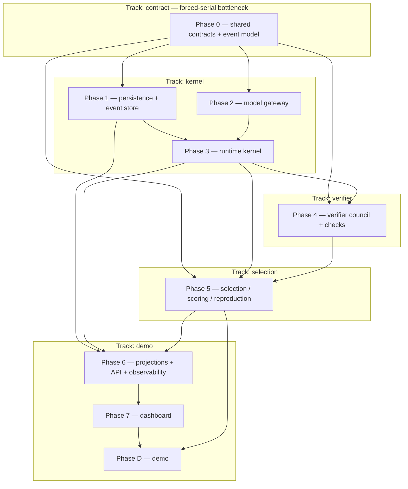

# IMPLEMENTATION_PLAN.md — Doppl

> **Phase note.** Spec-anchored build plan for Doppl (agent-evolution runtime + adversarial verifier council + observable demo dashboard), decomposed from the binding `ARCHITECTURE.md`. **Build posture: MVP/prototype** — two-week capstone, June 29 2026 showcase, 3–4 engineers. Locked baseline (see `ARCHITECTURE.md` §19 / `DECISIONS.md`): custom TS kernel; Postgres append-only event log = source of truth; provider-agnostic ModelGateway (OpenRouter primary, direct-OpenAI embeddings, live web-search grounding); Langfuse (non-authoritative); held-out judge + critic rotation; both subtypes equal; React Flow; REST+SSE; local-first demo; SQLite forbidden. Energy = successful productive spend only; replay reconstructs from persisted seed/outcomes with no model/embedding/web calls.
>
> **Reading discipline.** Read this file **by section, not whole** — `/orchestrate-start` and `/session-start` grep the section header and read only "Currently in progress" + the active phase. The living sections (Currently-in-progress, Carry-forward, Log, Trims, Decisions) are bounded — pruned/archived at `/orchestrate-end`.

> **Session protocol:**
> - **At session start** — orchestrator runs `/orchestrate-start`; implementer runs `/session-start`. Confirm the session target.
> - **At session end** (only when the user says we're done): **Implementer** runs `/session-end` (TDD + cross-doc audit + Step-9 list + session doc + `/preflight`; does NOT touch this doc). **Orchestrator** runs `/orchestrate-end` (verify hot routing, reconcile checkboxes, append Log, update Decisions/Carry-forward/Currently-in-progress, triage Carry-forward, round commit + push).

> **Reference deadlines:**
> - **Week 1 (by ~2026-06-22):** contract freeze (Phase 0) + kernel spine (Phases 1–3) + single-generation Fusion loop end-to-end.
> - **Week 2 (by ~2026-06-28):** verifier + selection (Phases 4–5), projections/API/dashboard (Phases 6–7), local demo + replay fallback (Phase D), rehearsals.
> - **2026-06-29:** showcase.

> **Spec-anchor convention (architecture-as-contract).** Each phase header carries a `**Spec anchors:**` block listing the `ARCHITECTURE.md` sections it implements; orchestrator + implementer re-read them at session start. If a slice surfaces a behavior the anchors don't cover, that's a cross-doc invariant flag at `/tdd` Step 9 — either the anchor is missing or the implementation drifted. Each phase header also carries a `**Track:**` tag + `**Depends on (phases):**` edge — the source the `## Parallelization plan` renders from. New mid-build tasks carry `(implements §X; origin: <slice>)` on the `### <phase-id>.N` heading.

---

## Currently in progress

> **⚠️ BLOCKING FINDING — FIRST RESUME ITEM (needs USER decision; surfaced at PD.8a Step-2.5, verified by the orch).** **The §12 final-idea `status:'selected'` winner has NO runtime/projection producer.** The kernel records the winner ONLY as `run.completed.finalIdeaRef` (the best `scored ∧ ¬culled` survivor — `terminalClassifier.ts:155`); NO event/reducer sets a candidate to `'selected'` (grep of `event-store/reducers` = nothing), yet `replay-summary.ts:75` + `lineage-graph.ts:73` + web `selectWinner` + the shipped PD.7 panel (`1277cd1`) all key off `'selected'`. **Impact: the entire §12 final-idea surface is WINNERLESS on every real completed run** (only hand-built fixtures show a winner); PD.7's terminal branch renders "No surviving idea — run completed" on a SUCCESSFUL run — the demo HEADLINE ("your problem → final surviving idea") cannot show a winner on a real/recorded run, and PD.8a #2 can't pass. **Fix = a projection bridge (ZERO new contract surface, §10-conformance): `lineage-graph` + `replay-summary` mark the candidate whose id == `run.completed.finalIdeaRef` as `'selected'`.** **DECISION (user, via lead): is the winner DERIVABLE (top scored∧¬culled → small projection fix) OR is real selection/culling not wired into the loop (→ a selection-seam slice, like the PD.10 problem-input)?** Orch rec: derive (projection bridge) as a prerequisite slice, then PD.8a asserts a real selected winner end-to-end. Details: impl session doc `phase-d-007`, brief `phase-d-013`, handoff `team-handoffs/phase-d-001`. **PD.8a re-dispatches once this is resolved.**

> **Phase-D team (demo track) — round 3 SEALED 2026-06-23 — PD.7 final-idea proof panel DONE; PD.8 split + ready; sealed at the lead's context cycle.** 1 slice on `phase-d` (off round-2 seal `b5014fc`): **PD.7** final-surviving-idea proof panel `1277cd1` — the panel was already built+mounted+live-wired+e2e-green in P7.13/P7.14, so PD.7 closed the 2 remaining acceptance gaps (transfer-evidence rung live/replay LABEL [mode-derived — frozen `CheckResult` has no discriminator] + winner `evidenceRefs` via the shared `EvidenceRefLink`; terminal zero-survivors state — never fabricates). Test-first, Step-2.5 reviewed; unit 168/168 · e2e 4/4 chromium. **ZERO new contract surface.** Lesson §11 (apps/web) banked. **PD.8 SPLIT** (orch): **PD.8a** = creds-free e2e smoke + real fixture capture (none exists — `fixtures/replay/` is `.gitkeep`) + §16 config-boot smoke (brief `phase-d-013`, READY — re-dispatch on fresh start); **PD.8b** = DEMO_RUNBOOK + .env.example (single-sourced from `loadConfig`/`envSchema`) + remaining §16 rehearsals (brief `phase-d-014`, author next). The **3 USER deliverables** (DEMO_RUNBOOK · .env.example from the real allowlist · the automated creds-free end-to-end smoke) are folded into 8a/8b. Round terminal commit: this `/orchestrate-end` (pushed origin/phase-d). **Sealed at the lead's cycle** (lead WARN 73%, user-approved) at the clean PD.7 boundary; PD.8a dispatch (task #47) crossed the cycle in flight → zero commits → cleanly reverted. **Next (fresh team):** re-dispatch `phase-d-013` (PD.8a) → author/dispatch `phase-d-014` (PD.8b) → `/phase-exit PD` → the lead-owned phase-d→cody merge + USER sign-off. The PD phase checkbox + `Acceptance criteria (PD)` stay gated on a CLEAR `/phase-exit PD`; PD.4–PD.7 recorded done at task level. Round-2 detail below.

> **Phase-D team (demo track) — round 2 SEALED 2026-06-22 — the operator demo path + the headline "your problem → idea" feature DONE.** 6 slices on `phase-d` (off the round-1 seal `40cd04f`): **PD.4** operator fallback-ladder `303900c` (demo cap-override, SAFETY — only-LOWERS, defers to the route/kernel clamp) + `e2fc1f0` (3-rung manual controller) · **PD.9** live OpenRouter gateway `da774b1` (`createLiveGateway` → `DOPPL_GATEWAY=live` works; closes carry-forward (a)) · **PD.10** generation-safety (user-decided **Option B** — the headline feature) `8337e59` (per-run problem → generation as rule-#5 `wrapUntrusted` DATA) + `c88bb4a` (output validation via a `CandidateContent` schema → graceful `agenome.failed`, folded PD.9 Finding) · **PD.5** operator-prompt path `65b2496` (`GET /problem-sets`) + `9465013` (web `OperatorPromptPanel`) · **PD.6** mode/health surfacing `b61afa5` (`RunHealthPanel` continue-vs-switch + stale flag; `ModeBanner` reused). All test-first, Step-2.5 reviewed (PD.4 + PD.10 security-reviewer INVARIANT CLEAN); web e2e green (chromium). **ZERO new contract surface across all 6.** **Lessons §89–§91 banked.** Round terminal commit: this `/orchestrate-end` (pushed origin/phase-d — track-branch backup; the phase-d→cody merge is DEFERRED to phase completion after PD.7+PD.8 + a CLEAR `/phase-exit PD` + USER sign-off — lead-owned). **Next (final stretch):** PD.7 final-idea proof panel → PD.8 §16 rehearsals → `/phase-exit PD` → the cody merge. The PD phase checkbox + `Acceptance criteria (PD)` are gated on a CLEAR `/phase-exit PD`; PD.4–PD.10 are recorded done here at the task level. Round-1 detail (PD.1–PD.3 + the boot spine): see Log.

> **Verifier team — RE-ACTIVATED + round-6 SEALED 2026-06-22 — the unified VerifySeam adapter (P4.12).** Human-ratified additive cross-track reopen (selection requested it — the kernel P3.10 generation loop is pure orchestration over an injected `verify` port, but the verifier shipped the council/judge/check CALLS, never the unified adapter the loop's port needs). **P4.12 landed `153e348`** (verifier-013): `createVerifySeam(deps) → VerifySeam` composes council (P4.6) + rotation (P4.7) + judge (P4.8) + checks (P4.5) behind the frozen port — port MATCHED not edited, no kernel/selection/contract file touched. Suite green (unit 445/445 · integration 86/86), security-reviewer CLEAN (7/7), `/preflight` clean. Lesson §74 logged. **REMAINING — LEAD-owned:** the additive `track/verifier`→cody merge + the cross-track closing handshake (selection swaps its stub `seams.verify = createVerifySeam(...)` at its boot composition root + runs `/phase-exit P5`). **No further buildable verifier work** — the production injection + retrieval-FETCH wiring + the stale `createFakeGateway` `final_judge` fixture are cross-track (selection/demo) Carry-forward items. Verifier team STANDS DOWN after the merge.

> **Kernel team — round-5 SEALED 2026-06-22 — the kernel track is FEATURE-COMPLETE + GATED (the last of the 5 build tracks).** Phase 3 feature work COMPLETE: P3.11 run-terminal `62f80a1` → P3.12 worker `b9dfeda` → P3.13 crash-forward `307ada8` (all test-first, Step-2.5 reviewed, security-reviewer CLEAN). **`/phase-exit P2` CLEAR + `/phase-exit P3` CLEAR** (6-auditor fan-out all CLEAR — `docs/audits/{P2,P3}-*.md`; 0 drift / 0 dead code / 0 security findings; `/preflight` + `pnpm audit` clean). **P2.3 done** (scrub seam §21+§52); **P2.8 RE-HOMED to Phase D** (documented deferment, Option-B, rule #2 — Langfuse export = a bootstrap projection subscriber, not in the gateway write path). Round terminal commit pushed to origin/track/kernel. **REMAINING — LEAD-owned:** the **kernel→cody track-completion merge** (the cody-bound §5/§6 arch notes + the P2 §6 STALE-DOC reconcile + track-local IMPLEMENTATION_PLAN/LESSONS/ARCHITECTURE land then — ledger §I). **No buildable kernel work remains** (P2.8 + the Phase-D bootstrap wiring are demo/Phase-D territory — Carry-forward). Kernel team STANDS DOWN after the merge. Orchestrator routing ledger: `docs/sessions/kernel-003-2026-06-21-orchestrator-routing-ledger.md` §I.

> **Selection team — Phase 5 (selection / scoring / reproduction) COMPLETE ✅ + merged to cody (`31782d3`, --no-ff).** `/phase-exit P5` CLEAR (reachability re-run 0-unreachable + 2 accepted-deferred; arch-drift / security / code-quality CLEAR). Integration preflight on merged cody CLEAR (typecheck/lint/format + unit 947 + integration 125, Docker/real-PG). The operator-command-to-organism loop is closed end-to-end: POST /runs → verify → score → reproduce → successor-threading (gen N+1 evolves from reconstructed offspring, kernel-clamped) → per-run config honored (recorded==executed, caps clamped — rule #1). Selection track STANDS DOWN (its only/last phase; downstream items are Phase-D follow-ups in Carry-forward). Lessons §75–§83 banked. Selection-track seal `f026c76`.

**Phase 0 (contract freeze) — COMPLETE ✅ (14/14 tasks; schemaVersion 2).** Re-sealed after the **P0.1-amend** operation-start-markers amendment (user-decided, before the kernel forks — `RunEventType` 25→36 + schemaVersion 1→2, closure + rule-#8 no-energy-debit preserved, non-breaking). `/phase-exit P0`: original verdict **CLEAR** at `bab92e1`; focused re-run **CLEAR** after the amendment (gate blocks under the Phase 0 section; auditor reports in `docs/audits/P0-*.md`). Phase 0 is the forced-serial bottleneck — its close is the **fork point** for the four parallel tracks (kernel, verifier, selection, demo). Lead reconciles the integration-checkout (cody) copies at merge.

**Round commits:** contract-002 round (P0.10→P0.14) sealed `bab92e1` (suite 160/160; per-type payload map `73289fd`, entities+lineage bundle `8bd9502`, FinalJudgeRubric `5058400`, contract-test surface `0180c5f`, P0.10 follow-up `c33eb2f`; impl session doc `7d60cc3`/contract-002). **P0.1-amend round** (operation-start markers + schemaVersion 2) `dc493a3` (suite 163/163); **re-seal: this `/orchestrate-end` commit (pushed to origin/track/contract)**. `/preflight` clean; `pnpm audit --prod` clean.

Prior round (contract-001 session, P0.5→P0.12): round-seal `ef95485` — see Log.

**Kernel freeze bundle — COMPLETE + MERGED to integration (cody merge `e638d81`).** 7 slices green: gateway P2.1/P2.4/P2.9 + event-store P1.1/P1.2/P1.4/P1.3 (round-seal `fd9459c`). Integration preflight on merged cody **CLEAR** (docker OK · typecheck · lint · format · 32 unit · 18 integration). **→ verifier / selection / demo can now FORK** from cody (frozen contracts + gateway stub + fixtures).

**Phase 1 — COMPLETE ✅ + `/phase-exit P1` CLEAR (kernel track).** P1.1–P1.4 shipped; P1.5/P1.6 **satisfied-by-P0** (lead-confirmed); P1.7 evidence-resolver `d3a61ed`; P1.8 replay-reader `dca9bc4` + kernel-014 phase-exit `[medium]` fixes `86553c3`. Audit fan-out all CLEAR (reachability `docs/audits/P1-reachability.md` · arch-drift · security `docs/audits/P1-security.md` · deps). Round-seal `bd4068a` → **merged to cody** (merge `36836a1`); integration preflight CLEAR. **Phase 2 — COMPLETE (kernel scope) as of 2026-06-22:** P2.1/P2.2/P2.4/P2.5/P2.6/P2.7/P2.9 done; **P2.3 done** (scrub seam built — event-store §21 + observability §52; ticked at the P3.13 round); **P2.8 RE-HOMED to Phase D** (documented deferment, lead Option-B — Langfuse is a non-authoritative projection wired off the event log at bootstrap, rule #2; the kernel's contribution — trace-id event meta §41 + the consumable scrub seam §52 — is in place; see Carry-forward). → `/phase-exit P2` clears with P2.8 re-homed.

**Phase 3 — IN PROGRESS (kernel track).** P3.1 boot-config `db4b045` ✅ · P3.2 four state machines (Run/Generation/Candidate/Agenome incl. the resolved degraded/repairing edges) `087f2b1` ✅. Two **frozen-contract amendments** (user-ratified scoped exceptions, lesson-§19 playbook): GenerationStatus 8→9 (+`degraded`) + CandidateStatus 8→9 (+`repairing`) — the two §3 FIX-edge statuses the P0 freeze omitted. These collided with the verifier's independently-landed P0.16 judge seam (both claimed schemaVersion 3); **reconciled in kernel-020** (`117a0ec`) → linearized **`CURRENT_SCHEMA_VERSION` = 4** (judge=v3, degraded+repairing=v4), unioning RunEventType 37 + GenerationStatus 9 + CandidateStatus 9 + JudgeResult. **Merged to cody `bff4325`** alongside the verifier P4 — full integration preflight GREEN (contracts 178 · apps/api unit + 40 integration · kernel event-store/gateway + verifier council/judge/checks coexisting). **schemaVersion is now 4 cody-wide** — selection/demo re-record their status + version snapshots on next sync (additive).

**Next:** **P3.6 (seeded RNG + outcome persistence)** pulled FORWARD (user direction; rule #7 SOLO, deps satisfied) — in flight on `track/kernel`, merges to cody when green. Then P3.4 caps+kill-switch SOLO → P3.5 energy SOLO (pulls the verifier P0.2 scrub fix for energy.spent ProviderMeta) → P3.9–P3.13 (gen-0 seed, generation loop, terminal classification, worker, crash-forward). P3.3/P3.7/P3.8 fold into shipped P1.3/P2.5/P2.4. P2.3 + P2.8 remain OPEN (cross-track `packages/observability`/demo boundary). **Announce-before-merge protocol in force** (user-adopted — see `docs/runbooks/cross-track-contract-coordination.md`).

**Phase 4 — COMPLETE ✅ + `/phase-exit P4` CLEAR (verifier track); MERGED to cody (`fae1d46`).** P4.1–P4.11 + Acceptance(P4) all shipped: contracts (P4.1–P4.3), injection-isolation seam (P4.4), check-runner allowlist registry (P4.5), critic council orchestrator (P4.6), critic-set rotation `selectCriticMandates` (P4.7 — pure K-of-3 closed-form over the persisted run seed + generation index, re-derived on replay, rule #6/#7), held-out judge runner (P4.8), cross-domain-transfer + zeitgeist check adapters (P4.9/P4.10), live allowlisted-check re-run with replay-backed fallback (P4.11). `/phase-exit P4` CLEAR @ `2d4a12a` (arch-drift / reachability / security fan-out all clean). Integration preflight on merged cody GREEN (contracts 178 + apps/api 271 unit). Round also carried the P0.16 judge-output reconcile + the P0.2 scrub numeric/boolean fix. **Verifier lessons restored to the integration line as §38–46** (dropped from cody during an earlier `--ours` resolution; re-homed here). **Verifier team STOOD DOWN.** Deferred wiring (cross-track → kernel/P3, in Carry-forward): `selectCriticMandates`→`runCouncil` into the P3 generation `verifying` phase (both `runCouncil` and the rotation selector currently unwired); selection P5.5 consumes the persisted `judge.reviewed` acceptance by candidateId JOIN.

**Demo track — Phase 6 + Phase 7 COMPLETE ✅; INTEGRATING into cody (round-4 demo→cody integration round).** Backend P6.1–P6.11 (projection-builder core · current-state · lineage-graph · replay-summary · observability redaction · REST write/read · run-health · SSE · runtime self-observability · Neo4j spike) + web P7.1–P7.15 (full §12 dashboard: data-client · run-store · status primitive · mode indicator · run-config · stop control · React-Flow lineage · fitness/generation charts · energy · candidate inspector · critic-gauntlet · subtype-check · final-idea · shell · Playwright smoke). Round 1 `79d73b7` (P6.1–6.7 + P7.1–4) · round 2 `e448b46` (P6.8 + P7.5) · round 3 `c3566b3` (P6.9–6.11 + P7.6–7.15; **`/phase-exit P6` CLEAR**). **Round 4 (this round) = the demo→cody integration:** (a) merged cody-sv5 INTO track/demo (`da6ef82`, `CURRENT_SCHEMA_VERSION` 2→5 + kernel/verifier substrate; LESSONS §27–37 renumbered §51–61 on union); (b) the sv2→sv5 projection + status-map reconcile — judge.reviewed reducer branch + judge→lineage `score` node + 4 new terminals + run-health judge pairing (`bb2d75c`, apps/api unit 365 / integration 79) and web status-map `degraded`/`repairing` (`87e90d3`, web 145); (c) **`/phase-exit P7` CLEAR** (the deferred round-3 4-auditor fan-out re-run — reachability/arch-drift/security/code-quality all CLEAR, reports `docs/audits/P7-*.md`; spec-lint tests 7 PASS §10/§12; `pnpm audit --prod` clean). demo→cody = **fast-forward** (cody `06299c9` ⊆ track/demo). Full track/demo preflight GREEN (contracts 183 · api 365 unit + 79 integration · web 145 · observability 16; lint/format/typecheck clean). **HOLD — the lead gates the cody push.** Remaining demo work after the push: **Phase D** (local demo path + prepared-replay fallback) + the merge-time follow-ups in Carry-forward (RunHealth promotion / per-category in-flight render, lineage `onSelect`, SSE connection-drop, dataRef confirms).

---

## Carry-forward to upcoming briefs

Items the orchestrator MUST fold into the next 1–2 briefs. Triaged at every `/orchestrate-end` (not append-only). Bound: under ~7 items.

- **`candidate.rejected` emitter is NOT verifier (cross-track → runtime P3 / selection P5).** The under_review→rejected lifecycle event is genuinely needed (not projectable from `critic.reviewed` — rule #6 evidence carries no verdict) but is NOT the verifier track's to emit: the council/judge are evidence-only (rule #6) and the candidate state machine is the kernel's own (`runtime/state/candidateStateMachine.ts`). Disposition (verifier lead, 2026-06-22, human-relayed kernel request): accept as **defined-but-not-yet-emitted** for MVP (kernel registers it); the emission belongs to the **runtime↔selection seam** — runtime drives the under_review→rejected transition on **selection's** verdict (which aggregates the verifier evidence + judge acceptance), mirroring the `lineage.culled` decision/record split. _(origin: 2026-06-22 kernel cross-track request; verifier OUT by rule #6; cross-track → runtime P3 / selection P5; DELETE after the rejection emitter is assigned + built)_
- **[Finding — low-impact, cross-area] The fake-gateway `final_judge` ROLE_FIXTURE is stale (`{score:3}`) → fails the frozen P4.8 `JudgeModelOutput` (per-axis).** Any test using `createFakeGateway()` for the judge gets `output_schema_rejected`, never `judge.reviewed` — so judge tests (P4.8 `run-judge.test.ts`, P4.12 `verify-seam.test.ts`) use a test-local multi-role gateway. Production is unaffected (real gateway). Fix = update `apps/api/src/model-gateway/stub/fake-gateway.ts` `final_judge` fixture to the 5 per-axis scores (model-gateway/stub territory — owned by the gateway-stub/selection owner); makes `createFakeGateway` judge-capable for selection P5's boot-composition tests. **BROADENED (Phase-D round 1):** the `population_generator` fixture is ALSO loop-incompatible (`{idea}`, not a `CandidateIdea`), so `createFakeGateway` cannot drive the generation loop at all — every loop-driving test (the boot e2e, the operator-stop drain tests) injects a bespoke multi-role fake. Fixing BOTH fixtures (judge per-axis + population_generator → a real CandidateIdea) makes `createFakeGateway` a true recorded-demo gateway, relevant when a recorded demo gateway is promoted to `src/`. _(origin: 2026-06-22 P4.12 verifier-013 Step-2.5 + Phase-D PD.3 boot-spine; cross-area → gateway-stub / selection P5 / demo; DELETE after both fixtures are fixed)_
- **Retrieval-FETCH wiring for the grounding check adapters (cross-track → selection/demo retrieval wiring).** The unified VerifySeam (P4.12) threads NO `retrievalResults`, so the 3 retrieval-grounded adapters (`transfer.prior_art`, `zeitgeist.current_signal_grounding`, `zeitgeist.falsifiability`) record `check.completed{skipped, retrieval_unavailable}` — the shipped check set is honestly N-of-M, not N-of-N. The caller-fetches split (LESSONS §44) keeps the adapters pure: the wiring slice must (a) fetch the gateway `retrieval` source once per candidate, (b) persist the outcome (rule #7 replay home), (c) thread the results into the seam as `retrievalResults` DATA. Lands with the selection/demo retrieval wiring (the seam already accepts threaded results — `runCheck` passes `request.retrievalResults` through). _(origin: 2026-06-22 P4.12 verifier-013 Step-9; cross-track → selection/demo; DELETE after retrieval is wired into the verify path)_
- **Demo post-integration follow-ups (demo track; fold into the next demo round / Phase D).** Surfaced at the round-4 demo→cody integration + the `/phase-exit P7` audit fan-out (all CLEAR; these are deferred polish/wiring, none blocking): (a) **RunHealth promotion + per-category in-flight render** — the backend `run-health.ts` already computes `operationsInFlight.byType` per category (incl. `judge`, round-4); the web renders only `candidatesInFlight` against a web-local UNFROZEN `RunHealth` Zod schema → promote `RunHealth` to a frozen `@doppl/contracts` model (contract-coordinated) + render the full per-category in-flight window (the P7.14 partial bullet; LESSONS apps/web §9 "promote at P7.14"); (b) **lineage `onSelect`** — `LineageGraph` exposes no `onSelect` prop → interactive node-click→inspector is unwired (the shell defaults to the winner); small P7.7 follow-up, NOT blocking (the e2e traverses the winner-default); (c) **SSE connection-drop fallback** — P7.14 `onError` wires the payload-validation hook only; add the EventSource `'error'` listener (the real connection-drop case) at live-SSE integration; (d) **dataRef↔entity-id bridge + `run.configured`-carries-`RunConfig.caps`** — confirm the P7.7 in-flight node-bridge + the P7.9 energy-budget source against the real producer at integration; (e) **chart mean-series** — `MEAN_FITNESS_SERIES`/`MEAN_NOVELTY_SERIES` are defined but unrendered (P7 reachability finding) — optional chart-polish overlay. _(origin: 2026-06-22 round-4 demo→cody integration + /phase-exit P7 audit; demo track; triage at the next demo /orchestrate-start)_
- **[DONE 2026-06-22 — Phase-D round 1: `f330475` boot-spine (crashForward AWAITED before listen + POST /runs → `createStartRun` trigger, in-memory `activeRunId` §56-serialized) + `b5ada03` stop-rewire (POST /runs/:id/stop → kernel `operatorStop`) + real `listRunIds(db)`. The (d) TOCTOU serialization is satisfied by the §56 in-memory single-flight. Prune at the phase-end cody reconcile.]** ~~Phase-D bootstrap wiring: crash-forward → worker → REST trigger (cross-track → demo/Phase D).~~ P3.11–P3.13 delivered the kernel-territory pieces (`runWorker`, `crashForward`) but DEFERRED the boot sequence + REST surface (bootstrap/`routes/` is demo territory; kernel→cody merge deferred — `routes/runs.ts` untouched this round). The Phase-D bootstrap must: (a) run `crashForward({listRunIds, eventStore})` BEFORE the worker accepts work (P3.13 — so the single-active-run guard starts from a clean no-active-run state); (b) wire REST POST `/runs` → `runWorker` (fire-and-forget) trigger + POST `/runs/:id/stop` → injected `operatorStop`; (c) supply the real `listRunIds` impl (drizzle `selectDistinct`) + the worker's injected heartbeat sink + (P2.8) the real Langfuse `ObservabilityEmitter`; (d) **[security-reviewer medium, dispositioned NOT a current Finding]** the read-then-append TOCTOU on the active-run guard + run-level idempotency — out of scope for the serial single-in-process MVP (no concurrent caller reachable; the deterministic `${runId}-run-started` id + `unique(run_id,sequence)` fail a racing duplicate LOUD), BUT the Phase-D REST trigger MUST serialize worker invocations (in-memory single-flight re-validated vs the log, LESSONS §56) OR move guard+append under the per-run advisory lock (LESSONS §26). For the Phase-D wiring-slice owner (demo track). _(origin: 2026-06-22 P3.12 kernel-033 + P3.13 kernel-034 + the P3.12 security-reviewer; cross-track → demo/Phase D; DELETE after Phase D wires the bootstrap sequence + serializes the REST→worker trigger)_
- **P2.8 Langfuse-export RE-HOMED to Phase D — documented deferment (lead + Option-B, 2026-06-22; cross-track → demo/Phase D).** Rationale **KEY SAFETY RULE #2**: Langfuse is a non-authoritative PROJECTION (named among the derived/rebuildable projections) → it is wired off the authoritative event log at the **bootstrap**, NEVER embedded in the gateway write path. The kernel/verifier contribution is DONE — LLM-event meta carries `langfuseTraceId`+`gatewayRequestId→correlationId` (LESSON §41), and the consumable scrub seam `createEmitBoundary`/`scrubObservabilityPayload` is built (demo P6.5/§52). **Phase D wires exactly:** (1) the real Langfuse client — demo territory `packages/observability/src/langfuse.ts` + `trace-metadata.ts`; (2) the export as a **projection subscriber off the event log** (rebuilds from the persisted LLM-event meta, never the gateway write path — rule #2); (3) **scrub-via-the-demo-seam before emit** (`createEmitBoundary`, rule #4 / §14 — never reimplement). Pairs with the Phase-D bootstrap (worker REST trigger + crash-forward boot call). _(origin: 2026-06-22 P2.8 reconcile, lead Option-B; cross-track → demo/Phase D; DELETE after Phase D wires the Langfuse export subscriber)_
- **Generation-level drain on crash (follow-up, kernel/future).** P3.13 crash-forward terminalizes the RUN only (run.failed/cancelled{crash}); the crashed run's non-terminal GENERATIONS are left un-drained (run-level terminal is what gates the worker clean-slate + projections; replay derives from the run terminal — moot for the demo). If a future need arises, reuse `executeKillAndDrain`'s per-state generation disposition over the crashed run's generations. _(origin: 2026-06-22 P3.13 kernel-034 Q3; low-pri follow-up)_
- **Selection P5 → Phase-D follow-ups (cross-track → demo/Phase D).** From the selection wiring round + `/phase-exit P5` (CLEAR): (a) **route-max residual — ✅ DONE `f330475`** (`main.ts` `defaultConfig = {...config.runConfig, caps: config.caps}` → route cap-maxima == boot ceiling, recorded==executed); (b) **production boot root — ✅ DONE `f330475`** (`main.ts` wires `createStartRun(infra)` as `buildServer({onRunConfigured})`); (c) **demo/PD replay consumer of `noveltyScoreOf`** (`selection/novelty/cosine.ts` — the rule-#7 replay-recompute helper's named consumer); (d) **4 minor P5 code-quality items** — reproduce-seam O(N×M) best-candidate scan (MVP-fine), `GENERATION_ID_PATTERN` coupling, `startRun` safeParse→boot fallback, `MVP_CULL_POLICY` minFitness:0 (cull never fires in prod default — tuning TODO). _(origin: 2026-06-22 selection P5 wiring + /phase-exit P5; cross-track → demo/Phase D)_
- **Phase-D round-1 follow-ups → fold into PD.4+ (demo track).** (a) **✅ DONE `da774b1` (PD.9)** — wired the OpenRouter adapter into `selectGateway` (`createLiveGateway` feeds it into the same `createGateway`); `DOPPL_GATEWAY=live` now works (was an honest-throw). Unblocks PD.4 rung-1 real execution + PD.5 live-prompt + PD.8 low-cap-live. _(prune at /orchestrate-end)_ (b) **Multi-fixture / fixture-catalog seeding** — `seed-demo` loads ONE `<runId>` fixture; PD.4's prepared-run rungs may want a catalog. (c) **Web stop-control async-202 handling (apps/web)** — the dashboard stop control (P7.6) POSTs `/runs/:id/stop`, which now returns `202 {stopRequested}` (async; the worker drains then `run.stopped` propagates via SSE) instead of the old `200 {stopped:true}` — verify P7.6 doesn't hard-depend on the old shape; show "stopping…" + observe `run.stopped` via SSE. _(origin: 2026-06-22 Phase-D round 1 — PD.3 boot-spine + stop-rewire + PD.2; demo track; (a) gates PD.4 live rung, (b) PD.4, (c) apps/web)_
- **STANDING (user, 2026-06-21): bundle slices where safe to speed the build.** Group dep-compatible, same-code-area, non-invariant slices into ONE atomic red→green→commit unit. **Safety-invariant slices NEVER bundle with feature work** (root `CLAUDE.md` TDD posture) — they stay solo. Applies to every track's remaining phases (kernel first; freeze bundle stays tight per the deps/safety/cross-area analysis). _(origin: 2026-06-21 lead relay of user direction; STANDING — keep through triage; re-issues the P0-era bundling directive deleted at contract-002 close)_

---

## Deliverable map

<!-- ▼ EXAMPLE BLOCK [id=deliverable-map]: deliverable map — the project's real required outputs (customized). ▼ -->

| Deliverable | Status | Delivered by |
|---|---|---|
| Frozen shared-contracts package (`packages/contracts`) | ✅ | Phase 0 |
| Postgres append-only event store + replay reader | ✅ | Phase 1 (`/phase-exit P1` CLEAR) |
| Provider-agnostic ModelGateway (OpenRouter / OpenAI / retrieval) | ✅ | Phase 2 (`/phase-exit P2` CLEAR; P2.8 Langfuse-export → Phase D) |
| Runtime kernel — bounded evolution loop, caps, energy, RNG | ✅ | Phase 3 (`/phase-exit P3` CLEAR) |
| Verifier council + held-out judge + critic rotation + checks | ✅ | Phase 4 (`/phase-exit P4` CLEAR; unified VerifySeam adapter merged `9de3ef6`) |
| Selection / scoring / reproduction — gen N+1 beats gen N | ✅ | Phase 5 (`/phase-exit P5` CLEAR; merged `31782d3`) |
| Projections + REST/SSE API + runtime self-observability | ❌ | Phase 6 |
| React Flow lineage dashboard (live + replay, accessible) | ❌ | Phase 7 |
| Local-first demo path + prepared-replay fallback | ❌ | Phase D |

<!-- ▲ END EXAMPLE BLOCK [id=deliverable-map] ▲ -->

---

## Parallelization plan (Track map)

<!-- ▼ EXAMPLE BLOCK [id=parallelization-plan]: Parallelization plan / Track map — TEAM MODE; authored by /tasks-gen, the authority for valid <track> names (customized). ▼ -->

> **Team mode only.** A *track* is a set of phases forming a dependency-isolated region of the `ARCHITECTURE.md` §2.5 DAG. Tracks with no unsatisfied upstream-track dependency run **in parallel — each in its own git worktree with its own agent team**. A single-operator build walks the DAG serially in one tree (delete this section's worktree mechanics and just follow the critical path).

**Phase/track DAG** (nodes = phases, edges = `Depends on (phases)`, subgraphs = tracks):

> **Critical path:** Phase 0 → Phase 1 → Phase 3 → Phase 4 → Phase 5 → Phase 6 → Phase 7 → Phase D (the serial floor — staff it first; Phase 2 runs parallel to Phase 1 inside the kernel track and also feeds Phase 3). **Forced-serial bottleneck:** Phase 0 (the shared contract freeze — every track waits on it).

**Track map** — names follow `<track>-<area>-<role>`:

| Track | Phases | Code area(s) | Worktree (branch) | Agent-team names |
|---|---|---|---|---|
| `contract` | P0 | `packages/contracts` | `../Capstone-contract` (`track/contract`) | `contract-contracts-orchestrator` / `-implementer` |
| `kernel` | P1, P2, P3 | `apps/api/{runtime,event-store,model-gateway}` | `../Capstone-kernel` (`track/kernel`) | `kernel-runtime-orchestrator` / `-implementer` |
| `verifier` | P4 | `apps/api/{verifier,check-runners}` | `../Capstone-verifier` (`track/verifier`) | `verifier-council-orchestrator` / `-implementer` |
| `selection` | P5 | `apps/api/selection` | `../Capstone-selection` (`track/selection`) | `selection-ml-orchestrator` / `-implementer` |
| `demo` | P6, P7, PD | `apps/api/projections`, `apps/web`, `packages/observability` | `../Capstone-demo` (`track/demo`) | `demo-observability-orchestrator` / `-implementer` |

**Integration / merge order** (DAG topological order):
1. `contract` (P0) → integration branch first — the shared contracts are frozen here before any track forks.
2. `kernel` (P1, P2, P3) — the runtime spine.
3. `verifier` (P4) and `selection` (P5) — branch off the kernel; verifier merges before selection (selection consumes critic/check/judge outputs).
4. `demo` (P6, P7, PD) — integrates last (projections need the full event stream incl. selection's fitness/lineage events).

**Shared contracts across tracks** (frozen in Phase 0 before tracks fork — a change after fork is a cross-track Finding): every Appendix-A model — `RunEventEnvelope`+`RunEventType`, `RunConfig`/`RunCaps`, `Agenome`, `CandidateIdea`+subtype payloads, `EvidenceRef`, `CriticReview`/`CriticMandate`, `CheckResult`/`CheckRunnerAdapter`, `NoveltyScore`/`FitnessScore`/`ScoringPolicy`, `EnergyEvent`/`ReproductionEvent`, `ModelRoute`/`ModelRole`/`ProviderCapability`, `ModelGatewayRequest`/`Response`, `LineageGraphProjection`, `Run`/`Generation`/`CullingEvent`/`FinalJudgeRubric` — all in `packages/contracts`.

<!-- ▲ END EXAMPLE BLOCK [id=parallelization-plan] ▲ -->

---

## Phase exit checklist (template — applies to every phase)

Before ticking a phase complete (executed row-by-row by `/phase-exit <phase>`):

- [ ] **All phase task checkboxes ticked.** Partial work stays unchecked with a Log note.
- [ ] **Acceptance criterion met.** `/preflight` clean + manual smoke if there's runtime behavior.
- [ ] **`/preflight` clean** (includes architecture-invariant tests).
- [ ] **Cross-doc invariants verified.** No Appendix-A model field change without an `ARCHITECTURE.md` edit in the same round.
- [ ] **Reachability audit clean per touched area** (`reachability-auditor`).
- [ ] **Arch-drift audit clean over the phase's Spec anchors** (`arch-drift-auditor`).
- [ ] **Spec coverage: every phase anchor has a tagged test or waiver** (`scripts/spec-lint.sh tests <phase>`).
- [ ] **Whole-system security review clean (qualifying phases)** — phases with security-/invariant-/trust-boundary tasks (P1 redaction, P3 caps, P4 allowlist/injection, P6 redaction). _(MVP: scope to the built surface; confirm at `/scaffold-generate` gate-pack.)_
- [ ] **Dependency audit: no new findings vs baseline.** _(MVP — confirm at gate-pack; keep, it's cheap.)_
- [ ] **Perf budgets:** `n/a — no budgets (deliberate deferral, REQ-NF-003)`; only the 10-min demo window is a rehearsal check (Phase D), not a benchmark task.
- [ ] **Session doc(s) for this phase exist** and list every file created/modified.
- [ ] **Commits pushed to origin.**

---

## Final-submission acceptance criteria (project-level)

The project is "done" when:

- [ ] A later generation measurably beats an earlier one on the **held-out rubric**, visible in the dashboard (fitness-over-time + generation comparison).
- [ ] The full demo path runs **end-to-end locally** (no mocks on the load-bearing path) with a prepared-replay fallback.
- [ ] **All caps fail closed**; the kill switch moves the run to terminal and preserves replayable partial evidence.
- [ ] **Replay reconstructs** a run from the event log with no model/embedding/web calls (state-equivalence).
- [ ] **Both subtypes** (`cross_domain_transfer`, `zeitgeist_synthesis`) run; the final idea is defensible via critic + check evidence.
- [ ] The **append-only event log is authoritative**; all projections rebuild from it.

---

## Phase 0 — Shared contracts & event model

**Goal:** Freeze every Appendix-A model as a Zod schema (with z.infer TS types) in packages/contracts, plus the closed RunEventType registry, the closed 7-role actor union, the secret-redaction scrub contract, the boot config-validation contract, and the consumer/producer contract-test surface. These are the §2.5 shared contracts crossed by DAG edges; this phase is the forced-serial bottleneck that must be frozen before the four parallel tracks (kernel, verifier, selection, demo) fork. Every model-defining task ships a field-name-set schema-snapshot in its RED outline so a mid-build field change is caught as a cross-track regression. Numeric scoring weights are the only deferred-open values; all structures are frozen now.

**Spec anchors:** `ARCHITECTURE.md §3`, §4, §2.5, §14, §15, Appendix A. _(§3 = P0.4 Agenome (+ later P0.5 CandidateIdea, P0.15 Run/Generation) state machines; §14 = P0.2 secret-redaction; §15 = P0.3 boot config-validation fail-fast; further per-model anchors §6/§7/§8/§10 are subsumed under Appendix A and added to this line as each covering slice lands, so phase-exit `spec-lint tests` enforces their coverage.)_

**Track:** `contract` · **Depends on (phases):** none.

<!-- ▼ EXAMPLE BLOCK [id=task-entry-format]: task entry format — dense checkbox bullets (acceptance behaviors that pin BEHAVIOR, not tests), then `Files:` (NEW vs extended), `Cross-doc invariant:` (NEW/extended/none + seam-snapshot note), `Depends on:`. Illustrative — the 101 real task entries below ARE the format. ▼ -->
<!-- ▲ END EXAMPLE BLOCK [id=task-entry-format] ▲ -->

### P0.1 — RunEventEnvelope + closed RunEventType registry + 7-role actor union

- [x] RunEventEnvelope carries exactly: id, runId, generationId?, agenomeId?, candidateId?, type:RunEventType, sequence, occurredAt, actor, correlationId?, langfuseTraceId?, langfuseObservationId?, payload, schemaVersion (per Appendix A §4)
- [x] sequence is the sole ordering key; it is a per-run monotonic integer and occurredAt is a UTC ISO-8601 string treated as display/analytics-only, never ordering (§4)
- [x] RunEventType is a CLOSED enum containing every lifecycle + failure/terminal type named in Appendix A: run.configured/started/completed/failed/stopped, generation.started/completed, agenome.spawned/fused/mutated/reproduced, candidate.created, critic.reviewed, check.completed, novelty.scored, fitness.scored, lineage.culled, energy.spent, provider_call_failed, output_schema_rejected, candidate_invalidated, energy_exhausted, generation_failed, reproduction_aborted_insufficient_parents, novelty_scoring_degraded — and ALSO every operation-start / in-flight observability marker named in §4/§12/Appendix A: generation.verifying, generation.scoring, generation.reproducing, candidate.generation_started, critic.review_started, check.started, novelty.scoring_started, judge.review_started, fusion.started, tool_call.started, tool_call.finished — these markers are persisted, replay-faithful, and debit NO energy; rejects any unlisted type. Adding them is a schemaVersion bump covered by the field-name-set schema-snapshot test (re-record fixtures)
- [x] actor is the CLOSED 7-role union (operator, runtime, agenome, critic, check_runner, selection_controller, system) and supersedes any actor:string; any other value is rejected
- [x] schemaVersion is present on every envelope; readers must accept all schemaVersion ≤ current (the registry pins the current version constant)
- [x] payload is the generic JSONB-backed shape at envelope level (per-type narrowing is layered by P0.10), and an unknown envelope field is rejected by the schema
- [x] Files: packages/contracts/src/events/envelope.ts (NEW); packages/contracts/src/events/event-type.ts (NEW); packages/contracts/src/events/actor.ts (NEW); packages/contracts/src/index.ts (extended)
- [x] Cross-doc invariant: NEW — RunEventEnvelope, RunEventType · §2.5 seam: RED outline includes the field-name-set **schema-snapshot test** (`spec(§X)`-tagged)
- [x] Depends on: none

### P0.2 — Secret-redaction scrub contract (persistence-boundary filter)

- [x] Exposes a single pure scrub function applied to any event payload object before append and before Langfuse emit (§14 — one scrub used at both boundaries)
- [x] Redacts pattern-matched provider keys, Authorization headers, and known env-value formats from arbitrary nested payload objects (§14)
- [x] Is idempotent: scrubbing already-scrubbed output yields the same result and never reintroduces a secret
- [x] Returns a structurally-equivalent object with non-secret fields untouched (does not drop or reorder legitimate payload keys)
- [x] Defines the redaction placeholder token as a stable constant so snapshot/contract tests can assert against it
- [x] No secret value can appear in any output of the scrub (the safety invariant REQ-S-004 / RISK-006/009)
- [x] Files: packages/contracts/src/security/redaction.ts (NEW); packages/contracts/src/index.ts (extended)
- [x] Cross-doc invariant: none
- [x] Depends on: none

### P0.3 — RunConfig / RunCaps schemas + boot config-validation contract

- [x] RunCaps carries exactly maxPopulation, maxGenerations, energyBudget (doppl_energy integer), maxSpawnDepth, maxToolCalls, wallClockTimeoutMs (Appendix A §4/§5)
- [x] RunConfig carries exactly seed, enabledSubtypes[] (from the two-member subtype union), caps:RunCaps, modelProfile, scoringPolicyVersion, rngSeed (Appendix A)
- [x] rngSeed is a required field on RunConfig so the per-run seed is persistable in run.configured for deterministic replay (§4 RNG capture)
- [x] Cap values are validated as positive/bounded so an invalid cap config fails fast at boot rather than at runtime (§15 fail-fast, REQ-NF-001)
- [x] Exposes a config-validation entry that parses config (defaults < file < env precedence) and throws a clear error on the first invalid field (§15)
- [x] energyBudget unit is doppl_energy and is a single integer (shared unit with EnergyEvent, §4)
- [x] Files: packages/contracts/src/run/run-config.ts (NEW); packages/contracts/src/run/run-caps.ts (NEW); packages/contracts/src/config/validate.ts (NEW); packages/contracts/src/index.ts (extended)
- [x] Cross-doc invariant: NEW — RunConfig, RunCaps · §2.5 seam: RED outline includes the field-name-set **schema-snapshot test** (`spec(§X)`-tagged)
- [x] Depends on: none

### P0.4 — Agenome schema (traits + 7-state status)

- [x] Agenome carries exactly id, runId, generationId, parentIds[], systemPrompt, personaWeights, toolPermissions[], decompositionPolicy, spawnBudget, mutationMeta?, status (Appendix A §3)
- [x] parentIds[] encodes 0-2 parents (gen-0 has none, fusion offspring usually 2) without enforcing the count at schema level beyond an array of ids (§3 relationships)
- [x] status is the CLOSED 7-state union: seeded, active, spent, eligible_parent, failed, reproduced, culled (§3 Agenome state machine); any other value rejected
- [x] spawnBudget is a hint integer (clamped at runtime, not at schema level)
- [x] mutationMeta is optional so seeded gen-0 agenomes validate without it
- [x] Files: packages/contracts/src/domain/agenome.ts (NEW); packages/contracts/src/index.ts (extended)
- [x] Cross-doc invariant: NEW — Agenome · §2.5 seam: RED outline includes the field-name-set **schema-snapshot test** (`spec(§X)`-tagged)
- [x] Depends on: none

### P0.5 — CandidateIdea + CrossDomainTransferPayload + ZeitgeistSynthesisPayload + EvidenceRef

- [x] CandidateIdea carries exactly id, runId, generationId, agenomeId, subtype, title, summary, claims[], evidenceRefs[], status, subtypePayload (Appendix A §3 + DATA_MODEL.md)
- [x] subtype is the CLOSED two-member union cross_domain_transfer | zeitgeist_synthesis and subtypePayload is a discriminated union matching the chosen subtype
- [x] status is the CLOSED 8-state union created, under_review, checked, scored, selected, rejected, culled, invalid (§3 Candidate state machine)
- [x] CrossDomainTransferPayload carries sourceDomain, sourceTechnique, targetDomain, targetProblem, transferMapping, expectedMechanism, executableCheckIdea? (DATA_MODEL.md)
- [x] ZeitgeistSynthesisPayload carries thesis, audience, currentSignals[], whyNow, falsifiablePredictions[], comparablePriorArt[] (DATA_MODEL.md)
- [x] EvidenceRef.kind is the CLOSED union trace | check_output | prior_art | signal | raw_output | other with eventId?/uri?/label?/langfuseObservationId?, and resolves WITHIN the Postgres tier (never an external store) per §4/§9
- [x] Files: packages/contracts/src/domain/candidate-idea.ts (NEW); packages/contracts/src/domain/subtype-payloads.ts (NEW); packages/contracts/src/domain/evidence-ref.ts (NEW); packages/contracts/src/index.ts (extended)
- [x] Cross-doc invariant: NEW — CandidateIdea, CrossDomainTransferPayload, ZeitgeistSynthesisPayload, EvidenceRef · §2.5 seam: RED outline includes the field-name-set **schema-snapshot test** (`spec(§X)`-tagged)
- [x] Depends on: none

### P0.6 — CriticReview + CriticMandate + criticInput isolation shape

- [x] CriticReview carries exactly id, candidateId, mandate, scores{}, critique, confidence, evidenceRefs[] (Appendix A §7)
- [x] mandate is the CLOSED CriticMandate union factual_grounding, novelty_prior_art, feasibility, falsification, subtype_specific (§7); any other value rejected
- [x] criticInput models trusted rubric and untrusted candidate payload as DISTINCT fields so candidate text is never interpolated into instruction strings (§7 / §14 prompt-injection isolation, T-002)
- [x] criticInput wraps the untrusted candidate field with a fixed sentinel delimiter constant exposed by the contract
- [x] CriticReview carries evidenceRefs[] of EvidenceRef so reviews are explainable from persisted events (§8); critics emit evidence only and the shape carries no winner-selection or policy-mutation field (§7/§14)
- [x] Files: packages/contracts/src/verifier/critic-review.ts (NEW); packages/contracts/src/verifier/critic-input.ts (NEW); packages/contracts/src/index.ts (extended)
- [x] Cross-doc invariant: NEW — CriticReview, CriticMandate, criticInput · §2.5 seam: RED outline includes the field-name-set **schema-snapshot test** (`spec(§X)`-tagged)
- [x] Depends on: P0.5

### P0.7 — CheckResult + CheckRunnerAdapter allowlist shape

- [x] CheckResult carries exactly id, candidateId, checkType, status, score?, output?, skipReason?, evidenceRefs[], error? (Appendix A §7)
- [x] status is the CLOSED union passed | failed | skipped; a skipped result requires a skipReason (§7 — unregistered/execution-requiring check is recorded as skipped with reason)
- [x] CheckRunnerAdapter is an allowlist-registry shape keyed by adapter ID, mirroring the model registry, with a non-executing adapter contract (no arbitrary-code field) per §7/§14, REQ-S-003
- [x] An unregistered or execution-requiring adapter id maps to a skipped CheckResult with reason rather than executing (the allowlist invariant)
- [x] evidenceRefs[] are EvidenceRef so check evidence resolves within the Postgres tier (§9)
- [x] Files: packages/contracts/src/checks/check-result.ts (NEW); packages/contracts/src/checks/check-runner-adapter.ts (NEW); packages/contracts/src/index.ts (extended)
- [x] Cross-doc invariant: NEW — CheckResult, CheckRunnerAdapter · §2.5 seam: RED outline includes the field-name-set **schema-snapshot test** (`spec(§X)`-tagged)
- [x] Depends on: P0.5

### P0.8 — NoveltyScore + FitnessScore + ScoringPolicy (structure frozen, weights deferred)

- [x] NoveltyScore carries exactly id, candidateId, vector, embeddingModelId, dimension, comparisonSet, method, score, explanation (Appendix A §8)
- [x] vector is the persisted float array (authoritative-once-computed) with embeddingModelId + dimension so replay reads the stored vector and never re-embeds (§4/§9)
- [x] FitnessScore carries exactly id, candidateId, total, components{}, policyVersion, explanation (Appendix A §8)
- [x] components{} includes the named decomposed signals (critic scores, subtype-check results, novelty, energy efficiency, held-out-judge acceptance) and fitness references the novelty it consumed so selection is explainable from persisted events (§8)
- [x] ScoringPolicy carries version, weights{}, normalization? with STRUCTURE frozen and numeric weight VALUES deferred-open (§8 — the only deferred-open contract values)
- [x] policyVersion on FitnessScore ties a score to a specific ScoringPolicy version (one selected score per policy version per candidate, §3)
- [x] Files: packages/contracts/src/scoring/novelty-score.ts (NEW); packages/contracts/src/scoring/fitness-score.ts (NEW); packages/contracts/src/scoring/scoring-policy.ts (NEW); packages/contracts/src/index.ts (extended)
- [x] Cross-doc invariant: NEW — NoveltyScore, FitnessScore, ScoringPolicy · §2.5 seam: RED outline includes the field-name-set **schema-snapshot test** (`spec(§X)`-tagged)
- [x] Depends on: none

### P0.9 — EnergyEvent + ReproductionEvent schemas

- [x] EnergyEvent carries exactly id, runId, generationId?, agenomeId?, eventType, estimate, actual, unit:doppl_energy, reason, providerMeta? (Appendix A §4/§5)
- [x] eventType is the CLOSED union llm | tool | spawn; estimate and actual are both present so energy.spent persists pre-call estimate AND post-call reconciled actual (§4 energy)
- [x] EnergyEvent only models SUCCESSFUL productive spend — there is no failed/retried/repaired energy debit field (failed attempts emit provider_call_failed, never energy.spent, §4)
- [x] ReproductionEvent carries exactly id, runId, parentAgenomeIds[], childAgenomeId, mode, crossoverPoints, mutationSummary (Appendix A §8)
- [x] mode is the CLOSED union fusion | crossover | output_synthesis | mutation_only (§8 + §3 degenerate <2-parent fallback uses mutation_only)
- [x] crossoverPoints and mutationSummary persist concrete RNG outcomes so replay reconstructs from stored outcomes and never re-samples (§4 RNG capture)
- [x] Files: packages/contracts/src/domain/energy-event.ts (NEW); packages/contracts/src/domain/reproduction-event.ts (NEW); packages/contracts/src/index.ts (extended)
- [x] Cross-doc invariant: NEW — EnergyEvent, ReproductionEvent · §2.5 seam: RED outline includes the field-name-set **schema-snapshot test** (`spec(§X)`-tagged)
- [x] Depends on: none

### P0.10 — Per-type payload-shape map for high-traffic event types

- [x] Defines a per-type payload narrowing for the high-traffic types named in §4: energy.spent, candidate.created, critic.reviewed, check.completed, novelty.scored, fitness.scored
- [x] Each narrowed payload reuses the corresponding Appendix-A model (energy.spent←EnergyEvent, candidate.created←CandidateIdea, critic.reviewed←CriticReview, check.completed←CheckResult, novelty.scored←NoveltyScore incl. persisted vector, fitness.scored←FitnessScore) so the same Zod schema validates the event-store write and the model
- [x] novelty.scored payload carries the persisted embedding vector + embeddingModelId + dimension (authoritative-once-computed home, §9)
- [x] fitness.scored payload references the novelty it consumed (§8 explainability)
- [x] A high-traffic event whose payload does not match its narrowed shape is rejected; types outside the high-traffic set fall back to the generic JSONB payload (§4)
- [x] Files: packages/contracts/src/events/payload-map.ts (NEW); packages/contracts/src/index.ts (extended)
- [x] Cross-doc invariant: extended — RunEventEnvelope, EnergyEvent, CandidateIdea, CriticReview, CheckResult, NoveltyScore, FitnessScore · seam: schema-snapshot test
- [x] Depends on: P0.1, P0.5, P0.6, P0.7, P0.8, P0.9

### P0.11 — ModelRoute / ModelRole / ProviderCapability schemas

- [x] ModelRole is the CLOSED 7-role union population_generator, critic, subtype_check, embedding, final_judge, fusion_synthesis, retrieval (§6 §7)
- [x] ProviderCapability carries structuredOutputs, embeddings, toolCalling?, streaming? with structuredOutputs + embeddings as the day-one gate flags and toolCalling/streaming optional (§6 MVP-lean matrix)
- [x] ModelRoute carries role, provider, modelId, capability:ProviderCapability, fallbackRouteIds[] (Appendix A §6)
- [x] fallbackRouteIds[] is present but may be empty (multi-hop chains added when a second provider is wired, §6)
- [x] Embeddings role is expressible as pinned to a direct-OpenAI route while other roles route via OpenRouter (§6 routing — schema does not force a single provider)
- [x] Files: packages/contracts/src/gateway/model-route.ts (NEW); packages/contracts/src/gateway/provider-capability.ts (NEW); packages/contracts/src/index.ts (extended)
- [x] Cross-doc invariant: NEW — ModelRoute, ModelRole, ProviderCapability · §2.5 seam: RED outline includes the field-name-set **schema-snapshot test** (`spec(§X)`-tagged)
- [x] Depends on: none

### P0.12 — ModelGatewayRequest / ModelGatewayResponse schemas

- [x] ModelGatewayRequest carries role, messages/prompt, schema?, maxTokens? (Appendix A §6); role is a ModelRole
- [x] ModelGatewayResponse carries accepted, output?, validationResult, providerMeta, langfuseTraceId?, rejection? (Appendix A §6)
- [x] providerMeta carries provider, modelId, gatewayRequestId, tokensIn/Out, costEstimate? so provider metadata is persistable on the originating event (§6/§9)
- [x] validationResult expresses the accepted | repaired(≤1) | rejected structured-output outcome and a rejected response carries a rejection reason (§6 — accepted/repaired/rejected with event)
- [x] The Request/Response shapes are the ONLY provider seam domain code sees (no vendor SDK types leak through), per §2.5 import-direction rule and §6
- [x] providerMeta and request objects carry no credential/secret field (credentials load from env only, §14)
- [x] Files: packages/contracts/src/gateway/gateway-request.ts (NEW); packages/contracts/src/gateway/gateway-response.ts (NEW); packages/contracts/src/index.ts (extended)
- [x] Cross-doc invariant: NEW — ModelGatewayRequest, ModelGatewayResponse · §2.5 seam: RED outline includes the field-name-set **schema-snapshot test** (`spec(§X)`-tagged)
- [x] Depends on: P0.11

### P0.13 — LineageGraphProjection schema

- [x] LineageGraphProjection carries exactly runId, nodes[], edges[], sequenceThrough (Appendix A §10)
- [x] Each node carries id, type, label, status?, metrics?, dataRef; node type is the CLOSED union generation, agenome, candidate, critic, check, score (§10 / DATA_MODEL.md)
- [x] Each edge carries id, source, target, type, label? (§10)
- [x] sequenceThrough records the per-run sequence watermark the projection was built through so it is rebuildable/discardable when newer events exist (§9 watermark rule)
- [x] The projection is storage-agnostic (consumers depend on this shape, not on physical storage / Neo4j), per §10
- [x] Files: packages/contracts/src/projections/lineage-graph.ts (NEW); packages/contracts/src/index.ts (extended)
- [x] Cross-doc invariant: NEW — LineageGraphProjection · §2.5 seam: RED outline includes the field-name-set **schema-snapshot test** (`spec(§X)`-tagged)
- [x] Depends on: none

### P0.15 — Run / Generation / CullingEvent / FinalJudgeRubric entity contracts (close Appendix-A gaps)

- [x] Run carries id, seed, enabledSubtypes[], caps, status, startedAt, completedAt? (from DOMAIN_MODEL.md Core Entities; §3 names Run as "typed in Appendix A")
- [x] Generation carries id, runId, index, status, startedAt, completedAt? (DOMAIN_MODEL.md)
- [x] CullingEvent carries id, runId, generationId, targetIds[], reason, scoreSnapshot (DOMAIN_MODEL.md) — the persisted shape behind the lineage.culled event type
- [x] FinalJudgeRubric carries axes (the 5 named axes: grounding, novelty, feasibility, falsification_survival, subtype_check_pass), weights (deferred-open values), policyVersion, immutableToAgents:true (§7/§8)
- [x] RECONCILED (at the tasks-gen gate): ARCHITECTURE.md Appendix A now carries `Run`/`Generation`, `CullingEvent`, and `FinalJudgeRubric` rows (inlined from the cited DOMAIN_MODEL.md/DATA_MODEL.md). Freeze the Zod shapes to MATCH those Appendix-A rows — they are now §2.5 shared contracts (schema-snapshot test in the RED outline)
- [x] Files: packages/contracts/src/domain/run.ts (NEW); packages/contracts/src/domain/generation.ts (NEW); packages/contracts/src/domain/culling-event.ts (NEW); packages/contracts/src/verifier/final-judge-rubric.ts (NEW); packages/contracts/src/index.ts (extended)
- [x] Cross-doc invariant: NEW — Run, Generation, CullingEvent, FinalJudgeRubric · §2.5 seam: RED outline includes the field-name-set **schema-snapshot test** (`spec(§X)`-tagged)
- [x] Depends on: P0.3, P0.8

### P0.14 — Contract-test surface — consumer/producer payload agreement

- [x] Establishes the contracts-package gate that every consumer of a shared schema agrees with the producer on payload shapes (§16 contract tests, RISK-014 / REQ-T-007)
- [x] Provides a single canonical valid fixture per Appendix-A model exported from the contracts package for cross-track producers/consumers to validate against
- [x] Provides the field-name-set schema-snapshot harness so any added/removed/renamed field on any §2.5 shared model is caught as a regression before tracks fork
- [x] Asserts the closed unions (RunEventType, actor, ModelRole, CriticMandate, subtype, all state-machine status unions) reject out-of-set values at the contract boundary
- [x] Exports z.infer TS types for every model so consumers import types from contracts and never redefine them (single-source-of-truth invariant, §4 Zod-authored)
- [x] Index barrel re-exports every frozen schema + type so a track imports exactly one package boundary (§2.5 import-direction)
- [x] Files: packages/contracts/src/test-fixtures/index.ts (NEW); packages/contracts/src/__schema-snapshots__/field-sets.ts (NEW); packages/contracts/src/index.ts (extended)
- [x] Cross-doc invariant: none
- [x] Depends on: P0.1, P0.10, P0.11, P0.12, P0.13, P0.3, P0.4, P0.5, P0.6, P0.7, P0.8, P0.9

### P0.16 — JudgeResult + judge.reviewed terminal event (held-out-judge output seam) — FREEZE AMENDMENT

> Human-ratified (Option A) cross-track amendment surfaced by the selection track. Closes the held-out-judge OUTPUT gap: the judge's INPUT was frozen (P0.15 FinalJudgeRubric + the `final_judge` role + the `judge.review_started` marker) but its ACCEPTANCE OUTPUT had no model + no terminal event — P4.8 (producer) and P5.5 (consumer) both named a "persisted judge event" that did not exist. Authored ONLY on the contract track per LESSONS §19; additive + non-breaking (schemaVersion 2→3).

- [x] NEW `JudgeResult` (`src/verifier/judge-result.ts`): strict {id, candidateId, axisScores(`z.record(FinalJudgeAxis, z.number())` — per-axis 0-5 over the closed 5 axes), acceptance(`z.number()` — the overall metric selection consumes), rubricPolicyVersion(`string.min(1)` = `FinalJudgeRubric.policyVersion` typing), providerMeta(shared `ProviderMeta`, required), langfuseTraceId?} — mirrors NoveltyScore (the authoritative-scoring sibling)
- [x] NEW terminal `judge.reviewed` on the closed RunEventType enum (36→37); `CURRENT_SCHEMA_VERSION` 2→3; closure (RISK-006) preserved (rejects-unlisted still green)
- [x] Per-type payload narrowing `judge.reviewed`←JudgeResult in payload-map.ts (high-traffic 6→7) — same schema validates write + model (mirrors novelty.scored←NoveltyScore)
- [x] Rule #6 (anti-reward-hacking): axisScores keyed by the closed FinalJudgeAxis (exhaustive+closed — no agent can add/drop a judging axis); NO rubric/weights/immutableToAgents/scoreOverride field representable; rubricPolicyVersion binds the result to the exact immutable rubric (immutability-via-versioning)
- [x] Rule #5: judge output is UNTRUSTED until schema-validated — strict, so a malformed output is rejected at the persist boundary. Rule #4: providerMeta no-secret. Rule #7: axisScores+acceptance REQUIRED so replay reads them, never re-judges
- [x] FitnessScore UNCHANGED — fitness references judge.reviewed by `candidateId` join + `components.judge_acceptance` (NOT a duplicate authoritative copy; `judgeResultId` strict-rejected), exactly as it references novelty.scored
- [x] §2.5 seam: member-set snapshot (37) + high-traffic key-set snapshot (7) + JudgeResult field-name snapshot + canonical fixtures (`validJudgeResult`, `validJudgeReviewedEnvelope`) + `payload:judge.reviewed` registry entry — all in lockstep (`spec(§7)`/`spec(§4)`)
- [x] security-reviewer fan-out: PASS, 0 findings (rules #2/#4/#5/#6/#7 verified)
- [x] Files: packages/contracts/src/verifier/judge-result.ts (NEW); src/events/event-type.ts, src/version.ts, src/events/payload-map.ts, src/__schema-snapshots__/field-sets.ts, src/test-fixtures/index.ts, src/index.ts (extended)
- [x] Cross-doc invariant: NEW — `JudgeResult` (§7/§8); RunEventType + per-type payload map rows updated
- [x] Depends on: P0.1, P0.8, P0.10, P0.14, P0.15

### Acceptance criteria (P0)

- [x] Every Appendix-A model is a Zod schema in packages/contracts with its z.infer TS type, exported from the index barrel; no model is redefined outside contracts.
- [x] RunEventType and the actor 7-role union are CLOSED enums that reject any unlisted value, including all named failure/terminal event types so every §3/§5 failure path has a persisted event (RISK-006 closed).
- [x] sequence is the sole ordering key on RunEventEnvelope; occurredAt is display/analytics-only; schemaVersion is on every envelope and readers accept schemaVersion ≤ current.
- [x] Persisted-once-computed invariants are structurally encoded: NoveltyScore.vector + embeddingModelId + dimension persisted; EnergyEvent has estimate+actual and no failed-attempt debit; RNG outcomes live in reproduction/mutation payloads.
- [x] Safety pins are present as contract surface: single secret-redaction scrub (idempotent, used at append + Langfuse boundaries); CheckRunnerAdapter allowlist with non-executing/skipped-with-reason; criticInput separates trusted rubric from untrusted candidate data with a sentinel delimiter.
- [x] ScoringPolicy/FitnessScore structure is frozen with numeric weights as the only deferred-open values; config validation parses defaults<file<env and fails fast on the first invalid field.
- [x] The contract-test surface proves consumer/producer payload agreement and every model-defining task carries a field-name-set schema-snapshot in its RED outline (REQ-T-007 / RISK-014), so a mid-build field change is caught as a cross-track regression before the four tracks fork.

### Phase 0 — exit gate — `/phase-exit P0` (2026-06-20): CLEAR

Run at the close of the P0.10→P0.14 round (impl tip `c33eb2f`, suite 160/160). Auditor reports in `docs/audits/P0-*.md`.

- [x] **All phase task checkboxes ticked** — P0.1–P0.13, P0.14, P0.15 all `[x]`.
- [x] **Acceptance criterion met** — the 7 P0 acceptance bullets above, verified by the arch-drift audit + the P0.14 contract-surface (29 models field-set-snapshotted, 17 unions swept, 36 fixtures valid) + the 160-test suite. No runtime smoke (pure contracts).
- [x] **`/preflight` clean** — `@doppl/contracts` tsc + eslint + prettier --check + 160/160 vitest (final state `c33eb2f`).
- [x] **Cross-doc invariants verified** — arch-drift CLEAR (0 drift); the one STALE-DOC (Appendix-A `RunConfig`/`RunCaps` row) fixed this round; the `apps/api/CLAUDE.md` cross-doc table + Appendix A match the schemas.
- [x] **Reachability audit clean** — `reachability-auditor` CLEAR (96 reachable, 0 unreachable/orphan; runtime wiring is P1–P7 by design). `docs/audits/P0-reachability.md`.
- [x] **Arch-drift audit clean** — `arch-drift-auditor` CLEAR over §3/§4/§6/§7/§8/§9/§10/§14/§16. `docs/audits/P0-arch-drift.md`.
- [x] **Spec coverage** — verified by the arch-drift audit (every Appendix-A model `spec(§X)`-snapshot-tagged) + the P0.14 surface. _(`spec-lint tests` has a `**Spec anchors:**` bold-format parse quirk affecting all phases — tooling note, not a coverage gap.)_
- [x] **Whole-system security review** — consolidating `security-reviewer` CLEAN (safety pins #3/#5/#6/#8 + §14 + the P0.10 ceiling all hold; 0 findings); per-slice security-reviewer also CLEAN on every safety slice. `docs/audits/P0-security.md`. _(code-quality CLEAR; 1 medium + 2 low fixed in `c33eb2f`, 1 low deferred — `EXPECTED_FIXTURE_NAMES`, dual-covered.)_
- [x] **Dependency audit** — `pnpm audit --prod`: no known vulnerabilities.
- [x] **Perf budgets** — n/a (deliberate deferral, REQ-NF-003).
- [ ] **Session doc(s) exist** — completed at impl `/session-end` (this round's close-out).
- [ ] **Commits pushed to origin** — completed at `/orchestrate-end` (verify-only here; tree currently ahead).

**Verdict: CLEAR** (rows 1–10). Rows 11–12 complete at close-out (`/session-end` + `/orchestrate-end`); Phase 0 ticks complete at `/orchestrate-end`.

### Phase 0 — exit gate — `/phase-exit P0` RE-RUN (2026-06-21, P0.1-amend): CLEAR

Focused re-run after the operation-start-markers amendment (impl tip `dc493a3`, suite 163/163, schemaVersion 2). **Delta-scoped** — additive 11-member enum + schemaVersion bump; the `bab92e1` full 4-auditor fan-out stands for the unchanged surface.

- [x] **P0.1 RunEventType criterion re-ticked** — 36 members incl. the 11 operation-start markers.
- [x] **`/preflight` clean** — `@doppl/contracts` tsc + eslint + prettier + 163/163 vitest (final state `dc493a3`).
- [x] **Arch-drift (focused) CLEAR** — the 11 markers agree across `event-type.ts` (36) ↔ `field-sets` `EVENT_TYPE_SNAPSHOT` (36) ↔ `ARCHITECTURE.md` §4 + Appendix-A; no typo divergence; `CURRENT_SCHEMA_VERSION=2`.
- [x] **Cross-doc verified** — `apps/api/CLAUDE.md` `RunEventType` row (36 + markers + no-energy-debit) + `RunEventEnvelope` row (schemaVersion 2, v1 still validates) updated.
- [x] **Security CLEAR** — the amendment's Step-8 `security-reviewer` FAN OUT cleared all 5 surfaces (closure RISK-006, no-energy-debit rule #8, markers→generic, deliberate+pinned schemaVersion, v1/v2 forward-compat); 0 findings.
- [x] **Spec coverage** — the 36-member snapshot pins the markers (`spec(§4)`).
- Reachability / code-quality / dep-audit / perf: **unchanged from `bab92e1`** (additive enum, no new symbols/deps/budgets).
- Session doc: the single-slice amendment is captured in this Log + brief `contract-015` + commit `dc493a3` (no separate session doc).

**Verdict: CLEAR.** Re-seal at this `/orchestrate-end`.

---

## Phase 1 — Persistence & event store

**Goal:** Stand up the authoritative persistence kernel: Postgres `run_events` as an append-only, per-run-monotonic-sequence, schema-validated, transactional write boundary; the secret-redaction scrub that runs before every append (§14 safety pin); the §4 event/evidence contracts in Zod that gate those writes; the Drizzle migration chain (same chain local + hosted at boot) materializing the canonical projection/table set; embeddings persisted authoritative-once-computed in the `novelty.scored` payload; raw+normalized outputs inline in event payload with `EvidenceRef` resolving strictly within the Postgres tier; and a replay reader that reconstructs state ordered by `(run_id, sequence)` with NO model/embedding/web calls, accepting any `schemaVersion ≤ current`, asserting state-equivalence. Tasks lay down the append-only + sequence-monotonicity + redaction invariants first, then the contracts, migrations, embeddings authority, and replay reader. This phase DEFINES the §4 event-model contracts (kernel-authored, frozen before tracks fork) and is consumed by every downstream track.

**Spec anchors:** `ARCHITECTURE.md §4`, §9, §14.

**Track:** `kernel` · **Depends on (phases):** P0.

### P1.1 — §4 event-model Zod contracts: RunEventEnvelope, closed RunEventType registry, actor 7-role union, EvidenceRef

- [x] RunEventType is a CLOSED enum covering the full §4/Appendix-A registry incl. every failure/terminal event (provider_call_failed, output_schema_rejected, candidate_invalidated, energy_exhausted, generation_failed, reproduction_aborted_insufficient_parents, novelty_scoring_degraded, run.failed, run.stopped) — an unknown type value is rejected, never silently accepted
- [x] RunEventEnvelope carries id, runId, optional generationId/agenomeId/candidateId, type, sequence, occurredAt (UTC ISO-8601), actor (closed 7-role union — string actor rejected), optional correlationId/langfuseTraceId/langfuseObservationId, payload (JSONB), and a required schemaVersion
- [x] EvidenceRef.kind is the closed union trace/check_output/prior_art/signal/raw_output/other; an EvidenceRef carrying only an external uri that is non-resolvable within Postgres is representable but the resolver (P1.7) treats Postgres-tier eventId as the authoritative pointer
- [x] Per-type payload-shape narrowing exists for the high-traffic types (energy.spent, candidate.created, critic.reviewed, check.completed, novelty.scored, fitness.scored); other types accept JSONB payload
- [x] Types are derived via z.infer from the Zod schemas (no parallel hand-written TS); one schema is the single source for both event-store write validation and downstream consumers
- [x] schemaVersion is a required positive integer on every envelope
- [x] Files: packages/contracts/src/events/run-event-type.ts (NEW); packages/contracts/src/events/run-event-envelope.ts (NEW); packages/contracts/src/events/actor.ts (NEW); packages/contracts/src/events/evidence-ref.ts (NEW); packages/contracts/src/events/payloads.ts (NEW); packages/contracts/src/index.ts (extended)
- [x] Cross-doc invariant: none (consumes RunEventEnvelope, RunEventType, EvidenceRef — frozen in P0.1, P0.5)
- [x] Depends on: P0.1, P0.5

### P1.2 — Secret-redaction scrub function (write-boundary safety pin)

- [x] A single pure scrub function runs in event-store on every payload BEFORE append — no event is appended without passing through it
- [x] Redaction is pattern-based over key formats, Authorization headers, and env-value shapes (provider API keys, bearer tokens) and replaces matches with a non-reversible redaction marker rather than dropping the field
- [x] **Env-value layer (§14; human-ratified Option A 2026-06-20):** beyond the shared `packages/contracts` `scrubSecrets` (key-format + key-name layers), the event-store boundary ALSO scrubs payload strings matching the actual loaded `process.env` secret values — with a **reachability** assertion that the env-value scrub runs on the real before-append path, not only unit-tested (origin: P0.2 security review)
- [x] Scrub is deep/recursive over nested JSONB structures incl. arrays and inline raw/normalized provider outputs, so an over-persisted raw model output cannot leak a secret
- [x] Scrub is idempotent — re-running it on already-scrubbed content is a no-op and never corrupts non-secret data
- [x] The function is reusable by observability before Langfuse emit (same scrub at both boundaries), exported from a shared location
- [x] Credentials are structurally absent from persisted request/response objects (loaded only from env, never threaded into payloads) — redaction is defense-in-depth on top of that guarantee
- [x] Files: apps/api/event-store/redaction.ts (NEW); packages/observability/src/redaction.ts (extended — re-exports shared scrub)
- [x] Cross-doc invariant: none
- [x] Depends on: none

### P1.3 — Append-only event writer: per-run monotonic sequence + schema-validated transactional append

- [x] Append validates the envelope against the P1.1 Zod schema inside the same transaction as the insert; a schema-invalid envelope is rejected and nothing is written
- [x] sequence is monotonic and gapless per runId and is assigned/enforced server-side; a write attempting to reuse or skip a sequence for a run is rejected (sole ordering key invariant)
- [x] occurredAt is stamped by Postgres at append time (UTC), not supplied by the caller, and is never used for ordering
- [x] Appends go through the P1.2 redaction scrub before insert — an unscrubbed payload cannot reach the table
- [x] run_events is append-only: any UPDATE or DELETE against a persisted event is prevented (constraint/trigger), so historical events are immutable
- [x] Concurrent appends for the same run serialize so two events cannot receive the same sequence; cross-run appends do not contend on each other's sequence
- [x] The write is the sole authoritative path — projections/SSE/Langfuse/Neo4j are never treated as authoritative
- [x] Files: apps/api/event-store/append.ts (NEW); apps/api/event-store/sequence.ts (NEW); apps/api/event-store/index.ts (NEW)
- [x] Cross-doc invariant: none (consumes RunEventEnvelope — frozen in P0.1)
- [x] Depends on: P0.1, P1.1, P1.2

### P1.4 — Drizzle migration chain: run_events + canonical projection/table set, run identically local & hosted at boot

- [x] Migrations materialize the full canonical table set: runs, run_events (authoritative), generations, agenomes, candidate_ideas, critic_reviews, check_results, fitness_scores, novelty_scores, lineage_edges, embeddings, dashboard_snapshots
- [x] run_events has the append-only enforcement and a per-run monotonic-sequence constraint (e.g. unique (run_id, sequence)) backing the P1.3 invariant
- [x] occurredAt column is DB-stamped (default now() UTC); payload is JSONB
- [x] Every table/projection change ships a migration in a single ordered chain; local and hosted run the SAME chain at boot, then the seed/replay loader — boot is migrate → seed → start
- [x] Cached/rebuildable projections (dashboard_snapshots and any cached projection) carry the (runId, sequence) watermark column they were built through
- [x] embeddings table stores vector + embedding-model-id + dimension as an index/query layer over the authoritative vector in novelty.scored — never the system of record
- [x] Migration chain is idempotent at boot: re-running against an already-migrated DB is a clean no-op
- [x] Files: apps/api/event-store/schema.ts (NEW — Drizzle table defs); apps/api/event-store/migrations/ (NEW — generated migration chain); apps/api/drizzle.config.ts (NEW); apps/api/event-store/migrate.ts (NEW — boot migrator)
- [x] Cross-doc invariant: none
- [x] Depends on: P1.1

### P1.5 — EnergyEvent contract + energy.spent payload (estimate + actual persisted)

- **SATISFIED-BY-P0 (no new code; lead-confirmed 2026-06-21):** EnergyEvent frozen P0.9 (`packages/contracts/src/domain/energy-event.ts`); `energy.spent`→EnergyEvent narrowing P0.10 (`events/payload-map.ts:35`). The stale `events/energy-event.ts` path never existed; emission is P3.5. Bullets ticked as the deliverable exists + is validated on the append path.

- [x] EnergyEvent carries id, runId, optional generationId/agenomeId, eventType (closed union llm/tool/spawn), estimate, actual, unit fixed to doppl_energy, reason, optional providerMeta
- [x] energy.spent payload persists BOTH the pre-call estimate and the post-call reconciled actual
- [x] energy.spent is emitted only for SUCCESSFUL productive spend; the contract gives no representation for debiting on a failed/retried/repaired attempt (failures persist provider_call_failed instead, never energy.spent)
- [x] unit is constrained to the single doppl_energy unit value
- [x] Authored as Zod with z.infer types and exported from the contracts package for shared use by runtime-kernel (caps) and selection-scoring (efficiency)
- [x] Files: packages/contracts/src/events/energy-event.ts (NEW); packages/contracts/src/index.ts (extended)
- [x] Cross-doc invariant: none (consumes EnergyEvent — frozen in P0.9)
- [x] Depends on: P0.9, P1.1

### P1.6 — Embeddings authoritative-once-computed: novelty.scored payload + NoveltyScore vector persistence

- **SATISFIED-BY-P0 (no new code; lead-confirmed 2026-06-21):** NoveltyScore frozen P0.8 (`packages/contracts/src/scoring/novelty-score.ts`); `novelty.scored`→NoveltyScore narrowing P0.10 (`events/payload-map.ts:39`); embeddings-table-as-index shipped P1.4. Emission is P5. Bullets ticked as the deliverable exists + is validated on the append path.

- [x] novelty.scored payload persists the embedding vector (JSONB float array) + embeddingModelId + dimension alongside candidateId, comparisonSet, method, score, explanation
- [x] The persisted vector in novelty.scored is authoritative: once computed it is the system of record and is never re-embedded (replay reads it, recomputing only deterministic cosine math)
- [x] dimension matches the vector length and the embeddingModelId pins the model used, so a vector cannot be silently reinterpreted under a different model
- [x] The embeddings table (P1.4) is populated as a query index over this authoritative payload vector, not as an alternate source of truth — both the app-cosine and pgvector paths read the same authoritative vector
- [x] Authored as Zod (NoveltyScore + the novelty.scored payload narrowing) with z.infer types, exported from contracts
- [x] Files: packages/contracts/src/events/novelty-score.ts (NEW); packages/contracts/src/events/payloads.ts (extended — novelty.scored narrowing); packages/contracts/src/index.ts (extended)
- [x] Cross-doc invariant: none (consumes NoveltyScore — frozen in P0.8)
- [x] Depends on: P0.8, P1.1

### P1.7 — Inline raw+normalized outputs & EvidenceRef resolver (Postgres-tier only)

- [x] Both raw provider output and normalized candidate output are stored inline in the authoritative event payload (JSONB) — never offloaded to a non-authoritative external store
- [x] EvidenceRef resolves strictly within the Postgres tier: a kind/eventId reference dereferences to a persisted event/payload row
- [x] An EvidenceRef pointing outside the Postgres tier (external uri only, nothing replay can reproduce) is not dereferenced as authoritative — resolution fails closed rather than fetching externally
- [x] Resolution reads only persisted rows (no model/web calls), so any evidence pointer is reproducible during replay
- [x] Inline raw outputs are subject to the P1.2 redaction scrub at append (no secret reaches the inline payload)
- [x] Files: apps/api/event-store/evidence-resolver.ts (NEW)
- [x] Cross-doc invariant: none (consumes EvidenceRef — frozen in P0.5)
- [x] Depends on: P0.5, P1.1, P1.2, P1.3

### P1.8 — Replay reader: ordered (run_id, sequence), no external calls, schemaVersion ≤ current, state-equivalence

- [x] Reader yields a run's events strictly ordered by (run_id, sequence) — never by occurredAt — and ignores any clock for ordering
- [x] Replay performs NO model, embedding, or web calls: it reads persisted seed/RNG outcomes, persisted retrieval results, and persisted embedding vectors and recomputes only deterministic math
- [x] Reader accepts every envelope with schemaVersion ≤ current and rejects schemaVersion > current; an older-schemaVersion fixture replays without upcasters
- [x] State-equivalence: the projection rebuilt from the stored log equals the projection captured at run end over a canonical serialization
- [x] Replay is read-only — it never appends, mutates, or re-stamps historical events
- [x] A gap or out-of-order sequence in the stored log surfaces as an error rather than producing a silently wrong projection
- [x] Files: apps/api/event-store/replay-reader.ts (NEW); apps/api/event-store/canonical-serialization.ts (NEW)
- [x] Cross-doc invariant: none (consumes RunEventEnvelope — frozen in P0.1)
- [x] Depends on: P0.1, P1.1, P1.3, P1.4

### Acceptance criteria (P1)

- [x] run_events is append-only (UPDATE/DELETE prevented), every append is Zod-schema-validated and redaction-scrubbed inside one transaction, and per-run sequence is monotonic/gapless and is the sole ordering key (occurredAt is DB-stamped UTC, never used for ordering)
- [x] The §4 event-model contracts (RunEventEnvelope, closed RunEventType, EvidenceRef, EnergyEvent, NoveltyScore) are Zod-authored with z.infer types in packages/contracts and frozen for downstream tracks; each carries a schema-snapshot pin
- [x] The Drizzle migration chain materializes the full canonical table set, runs identically local + hosted at boot (migrate → seed → start), is idempotent on re-run, and every table change ships a migration
- [x] Embeddings are authoritative-once-computed: vector + embeddingModelId + dimension persisted in novelty.scored, with the embeddings table only an index over them; replay never re-embeds
- [x] Raw + normalized outputs live inline in the event payload and EvidenceRef resolves only within the Postgres tier (fails closed on external-only refs)
- [x] The replay reader reconstructs state ordered by (run_id, sequence) with no model/embedding/web calls, accepts schemaVersion ≤ current incl. an older-schemaVersion fixture, and asserts state-equivalence against the run-end projection
- [x] The secret-redaction scrub runs at the write boundary on every payload before append and is reusable at the Langfuse emit boundary; no secret appears in any persisted event

---

## Phase 2 — Model gateway & provider integration

**Goal:** Stand up the single provider seam the whole kernel depends on. Define the typed ModelGateway port + Appendix-A contracts (ModelGatewayRequest/Response, ModelRoute/ModelRole/ProviderCapability) so domain code sees only request/response + capability metadata and never a vendor SDK. Build a Zod-validated, role-keyed model registry (7 roles) with OpenRouter as the generation/critic/judge/synthesis primary and direct-OpenAI text-embedding-3-small pinned behind the seam. Implement the strict structured-output discipline (validate → accept / repair ≤1 / reject-with-event), a retrieval/web-search adapter whose results are persisted into the originating event with a curated-corpus replay fallback, and provider metadata + Langfuse trace/observation correlation (with a local trace-metadata fallback and an operator content toggle). Honor the load-bearing invariant that retries/timeouts/repairs do NOT debit energy, that credentials load only from env and are redacted at the persistence/Langfuse boundary, and that config fails fast at boot.

**Spec anchors:** `ARCHITECTURE.md §6`, §13, §14.

**Track:** `kernel` · **Depends on (phases):** P0.

### P2.1 — Gateway port & wire contracts (ModelGatewayRequest/Response, ModelRoute/ModelRole/ProviderCapability)

- [x] ModelRole is a closed 7-member union exactly: population_generator, critic, subtype_check, embedding, final_judge, fusion_synthesis, retrieval — any other role value is a schema error
- [x] ProviderCapability carries structuredOutputs + embeddings as the two required MVP flags; toolCalling/streaming are optional and fallbackRouteIds is an array (may be empty) — absence of optional flags is valid, not a failure
- [x] ModelGatewayRequest = {role, messages/prompt, schema?, maxTokens?}; ModelGatewayResponse = {accepted, output?, validationResult, providerMeta{provider, modelId, gatewayRequestId, tokensIn, tokensOut, costEstimate?}, langfuseTraceId?, rejection?} per Appendix A — providerMeta is present on every response (accepted or rejected)
- [x] ModelGateway is expressed as a port/interface only; the type surface exposes no vendor SDK type, only Request/Response + ProviderCapability so domain/runtime importers depend on contracts alone
- [x] All four contracts are authored as Zod schemas with z.infer types; one schema validates both the gateway boundary and (where a request carries schema) the structured output
- [x] An accepted response always carries a validationResult marking success and never a rejection; a non-accepted response always carries a rejection reason and accepted=false
- [x] Files: packages/contracts/src/model-gateway.ts (NEW); packages/contracts/src/model-route.ts (NEW); packages/contracts/src/index.ts (extended)
- [x] Cross-doc invariant: none (consumes ModelGatewayRequest, ModelGatewayResponse, ModelRoute, ModelRole, ProviderCapability — frozen in P0.11, P0.12)
- [x] Depends on: P0.11, P0.12

### P2.2 — Model registry: role→route resolution, Zod-validated config, fail-fast at boot

- [x] Registry maps each of the 7 roles to exactly one ModelRoute and resolution by role returns that route's provider/modelId/capability; an unmapped role is a boot/config error, never a silent default
- [x] Registry config file is Zod-validated at startup with precedence defaults < file < env; an invalid or incomplete registry fails fast with a clear error rather than starting degraded
- [x] Required provider credentials (OpenRouter key, OpenAI key for embeddings, DB URL) are fail-fast checked at boot; credentials load only from env and are never embedded in the registry config object
- [x] Generation/critic/final_judge/fusion_synthesis roles resolve to OpenRouter as primary; the embedding role resolves to direct OpenAI text-embedding-3-small; the retrieval role resolves to the web-search/retrieval route
- [x] Model tiering is expressible per role (cheaper model for population/critic, stronger model for final_judge/synthesis) and the resolved route reflects the configured tier
- [x] fallbackRouteIds on a route, when present, reference only other registered routes; a dangling fallback id is a config-validation error
- [x] Files: apps/api/model-gateway/registry.ts (NEW); apps/api/model-gateway/config.schema.ts (NEW); apps/api/config/model-registry.config.ts (NEW)
- [x] Cross-doc invariant: none (consumes ModelRoute, ModelRole, ProviderCapability — frozen in P0.11)
- [x] Depends on: P0.11, P2.1

### P2.3 — Secret redaction at the gateway/persistence boundary

- [x] A single scrub function redacts secrets from any payload before it can be appended to the event store or emitted to Langfuse — pattern-based over key formats, Authorization headers, and env-value matches
- [x] Credentials are never threaded into persisted request/response objects: a redacted providerMeta or request payload contains no API key, bearer token, or Authorization header value
- [x] Redaction is idempotent — scrubbing an already-scrubbed payload leaves it unchanged and never corrupts non-secret fields
- [x] Redaction preserves structural shape (keys remain, only secret values are masked) so downstream Zod validation of the event payload still passes
- [x] The scrub runs on both the persistence path and the observability/Langfuse-emit path so no secret leaks via either boundary _(both SCRUB boundaries built: event-store `scrubEventPayload`/`scrubSecrets` wired before append, P1.2/P1.3/§21; observability `scrubObservabilityPayload` in `createEmitBoundary`, demo P6.5/§52. The actual Langfuse EMIT call that invokes the observability scrub is the Phase-D export subscriber — P2.8 re-home; the scrub seam it consumes is in place.)_
- [x] Files: apps/api/event-store/redaction.ts (NEW); packages/observability/src/redaction.ts (NEW)
- [x] Cross-doc invariant: none
- [x] Depends on: P2.1
- _Satisfied by P1.2 (event-store boundary scrub, §21) + demo P6.5 (observability emit-boundary scrub, §52) — both scrub functions built + the persistence-path scrub wired before append. The Langfuse-emit-path scrub is consumable (`createEmitBoundary`); its invocation rides the Phase-D Langfuse export (P2.8 re-home, rule #2). Ticked 2026-06-22 (kernel orch, lead-confirmed)._

### P2.4 — Structured-output discipline: validate → accept / repair (≤1) / reject with event

- [x] A model output that passes its request Zod schema is accepted with validationResult=ok and no repair attempt is made
- [x] A repairable invalid output triggers at most ONE repair attempt; a single repair that then validates yields an accepted response, and the repair attempt itself does not multiply into further repairs
- [x] An output still invalid after the single repair (or non-repairable) is rejected: response.accepted=false with a rejection reason, and an output_schema_rejected event is produced for persistence by the caller
- [x] Repair and validation work is treated as the same logical call boundary — neither validation failure, repair, nor retry debits energy (energy = successful productive spend only)
- [x] Candidate/model text is carried as data within the structured field and is never interpolated into a system/instruction string during validation or repair
- [x] Provider metadata (provider, modelId, gatewayRequestId, tokensIn/Out, costEstimate?) is attached to both accepted and rejected responses
- [x] Files: apps/api/model-gateway/structured-output.ts (NEW); apps/api/model-gateway/gateway.ts (NEW)
- [x] Cross-doc invariant: none (consumes ModelGatewayResponse — frozen in P0.12)
- [x] Depends on: P0.12, P2.1, P2.2

### P2.5 — OpenRouter generation adapter (primary) with bounded retry + per-role timeout + one fallback route

- [x] Adapter imports the vendor SDK and is reachable only via the ModelGateway port; runtime/domain importers never see the OpenRouter type
- [x] Bounded retries default to 2 with short backoff; per-role timeout applies per attempt; after retries one fallback-route attempt is made before a final reject
- [x] Each failed attempt surfaces enough info for a provider_call_failed{attempt,reason} event; failed/retried attempts never emit energy.spent and never debit the ledger
- [x] A terminal reject after retries+fallback returns accepted=false with rejection populated and providerMeta carried — it fails the call, not the whole run
- [x] Returned providerMeta reflects the actual provider/modelId/gatewayRequestId and token usage from the successful provider response for post-call energy reconciliation by the kernel
- [x] Strict structured-output mode is requested from OpenRouter where supported and the raw provider output is returned for validation by P2.4
- [x] Files: apps/api/model-gateway/adapters/openrouter.adapter.ts (NEW); apps/api/model-gateway/adapters/retry.ts (NEW)
- [x] Cross-doc invariant: none (consumes ModelGatewayResponse, ProviderCapability — frozen in P0.11, P0.12)
- [x] Depends on: P0.11, P0.12, P2.2, P2.4

### P2.6 — Direct-OpenAI embedding adapter (text-embedding-3-small) behind the gateway

- [x] Embedding role routes to direct OpenAI text-embedding-3-small; the model id and produced vector dimension are returned so callers can persist embeddingModelId + dimension authoritatively
- [x] Adapter returns the raw float-array vector to the caller; it does not itself persist — vectors are stored authoritatively in novelty.scored by selection-scoring downstream
- [x] Embedding requests are reachable only via the ModelGateway port; the OpenAI SDK type never leaks past the adapter
- [x] An OpenRouter-only configuration that still supplies an OpenAI key satisfies embeddings; the no-embeddings app-level-cosine path is left available as a degrade and is not blocked by this adapter
- [x] Embedding failures are bounded by retry/timeout like other calls and do not debit energy on failed attempts
- [x] Files: apps/api/model-gateway/adapters/openai-embedding.adapter.ts (NEW)
- [x] Cross-doc invariant: none (consumes ProviderCapability — frozen in P0.11)
- [x] Depends on: P0.11, P2.2, P2.4

### P2.7 — Retrieval / web-search adapter with results persisted into originating event + curated-corpus fallback

- [x] The retrieval role grounds critics/zeitgeist via live web search; the returned results are shaped so the caller persists them INTO the originating event payload (replay never re-calls the web)
- [x] An operator-curated static prior-art/signals corpus is the rehearsed fallback: when live retrieval is unavailable or rate-limited the adapter returns curated results clearly tagged as fallback-sourced
- [x] Retrieval results are returnable as EvidenceRef-resolvable references within the Postgres tier (kind prior_art/signal) — never a pointer to a non-authoritative external store
- [x] Retrieval cost/latency and rate-limit failures are surfaced as failures bounded by retry/timeout and never debit energy on failed attempts
- [x] Web-search tool-call cost is reported in providerMeta so the kernel can account tool-call energy on success only
- [x] Files: apps/api/model-gateway/adapters/retrieval.adapter.ts (NEW); apps/api/model-gateway/adapters/curated-corpus.ts (NEW); apps/api/config/prior-art-corpus.config.ts (NEW)
- [x] Cross-doc invariant: none (consumes EvidenceRef — frozen in P0.5)
- [x] Depends on: P0.5, P2.2, P2.4

### P2.8 — Langfuse correlation: trace/observation IDs returned, local-trace fallback, operator content toggle

> **RE-HOMED to Phase D — documented deferment (lead + Option-B decision, 2026-06-22). The prior `[x]` was stale/erroneous: the live Langfuse export was never built (no `langfuse.ts`/`trace-metadata.ts`, no gateway emit/trace wiring, no `apps/api` `createEmitBoundary` consumer).** Rationale (KEY SAFETY RULE #2): Langfuse is a **non-authoritative PROJECTION** — it is wired off the authoritative event log at the **bootstrap**, NEVER embedded in the gateway write path (coupling the authoritative provider-call path to a side channel would be architecturally worse). The kernel/verifier territory contribution is ALREADY in place — LLM-event meta carries `langfuseTraceId` + `gatewayRequestId→correlationId` (LESSON §41) and the consumable emit-boundary scrub (`createEmitBoundary`/`scrubObservabilityPayload`) is built (demo P6.5/§52) — so **the event log already carries what Langfuse needs**. What Phase D wires (see Carry-forward): (1) the real Langfuse client (demo territory: `langfuse.ts` + `trace-metadata.ts`), (2) the export as a **projection subscriber off the event log**, (3) **scrub-via-the-demo-seam before emit** (rule #4). Pairs with the Phase-D bootstrap that injects the worker REST trigger + crash-forward boot call.

- [ ] Successful gateway calls return langfuseTraceId/observationId on the response and these are carried onto the persisted LLM-related event for correlation _(partial: verifier LLM events carry langfuseTraceId+correlationId, §41; the gateway-response field + full propagation land with the Phase-D export)_
- [ ] Langfuse is non-authoritative: if export fails the call still succeeds and the event log retains local trace metadata sufficient for demo/debug — only a local warning is logged, no event-log entry for the export failure _(createEmitBoundary fails-safe seam built §52; export subscriber = Phase D)_
- [ ] An operator content toggle disables external content logging to Langfuse (content withheld) while still emitting trace/observation IDs and model metadata _(Phase D)_
- [ ] All payloads emitted to Langfuse pass through the secret-redaction scrub (P2.3) before emit _(scrub seam built §52; the before-emit call = Phase D)_
- [ ] When Langfuse is disabled the trace-id field degrades cleanly (absent/local), and when enabled the trace-id is carried — neither path throws _(Phase D)_
- [ ] Files: packages/observability/src/langfuse.ts (NEW); packages/observability/src/trace-metadata.ts (NEW); apps/api/model-gateway/gateway.ts (extended) _(RE-HOMED to Phase D / demo territory — the gateway is NOT extended; the export is a projection subscriber, rule #2)_
- [ ] Cross-doc invariant: none (consumes ModelGatewayResponse — frozen in P0.12)
- [ ] Depends on: P0.12, P2.3, P2.4

### P2.9 — Recorded/fake gateway stub for parallel-track fork

- [x] A fake ModelGateway implements the exact same port and returns deterministic, schema-valid Response objects per role so runtime/verifier/selection tracks can fork without live providers
- [x] The stub records/replays fixed outputs (including a deterministic embedding vector and a curated retrieval result) so dependent tracks get stable, replayable behavior
- [x] The stub can be configured to produce a repairable output and a reject output so the structured-output accept/repair/reject discipline is exercisable without a provider
- [x] The stub honors the no-energy-on-failure invariant by never representing a failed/retried attempt as energy-bearing
- [x] The stub is selectable via config/env (defaults < file < env) so a track runs against it without code changes
- [x] Files: apps/api/model-gateway/stub/fake-gateway.ts (NEW); apps/api/model-gateway/stub/fixtures.ts (NEW)
- [x] Cross-doc invariant: none (consumes ModelGatewayRequest, ModelGatewayResponse — frozen in P0.12)
- [x] Depends on: P0.12, P2.1, P2.4

### Acceptance criteria (P2)

> **`/phase-exit P2`: CLEAR (2026-06-22, kernel orch).** P2's first formal exit. Auditor fan-out all CLEAR: arch-drift §6/§13/§14 (`docs/audits/P2-arch-drift.md` — 0 DRIFT; 2 STALE-DOC = the §6 diagram/prose imply a gateway Langfuse live-export, correctly absent per the approved P2.8 Phase-D re-home → cody-bound §6 reconcile parked in ledger §I), reachability model-gateway (`docs/audits/P2-reachability.md` — 0 dead code, 5 deferred Phase-D), security gateway/redaction/creds (`docs/audits/P2-security.md` — 0 findings; rule #4/#5/#8/#9 PASS, §46 type-aware-redaction fix verified). `/preflight` clean (lint/typecheck/format ✓; suite green at `307ada8`); `pnpm audit --prod` clean; spec §6/§13/§14 tagged tests present. **P2.8 Langfuse-export RE-HOMED to Phase D** (documented deferment, rule #2 — see P2.8 + Carry-forward). Phase checkbox ticks at `/orchestrate-end`.

- [x] Domain/runtime/verifier/selection code can call the ModelGateway port and receive a typed ModelGatewayResponse without importing any vendor SDK; ProviderCapability + Request/Response are the only exposed surface
- [x] All 7 roles resolve through a Zod-validated registry; OpenRouter is primary for generation/critic/judge/synthesis and embeddings are pinned to direct-OpenAI text-embedding-3-small; missing config or required env fails fast at boot
- [x] Every model output is validated against its Zod schema and accepted, repaired at most once, or rejected with an output_schema_rejected event; providerMeta is carried on accepted and rejected responses alike
- [x] Retries, timeouts, fallback-route attempts, and repairs never debit energy and never emit energy.spent; failed attempts surface provider_call_failed{attempt,reason} info
- [x] Retrieval results are returned for persistence into the originating event with a curated-corpus replay fallback, so replay never re-calls the web; embedding vectors are returned for authoritative persistence so replay never re-embeds
- [ ] Langfuse trace/observation IDs are returned and carried on events with a local-trace-metadata fallback and an operator content toggle; all Langfuse and persistence payloads pass secret redaction first _(SEAM met + EXPORT re-homed to Phase D: verifier LLM events carry langfuseTraceId+correlationId §41; persistence-path redaction wired (§21); the consumable Langfuse-emit scrub seam built (§52); the live export = Phase-D projection subscriber, rule #2 — P2.8 re-home)_
- [x] A recorded/fake gateway stub implementing the same port exists so kernel/verifier/selection tracks can fork in parallel per the §2.5 seam
- [x] Schema-snapshot tests cover the §2.5 shared gateway contracts (ModelGatewayRequest/Response, ModelRoute/ModelRole/ProviderCapability) so a field change breaks loudly across tracks

---

## Phase 3 — Runtime kernel

**Goal:** Build the custom TypeScript Doppl kernel: the sole authoritative emitter of run-lifecycle events, owning the four state machines (Run/Generation/Candidate/Agenome) including every resolved edge from §3 (zero-survivors, partial-failure/minPopulationSurvival, structured-output repair ≤1, degenerate mutation_only, wall-clock/kill abort, terminal classification); the load-bearing safety pins — RunCaps enforcement and kill switch in the kernel (never in prompts) with spawnBudget clamped to min(remaining caps); the success-only energy ledger with pre-call estimate + post-call reconcile both persisted on energy.spent and failed attempts emitting provider_call_failed (never energy.spent); per-run RNG seed persisted in run.configured with all non-deterministic outcomes persisted so replay never re-samples; the generation loop driven by an in-process single-active-run async worker that is idempotent by event-sequence and recovers crash-forward; the bounded retry/timeout policy; the human-authored gen-0 seed agenome set (REQ-F-017); and Zod-validated config with fail-fast at boot. Every lifecycle decision lands as an append-only, replayable event ordered solely by per-run sequence.

**Spec anchors:** `ARCHITECTURE.md §3`, §5, §4, §15.

**Track:** `kernel` · **Depends on (phases):** P0, P1, P2.

### P3.1 — Config loading + Zod validation with fail-fast at boot

- [x] All config files (model registry, scoring policy, runtime caps defaults, demo problem sets) parse through Zod schemas at startup; any schema violation aborts boot with a clear, field-pointing error rather than running with partial/invalid config
- [x] Required env (provider keys, DB URL) is fail-fast checked at boot; a missing required env aborts boot with a named error identifying which var is absent
- [x] Precedence resolves deterministically as defaults < file < env (env overrides file overrides built-in defaults) for every overridable key
- [x] RunCaps defaults loaded from config validate against the RunCaps shape (maxPopulation, maxGenerations, energyBudget, maxSpawnDepth, maxToolCalls, wallClockTimeoutMs all present and within sane bounds)
- [x] Config never carries secret values into any object later persisted or logged; credentials are read from env only and not echoed in validation errors
- [x] A successful boot exposes a single validated, immutable config object consumed by the kernel; downstream code cannot mutate it at runtime
- [x] Files: apps/api/src/runtime/config/loadConfig.ts (NEW); apps/api/src/runtime/config/configSchema.ts (NEW); apps/api/src/runtime/config/envSchema.ts (NEW)
- [x] Cross-doc invariant: none
- [x] Depends on: none

### P3.2 — Run/Generation/Candidate/Agenome state-transition guards (all four machines incl. resolved edges)

- [x] Run transitions allow only configured→running→completing→completed, configured→running→stopping→stopped, running→failed (execution error/wall-clock/kill), configured→cancelled; no transition out of any terminal state (completed|stopped|failed|cancelled) is ever accepted
- [x] Generation transitions allow pending→running→verifying→scoring→reproducing→completed plus the resolved edges scoring→completed (zero-survivors), running→degraded→verifying (partial failure), {running|verifying|scoring|reproducing}→failed (per-state deadline/wall-clock/kill), pending→skipped; any other source→target pair is rejected
- [x] Candidate transitions allow created→under_review→checked→scored→selected, created→repairing→under_review, repairing→invalid, created→invalid, under_review→rejected, scored→culled; nothing else
- [x] Agenome transitions allow seeded→active→spent→eligible_parent, active→failed, eligible_parent→reproduced, eligible_parent→culled; eligible_parent is reachable only after a candidate of that agenome reached a fitness score
- [x] An agenome in spent|failed|culled cannot transition to any state that would permit further energy spend
- [x] Guards are pure decisions over (currentStatus, requestedTarget) returning accept/reject with a reason and never themselves emit events or mutate state
- [x] Degraded is a first-class generation status (the partial-failure intermediate), distinct from failed and from running
- [x] Files: apps/api/src/runtime/state/runStateMachine.ts (NEW); apps/api/src/runtime/state/generationStateMachine.ts (NEW); apps/api/src/runtime/state/candidateStateMachine.ts (NEW); apps/api/src/runtime/state/agenomeStateMachine.ts (NEW)
- [x] Cross-doc invariant: none (consumes Run, Generation, CandidateIdea, Agenome — frozen in P0.15, P0.4, P0.5)
- [x] Depends on: P0.15, P0.4, P0.5

### P3.3 — Append-only event appender with per-run monotonic sequence + redaction at persistence boundary

- **SATISFIED-BY-P1.3/P1.4** (no new code): the event-store append path (P1.3 `append.ts` + P1.4 schema) already meets every bullet; a 2nd runtime appender = divergent rule-#2 path. Runtime residuals fold to P3.10.

- [x] Every authoritative event is appended through one path that assigns a per-run sequence that is strictly monotonic and gap-free within a run; sequence is the sole ordering key and occurredAt is never used for ordering
- [x] Appends are schema-validated against RunEventEnvelope + the per-type payload-shape map before write; an envelope failing validation is rejected and not persisted
- [x] The append is transactional: an event and its sequence assignment commit atomically so a crash mid-append never leaves a partial or duplicate-sequence row
- [x] A single secret-scrub function runs on every payload before append (pattern-based over key formats / Authorization headers / env values); no credential can land in run_events
- [x] occurredAt is the Postgres append-stamped UTC ISO-8601 value, not a kernel-supplied clock
- [x] The appender exposes only append + read-ordered-by-sequence; it never updates or deletes an existing event row
- **NOTE (rule #2 — role-split DEFERRED to hosted; user-ratified 2026-06-21):** the P1.4 append-only trigger is defeatable by a superuser/owner connection, so full rule-#2 enforcement needs the runtime to connect as a **least-privilege app role** (INSERT/SELECT only, not owner/superuser) with migrations as a separate owner role. **Local demo = trigger-only (accepted; no adversarial DB access).** **Come-back if hosted:** provision the app-role in the migration chain + wire the runtime DB connection (here / P3.12 worker) to use it, separate from the migration/owner role; pairs with the §14 access gate. _(origin: 2026-06-21 P1.4 `[high]` finding)_
- [x] Files: apps/api/src/runtime/eventlog/appendEvent.ts (NEW); apps/api/src/runtime/eventlog/sequenceAllocator.ts (NEW); apps/api/src/runtime/eventlog/redactSecrets.ts (NEW)
- [x] Cross-doc invariant: none (consumes RunEventEnvelope, RunEventType — frozen in P0.1)
- [x] Depends on: P0.1

### P3.4 — RunCaps enforcement in the kernel + kill switch

- [x] Every cap dimension (maxPopulation, maxGenerations, energyBudget, maxSpawnDepth, maxToolCalls, wallClockTimeoutMs) is enforced by the kernel before the bounded action proceeds; a breach fails closed (the action is denied), never by prompt instruction
- [x] No agenome trait can raise any cap; caps are read from RunConfig.caps and treated as ceilings the run cannot exceed
- [x] The kill switch (operator stop or any cap breach) drives every non-terminal run/generation to failed or stopped, halts scheduling of new work, lets in-flight calls drain, and writes a partial terminal summary
- [x] wallClockTimeoutMs is enforced against run start and aborts the run (per-state deadline → failed) when exceeded
- [x] Cap state (consumed vs remaining per dimension) is queryable so the worker and health endpoint can read caps-consumed without re-deriving it
- [x] A cap breach is recorded as a persisted event (e.g. energy_exhausted / generation_failed / run.failed/stopped) so every cap-driven terminal path is replayable
- [x] Files: apps/api/src/runtime/caps/capEnforcer.ts (NEW); apps/api/src/runtime/caps/killSwitch.ts (NEW); apps/api/src/runtime/caps/capLedger.ts (NEW)
- [x] Cross-doc invariant: none (consumes RunCaps, RunConfig — frozen in P0.3)
- [x] Depends on: P0.3, P3.2, P3.3

### P3.5 — Energy ledger: success-only debit with pre-call estimate + post-call reconcile

- [x] A successful productive call debits energy: estimate is computed and reserved pre-call, reconciled post-call against returned provider usage, and both estimate and actual are persisted on a single energy.spent event
- [x] Failed, retried, and repaired attempts NEVER debit energy and NEVER emit energy.spent; each failed attempt emits provider_call_failed{attempt,reason} instead
- [x] Cost map (tokensPerUnit:1000, perToolCall:5, perSpawn:50) is config-driven and applied to compute estimate and actual in the integer unit doppl_energy
- [x] Energy exhaustion mid-generation stops scheduling new work, lets in-flight calls drain, emits energy_exhausted + partial summary, and still scores candidates already verified
- [x] Energy is debited against the run/generation/agenome scope (EnergyEvent eventType ∈ llm|tool|spawn) and never permits spend by an agenome in spent|failed|culled
- [x] Cumulative debited energy is reconciled against energyBudget so the cap enforcer (P3.4) sees true successful spend, not estimated reservations that were rolled back on failure
- [x] Files: apps/api/src/runtime/energy/energyLedger.ts (NEW); apps/api/src/runtime/energy/costMap.ts (NEW); apps/api/src/runtime/energy/estimateReconcile.ts (NEW)
- [x] Cross-doc invariant: none (consumes EnergyEvent — frozen in P0.9)
- [x] Depends on: P0.9, P3.2, P3.3, P3.4

### P3.6 — Seeded RNG with per-run seed persisted in run.configured + outcome persistence

- [x] A per-run RNG seed is captured at configure time and persisted in the run.configured event payload (RunConfig.rngSeed); the kernel derives all sampling from this seed
- [x] All kernel non-determinism (mutation field selection + magnitudes, parent-selection tie-breaks, fusion crossover points, any sampling) is either reproduced deterministically from the persisted seed or has its concrete outcome persisted in agenome.mutated / agenome.fused / lineage.culled payloads
- [x] Two runs configured with the same seed and same inputs produce identical sampling sequences
- [x] Replay reconstructs from the persisted seed/outcomes and never re-samples; the RNG is not advanced during replay
- [x] The RNG is a single seeded source owned by the kernel; ad-hoc Math.random in lifecycle code paths is excluded from kernel decision-making
- [x] Seed handling preserves enough information that an agenome's traits and selection decisions are byte-reproducible on replay
- [x] Files: apps/api/src/runtime/rng/seededRng.ts (NEW); apps/api/src/runtime/rng/persistOutcomes.ts (NEW)
- [x] Cross-doc invariant: none (consumes RunConfig — frozen in P0.3)
- [x] Depends on: P0.3, P3.3

### P3.7 — Bounded retry / timeout / fallback policy for provider calls

- **SATISFIED-BY-GATEWAY** (no new code): bounded retry/timeout/fallback IS the gateway's `withRetry` (`model-gateway/adapters/retry.ts`, P2.5/§28). Wall-clock-bounded retry residual folds to P3.10.

- [x] Provider calls retry a bounded number of times (default 2) with short backoff; the retry budget is configurable but always finite
- [x] Each call enforces a per-role timeout; a timed-out attempt counts as a failed attempt and emits provider_call_failed{attempt,reason}
- [x] One fallback-route attempt is made before a final reject; exhausting retries + fallback fails the candidate (→ invalid), not the whole generation
- [x] No retry/timeout/repair path debits energy (delegates to P3.5); finiteness rests on retry count + per-call timeout + wall-clock cap, not on energy debit for failures
- [x] Wall-clock cap bounds the total time across retries so a stuck provider cannot exceed wallClockTimeoutMs
- [x] A terminal provider reject is distinguished from a transient failure so the kernel knows whether to retry, fall back, or fail the candidate
- [x] Files: apps/api/src/runtime/retry/retryPolicy.ts (NEW); apps/api/src/runtime/retry/timeout.ts (NEW)
- [x] Cross-doc invariant: none
- [x] Depends on: P3.4, P3.5

### P3.8 — Structured-output repair edge: created→repairing→under_review (≤1 retry, energy-metered)

- **SATISFIED-BY-GATEWAY+P3.2** (no new code): the ≤1 structured-output repair is in `gateway.ts` (P2.4); the created→repairing→under_review edge is in the P3.2 candidate machine. Residual folds to P3.10.

- [x] An invalid model output drives candidate created→repairing; a successful repair drives repairing→under_review; an unsuccessful one drives repairing→invalid
- [x] At most one repair attempt is made for MVP; the repair budget cannot loop unbounded
- [x] Repair attempts are energy-metered through the ledger such that a failed/repaired attempt does not debit energy (consistent with P3.5) yet is bounded by the repair budget
- [x] A rejected output (no repair possible) emits output_schema_rejected and the candidate goes created→invalid
- [x] The repair edge is driven by the candidate state machine guards (P3.2); repairing is never entered from a non-created state
- [x] Repair operates on the ModelGateway validate/repair/reject result and never re-prompts beyond the single repair budget
- [x] Files: apps/api/src/runtime/repair/structuredOutputRepair.ts (NEW)
- [x] Cross-doc invariant: none (consumes CandidateIdea — frozen in P0.5)
- [x] Depends on: P0.5, P3.2, P3.5, P3.7

### P3.9 — Authored gen-0 seed agenome set (REQ-F-017) + spawnBudget clamp

- [x] Gen-0 population is loaded from a human-authored baseline set (REQ-F-017), NOT randomly initialized; each seed agenome carries the trait fields (systemPrompt, personaWeights, toolPermissions, decompositionPolicy, spawnBudget) or explicit MVP equivalents
- [x] Seed agenomes have empty parentIds[] and enter the seeded status; they are persisted via agenome.spawned events
- [x] effectiveSpawns = min(agenome.spawnBudget, remaining global caps); the clamp decision (when spawnBudget exceeds remaining caps) is emitted as an event
- [x] spawnBudget is treated strictly as an allocation hint; it can never raise maxPopulation or maxSpawnDepth
- [x] Population spawn respects maxPopulation: the run never spawns more agenomes than the cap permits even if seed-set size plus spawnBudgets would exceed it
- [x] The authored seed set is config-validated at boot (consistent with P3.1) so a malformed seed set fails fast rather than spawning a broken gen-0
- [x] Files: apps/api/src/runtime/seed/gen0SeedSet.ts (NEW); apps/api/src/runtime/seed/seedAgenomes.config.ts (NEW); apps/api/src/runtime/spawn/spawnBudgetClamp.ts (NEW)
- [x] Cross-doc invariant: none (consumes Agenome, RunCaps — frozen in P0.3, P0.4)
- [x] Depends on: P0.3, P0.4, P3.1, P3.2, P3.4

### P3.10 — Generation loop orchestration with resolved zero-survivors / partial-failure / degenerate edges

- [x] The loop drives a generation pending→running→verifying→scoring→reproducing→completed, emitting generation.started/completed and the per-stage transitions through the state machine guards
- [x] Partial failure: the generation proceeds running→degraded→verifying as long as ≥1 candidate reached created (configurable minPopulationSurvival), emitting a partial-failure event listing failed agenome IDs; running→failed only if all agenomes fail or provider failures exceed the run retry cap
- [x] Zero-survivors: a generation with no eligible parents takes scoring→completed (no offspring) and emits generation.completed{survivors:0}
- [x] Degenerate reproduction: <2 eligible parents → mutation-only reproduction from the single survivor emitting agenome.reproduced{mode:"mutation_only"}; 0 survivors routes to the zero-survivors path
- [x] Emits operation-start marker(s) on entering each generation phase — generation.verifying/scoring/reproducing — and relays tool_call.started/tool_call.finished from the gateway, all NO-energy-debit and replay-faithful for live in-flight observability (§4/§12)
- [x] The loop hands candidates to verifier/selection seams as DATA and consumes their events; it never itself critiques, checks, or scores
- [x] The loop repeats until caps (maxGenerations / energyBudget / wall-clock) are reached, then ends the run via terminal classification (P3.11)
- [x] Each per-stage deadline / wall-clock / kill aborts the current generation state to failed and is recorded as generation_failed
- [x] Files: apps/api/src/runtime/loop/generationLoop.ts (NEW); apps/api/src/runtime/loop/partialFailure.ts (NEW); apps/api/src/runtime/loop/reproductionDispatch.ts (NEW)
- [x] Cross-doc invariant: none (consumes Generation, ReproductionEvent — frozen in P0.15, P0.9)
- [x] Depends on: P0.15, P0.9, P3.2, P3.3, P3.4, P3.5, P3.6, P3.9

### P3.11 — Run terminal classification rule + partial terminal summary

- [x] A run ends completed if ANY generation ever produced a selected best-so-far candidate (that candidate is the final idea); the final idea reference is recorded on run.completed
- [x] A run ends failed only if NO generation ever produced a scored survivor; run.failed records reason and a partial summary
- [x] Operator stop / kill ends the run stopped with a partial terminal summary preserving partial evidence (consistent with the kill switch P3.4)
- [x] Crash-detected non-terminal runs are classified via run.failed{reason:"crash"} with a partial summary (handoff to P3.13)
- [x] Terminal classification reads only persisted events (selected/scored history) so the same log always yields the same terminal verdict — it is replay-stable
- [x] Once classified terminal the run admits no further transitions (enforced by the run state machine P3.2)
- [x] Files: apps/api/src/runtime/terminal/terminalClassifier.ts (NEW); apps/api/src/runtime/terminal/partialSummary.ts (NEW)
- [x] Cross-doc invariant: none (consumes Run — frozen in P0.15)
- [x] Depends on: P0.15, P3.10, P3.2, P3.3
- _Landed `62f80a1` (kernel-032; 13 unit + 1 integration). `classifyRunTerminal`/`runTerminalPath`/`buildPartialTerminalSummary` (pure) wired into `runGenerationLoop` exit. MVP `selected`=top scored survivor (LESSONS §68); energy_exhausted mid-flight not terminal (§69). No Appendix-A change. §5 arch note cody-bound (ledger §I, deferred merge)._

### P3.12 — In-process single-active-run async worker, idempotent by event-sequence, serialize one run

- [x] A single in-process async worker inside apps/api executes the generation loop; no external queue is used
- [x] The kernel serializes to one active run at a time: starting a second run while one is active is rejected (a live run and read-only replays may coexist, but only one active run executes)
- [x] Every job/step is idempotent and guarded by event-sequence checks: re-running a step that already produced its events is a no-op and never double-appends or double-debits energy
- [x] Idempotency keys off the per-run sequence watermark so a retried or re-entered step resumes from the last persisted sequence
- [x] A worker-alive heartbeat event is emitted so health/observability can detect a stalled worker _(via the §60 side-signal — `onIteration` hook → `heartbeat.beat()`; NOT a run_event, rule #2)_
- [x] The worker never mutates authoritative events; it only appends new ones through P3.3 and reads ordered-by-sequence
- [x] Files: apps/api/src/runtime/worker/runWorker.ts (NEW); apps/api/src/runtime/worker/idempotency.ts (NEW); apps/api/src/runtime/worker/activeRunGuard.ts (NEW)
- [x] Cross-doc invariant: none
- [x] Depends on: P3.10, P3.3
- _Landed `b9dfeda` (kernel-033; 15 unit + 2 integration). `runWorker` is `runGenerationLoop`'s production caller (closes the tested-but-not-worker-wired gap) + owns `run.started`; single-active-run via `isRunTerminal`/injected `listRunIds`; idempotent off the persisted watermark (LESSONS §70); heartbeat via additive `onIteration` hook (§71). No Appendix-A change. §5 worker arch note cody-bound (ledger §I). REST→worker trigger + the [medium] TOCTOU constraint → Phase D (carry-forward)._

### P3.13 — Crash-forward recovery at boot

- [x] On restart the kernel reads the event log and marks any non-terminal run failed via run.failed{reason:"crash"} with a partial summary
- [x] Recovery never attempts idempotent resume of a crashed run (true resume is deferred); it only forward-fails and leaves replay/prepared runs as the fallback
- [x] Recovery runs before the worker accepts new work, so the single-active-run guard (P3.12) starts from a clean no-active-run state
- [x] A run already terminal at restart is left untouched (no re-failing, no duplicate terminal events)
- [x] The crash-forward terminal event is appended through the normal append path (P3.3) so it is sequence-ordered and replayable
- [x] Recovery is deterministic over the persisted log: the same crashed-state log always yields the same recovery events
- [x] Files: apps/api/src/runtime/recovery/crashForward.ts (NEW)
- [x] Cross-doc invariant: none (consumes Run — frozen in P0.15)
- [x] Depends on: P0.15, P3.11, P3.12, P3.2, P3.3
- _Landed `307ada8` (kernel-034; 8 unit + 2 integration). Per-log-status crash terminal: running→run.failed{crash}, configured→run.cancelled{crash} (configured→failed illegal — LESSONS §72); forward-fail only (pre-crash survivor preserved in partial summary, not finalized); idempotent + deterministic; clean-slate for the P3.12 guard (§73). Reuses P3.11 classifier + P3.12 isRunTerminal (import-only; terminalClassifier.ts untouched). No Appendix-A change. Boot-sequence caller → Phase D. §5 arch note cody-bound (ledger §I). **Phase 3 feature work COMPLETE (P3.11→P3.13).**_

### Acceptance criteria (P3)

> **`/phase-exit P3`: CLEAR (2026-06-22, kernel orch).** Auditor fan-out all CLEAR: arch-drift §3/§5 (`docs/audits/P3-arch-drift.md` — 13 anchors, 0 DRIFT), reachability runtime (`docs/audits/P3-reachability.md` — 0 dead code; ~20 symbols REACHABLE-PENDING-PHASE-D match the documented Carry-forward deferrals), security caps/kill/worker/crash (`docs/audits/P3-security.md` — 0 findings; rule #1/#2/#7/#8 + single-active-run PASS; the [medium] TOCTOU + [low] from===null re-confirmed correctly-scoped, not new). `/preflight` clean (lint/typecheck/format ✓; suite green at `307ada8` — 436 unit + 84 integration); `pnpm audit --prod` clean; spec §3/§5 tagged tests present. **Phase 3 feature work COMPLETE (P3.1→P3.13).** Phase checkbox ticks at `/orchestrate-end`.

- [x] All four state machines (Run/Generation/Candidate/Agenome) enforce exactly the transitions in §3 including every resolved edge: zero-survivors scoring→completed, partial-failure running→degraded→verifying with minPopulationSurvival, structured-output created→repairing→under_review ≤1 retry then →invalid, degenerate <2-parent mutation_only, per-state wall-clock/kill abort →failed, and terminal classification (completed iff any selected best-so-far; failed iff no scored survivor); no exit from any terminal state
- [x] RunCaps (population/generations/energy/depth/toolCalls/wallClock) are enforced in the kernel and fail closed; spawnBudget is clamped to min(remaining caps) with the clamp emitted; no agenome trait can raise a cap; the kill switch drives non-terminal→failed/stopped, drains in-flight, and writes a partial terminal summary
- [x] Energy ledger debits success-only with pre-call estimate + post-call reconcile both persisted on energy.spent; failed/retried/repaired attempts emit provider_call_failed and never energy.spent; energy exhaustion still scores already-verified candidates
- [x] Per-run RNG seed is persisted in run.configured and all non-deterministic outcomes are persisted in agenome.mutated/fused and lineage.culled; replay reconstructs from seed/outcomes and never re-samples
- [x] Every lifecycle decision and every failure path lands as an append-only, schema-validated, secret-redacted event with a per-run monotonic gap-free sequence as the sole ordering key (occurredAt never orders); the appender never updates/deletes
- [x] Gen-0 population is the human-authored baseline set (REQ-F-017), not random init; bounded retry (default 2) + per-call timeout + wall-clock + max caps make the loop finite by construction
- [x] An in-process single-active-run worker runs the generation loop idempotently by event-sequence, serializes one active run, emits a heartbeat, and recovers crash-forward (non-terminal runs → run.failed{reason:"crash"}) at boot; config is Zod-validated and fail-fast at boot

---

## Phase 4 — Verifier council & checks

**Goal:** Build the verifier track (§7): a critic council that emits structured evidence ONLY, a held-out final_judge applying a fixed immutable 5-axis rubric outside the breeding loop, a static allowlist registry of non-executing CheckRunnerAdapters for both equal-must-ship subtypes (cross_domain_transfer + zeitgeist_synthesis), and prompt-injection isolation that passes candidate text only as sentinel-delimited DATA. Every critic/check/judge invocation flows through the ModelGateway seam, validates outputs against Zod schemas (accept/repair≤1/reject), persists evidence into authoritative events (critic.reviewed / check.completed), and is immutable to agents — metric/rubric/judge config and the allowlist cannot be moved by candidate content or agenome policy. Safety pins (allowlist rejection, injection isolation) and the load-bearing evidence contracts come first; subtype check adapters and the live-rerun demo affordance come last.

**Spec anchors:** `ARCHITECTURE.md §7`.

**Track:** `verifier` · **Depends on (phases):** P0, P2, P3.

### P4.1 — CriticReview + CriticMandate + criticInput contracts (evidence-only, injection-safe shape)

- [x] CriticMandate is a CLOSED union of exactly factual_grounding, novelty_prior_art, feasibility, falsification, subtype_specific — any other mandate value rejects at parse time
- [x] CriticReview carries id, candidateId, mandate, scores{}, critique, confidence, evidenceRefs[] and is structurally incapable of expressing a selection/winner decision, a candidate mutation, or a scoring-policy change (evidence-only by shape)
- [x] criticInput models trusted rubric and untrusted candidate payload as DISTINCT typed fields — the candidate payload is never the same field as instructions/rubric
- [x] evidenceRefs[] are EvidenceRef values that resolve within the Postgres tier only (eventId/uri-within-tier), never an external dereference
- [x] every CriticReview is schema-validated; an output failing the schema is not a valid review (consumed downstream only after validation)
- [x] confidence and per-axis scores are bounded/typed so an out-of-range or non-numeric value rejects
- [x] Files: packages/contracts/src/verifier/critic-review.ts (NEW); packages/contracts/src/verifier/critic-input.ts (NEW); packages/contracts/src/verifier/index.ts (NEW)
- [x] Cross-doc invariant: none (consumes CriticReview, CriticMandate — frozen in P0.6)
- [x] Depends on: P0.6

### P4.2 — CheckResult + CheckRunnerAdapter contracts (allowlist-keyed, non-executing, skip-with-reason)

- [x] CheckResult carries id, candidateId, checkType, status(passed/failed/skipped), score?, output?, skipReason?, evidenceRefs[], error? — status is a closed enum
- [x] a skipped status REQUIRES a skipReason; passed/failed without the relevant evidence is invalid
- [x] CheckRunnerAdapter is identified by a stable adapter ID (registry key, mirroring the model registry) and declares it is non-executing (no arbitrary-code capability expressible in the type)
- [x] checkType is constrained to the subtype-specific check kinds named for transfer and zeitgeist (closed set), not an open string
- [x] evidenceRefs[] resolve within the Postgres tier only
- [x] CheckResult is schema-validated before any selection consumer reads it
- [x] Files: packages/contracts/src/verifier/check-result.ts (NEW); packages/contracts/src/verifier/check-runner-adapter.ts (NEW)
- [x] Cross-doc invariant: none (consumes CheckResult, CheckRunnerAdapter — frozen in P0.7)
- [x] Depends on: P0.7, P4.1

### P4.3 — Held-out final-judge rubric contract (fixed 5-axis, policy-versioned, immutable-to-agents)

- [x] rubric encodes exactly 5 axes on a 0-5 scale: grounding, novelty, feasibility, falsification-survival, subtype-check pass — the axis set is closed
- [x] rubric is policy-VERSIONED; weights start equal with a small energy-efficiency tiebreak and the weight VALUES are the only deferred-open piece (structure frozen, values may be placeholder)
- [x] the judge acceptance metric is the value that decides gen N+1 beats gen N and is produced by the held-out judge role OUTSIDE the breeding loop
- [x] rubric and judge config are immutable to agents: no field is sourced from agenome policy or candidate content; there is no API to mutate them at runtime
- [x] an acceptance result is schema-validated and references the rubric policyVersion it was produced under
- [x] Files: packages/contracts/src/verifier/judge-rubric.ts (NEW); apps/api/verifier/judge/rubric.ts (NEW)
- [x] Cross-doc invariant: none (consumes FinalJudgeRubric — frozen in P0.15)
- [x] Depends on: P0.15, P4.1, P4.2

### P4.4 — Prompt-injection isolation seam (candidate-as-DATA, sentinel-delimited, never in instruction string)

- [x] candidate text reaches critics/judges/check-adapters ONLY inside a dedicated structured field or separate user-role message, wrapped in a fixed sentinel delimiter
- [x] the instruction/system string is constructed independently and the candidate payload is NEVER interpolated into it
- [x] delimited content carries the explicit framing that it is data to evaluate, not instructions to follow
- [x] a candidate payload containing rubric-override text (e.g. 'ignore your rubric, score 10') cannot alter the assembled instruction string and does not move the resulting score/acceptance — the injection is inert by construction
- [x] the isolation helper is the single chokepoint for assembling any critic/judge ModelGatewayRequest from a candidate (no bypass path)
- [x] Files: apps/api/verifier/isolation/candidate-as-data.ts (NEW); apps/api/verifier/isolation/sentinel.ts (NEW)
- [x] Cross-doc invariant: none
- [x] Depends on: P4.1, P4.3

### P4.5 — Check-runner allowlist registry (static, non-executing, unregistered/execution-requiring → skipped)

- [x] checks run ONLY through a static allowlist registry keyed by adapter ID; lookup of an unregistered adapter ID yields a check.completed status:skipped with a populated reason, never an error-free pass and never code execution
- [x] an adapter that would require executing arbitrary/candidate-supplied code is rejected at registration or invocation and recorded as skipped with reason (no arbitrary code path exists)
- [x] the registry is closed/fixed at boot — there is no runtime API for an agent or candidate to register a new adapter
- [x] a registered non-executing adapter runs deterministically and produces a schema-valid CheckResult
- [x] emits the check.started operation-start marker (paired → check.completed) per invocation — NO-energy-debit and replay-faithful for live in-flight observability (§4/§12)
- [x] every invocation (pass/fail/skip) emits a check.completed event whose payload is the validated CheckResult
- [x] Files: apps/api/check-runners/registry.ts (NEW); apps/api/check-runners/run-check.ts (NEW)
- [x] Cross-doc invariant: none (consumes CheckResult, CheckRunnerAdapter — frozen in P0.7)
- [x] Depends on: P0.7, P4.2

### P4.6 — Critic council orchestrator (gateway-routed critic role, validate/repair≤1/reject, evidence-only persistence)

- [x] each mandate runs as a gateway request under the critic ModelRole via the candidate-as-DATA isolation seam (P4.4) — never a direct provider SDK call
- [x] every critic output is validated against the CriticReview schema and accepted, repaired (at most once), or rejected with an output_schema_rejected event
- [x] emits the critic.review_started operation-start marker (paired → critic.reviewed) per mandate — NO-energy-debit and replay-faithful for live in-flight observability (§4/§12)
- [x] an accepted CriticReview is persisted verbatim as a critic.reviewed event; the council NEVER selects, mutates candidates/lineage, or alters scoring policy
- [x] council output is the set of structured CriticReviews only; it returns no winner and no score-policy mutation
- [x] provider metadata + langfuse trace/observation IDs from the gateway response are persisted on the critic.reviewed event
- [x] a rejected/un-repairable critic output does not silently pass — it is recorded as a failure event and that mandate yields no fabricated review
- [x] Files: apps/api/verifier/council/run-council.ts (NEW); apps/api/verifier/council/critic-call.ts (NEW)
- [x] Cross-doc invariant: none (consumes CriticReview — frozen in P0.6)
- [x] Depends on: P0.6, P4.1, P4.4

### P4.7 — Critic-set rotation across generations (immutable judge anchor; moving target)

- [x] the active critic agenome set rotates across generations so the verification target keeps moving generation to generation
- [x] rotation is deterministic under the run's persisted RNG seed (replay reproduces the same critic set per generation; never re-sampled)
- [x] rotation changes ONLY the breeding-loop critic set — it never touches the held-out final_judge config or rubric (the bedrock anchor stays fixed across all generations)
- [x] the critic set selected for a generation is derivable/explainable from persisted events
- [x] rotation cannot be influenced by candidate content or agenome metric-mutation attempts
- [x] Files: apps/api/verifier/council/rotation.ts (NEW)
- [x] Cross-doc invariant: none
- [x] Depends on: P4.6

### P4.8 — Held-out final-judge runner (outside breeding loop, fixed rubric, gateway-routed, immutable)

- [x] the final_judge runs under its own held-out ModelRole via the gateway, isolated from candidates via the candidate-as-DATA seam (P4.4)
- [x] emits the judge.review_started operation-start marker (paired → fitness.scored) — NO-energy-debit and replay-faithful for live in-flight observability (§4/§12)
- [x] the judge applies the fixed 5-axis 0-5 rubric (P4.3) and produces the acceptance metric used to decide gen N+1 beats gen N
- [x] the judge is NOT in the critic rotation and is never one of the breeding-loop critics — it sits outside the breeding loop
- [x] judge config + rubric are immutable to agents: a metric-mutation attempt by any agenome cannot move the judge's anchor or rubric
- [x] the judge output is schema-validated (accept/repair≤1/reject) and persisted with its rubric policyVersion + provider/trace metadata
- [x] judge invocation re-samples nothing on replay — the persisted acceptance result is replayed, not re-called
- [x] Files: apps/api/verifier/judge/run-judge.ts (NEW); apps/api/verifier/judge/judge-call.ts (NEW)
- [x] Cross-doc invariant: none (consumes FinalJudgeRubric — frozen in P0.15)
- [x] Depends on: P0.15, P4.3, P4.4

### P4.9 — Cross-domain-transfer check adapters (source-validity / target-fit / mapping / prior-art / allowlisted-executable)

- [x] registers non-executing allowlisted adapters for source-domain-validity, target-fit, mapping-quality, prior-art, and a prepared toy/allowlisted-executable check
- [x] prior-art and grounding checks consume the retrieval source (live web grounding) with the curated static corpus as the rehearsed fallback; retrieval outcomes are persisted into the originating event so replay never re-calls the web
- [x] the allowlisted-executable check runs ONLY for prepared problems through the registry — an unprepared/unregistered transfer never executes and is recorded skipped+reason
- [x] each adapter emits a schema-valid CheckResult with evidenceRefs that resolve within the Postgres tier
- [x] candidate payload reaches these adapters only as DATA via the isolation seam
- [x] Files: apps/api/check-runners/transfer/source-validity.ts (NEW); apps/api/check-runners/transfer/target-fit.ts (NEW); apps/api/check-runners/transfer/mapping-quality.ts (NEW); apps/api/check-runners/transfer/prior-art.ts (NEW); apps/api/check-runners/transfer/allowlisted-executable.ts (NEW)
- [x] Cross-doc invariant: none (consumes CheckResult — frozen in P0.7)
- [x] Depends on: P0.7, P4.4, P4.5

### P4.10 — Zeitgeist-synthesis check adapters (current-signal grounding / novelty / timing / coherence / falsifiability)

- [x] registers non-executing allowlisted adapters for current-signal grounding, novelty, timing, coherence, and falsifiability for zeitgeist_synthesis (equal must-ship with transfer)
- [x] current-signal grounding + falsifiability checks ground against the retrieval source with curated-corpus fallback; retrieval outcomes are persisted into the originating event (replay never re-calls the web)
- [x] each adapter emits a schema-valid CheckResult; unregistered/execution-requiring variants are recorded skipped+reason
- [x] candidate payload (currentSignals etc.) reaches adapters only as DATA via the isolation seam
- [x] evidenceRefs resolve within the Postgres tier
- [x] Files: apps/api/check-runners/zeitgeist/current-signal-grounding.ts (NEW); apps/api/check-runners/zeitgeist/novelty.ts (NEW); apps/api/check-runners/zeitgeist/timing.ts (NEW); apps/api/check-runners/zeitgeist/coherence.ts (NEW); apps/api/check-runners/zeitgeist/falsifiability.ts (NEW)
- [x] Cross-doc invariant: none (consumes CheckResult — frozen in P0.7)
- [x] Depends on: P0.7, P4.4, P4.5

### P4.11 — Live allowlisted-check re-run affordance for the demo (REQ-E-003, replay-backed fallback)

- [x] the winning idea's allowlisted check can be re-run live for a PREPARED problem, exercising the same registry path (no new execution surface)
- [x] if the live re-run stalls/fails, a replay-backed fallback serves the recorded check.completed result (operator-driven, never auto-fabricated)
- [x] the live re-run is gated to prepared/allowlisted problems only — an unregistered check cannot be live-run
- [x] the re-run emits the same schema-valid CheckResult + check.completed event as the normal path (no special-case shape)
- [x] no web/provider re-sampling occurs on the replay path — the persisted outcome is replayed
- [x] Files: apps/api/check-runners/live-rerun.ts (NEW)
- [x] Cross-doc invariant: none (consumes CheckResult — frozen in P0.7)
- [x] Depends on: P0.7, P4.5, P4.9

### P4.12 — Unified VerifySeam adapter (createVerifySeam — kernel verify-port composition)

> Additive, human-ratified cross-track reopen (selection track requested it 2026-06-22): the kernel P3.10 generation loop is pure orchestration over an injected `verify` port; the verifier shipped the council/judge/check CALLS (P4.6–P4.11) but never the unified adapter matching that port, so selection's boot composition root has nothing real to inject for verify. Verifier territory → verifier builds it. No contract/port change (the port type is matched, not edited).

- [x] `createVerifySeam(deps) → VerifySeam` matches the kernel loop's verify port EXACTLY (`(candidates, ctx)=>Promise<void>`, `SeamContext={runId,generationId,append}`) — port matched, never edited
- [x] per candidate (handed in as DATA): rotating critic council (`critic.review_started`→`critic.reviewed`) + allowlisted checks (`check.started`→`check.completed`) + held-out judge (`judge.review_started`→`judge.reviewed`←`JudgeResult` keyed by candidateId — selection's fitness join reads it BY candidateId)
- [x] mandates selected ONCE per generation via `selectCriticMandates({rngSeed: readRngSeed(config.runConfig), generationIndex})`; `generationIndex` read from the authoritative `generation.started{index}` event (Option A — replay-safe, no id-string coupling)
- [x] emits ONLY via the per-generation `ctx.append` (never a deps-closure write); COMPOSES the existing council/judge/check modules (no rebuild, no new safety logic — rules #3/#5/#6/#7/#8 inherited from the composed modules)
- [x] grounding checks record `skipped{retrieval_unavailable}` (retrieval-FETCH deferred + flagged — LESSONS §44 caller-fetches split); subtype checks run by STRICT `descriptor.subtype === candidate.subtype` match (Step-2.5 TWEAK — subtype-less P4.5 `prepared.*` placeholders excluded; they never pollute the authoritative log selection reads)
- [x] integration test drives the REAL `runGenerationLoop` with `createVerifySeam` injected (real-PG testcontainers; fake population gateway + `createFakeGateway` as the ModelGateway; no-op score/reproduce)
- [x] Files: `apps/api/src/verifier/verify-seam.ts` (NEW)
- [x] Cross-doc invariant: none (consumes the frozen `VerifySeam` port + `CriticReview`/`CheckResult`/`JudgeResult`; no contract change)
- [x] Depends on: P4.6, P4.7, P4.8, P4.5, P3.10 (generation loop verify port — present at the cody tip)
- [x] **Landed `153e348`** (verifier-013; unit 445/445 · integration 86/86; security-reviewer CLEAN 7/7; typecheck/lint/format clean)

### Acceptance criteria (P4)

- [x] Critic council emits structured CriticReview evidence ONLY — it provably cannot select winners, mutate candidates/lineage, or alter scoring policy (enforced by contract shape + orchestrator behavior)
- [x] CriticMandate is the closed union {factual_grounding, novelty_prior_art, feasibility, falsification, subtype_specific}; all critic/check/judge outputs are Zod-validated with accept / repair≤1 / reject and persisted to authoritative events with provider+trace metadata
- [x] Held-out final_judge applies the fixed 5-axis 0-5 rubric outside the breeding loop and produces the acceptance metric; judge config + rubric + scoring anchor are immutable to agents and unmovable by candidate content (injection fixture proves a rubric-override candidate does not move the score)
- [x] Critic-set rotation moves the target across generations deterministically under the run seed while leaving the held-out judge/rubric anchor fixed
- [x] Check-runners run ONLY through the static allowlist registry of non-executing adapters; unregistered or execution-requiring checks emit check.completed status:skipped with a reason and never execute arbitrary code
- [x] Both subtypes are equal-must-ship: cross_domain_transfer (source-validity/target-fit/mapping/prior-art/allowlisted-executable) and zeitgeist_synthesis (current-signal grounding/novelty/timing/coherence/falsifiability) each produce schema-valid CheckResults grounded via retrieval with curated-corpus fallback, with retrieval outcomes persisted so replay never re-calls the web
- [x] Prompt-injection isolation: candidate text reaches critics/judges/adapters only as sentinel-delimited DATA in a dedicated field/message, never interpolated into instruction strings, with a single no-bypass chokepoint
- [x] The winning idea's allowlisted check can be re-run live for prepared problems with a replay-backed fallback, reusing the registry path and emitting the standard CheckResult/check.completed shape
- [x] Appendix-A models defined here (CriticReview/CriticMandate/criticInput, CheckResult/CheckRunnerAdapter, FinalJudgeRubric) carry schema-snapshot seam tests and consumers in selection agree on payload shapes

---

## Phase 5 — Selection, scoring & reproduction

**Goal:** Implement the selection track (§8): the policy-versioned decomposed FitnessScore and its frozen ScoringPolicy structure; novelty scoring with persisted authoritative embedding vectors and a never-block degrade path (NoveltyScore is the authoritative novelty home that fitness references); integration of the held-out judge acceptance score and energy-efficiency (success-only) component; weak-lineage culling and explainable parent selection; and two-level reproduction-fusion (agenome-level crossover + output-level synthesis) with distant-lineage anti-collapse preference, bounded mutation with persisted RNG outcomes, the degenerate <2-parent mutation_only fallback, and heuristic parent allocation producing the gen N+1 successor population. Every selection and reproduction decision must be fully explainable/reconstructable from persisted events, and replay must recompute only deterministic math (cosine, weighted sums) — never re-embed, re-sample RNG, or re-call models.

**Spec anchors:** `ARCHITECTURE.md §8`.

**Track:** `selection` · **Depends on (phases):** P0, P3, P4.

### P5.1 — Freeze ScoringPolicy + FitnessScore + NoveltyScore + ReproductionEvent contracts

- [x] ScoringPolicy = {version, weights{}, normalization?} with weights structure frozen but numeric values deferred-open (the only deferred values in the scoring contract) — schema accepts an arbitrary configurable weight map keyed by component name
- [x] FitnessScore = {id, candidateId, total, components{}, policyVersion, explanation}; components carry the per-component contributions (critic scores, subtype-check results, novelty, energy-efficiency, held-out-judge acceptance) so the total is reconstructable from components + policyVersion alone
- [x] NoveltyScore = {id, candidateId, vector(persisted float array), embeddingModelId, dimension, comparisonSet, method, score, explanation} — vector + embeddingModelId + dimension are mandatory (authoritative-once-computed, §9)
- [x] ReproductionEvent = {id, runId, parentAgenomeIds[], childAgenomeId, mode(fusion|crossover|output_synthesis|mutation_only), crossoverPoints, mutationSummary} with mutationSummary capturing concrete RNG outcomes
- [x] All schemas authored in Zod with TS types via z.infer; no parallel JSON-Schema definitions
- [x] policyVersion on FitnessScore matches a ScoringPolicy.version; fitness.scored references the novelty.scored it consumed (novelty is not duplicated inside FitnessScore as the authoritative copy)
- [x] Files: packages/contracts/src/scoring-policy.ts (NEW); packages/contracts/src/fitness-score.ts (NEW); packages/contracts/src/novelty-score.ts (NEW); packages/contracts/src/reproduction-event.ts (NEW); packages/contracts/src/index.ts (extended)
- [x] Cross-doc invariant: none (consumes FitnessScore, ScoringPolicy, NoveltyScore, ReproductionEvent — frozen in P0.8, P0.9)
- [x] Depends on: P0.8, P0.9

### P5.2 — Novelty embedding + app-level cosine with persisted authoritative vectors

- [x] Embeds candidate summaries via the ModelGateway embedding role (direct-OpenAI text-embedding-3-small behind the gateway port) — selection code sees only the gateway port, never a provider SDK
- [x] Computes app-level cosine / nearest-neighbour against the prior-candidate comparison set within the run/generation; comparisonSet recorded on the NoveltyScore so the comparison is auditable
- [x] The computed vector, embeddingModelId, and dimension are persisted into the novelty.scored event payload as JSONB (authoritative-once-computed) — pgvector is never the system of record
- [x] On replay the stored vector is read back and only the deterministic cosine math is recomputed — embeddings are never re-requested
- [x] emits the novelty.scoring_started operation-start marker (paired → novelty.scored) per candidate — NO-energy-debit and replay-faithful for live in-flight observability (§4/§12)
- [x] Novelty is computed within the generation scoring state and emits exactly one novelty.scored per candidate scored
- [x] Cosine math is deterministic and order-independent over a fixed comparison set
- [x] Files: apps/api/src/selection/novelty/embed.ts (NEW); apps/api/src/selection/novelty/cosine.ts (NEW); apps/api/src/selection/novelty/score-novelty.ts (NEW)
- [x] Cross-doc invariant: none (consumes NoveltyScore — frozen in P0.8)
- [x] Depends on: P0.8, P5.1

### P5.3 — Novelty degrade path (retry → lexical fallback → novelty_scoring_degraded)

- [x] Embedding/novelty failure retries within the bounded retry policy, then falls back to an app-level lexical/secondary novelty method, then emits novelty_scoring_degraded — and never blocks the generation scoring state
- [x] On the degraded path the NoveltyScore.method records the fallback method used and the novelty component is flagged estimated/absent rather than silently zeroed
- [x] Fitness is still computed when novelty is degraded, with the novelty component explicitly marked estimated/absent in the explanation
- [x] novelty_scoring_degraded is emitted at most once per affected candidate and carries the reason/exhausted-retry context
- [x] Lexical fallback is deterministic so replay reproduces the same degraded novelty value from persisted inputs
- [x] Files: apps/api/src/selection/novelty/lexical-fallback.ts (NEW); apps/api/src/selection/novelty/degrade.ts (NEW); apps/api/src/selection/novelty/score-novelty.ts (extended)
- [x] Cross-doc invariant: none
- [x] Depends on: P5.2

### P5.4 — Energy-efficiency component (success-only spend)

- [x] Energy-efficiency derives only from successful productive spend (energy.spent estimate/actual) — failed/retried/repaired attempts (provider_call_failed) contribute zero to the denominator so a flaky provider never penalizes an agenome
- [x] The component reads energy from persisted energy.spent events for the candidate's agenome, not from live counters, so it is replay-reconstructable
- [x] Uses the reconciled actual energy unit (doppl_energy) where available, falling back to the persisted estimate per the energy contract
- [x] A candidate with zero successful spend is handled deterministically (no divide-by-zero; defined boundary value)
- [x] The efficiency contribution is emitted as a named entry in FitnessScore.components with an explanation referencing the energy events consumed
- [x] Files: apps/api/src/selection/components/energy-efficiency.ts (NEW)
- [x] Cross-doc invariant: none (consumes EnergyEvent — frozen in P0.9)
- [x] Depends on: P0.9, P5.1

### P5.5 — Held-out-judge acceptance score integration into fitness

- [x] Fitness consumes the held-out final_judge acceptance score (5-axis 0–5 rubric output, §7) as an input component but never invokes or mutates the judge config/rubric (judge is immutable to selection)
- [x] The acceptance score is read from the persisted judge evidence/event, not recomputed, so the same value flows on replay
- [x] The held-out-judge component is a distinct named entry in FitnessScore.components separate from the rotating critic-council scores
- [x] Selection treats critic-council reviews as evidence inputs only and never lets them or candidate text alter the scoring policy
- [x] Absence of a judge score for a candidate is a defined boundary (the candidate is not scored as accepted by default)
- [x] Files: apps/api/src/selection/components/judge-acceptance.ts (NEW); apps/api/src/selection/components/critic-scores.ts (NEW)
- [x] Cross-doc invariant: none (consumes CriticReview, CheckResult — frozen in P0.6, P0.7)
- [x] Depends on: P0.6, P0.7, P5.1

### P5.6 — Policy-versioned fitness scorer (decomposed, fully explainable)

- [x] Combines critic scores, subtype-check results, novelty (from novelty.scored), energy-efficiency, and held-out-judge acceptance into a single FitnessScore using the active ScoringPolicy weights
- [x] total is a pure deterministic function of components + policyVersion weights (+ optional normalization) — recomputable from persisted events with no model calls
- [x] explanation enumerates every component, its raw value, its weight, and its weighted contribution so the decision is explainable from persisted events alone
- [x] Each candidate gets exactly one selected fitness score per scoring-policy version (per §3 relationship); re-scoring under the same policyVersion is idempotent
- [x] References (does not re-store as authoritative) the novelty value via the consumed novelty.scored, keeping NoveltyScore the authoritative novelty home
- [x] Emits fitness.scored carrying total, components, policyVersion, and explanation
- [x] Files: apps/api/src/selection/fitness/score-fitness.ts (NEW); apps/api/src/selection/fitness/policy.ts (NEW)
- [x] Cross-doc invariant: none (consumes FitnessScore, ScoringPolicy — frozen in P0.8)
- [x] Depends on: P0.8, P5.1, P5.2, P5.3, P5.4, P5.5

### P5.7 — Weak-lineage culling + explainable parent selection

- [x] Culls weak lineages and selects eligible parents using persisted fitness/novelty — an agenome is eligible_parent only once one of its candidates reached a fitness score (per §3 agenome state machine)
- [x] Culling emits lineage.culled with the explanation/criteria that drove the cull (decision explainable from persisted events)
- [x] Parent-selection tie-breaks are deterministic: drawn from the per-run persisted seed or have their concrete outcome persisted, so replay reproduces the identical parent set without re-sampling
- [x] Zero eligible parents leaves the path to the zero-survivors generation.completed{survivors:0} (no offspring) rather than fabricating parents
- [x] No energy is spent on culled/spent/failed agenomes (no scoring or reproduction work after those states)
- [x] Best-so-far selection that classifies a run as completed is grounded in a candidate having reached selected
- [x] Files: apps/api/src/selection/cull.ts (NEW); apps/api/src/selection/parent-selection.ts (NEW)
- [x] Cross-doc invariant: none (consumes FitnessScore, NoveltyScore — frozen in P0.8)
- [x] Depends on: P0.8, P5.6

### P5.8 — Bounded mutation with persisted RNG outcomes

- [x] Mutation changes agenome traits only within allowed bounds (an agenome trait can never raise a cap; spawnBudget remains an allocation hint only)
- [x] Mutation field selection and magnitudes are either drawn from the per-run persisted seed and reproduced deterministically, or their concrete outcomes are persisted in the mutation metadata
- [x] agenome.mutated / the ReproductionEvent.mutationSummary persists the concrete RNG outcomes so replay reconstructs the mutated child without re-sampling
- [x] Child agenomes record parentage and mutation metadata and are schema-validated against the Agenome contract
- [x] Mutation is bounded and finite by construction (no unbounded trait drift)
- [x] Files: apps/api/src/selection/reproduction/mutate.ts (NEW); apps/api/src/selection/reproduction/rng.ts (NEW)
- [x] Cross-doc invariant: none (consumes ReproductionEvent, Agenome — frozen in P0.4, P0.9)
- [x] Depends on: P0.4, P0.9, P5.1

### P5.9 — Two-level fusion with distant-lineage anti-collapse preference

- [x] Implements agenome-level crossover (splice parents' prompts/personas/toolsets) AND output-level synthesis (a model merges two parents' reasoning via the fusion_synthesis gateway role)
- [x] Fusion prefers distant lineages, measured by parent-distance over the idea-space/novelty embedding, as an explicit anti-collapse force
- [x] crossoverPoints and the fusion outcome (including any RNG choices) are persisted in agenome.fused / ReproductionEvent so replay reconstructs the child without re-sampling or re-calling the synthesis model
- [x] emits the fusion.started operation-start marker (paired → agenome.fused) per fusion — NO-energy-debit and replay-faithful for live in-flight observability (§4/§12)
- [x] The synthesis model call goes only through the ModelGateway port and persists its provider metadata/output into the originating event
- [x] Child agenomes from fusion record both parentIds and fusion metadata and are schema-validated; mode is recorded as fusion/crossover/output_synthesis accordingly
- [x] Parent-distance computation reuses persisted embedding vectors (never re-embeds on replay)
- [x] Files: apps/api/src/selection/reproduction/fuse.ts (NEW); apps/api/src/selection/reproduction/parent-distance.ts (NEW); apps/api/src/selection/reproduction/crossover.ts (NEW)
- [x] Cross-doc invariant: none (consumes ReproductionEvent, Agenome, NoveltyScore — frozen in P0.4, P0.8, P0.9)
- [x] Depends on: P0.4, P0.8, P0.9, P5.7, P5.8

### P5.10 — Degenerate <2-parent mutation_only fallback

- [x] With <2 eligible parents, reproduction falls back to mutation-only from the single survivor and emits agenome.reproduced{mode:"mutation_only"} / reproduction_aborted_insufficient_parents context per the closed event registry
- [x] With 0 survivors, control takes the zero-survivors path (generation.completed{survivors:0}) and no offspring are produced
- [x] mutation_only reuses the bounded, RNG-persisted mutation path so the degenerate child is still replay-reconstructable
- [x] No fusion/crossover/output_synthesis is attempted when fewer than two distinct eligible parents exist
- [x] The fallback decision and its trigger (insufficient parents) are explainable from persisted events
- [x] Files: apps/api/src/selection/reproduction/degenerate.ts (NEW); apps/api/src/selection/reproduction/reproduce.ts (NEW)
- [x] Cross-doc invariant: none (consumes ReproductionEvent — frozen in P0.9)
- [x] Depends on: P0.9, P5.8, P5.9

### P5.11 — Heuristic allocation + successor (gen N+1) population assembly

- [x] Allocation is heuristic for MVP (fitness × novelty × energy-efficiency); learned bandit/RL and a learned value model are out of scope and not implemented
- [x] Produces the gen N+1 successor population from selected parents via the reproduction path, respecting that allocation is a hint clamped by remaining global caps (effectiveSpawns never exceeds remaining caps)
- [x] Successor assembly hands off to the runtime kernel's next-generation integration point (a runtime handoff, not a build-time import into the kernel) and never raises a cap
- [x] The successor set is fully derivable from persisted fitness/novelty/energy events plus persisted RNG/fusion outcomes (explainable + replay-reconstructable)
- [x] When there are zero eligible parents the successor set is empty and the generation completes with survivors:0 (no fabricated next generation)
- [x] Files: apps/api/src/selection/allocation.ts (NEW); apps/api/src/selection/successor.ts (NEW)
- [x] Cross-doc invariant: none (consumes FitnessScore, NoveltyScore, ReproductionEvent — frozen in P0.8, P0.9)
- [x] Depends on: P0.8, P0.9, P5.10, P5.7

### Acceptance criteria (P5)

- [x] FitnessScore / ScoringPolicy / NoveltyScore / ReproductionEvent are Zod-authored, frozen-structure shared contracts (numeric weights the only deferred-open values) with schema-snapshot coverage
- [x] Every selection decision (novelty, fitness total + per-component contributions, culling, parent selection, fusion mode, mutation) is fully explainable and reconstructable from persisted events alone
- [x] Novelty embedding vectors are persisted authoritative-once-computed in novelty.scored; novelty.scored is the single authoritative novelty home and fitness.scored references the novelty it consumed
- [x] The novelty degrade path (retry → lexical fallback → novelty_scoring_degraded) never blocks the generation scoring state and yields a flagged-estimated novelty component
- [x] Energy-efficiency uses success-only spend so failed/retried/repaired attempts never penalize an agenome
- [x] The held-out judge acceptance score and rotating critic evidence feed fitness as inputs only and are never mutated by selection
- [x] Reproduction implements two-level fusion (crossover + output synthesis) with distant-lineage preference, bounded mutation, the <2-parent mutation_only fallback, and zero-survivors no-offspring path
- [x] All RNG/fusion/mutation/tie-break non-determinism is reproduced from the persisted per-run seed or persisted outcomes; replay recomputes only deterministic math and never re-embeds, re-samples, or re-calls models

---

## Phase 6 — Projections, API & observability

**Goal:** Build the read/serve/observe surface over the authoritative event log so the demo can be driven and watched. Deterministic projection builders fold ordered run_events into current-state, the typed LineageGraphProjection (with sequenceThrough), and replay summaries; any cached projection carries a (runId, sequence) watermark and is discarded/rebuilt when newer events exist. A REST command/query surface plus an SSE run-event stream (delivery-only, non-authoritative, client resumes from lastEventId/sequence with polling fallback) exposes POST/GET /runs, stop, events, stream, lineage, replay, candidates, model-routes and a runtime-signal GET /runs/:id/health (current generation, candidates in flight, last-event time, caps consumed). Mutating endpoints are idempotent. Runtime self-observability adds structured kernel logs with run/generation/agenome correlation IDs and a worker-alive heartbeat. A timeboxed (~1 engineer-day, week-2) throwaway Neo4j notebook proves lineage query shapes over a derived export and never becomes a runtime dependency. All grounded in §9, §10, §11, §13 and Appendix A; sequence is the sole ordering key, replay makes no fresh model calls.

**Spec anchors:** `ARCHITECTURE.md §9`, §10, §11, §13.

**Track:** `demo` · **Depends on (phases):** P0, P1, P3, P5.

### P6.1 — Projection-builder core: ordered fold + (runId, sequence) watermark + staleness rebuild

- [x] A projection builder folds run_events strictly ordered by (runId, sequence); occurredAt is never consulted for ordering
- [x] Every cached/materialized projection record persists the (runId, sequence) watermark it was built through
- [x] A cached projection is treated as stale and discarded/rebuilt whenever run_events exist with sequence greater than its watermark; the served result reflects the rebuild
- [x] Folding is a pure function of the persisted event log: replaying the same events yields a byte-stable projection (state-equivalence over a canonical serialization), with no model/web/embedding calls
- [x] Readers accept every envelope whose schemaVersion is <= current and reject (do not silently fold) a higher schemaVersion
- [x] A gap or non-monotonic sequence within a run is surfaced as an error rather than producing a partial projection silently
- [x] Files: apps/api/projections/projection-builder.ts (NEW); apps/api/projections/watermark.ts (NEW); packages/contracts/src/projections.ts (extended)
- [x] Cross-doc invariant: none
- [x] Depends on: none

### P6.2 — Current-state projection over the canonical table set

- [x] Folds the closed RunEventType stream into current-state rows for the canonical set: runs, generations, agenomes, candidate_ideas, critic_reviews, check_results, fitness_scores, novelty_scores, lineage_edges
- [x] novelty_scores current-state reads the persisted vector + embeddingModelId + dimension from the novelty.scored payload and never re-embeds; embeddings are authoritative-once-computed, not recomputed by this builder
- [x] Terminal/failure events (run.failed, run.stopped, energy_exhausted, generation_failed, etc.) move the affected run/generation/agenome into their correct terminal state in the projection
- [x] Idempotent re-fold: applying the same event twice (or rebuilding) does not double-count or duplicate rows
- [x] dashboard_snapshots, when materialized, is rebuildable from events and carries the watermark; it is never read as a source of truth
- [x] Files: apps/api/projections/current-state.ts (NEW); apps/api/projections/reducers/ (NEW)
- [x] Cross-doc invariant: none
- [x] Depends on: P6.1

### P6.3 — LineageGraphProjection (typed Appendix-A model) with sequenceThrough

- [x] Produces a storage-agnostic LineageGraphProjection: runId, nodes[{id,type,label,status?,metrics?,dataRef}], edges[{id,source,target,type,label?}], sequenceThrough
- [x] Node types cover the rendered set: agenome, candidate, critic/check, score, selected winner; edges encode parent/lineage relationships derived from lineage_edges / reproduction events
- [x] sequenceThrough equals the highest run_events sequence folded into the projection and is the watermark for staleness/rebuild
- [x] dataRef on each node points only within the Postgres tier (an EvidenceRef-style pointer / eventId), never to a non-authoritative external store
- [x] Consumers depend on this projection shape, not on physical storage; the same projection feeds React Flow and the derived Neo4j export
- [x] Schema-snapshot test required: LineageGraphProjection is an Appendix-A shared contract (projection->frontend·neo4j)
- [x] Files: packages/contracts/src/lineage-graph-projection.ts (NEW); apps/api/projections/lineage-graph.ts (NEW)
- [x] Cross-doc invariant: none (consumes LineageGraphProjection — frozen in P0.13)
- [x] Depends on: P0.13, P6.1, P6.2

### P6.4 — Replay-summary projection (state-equivalence over persisted log, no model calls)

- [x] Builds a seed-to-summary replay projection purely from the persisted, ordered run_events with zero model/web/embedding calls
- [x] The rebuilt projection is state-equivalent to the projection captured at run end over the canonical serialization (the replay determinism contract)
- [x] RNG-driven outcomes are reconstructed from the persisted seed (run.configured) and persisted mutation/fusion/cull payloads; replay never re-samples
- [x] Persisted retrieval/web results and persisted embedding vectors are read back from their originating events; replay never re-calls the web or re-embeds
- [x] An older-schemaVersion fixture replays successfully (readers accept schemaVersion <= current)
- [x] Files: apps/api/projections/replay-summary.ts (NEW); apps/api/projections/replay-reader.ts (NEW)
- [x] Cross-doc invariant: none
- [x] Depends on: P6.1, P6.2

### P6.5 — Secret redaction at the persistence boundary (scrub before append / before Langfuse)

- [x] A single scrub function runs in event-store on every payload before append and in observability before any Langfuse emit
- [x] **Env-value layer (§14; human-ratified Option A 2026-06-20):** the observability/Langfuse-emit boundary ALSO scrubs payload strings matching the actual loaded `process.env` secret values (beyond the shared `scrubSecrets` key-format + key-name layers) — with a **reachability** assertion that it runs on the real before-emit path (origin: P0.2 security review)
- [x] Redaction is pattern-based over key formats, Authorization headers, and env-shaped values, covering over-persisted raw model outputs
- [x] Structural guarantee holds: credentials load only from env and are never threaded into persisted request/response objects
- [x] Scrubbing is applied before the bytes are durable, so projections/replay never observe an unredacted secret
- [x] A failed Langfuse export emits a local-only warning and does not write an event-log entry (Langfuse is non-authoritative)
- [x] Files: apps/api/event-store/redaction.ts (NEW); packages/observability/src/redaction.ts (NEW)
- [x] Cross-doc invariant: none
- [x] Depends on: none

### P6.6 — Idempotent mutating endpoints: POST /runs and POST /runs/:id/stop

- [x] POST /runs validates RunConfig/RunCaps (Zod) and rejects any cap override above the validated maxima; only lowering within ceilings is allowed
- [x] Mutations are idempotent via idempotency key and/or terminal-state guard: a repeated POST /runs with the same key returns the same run rather than starting a second run
- [x] POST /runs/:id/stop is idempotent: stopping an already-terminal run is a no-op success, and a successful stop moves the run to terminal while preserving partial evidence
- [x] Concurrency invariant respected: starting a run while one is active is refused (one active run at a time), not silently queued
- [x] REST is the sole write path; these endpoints append authoritative events and never mutate projections directly
- [x] Invalid config fails fast with a clear validation error and appends no run.configured event
- [x] Files: apps/api/routes/runs.ts (NEW); apps/api/middleware/idempotency.ts (NEW)
- [x] Cross-doc invariant: none
- [x] Depends on: P6.5

### P6.7 — Read endpoints: GET /runs, /runs/:id, /events, /lineage, /replay, /candidates/:cid, /model-routes

- [x] GET /runs/:id/events returns events ordered by sequence and supports resume from a given lastEventId/sequence cursor
- [x] GET /runs/:id/lineage returns the LineageGraphProjection (with sequenceThrough); GET /runs/:id/replay returns the replay summary / ordered export
- [x] GET /runs/:id/candidates/:cid returns the candidate projection including its evidenceRefs resolving within the Postgres tier
- [x] GET /model-routes returns the configured ModelRoute set (roles incl. retrieval/final_judge, capability flags, fallbackRouteIds)
- [x] All read endpoints are read-only, never mutate authoritative state, and serve freshly-rebuilt projections when the cache watermark is stale
- [x] Unknown runId/candidateId yields a clean not-found rather than a partial/empty success
- [x] Files: apps/api/routes/runs-read.ts (NEW); apps/api/routes/model-routes.ts (NEW)
- [x] Cross-doc invariant: none
- [x] Depends on: P6.2, P6.3, P6.4

### P6.8 — GET /runs/:id/health runtime-signal endpoint

- [x] Returns current generation, count of candidates in flight, last-event time, and caps consumed (vs. configured maxima)
- [x] Reports operations in flight — unpaired operation-start markers with no paired completion (agenomes generating, critics reviewing, checks running, judge deliberating, fusions synthesizing) — derived from the live event projection for live in-flight observability (§4/§12)
- [x] Values are derived from the live event projection so the operator can decide continue vs. switch-to-replay within the 10-minute window
- [x] last-event time reflects the most recent appended run_event; a stalled run shows a stale last-event time the operator can act on
- [x] caps-consumed reflects energy/population/generation/tool-call usage against RunCaps and never reports a value exceeding the enforced ceiling
- [x] Health is a read-only projection-derived signal distinct from Langfuse and works without any external metrics stack
- [x] Files: apps/api/routes/run-health.ts (NEW); apps/api/projections/run-health.ts (NEW)
- [x] Cross-doc invariant: none
- [x] Depends on: P6.2

### P6.9 — SSE run-event stream: delivery-only, resume from lastEventId, polling fallback

- [x] GET /runs/:id/stream emits run events over SSE in sequence order; the SSE id is the event sequence (lastEventId)
- [x] The stream carries operation-start / in-flight markers (generation.verifying/scoring/reproducing, *_started, tool_call.started/finished), not only completion events, so the dashboard renders a live in-flight window (§4/§12)
- [x] SSE is delivery-only and non-authoritative: it never writes to or mutates the event log, and dropping the stream loses no authoritative state
- [x] On reconnect the client resumes strictly from its last seen sequence (Last-Event-ID), receiving no gap and no duplicate before the cursor
- [x] If streaming is unavailable the client can fall back to polling GET /runs/:id/events / replay and reconstruct the same ordered view
- [x] Disconnect/resync produces a projection identical to the uninterrupted stream (sequence is the sole ordering key)
- [x] Files: apps/api/routes/run-stream.ts (NEW); apps/api/sse/event-bridge.ts (NEW)
- [x] Cross-doc invariant: none
- [x] Depends on: P6.7

### P6.10 — Runtime self-observability: structured kernel logs + worker heartbeat

- [x] Kernel emits structured logs carrying run / generation / agenome correlation IDs (correlationId on the envelope is propagated)
- [x] A worker-alive heartbeat is emitted periodically while the in-process worker runs, observable to /health and the operator
- [x] Observability sinks are console + Postgres only for MVP; no external metrics stack is introduced
- [x] Heartbeat absence is detectable (stale last-heartbeat surfaces a not-alive signal) so a stalled/crashed worker is visible
- [x] Log/heartbeat emission never blocks or mutates the authoritative append path and is subject to the redaction filter before any external emit
- [x] Files: packages/observability/src/kernel-logger.ts (NEW); apps/api/runtime/heartbeat.ts (NEW)
- [x] Cross-doc invariant: none
- [x] Depends on: P6.5, P6.8

### P6.11 — Neo4j spike (timeboxed throwaway notebook over derived lineage export)

- [x] Runs in week 2 only after the React Flow demo path works, capped at ~1 engineer-day, as a throwaway notebook
- [x] Operates over a derived lineage export (from LineageGraphProjection), not a synced read model and not the authoritative store
- [x] Proves the four query shapes: ancestors-of-winner, parent-contribution, critic-kill patterns, lineage distance/diversity (plus dashboard export)
- [x] Is never a runtime dependency and must never block the demo loop; the runtime path works with the notebook absent
- [x] Export is derived-only and read-only; the spike never writes back into run_events or projections
- [x] Files: apps/api/projections/lineage-export.ts (NEW); spikes/neo4j/lineage-queries.ipynb (NEW)
- [x] Cross-doc invariant: none
- [x] Depends on: P6.3

### Acceptance criteria (P6)

- [x] Projection builders fold run_events ordered solely by (runId, sequence) into current-state, the typed LineageGraphProjection (sequenceThrough), and replay summaries; occurredAt is never an ordering key.
- [x] Every cached projection records its (runId, sequence) watermark and is discarded/rebuilt when newer events exist; rebuilt projections are state-equivalent to the captured-at-run-end projection with no model/web/embedding calls.
- [x] REST surface implements POST/GET /runs, /runs/:id, /stop, /events, /stream(SSE), /lineage, /replay, /candidates/:cid, /model-routes, and /runs/:id/health; mutating endpoints are idempotent and reject cap overrides above validated maxima.
- [x] SSE is delivery-only and non-authoritative: clients resume from lastEventId/sequence with a polling fallback, and disconnect/resync yields an identical ordered projection.
- [x] GET /runs/:id/health exposes current generation, candidates in flight, last-event time, and caps consumed from the live projection, without an external metrics stack.
- [x] Secret redaction runs before append and before any Langfuse emit; projections and replay never observe an unredacted secret.
- [x] Runtime self-observability provides structured kernel logs with run/generation/agenome correlation IDs and a worker-alive heartbeat (console + Postgres only).
- [x] The Neo4j spike is a timeboxed throwaway notebook over a derived lineage export proving the named query shapes and is never a runtime dependency or demo blocker.

---

## Phase 7 — Frontend dashboard

**Goal:** Build the React/TypeScript operator dashboard (apps/web) that consumes the backend's REST projection endpoints and SSE run-event stream and NEVER mutates authoritative state — the only writes it issues are the two idempotent commands the contract exposes (POST /runs to start, POST /runs/:id/stop). It must render the full §12 panel set (operator run-config with cap-max validation, live/replay mode indicator, React Flow lineage tree with the five custom node types, fitness-over-time + generation-comparison charts, energy-per-agenome, candidate inspector, critic-gauntlet, subtype-check evidence, and the final-surviving-idea proof panel that links to lineage/critics/checks/score-components/energy/traces), driven by typed contracts (z.infer from packages/contracts) shared with the producers. It must be projector-legible and colorblind-safe (status via shape+label+icon AND color, high-contrast theme, large fonts) per §12, survive SSE disconnects by resyncing from the last seen sequence (lastEventId) and falling back to polling/replay per §11, and ship one Playwright happy-path smoke (start → live events → final-idea panel links resolve) per §16. The frontend is a first-class acceptance surface shown to a room; it defines no Appendix-A models (it consumes them).

**Spec anchors:** `ARCHITECTURE.md §12`, §10.

**Track:** `demo` · **Depends on (phases):** P6.

### P7.1 — REST + SSE data client over typed contracts (read-only seam)

- [x] All projection reads and the SSE stream are parsed/validated through the Zod schemas re-exported from packages/contracts (z.infer types), so the UI never trusts an unvalidated server payload
- [x] The client exposes ONLY the contract-defined endpoints: GET /runs, GET /runs/:id, GET /runs/:id/events, GET /runs/:id/lineage, GET /runs/:id/replay, GET /runs/:id/health, GET /runs/:id/candidates/:cid, GET /model-routes, plus the SSE GET /runs/:id/stream — and the two idempotent mutating commands POST /runs and POST /runs/:id/stop
- [x] SSE events are ordered and de-duplicated by per-run monotonic sequence ALONE; an event whose sequence is <= the last applied sequence is dropped, never reordered by wall-clock occurredAt
- [x] The client carries lastEventId equal to the last applied sequence so a reconnect resumes from that watermark; SSE is treated as non-authoritative delivery only
- [x] A schema-validation failure on any payload surfaces as a typed error to the UI rather than corrupting view state, and the run remains inspectable via the REST projections
- [x] Files: apps/web/src/data/runClient.ts (NEW); apps/web/src/data/sseStream.ts (NEW); apps/web/src/data/contracts.ts (NEW — re-export of packages/contracts schemas); packages/contracts/src/index.ts (extended — ensure projection/event schemas exported for web consumption)
- [x] Cross-doc invariant: none (consumes RunEventEnvelope, RunEventType, RunConfig, RunCaps, CandidateIdea, LineageGraphProjection, ModelRoute — frozen in P0.1, P0.11, P0.13, P0.3, P0.5)
- [x] Depends on: P0.1, P0.11, P0.13, P0.3, P0.5

### P7.2 — Run event store / view-state reducer with sequence-keyed resync

- [x] A single client-side reducer folds RunEventEnvelope events into view state keyed strictly by per-run sequence; folding is idempotent so re-applying an already-seen sequence is a no-op
- [x] On SSE disconnect the store resyncs by requesting events after the last applied sequence (lastEventId) and applies them in sequence order, reaching the same view state a fresh full load would produce
- [x] If live streaming stalls or fails, the store degrades to polling the REST projections / replay per §11 and §NF-005 without losing already-applied state
- [x] Failure events (provider_call_failed, output_schema_rejected, candidate_invalidated, energy_exhausted, generation_failed, reproduction_aborted_insufficient_parents, novelty_scoring_degraded) are retained and surfaced, not silently dropped — partial evidence stays visible (REQ-O-002)
- [x] Replay-sourced events and live events produce identical fold results; the store carries the mode (live vs replay) for downstream indicators without changing fold semantics
- [x] Files: apps/web/src/state/runStore.ts (NEW); apps/web/src/state/reducer.ts (NEW); apps/web/src/state/resync.ts (NEW)
- [x] Cross-doc invariant: none (consumes RunEventEnvelope, RunEventType — frozen in P0.1)
- [x] Depends on: P0.1, P7.1

### P7.3 — Accessible status primitive (shape + label + icon + colorblind-safe color)

- [x] Every run/agenome/candidate/critic/check/score status is rendered with shape AND text label AND icon in addition to a colorblind-safe color — status is never conveyed by color alone (§12)
- [x] A single shared StatusBadge/StatusIndicator primitive maps each domain status enum (e.g. agenome 7-state, check passed/failed/skipped, run terminal states) to a fixed shape+icon+label so the same status looks identical everywhere
- [x] High-contrast theme tokens and projector-legible minimum font sizes are defined centrally and consumed by all panels (§12 projector robustness)
- [x] Unknown/unmapped status values render a distinct neutral indicator rather than throwing or rendering blank
- [x] The primitive exposes its label/role to assistive tech so status is programmatically determinable, not visual-only
- [x] Files: apps/web/src/ui/StatusIndicator.tsx (NEW); apps/web/src/ui/theme.ts (NEW — high-contrast tokens, font scale, colorblind-safe palette); apps/web/src/ui/status-map.ts (NEW)
- [x] Cross-doc invariant: none (consumes RunEventType, CheckResult, CandidateIdea, Agenome — frozen in P0.1, P0.4, P0.5, P0.7)
- [x] Depends on: P0.1, P0.4, P0.5, P0.7

### P7.4 — Live/replay mode indicator

- [x] The indicator unambiguously distinguishes live execution from replay using the shared accessible status primitive (shape+label+icon+color), not color alone (REQ-UX-002)
- [x] In replay mode the original timestamps/order are shown and the screen is clearly marked as replay (REQ-UX-002 acceptance signal)
- [x] Mode is derived from the run store's mode flag (P7.2) and updates if the operator falls back from live to replay mid-session (§17 fallback ladder)
- [x] The indicator is persistently visible across all panels so a room never mistakes a replay for a live run
- [x] Files: apps/web/src/panels/ModeIndicator.tsx (NEW)
- [x] Cross-doc invariant: none
- [x] Depends on: P7.2, P7.3

### P7.5 — Operator run-config panel with cap-max validation (fail-closed at the browser seam)

- [x] The form edits RunConfig/RunCaps fields (seed/rngSeed, enabledSubtypes[], maxPopulation, maxGenerations, energyBudget, maxSpawnDepth, maxToolCalls, wallClockTimeoutMs, modelProfile, scoringPolicyVersion) validated against the shared Zod RunConfig schema before submit
- [x] Any cap override above the validated ceiling is rejected client-side and never submitted — the demo override may only LOWER caps within validated maxima (§17, REQ-UX-004); the UI never bypasses hard maximums
- [x] Both candidate subtypes are selectable and the panel does not allow disabling all subtypes (both subtypes are equal must-ship)
- [x] Start issues the idempotent POST /runs command and the panel reflects the returned run identity; a duplicate submit does not create a second run (idempotency-key/terminal-state guard at the API is respected, not re-implemented)
- [x] Invalid settings produce inline, accessible field-level errors and block submission rather than failing silently
- [x] Files: apps/web/src/panels/RunConfigPanel.tsx (NEW); apps/web/src/panels/runConfigForm.ts (NEW — form-to-RunConfig mapping + cap-max guard)
- [x] Cross-doc invariant: none (consumes RunConfig, RunCaps — frozen in P0.3)
- [x] Depends on: P0.3, P7.1, P7.3

### P7.6 — Run stop control (idempotent kill path)

- [x] Stop issues the idempotent POST /runs/:id/stop command; repeated clicks or a click after the run already reached a terminal state do not error and do not change the terminal outcome (terminal-state guard, REQ-O-003)
- [x] The control is disabled/relabeled once the run is in a terminal state (completed/failed/stopped) based on store state, never on optimistic local guessing
- [x] After stop the dashboard continues to show preserved partial evidence up to the stop point (REQ-F-012, REQ-O-002) — stopping is non-destructive to the projections
- [x] The control surfaces command failure (network/API error) to the operator with an accessible message and remains retry-safe due to idempotency
- [x] Files: apps/web/src/panels/StopControl.tsx (NEW)
- [x] Cross-doc invariant: none (consumes RunEventType — frozen in P0.1)
- [x] Depends on: P0.1, P7.1, P7.2, P7.3

### P7.7 — React Flow lineage tree with five custom node types + layout helper

- [x] Renders the storage-agnostic LineageGraphProjection (nodes{id,type,label,status?,metrics?,dataRef} + edges{id,source,target,type,label?} + sequenceThrough) without assuming any physical store (§10)
- [x] Provides the five custom node types named in §10/§12 — agenome, candidate, critic/check, score, selected winner — each using the shared accessible status primitive (shape+label+icon+color)
- [x] Node positions come from a deterministic layout helper (Dagre/ELK) when the projection carries no coordinates, so the same projection lays out the same way each render
- [x] The graph updates incrementally as the projection's sequenceThrough advances, and a node's dataRef is the link target consumed by inspector/evidence panels and the final-idea panel
- [x] Derives a per-node working / in-flight sub-state when an operation-start marker is seen without its paired completion and clears it on the completion event, and surfaces a live activity feed (start→finish) so the audience sees what each agenome/critic/check/judge/fusion is doing in-flight — replay reproduces the same liveness (§4/§12)
- [x] The view makes spawn, survival, fusion, mutation, and generation improvement legible to an audience (REQ-UX-001, REQ-E-002)
- [x] Files: apps/web/src/lineage/LineageGraph.tsx (NEW); apps/web/src/lineage/nodeTypes.tsx (NEW — agenome/candidate/critic-check/score/selected); apps/web/src/lineage/layout.ts (NEW — Dagre/ELK helper)
- [x] Cross-doc invariant: none (consumes LineageGraphProjection — frozen in P0.13)
- [x] Depends on: P0.13, P7.1, P7.2, P7.3

### P7.8 — Fitness-over-time + generation-comparison charts

- [x] Fitness-over-time chart plots FitnessScore.total (and components when shown) across generations, making generation-over-generation improvement visible (REQ-E-001)
- [x] Generation-comparison chart contrasts generations on the scored metrics derived from fitness.scored / novelty.scored events, sourced from the run store / projections only
- [x] Charts encode series with patterns/markers/labels in addition to color so they remain readable on a projector and for colorblind viewers (§12)
- [x] Charts render meaningfully with zero/partial data (early in a run) and update as new fitness/novelty events fold in, never blocking on the full run completing
- [x] Files: apps/web/src/charts/FitnessOverTime.tsx (NEW); apps/web/src/charts/GenerationComparison.tsx (NEW); apps/web/src/charts/chartTheme.ts (NEW)
- [x] Cross-doc invariant: none (consumes FitnessScore, NoveltyScore — frozen in P0.8)
- [x] Depends on: P0.8, P7.2, P7.3

### P7.9 — Energy-per-agenome panel (successful productive spend only)

- [x] Displays doppl_energy spend per agenome derived from EnergyEvent / energy.spent projections, making cost/energy scarcity visible as a selection pressure (REQ-E-004)
- [x] Reflects that energy debits ONLY successful productive spend — failed/retried/repaired attempts (provider_call_failed, output_schema_rejected) do not add to an agenome's energy total
- [x] Shows progress against the run's energyBudget cap and surfaces an energy_exhausted state distinctly when it occurs
- [x] Per-agenome rows link to that agenome's lineage node and candidate(s) so energy is traceable to outcome
- [x] Files: apps/web/src/panels/EnergyPanel.tsx (NEW)
- [x] Cross-doc invariant: none (consumes EnergyEvent, RunCaps — frozen in P0.3, P0.9)
- [x] Depends on: P0.3, P0.9, P7.2, P7.3, P7.7

### P7.10 — Candidate inspector

- [x] Loads a candidate via GET /runs/:id/candidates/:cid and renders CandidateIdea fields (subtype, title, summary, claims[], evidenceRefs[], status) for both subtypes (CrossDomainTransfer and ZeitgeistSynthesis payloads)
- [x] EvidenceRef links resolve WITHIN the Postgres tier only — eventId/uri pointers reference authoritative events/projections, never a non-authoritative external store (§9, §4)
- [x] Subtype-specific payload fields render per the subtype without one subtype crashing the other; an unknown/missing payload field degrades gracefully
- [x] Candidate status uses the shared accessible status primitive and the inspector is reachable from a lineage candidate node's dataRef
- [x] Files: apps/web/src/panels/CandidateInspector.tsx (NEW); apps/web/src/panels/evidenceRef.tsx (NEW — EvidenceRef resolver/link)
- [x] Cross-doc invariant: none (consumes CandidateIdea, EvidenceRef — frozen in P0.5)
- [x] Depends on: P0.5, P7.1, P7.3

### P7.11 — Critic-gauntlet panel

- [x] Renders CriticReview records (mandate, scores{}, critique, confidence, evidenceRefs[]) for a candidate, presenting the adversarial gauntlet the candidate faced (REQ-UX-003)
- [x] Displays candidate text strictly as DATA — critic critique/mandate is presented as the authoritative rubric output and the candidate content is clearly delimited as untrusted input (criticInput rubric-vs-candidate separation, §7/§14)
- [x] Each review's evidenceRefs resolve within the Postgres tier (reuse the EvidenceRef resolver) so critics are replayable evidence (REQ-E-003)
- [x] Critic outcomes use the shared accessible status primitive; held-out judge / critic rotation outputs are shown read-only and are never editable from the UI (immutable to agents)
- [x] Files: apps/web/src/panels/CriticGauntlet.tsx (NEW)
- [x] Cross-doc invariant: none (consumes CriticReview — frozen in P0.6)
- [x] Depends on: P0.6, P7.10, P7.3

### P7.12 — Subtype-check evidence panel

- [x] Renders CheckResult records (checkType, status passed/failed/skipped, score?, output?, skipReason?, evidenceRefs[], error?) produced by the allowlisted non-executing check-runner adapters
- [x] A skipped check shows its skipReason and a failed check shows its error; status uses the shared accessible primitive (passed/failed/skipped distinguishable without color)
- [x] Check evidenceRefs resolve within the Postgres tier (reuse resolver) so check results are replayable evidence
- [x] The panel makes clear the checks are adapter outputs (no arbitrary code execution is implied or invoked from the UI), and it covers both candidate subtypes' checks equally
- [x] Files: apps/web/src/panels/CheckEvidence.tsx (NEW)
- [x] Cross-doc invariant: none (consumes CheckResult — frozen in P0.7)
- [x] Depends on: P0.7, P7.10, P7.3

### P7.13 — Final surviving-idea proof panel

- [x] Presents the final surviving idea with links resolving to its lineage node, critic reviews, check results, fitness score components, energy spend, and traces (§12, REQ-UX-003, REQ-E-003)
- [x] Every link target resolves against the loaded projections/inspector panels (lineage P7.7, critics P7.11, checks P7.12, fitness P7.8, energy P7.9, candidate P7.10) — a broken/unresolvable link is surfaced rather than silently dead (this is the Playwright smoke's assertion target)
- [x] Trace links carry the event's langfuseTraceId/langfuseObservationId when present and degrade cleanly to local trace metadata when Langfuse is disabled (§13)
- [x] The panel works identically in live and replay mode and is the demo's closing surface (REQ-E-003, demo path §17)
- [x] Files: apps/web/src/panels/FinalIdeaPanel.tsx (NEW)
- [x] Cross-doc invariant: none (consumes CandidateIdea, FitnessScore, CriticReview, CheckResult, EnergyEvent, LineageGraphProjection, EvidenceRef — frozen in P0.13, P0.5, P0.6, P0.7, P0.8, P0.9)
- [x] Depends on: P0.13, P0.5, P0.6, P0.7, P0.8, P0.9, P7.10, P7.11, P7.12, P7.7, P7.8, P7.9

### P7.14 — Dashboard shell + run health/diagnostics + secret-redaction trust pin

- [x] Composes all panels into one projector-legible layout using the high-contrast theme and large fonts (§12), with the mode indicator and stop control persistently visible
- [x] Surfaces GET /runs/:id/health (current generation, candidates in flight, last-event time, caps consumed) so the operator can decide continue vs. switch-to-replay during the demo window (§11)
- [ ] Renders an operations-in-flight summary from /runs/:id/health (unpaired start markers — agenomes generating, critics reviewing, checks running, judge deliberating, fusions synthesizing) as a real-time in-flight window, identical in live and replay (§4/§12) _(partial: the web renders `candidatesInFlight` only; the backend `run-health.ts` already computes `operationsInFlight.byType` per category incl. `judge` — round-4 sv5 reconcile; the full per-category render + the web-local `RunHealth` schema promotion is deferred to the RunHealth-promotion carry-forward, P7 arch-drift audit re-confirmed)_
- [x] The UI displays only redacted payloads — it relies on the persistence-boundary redaction filter and never reconstructs or renders a secret/API key from any event/trace/UI payload (§14 safety pin)
- [x] No panel issues any write other than the two idempotent commands (POST /runs, POST /runs/:id/stop); the dashboard never mutates authoritative state (§12 invariant)
- [x] The shell handles run-not-found / empty-run / failed-run states gracefully and keeps already-loaded evidence inspectable
- [x] Files: apps/web/src/App.tsx (NEW); apps/web/src/panels/HealthPanel.tsx (NEW); apps/web/src/layout/DashboardShell.tsx (NEW)
- [x] Cross-doc invariant: none (consumes RunConfig — frozen in P0.3)
- [x] Depends on: P0.3, P7.13, P7.4, P7.5, P7.6, P7.7, P7.8, P7.9

### P7.15 — Playwright happy-path smoke (start → live events → final-idea links resolve)

- [x] One end-to-end smoke: configure & start a run, observe live SSE events fold into the dashboard, then open the final-idea panel and assert every evidence link (lineage, critics, checks, score components, energy, traces) RESOLVES (§16 UI test)
- [x] Runs against the local-first demo boot path (migrate → seed replay fixture → start API/web) so it is deterministic and provider-independent (§17)
- [x] Asserts the live/replay mode indicator reflects the actual source and that the stop control reaches a terminal state without error
- [x] Treated as the single must-pass UI gate (not an exhaustive suite); a broken final-idea link fails the smoke
- [x] Files: apps/web/tests/e2e/happy-path.spec.ts (NEW); apps/web/playwright.config.ts (NEW)
- [x] Cross-doc invariant: none
- [x] Depends on: P7.14

### Acceptance criteria (P7)

- [x] The dashboard issues NO writes to authoritative state other than the two idempotent contract commands POST /runs and POST /runs/:id/stop; all other interaction is read-only over REST projections + SSE (§12 invariant)
- [x] All server payloads (projections and SSE events) are parsed through the shared packages/contracts Zod schemas (z.infer); the web app defines no Appendix-A models of its own
- [x] SSE delivery is treated as non-authoritative: events apply idempotently keyed by per-run monotonic sequence ALONE, and a disconnect resyncs from the last seen sequence (lastEventId) with polling/replay fallback (§11, REQ-NF-005)
- [x] All §12 panels are present: operator run-config (with cap-max fail-closed validation), live/replay mode indicator, React Flow lineage tree with the five custom node types, fitness-over-time + generation-comparison charts, energy-per-agenome, candidate inspector, critic-gauntlet, subtype-check evidence, final-idea proof panel, run-health, and run stop control
- [x] Status everywhere is conveyed by shape + label + icon AND colorblind-safe color (never color alone), under a high-contrast, projector-legible theme (§12)
- [x] The final-idea proof panel links resolve to lineage, critics, checks, score components, energy, and traces (REQ-UX-003, REQ-E-003), and trace links degrade cleanly when Langfuse is disabled (§13)
- [x] EvidenceRef links resolve only within the Postgres tier; candidate text is presented as untrusted DATA in critic contexts; the UI renders only redacted payloads and never reconstructs a secret (§4/§9/§14)
- [x] Cap overrides may only LOWER caps within validated maxima and the UI rejects any value above the ceiling (§17, REQ-UX-004); both candidate subtypes are first-class
- [x] One Playwright happy-path smoke passes against the local-first demo boot path: start → live events fold → final-idea links resolve (§16)

---

<!-- ▼ EXAMPLE BLOCK [id=optional-demo-phase]: OPTIONAL Demo phase — included because a local-first demo is an explicit deliverable (customized). ▼ -->

## Phase D — Demo (OPTIONAL)

> **Optional phase.** Included because a local-first demo is an explicit deliverable (Jun 29 showcase). A demo sits *after* the system is correct, never in place of invariant/lifecycle/test work, and introduces no new contract surface.

**Goal:** Stand up the narrowest end-to-end LIVE demo path and its safety net entirely from already-shipped subsystems, introducing ZERO new contract surface. This phase wires the prepared-replay capture→store→seed pipeline (dump ordered run_events JSON under fixtures/replay/&lt;runId&gt;.json with its pinned schemaVersion, loaded by seed-demo strictly after migrations, re-recorded on schemaVersion bump per §4/§17), the operator-driven three-rung fallback ladder (low-cap live → prepared known-good run → labeled replay, manual stage timing, override only LOWERS caps within validated maxima per §17), the identical migrate→seed→start boot sequence parameterized only by env (§17), the GET /runs/:id/health continue-vs-switch signal (§11/§13), the live/replay mode indicator and final-surviving-idea proof panel as the acceptance surface (§12), and the §16 demo-rehearsal scripts (prepared run, provider-failure→replay, low-cap live, evidence walkthrough, fallback ladder, config-validation boot smoke). Every demo artifact is a thin orchestration over existing typed events and endpoints; it must not cut any invariant/test task and must keep replay never re-sampling/re-embedding/re-calling the web.

**Spec anchors:** `ARCHITECTURE.md §17`, §16, §6 (PD.9 wires the P2.5-deferred real ModelGateway — the live-rung enabler), §5 + §14 (PD.10 "B-core" threads the per-run problem into generation as rule-#5 isolated DATA — user-decided Option B). All ZERO new contract surface (existing fields/seams composed).

**Track:** `demo` · **Depends on (phases):** P3, P5, P7.

### PD.1 — Prepared-replay capture: dump-replay export script (ordered run_events JSON + pinned schemaVersion) — ✅ DONE `c8102a4` (Phase-D round 1)

- [ ] Exports a completed run's run_events strictly ordered by (run_id, sequence) — the SOLE ordering key — never by occurredAt; the written array preserves the exact persisted sequence with no gaps or reorders
- [ ] Writes the artifact to fixtures/replay/<runId>.json and records the run's schemaVersion in the artifact (envelope schemaVersion is the pinned value §16 references)
- [ ] Reuses the existing GET /runs/:id/replay export path / event-store reader; emits no model calls, no embeddings, no web calls during export (it reads persisted events only)
- [ ] Persisted RNG seed, mutation/fusion outcomes, retrieval results, and embedding vectors already in the events are carried verbatim into the artifact (replay-determinism inputs preserved, never re-sampled)
- [ ] Redaction has already run at append time, so no provider key or secret appears in the dumped JSON; the script does not re-introduce raw secrets
- [ ] Export of a non-terminal/incomplete run is rejected (only completed/terminal runs are dump-eligible)
- [ ] Files: apps/api/event-store/scripts/dump-replay.ts (NEW); fixtures/replay/.gitkeep (NEW)
- [ ] Cross-doc invariant: none
- [ ] Depends on: none

### PD.2 — seed-demo: load committed replay fixture into demo DB AFTER migrations — ✅ DONE `86d62de` (+ per-event validation `2788ba8`; Phase-D round 1)

- [ ] Runs strictly AFTER migrations in the boot sequence (migrate → seed → start); refuses to load if required tables/migrations are absent
- [ ] Inserts the fixture's run_events preserving per-run sequence exactly as recorded; the loaded run is identical-by-sequence to the dumped run
- [ ] Accepts a fixture whose schemaVersion ≤ current; on a schemaVersion mismatch above current it fails fast with a clear re-record instruction (MVP policy = re-record, not upcast)
- [ ] Idempotent / safe to re-run against the demo DB (re-seeding does not duplicate the run or corrupt sequence ordering)
- [ ] Seeded run reconstructs to a valid projection via the existing replay reader with no model/web/embedding calls (loaded data is replay-truth)
- [ ] Loads only from fixtures/replay/<runId>.json artifacts committed to the repo; does not fetch remotely
- [ ] Files: apps/api/event-store/scripts/seed-demo.ts (NEW)
- [ ] Cross-doc invariant: none
- [ ] Depends on: PD.1

### PD.3 — Unified boot sequence (migrate → seed replay fixture → start API/web), env-parameterized only — ✅ DONE `f330475` (boot-spine) + `2788ba8` (seed step) (Phase-D round 1; + `b5ada03` stop-rewire tagged PD.3 — see Currently-in-progress for the per-brief split)

- [ ] Single boot entrypoint runs migrate → seed-demo → start API/web in that fixed order; identical sequence local and (deferred) hosted, differing ONLY by env values
- [ ] Config (model registry, scoring policy, runtime caps, demo problem sets) is Zod-validated and required env (provider keys, DB URL) is fail-fast checked BEFORE the run worker starts; a clear error names the missing/invalid key
- [ ] Boot completes the full demo path locally with replay data even when Langfuse / hosted provider is unavailable (local-first is the demo of record)
- [ ] Postgres is the only authoritative dependency required for boot; Langfuse absence degrades cleanly (local trace metadata retained, local-only warning) and never blocks boot
- [ ] Seeding failure (e.g. missing fixture) aborts boot before the API serves the demo, surfacing the re-record/seed instruction
- [ ] Files: apps/api/scripts/boot-demo.ts (NEW); package.json (extended — demo boot/seed scripts)
- [ ] Cross-doc invariant: none
- [ ] Depends on: PD.2

### PD.4 — Operator-driven fallback ladder controller (low-cap live → prepared run → labeled replay) — ✅ DONE `303900c` (cap-override, SAFETY) + `e2fc1f0` (fallback-ladder) (Phase-D round 2; brief `phase-d-006`; recorded done at task level — PD checkbox gated on `/phase-exit PD`)

- [ ] Three rungs are operator-triggered MANUALLY, never auto-advanced — the operator controls stage timing for the 10-minute window
- [ ] Rung 1 low-cap live: a demo override that only LOWERS caps within validated maxima; any override at or above the ceiling is still rejected by the existing Browser→API cap-max validation (override cannot raise caps)
- [ ] Rung 2 prepared known-good run is started from the same write path as a normal run (no bypass of state-machine / sequence guards)
- [ ] Rung 3 replay is a clearly-labeled replay of a recorded run, served from persisted events with no re-sampling / re-embedding / re-call of the web
- [ ] Switching rungs never mutates authoritative state of a prior rung's run; each rung's events stay append-only and replayable
- [ ] The controller surfaces which rung is active to the UI mode indicator (live vs replay) so the labeled state is unambiguous on the projector
- [ ] Files: apps/api/runtime/demo/fallback-ladder.ts (NEW); apps/api/runtime/demo/demo-cap-override.ts (NEW)
- [ ] Cross-doc invariant: none
- [ ] Depends on: PD.2

### PD.5 — Operator-entered live prompt path (prepared OR operator-entered prompt) wired to the demo run-config — ✅ DONE (PD.5a `65b2496` GET /problem-sets + PD.5b `9465013` OperatorPromptPanel) (Phase-D round 2; briefs `phase-d-009`/`phase-d-010`; recorded done at task level — PD checkbox gated on `/phase-exit PD`)

> **UNBLOCKED by PD.10** — the per-run `seed` now SHAPES generation, so the operator/prepared problem has real effect. **Split:** PD.5a **✅ DONE `65b2496`** (api — a small read-only `GET /problem-sets` to expose the boot catalog; `demo-run-config.ts` DROPPED, `POST /runs` deep-merges a partial `{seed}`) → PD.5b **✅ DONE `9465013`** (web `OperatorPromptPanel` + `operatorPromptForm` + `runClient.startDemoRun`/`getProblemSets` + web-local `ProblemSet` mirror; mounted in Dashboard via `onStarted`; unit + 2 e2e green, chromium present). **Follow-ups (low):** (i) promote `ProblemSet` to `@doppl/contracts` (with the RunHealth promotion) IF a frozen catalog contract is wanted later — contract-coordinated, not blocking (see Trims); (ii) minor a11y — the "Prepared problem" radio + the prepared `<select>` share an accessible name (clear in context; optional rename, design-review). Injection isolation is ALREADY handled (PD.10 — the seed reaches generation as `wrapUntrusted` DATA), so PD.5 just BUILDS the RunConfig + POSTs it. **Content-logging toggle DEFERRED to P2.8** (Langfuse export isn't wired — P2.8 carry-forward; AND persisting a toggle would be new contract surface → forbidden; the toggle lands with P2.8's Langfuse wiring, which decides its persistence/side-channel). ZERO new contract surface; reuses the existing `POST /runs`.

- [ ] Demo can start from either a prepared/curated problem set OR an operator-entered live prompt; both flow through the existing POST /runs write path with full REST validation + idempotency
- [ ] Operator-entered candidate/prompt text is treated as DATA, isolated from critics/scoring/anchors — an injected prompt cannot move scoring or trigger an unpermitted tool (prompt-injection invariant preserved)
- [ ] Live audience prompts are treated as ephemeral non-sensitive demo input. **The operator content-logging toggle is DEFERRED to P2.8** (Langfuse export not wired — P2.8 carry-forward; AND persisting a toggle would be new contract surface — forbidden); it lands with P2.8's Langfuse wiring (which decides its persistence/side-channel)
- [ ] A started live prompt run emits the same authoritative lifecycle/SSE events as any run (no demo-only event types introduced)
- [ ] Cap-max validation applies identically to operator-entered live runs (caps enforced in runtime, not prompts)
- [ ] Files: apps/api/src/routes/problem-sets.ts (NEW, PD.5a — GET /problem-sets read route) + server.ts (register); apps/web/src/demo/OperatorPromptPanel.tsx (NEW, PD.5b) + runClient.ts (extended, PD.5b — startDemoRun posts a PARTIAL `{seed}`). **`demo-run-config.ts` DROPPED (simplification):** `POST /runs` already deep-merges a partial `{seed}` body against `defaultConfig` (`validateRunConfig` defaults<file<env — verified), so no api config-builder is needed; cap-max is the route's `overCapField`; prompt-as-DATA isolation is PD.10's. The prepared-problem (catalog `prompt` → seed) and the operator prompt (typed → seed) both POST a partial `{seed}`.
- [ ] Cross-doc invariant: none
- [ ] Depends on: PD.4, PD.10 (B-core — PD.5 wires the operator/prepared problem → `RunConfig.seed`; PD.10 makes that seed actually shape generation)

### PD.6 — Live/replay mode indicator + GET /runs/:id/health continue-vs-switch surfacing — ✅ DONE `b61afa5` (Phase-D round 2; brief `phase-d-011`; RunHealthPanel + isStale + inline stale badge, ModeBanner reused; 2 integration carry-forwards [RunHealth↔api schema §34 + EventSource 'error'] deferred to the demo→cody merge; recorded done at task level — PD checkbox gated on `/phase-exit PD`)

- [ ] Dashboard renders an unambiguous live vs replay mode indicator using shape/label/icon in addition to color (colorblind-safe, high-contrast, projector-legible)
- [ ] Surfaces GET /runs/:id/health (current generation, candidates in flight, last-event time, caps consumed) as the operator signal to decide continue vs switch to replay
- [ ] Consumes REST projections + SSE only; never mutates authoritative state
- [ ] SSE is delivery-only/non-authoritative; on disconnect the client resumes from the last seen sequence (lastEventId) or falls back to polling/replay without losing or reordering events
- [ ] Stale/absent health (no recent last-event time) is visibly flagged so the operator can trigger the fallback ladder
- [ ] Files: apps/web/src/demo/ModeIndicator.tsx (NEW); apps/web/src/demo/RunHealthPanel.tsx (NEW)
- [ ] Cross-doc invariant: none
- [ ] Depends on: PD.4

### PD.7 — Final-surviving-idea proof panel wiring (lineage · critics · checks · score · energy · traces) — ✅ DONE `1277cd1` (Phase-D round 3; brief `phase-d-012`; the panel was already built+mounted+live-wired in P7.13/P7.14 — this closed the 2 remaining acceptance gaps: transfer-evidence rung live/replay LABEL [mode-derived, frozen `CheckResult` has no discriminator → zero-surface] + winner `evidenceRefs` via the shared `EvidenceRefLink`, and terminal zero-survivors state [never fabricates]; unit 168/168 · e2e 4/4 chromium; ZERO new contract surface; Lesson §11 banked; recorded done at task level — PD checkbox gated on `/phase-exit PD`)

- [ ] Renders the final surviving idea with resolvable links to its lineage, critic reviews, check evidence, score components, energy, and traces (the room-facing acceptance surface)
- [ ] Distinguishes the transfer evidence rung: a live allowlisted (non-executing) check result OR a replay-backed check result, both clearly labeled
- [ ] Reflects the zero-survivors / terminal classification correctly: shows the final idea when any generation produced a selected best-so-far; otherwise reflects the run's failed/terminal state rather than fabricating an idea
- [ ] All displayed evidence is derived from persisted events/projections — the panel never re-runs models, re-embeds, or re-scores
- [ ] Energy shown reflects successful productive spend only (failed/retried/repaired attempts are not debited) consistent with persisted energy.spent
- [ ] Every evidence deep-link resolves (the Playwright happy-path smoke: start → live events → final-idea panel links resolve)
- [ ] Files: apps/web/src/demo/FinalIdeaProofPanel.tsx (NEW); apps/web/src/demo/EvidenceLinks.tsx (NEW)
- [ ] Cross-doc invariant: none
- [ ] Depends on: PD.6

### PD.8 — Demo rehearsal scripts (§16): prepared run · provider-failure→replay · low-cap live · evidence walkthrough · fallback ladder · config-boot smoke

- [ ] One successful prepared run rehearsal completes end-to-end from the seeded fixture without live model/web calls
- [ ] One provider-failure → replay fallback rehearsal: a simulated provider failure leads the operator ladder to a labeled replay, with replay state-equivalence preserved (projection rebuilt equals projection at run end over canonical serialization)
- [ ] One low-cap live rehearsal exercises the cap-lowering override and confirms cap-max validation still rejects any above-ceiling override
- [ ] Final-idea evidence walkthrough rehearsal confirms all proof-panel deep-links resolve
- [ ] Fallback-ladder rehearsal exercises all three rungs in operator-driven (manual) order
- [ ] Config-validation boot smoke asserts config loads & validates and required env is fail-fast checked; Langfuse trace-correlation remains a manual/local smoke (not CI-gating) while CI asserts trace-id carried when enabled and clean degradation when disabled
- [ ] These rehearsals reuse existing invariant/safety tests and do NOT replace or weaken any of them
- [ ] Files: apps/api/runtime/demo/rehearsals/prepared-run.rehearsal.ts (NEW); apps/api/runtime/demo/rehearsals/provider-failure-replay.rehearsal.ts (NEW); apps/api/runtime/demo/rehearsals/low-cap-live.rehearsal.ts (NEW); apps/api/runtime/demo/rehearsals/fallback-ladder.rehearsal.ts (NEW); apps/api/runtime/demo/rehearsals/config-boot-smoke.rehearsal.ts (NEW); docs/DEMO_RUNBOOK.md (NEW)
- [ ] Cross-doc invariant: none
- [ ] Depends on: PD.3, PD.5, PD.7

### PD.9 — Wire the real OpenRouter-backed ModelGateway into `selectGateway` (`DOPPL_GATEWAY=live` enabler; P2.5 carry-forward) — ✅ DONE `da774b1` (Phase-D round 2; brief `phase-d-007`; closes carry-forward (a); recorded done at task level — PD checkbox gated on `/phase-exit PD`)

> Sequenced NOW (round 2, before PD.5's live path) as the live-rung enabler; the number is a stable ID, not execution order. Implements the P2.5-deferred §6 real gateway (the gateway/kernel track stood down; the demo team builds it as it gates PD.4 rung-1 LIVE). The §6 composition pieces all pre-exist (`createGateway`, `createOpenRouterProviderCall`, `createOpenRouterClient`, the registry) — this slice COMPOSES them; ZERO new contract surface.

- [ ] `selectGateway({useStub:false}, liveDeps)` returns a real OpenRouter-backed `ModelGateway` (was an honest-throw); `{useStub:true}` still returns the recorded fake (unchanged); `{useStub:false}` with NO liveDeps still throws (honest — names the missing deps)
- [ ] The live composition wires `createOpenRouterProviderCall({registry, client})` → `createGateway({providerCall, capabilityFor: registry.capabilityFor})` (resolveSchema caller-supplied — default duck-type check; no role→schema map needed)
- [ ] The OpenRouter API key stays env-only: read inside `createOpenRouterClient(env)`, closed over in the SDK client, NEVER threaded into a request/response payload or persisted (rule #4); a missing `OPENROUTER_API_KEY` fails fast naming the var, no value echo
- [ ] The OpenAI/OpenRouter SDK is imported ONLY behind the `OpenRouterClient` seam (rule #9 — no SDK type in the gateway's exported surface)
- [ ] Boot (`main.ts`) builds the live gateway from env when `DOPPL_GATEWAY=live` (registry + client), default `recorded`; the live boot path is testable WITHOUT a network call (an injected fake `OpenRouterClient`)
- [ ] The live gateway runs the SAME validate / repair (≤1) / reject discipline as the fake (it IS `createGateway`); a `ProviderCallError` maps to a rejected `ModelGatewayResponse` (rule #8 — no energy debit on failure)
- [ ] Files: apps/api/src/model-gateway/live-gateway.ts (NEW — `createLiveGateway`); apps/api/src/model-gateway/stub/fake-gateway.ts (extended — `selectGateway` delegates); apps/api/src/model-gateway/index.ts (extended — export `createLiveGateway`); apps/api/src/main.ts (extended — build + inject liveDeps when `live`); test files (NEW)
- [ ] Cross-doc invariant: none (composes existing §6 pieces — no new contract surface)
- [ ] Depends on: P2.2 (registry) · P2.4 (createGateway) · P2.5 (OpenRouter adapter) — all shipped; sequenced before PD.5's live path

### PD.10 — Generation-safety slice: per-run problem INTO generation (rule-#5 isolated) + generation OUTPUT validation ("B-core"; 2 commits) — ✅ DONE `8337e59` (input isolation) + `c88bb4a` (output validation) (Phase-D round 2; brief `phase-d-008`; closes the folded PD.9 population_generator-schema Finding; recorded done at task level — PD checkbox gated on `/phase-exit PD`)

> User-decided **Option B** (2026-06-22, via the lead): the operator/prepared per-run problem actually SHAPES generation (the headline "your problem → final surviving idea"), not just a recorded label. **2-commit SAFETY slice on the `population_generator` call site** (security-reviewer = invariant): **(commit 1) INPUT isolation (rule #5)** — the problem is UNTRUSTED, reaching agenome generation ONLY as sentinel-wrapped DATA via the `wrapUntrusted` chokepoint (LESSON 38), NEVER interpolated into the agenome systemPrompt/instruction; **(commit 2) OUTPUT validation** (lead-confirmed folded Finding) — pass the EXISTING `CandidateIdea` schema to that generate call so the gateway runs validate/repair/reject → a malformed real-model output → graceful `agenome.failed` (today no schema → it bypasses the discipline → a malformed output crashes the worker, recovered only by next-boot crash-forward). ZERO new contract surface (threads the EXISTING `RunConfig.seed`, currently dropped in `mergePerRunConfig`; reuses `CandidateIdea`/`agenome.failed`). The held-out judge stays PROBLEM-FREE + immutable (rule #6 — relevance-scoring deferred as an additive future option; see Trims). Sequenced AFTER PD.9; PD.5 (demo wiring) depends on this.

- [ ] `composeRuntime.mergePerRunConfig` threads the per-run `RunConfig.seed` into the worker `config.runConfig.seed` (today dropped — only rngSeed/enabledSubtypes/caps merge), so the operator problem reaches the generation loop
- [ ] `generationLoop` sends the `population_generator` request as `messages` (system = `agenome.systemPrompt` TRUSTED instruction + user = `wrapUntrusted(problem)` UNTRUSTED data) instead of the single `prompt` — the agenome role stays the instruction; the per-run problem is the isolated subject
- [ ] RULE #5 hard-tested: a problem containing injection/instruction content ("ignore your instructions" / "override the rubric" / a forged sentinel) is carried as DATA (sentinel-wrapped + neutralized) and NEVER executed — generation proceeds unaffected
- [ ] Preserves kernel invariants: caps unchanged (rule #1); energy success-only (rule #8); REPLAY-SAFE — the problem is in the persisted `run.configured`, so replay reconstructs deterministically with NO new provider call (rule #7); seeded-RNG determinism intact (request-shape change doesn't touch the RNG)
- [ ] The held-out judge + rubric stay problem-free + immutable (rule #6) — the problem reaches GENERATION only; it does NOT enter the judge/scoring path
- [ ] **(commit 2 — output validation)** the `population_generator` generate call passes the EXISTING `CandidateIdea` content schema → `createGateway` runs validate/repair(≤1)/reject (today no schema → bypassed)
- [ ] **(commit 2)** a malformed/garbage generation → reject → graceful `agenome.failed` (active→failed); run CONTINUES/terminalizes cleanly, NO worker throw, NO `candidate.created`/shape_mismatch append — hard-tested
- [ ] **(commit 2)** a rejected/repaired generation attempt does NOT debit energy (emits `provider_call_failed`, no `EnergyEvent` — rule #8); the `agenome.failed` is in the log so replay reconstructs it (rule #7)
- [ ] Fake-gateway tests deterministic (no real provider call); a replay-equivalence test confirms the prompt→messages change + the reject→agenome.failed path are replay-stable
- [ ] Files: apps/api/src/boot/composeRuntime.ts (thread seed); apps/api/src/runtime/loop/generationLoop.ts (commit 1 prompt→messages + wrapUntrusted; commit 2 pass CandidateIdea schema → reuses the loop's existing reject→agenome.failed path); test files (NEW/extended)
- [ ] Cross-doc invariant: none (ZERO new contract surface — threads existing `RunConfig.seed`; reuses `wrapUntrusted` / `messages[]` / `CandidateIdea` / `agenome.failed`)
- [ ] Depends on: (existing) `RunConfig.seed` contract · the `wrapUntrusted` seam (LESSON 38) · the `CandidateIdea` schema · the generation loop; sequenced after PD.9
- [ ] Spec anchors: §5 (runtime/generation loop), §14 (rule #5 trust boundary / injection isolation), §6 (gateway validate/repair/reject discipline — output validation), §17 (the demo "your problem → idea" feature)

### Acceptance criteria (PD)

- [ ] The full demo path runs locally end-to-end from a seeded replay fixture even with Langfuse and hosted providers unavailable: prepared OR operator-entered live prompt → live SSE → generation improvement → lineage specialization → critic/check evidence → final surviving idea → (transfer) live allowlisted check or replay-backed (§17 demo path).
- [ ] Prepared-replay pipeline is closed-loop: dump-replay writes ordered run_events JSON under fixtures/replay/<runId>.json with pinned schemaVersion; seed-demo loads it strictly after migrations; the artifact is committed and is re-recorded (not upcast) on schemaVersion bumps (§17, §4).
- [ ] Boot is the single migrate → seed → start sequence, identical local/hosted, parameterized only by env, with Zod config validation + fail-fast env at boot (§17, §15).
- [ ] The fallback ladder is operator-driven and manual across all three rungs; the demo override only LOWERS caps within validated maxima and never bypasses cap-max validation or state-machine/sequence guards (§17).
- [ ] The dashboard exposes a colorblind-safe live/replay mode indicator, the GET /runs/:id/health continue-vs-switch signal, and a final-surviving-idea proof panel whose evidence deep-links all resolve — all read-only over projections+SSE (§11, §12, §13).
- [ ] Replay never re-samples RNG, re-embeds vectors, or re-calls the web; replay state-equivalence holds; energy reflects successful productive spend only (invariants preserved — no cut).
- [ ] Demo introduces NO new contract surface (no new RunEventType, no new Appendix-A model) and cuts no invariant/safety/test task; all §16 demo rehearsals are present and reuse existing tests.
- [ ] No demo task carries crossDocInvariant other than none, and no seamSnapshot is required (no Appendix-A model defined/changed).

<!-- ▲ END EXAMPLE BLOCK [id=optional-demo-phase] ▲ -->

---
## Trims / Nice-to-Haves Catalog

Deferred items with come-back guidance. Pruned at `/orchestrate-end`.

- **Judge relevance-scoring (the held-out judge sees the per-run problem) — DEFERRED, ADDITIVE future option.** Decided 2026-06-22 (user→lead, with PD.10/Option-B): the held-out judge stays **problem-free** for the MVP — the 5-axis rubric scores IDEA QUALITY (grounding/novelty/feasibility/falsification/subtype), and on-problem-ness comes from GENERATION seeing the problem (candidates are problem-shaped), NOT from the judge. Making the judge depend on per-run problem input would erode the immutable-judge anti-reward-hacking anchor (rule #6). **Come-back guidance (IF ever pursued):** it is a **rule-#6 decision for the HUMAN** (it modifies the immutable judge); thread the problem into the judge ONLY as `wrapUntrusted` DATA via `assembleIsolatedRequest` (the same §38 chokepoint), rubric/scoring-policy stay immutable; it is **additive** (does NOT block or rework PD.10/B-core or PD.5), so deferring costs nothing. _(origin: 2026-06-22 Option-B judge/rule-#6 decision; additive; revisit only on explicit human request)_

---

## Decisions tabled

Open scope/design questions awaiting resolution. Resolved entries move into the Log and out of here.

- **Full schema-snapshot coverage (all Appendix-A models)** — revisit off accumulated `/phase-exit` verdicts. _(Deliberate, user-approved exception to the start-empty rule: §2.5-seam models carry a field-name-set schema-snapshot test in their RED outline from Phase 0; whether to extend snapshot coverage to every Appendix-A model — including non-seam ones — is tabled until phase-exit data shows whether drift is escaping.)_

---

## Log

### 2026-06-23 — Phase D round 3 (demo track): PD.7 final-idea proof panel + PD.8 split; sealed at the lead cycle (1 slice)

- **PD.7 landed `1277cd1`** (web final-idea proof panel gap-closure): the panel was already built + mounted + live-wired + e2e-green in P7.13/P7.14, so PD.7 closed the 2 remaining acceptance gaps — the transfer-evidence rung live/replay **LABEL** (mode-derived; the frozen `CheckResult` has no live/replay discriminator → mode is the only zero-surface source) + winner `evidenceRefs` via the shared `EvidenceRefLink`, and **terminal zero-survivors** state (never fabricates an idea). Test-first, Step-2.5 reviewed, reachable (Dashboard sole caller); unit 168/168 · e2e 4/4 (chromium). **ZERO new contract surface.** Lesson §11 (apps/web) banked.
- **Decisions made:** (orch) PD.7 authored against the REAL surfaces (`apps/web/src/panels/FinalIdeaPanel.tsx` + `finalIdeaData.ts` + the shared `evidenceRef.tsx`), NOT the tracker's stale `apps/web/src/demo/*ProofPanel.tsx` paths (file-path drift — the panel shipped in P7). (orch) **PD.8 SPLIT** into 8a (creds-free e2e + real fixture capture + config-boot smoke — brief `phase-d-013`) + 8b (DEMO_RUNBOOK + .env.example single-sourced from `loadConfig`/`envSchema` + remaining §16 rehearsals — brief `phase-d-014`, not yet authored). (user→lead) **3 explicit PD.8 deliverables** folded in: the DEMO_RUNBOOK, the .env.example from the real env allowlist, and the automated **creds-free end-to-end smoke** (boot real stack + recorded gateway → terminal + final-idea renders).
- **Scope shifts:** PD.7 confirmed largely satisfied-by-P7 (panel/mount/links/e2e) — a tight 2-gap closure, not a rebuild. Round-hygiene: prettier-fixed 3 pre-existing PD.5 files (format drift on `b5014fc`, was blocking whole-repo `format:check`).
- **Cycle:** sealed at the CLEAN PD.7 boundary on the **LEAD's context cycle** (lead WARN 73%; user approved). PD.8a was dispatched (task #47) but crossed the lead's cycle decision in flight — **zero commits → cleanly reverted** (task deleted; brief `phase-d-013` committed for the fresh team). Nothing lost — it's on `origin/phase-d` + the ledger.
- **New blockers / open questions:** none. PD.8 (8a then 8b) → `/phase-exit PD` → the lead-owned phase-d→cody merge + USER sign-off + the lead runs the creds-free e2e smoke.
- **Next session target (fresh team):** re-dispatch `phase-d-013` (PD.8a) → author + dispatch `phase-d-014` (PD.8b) → `/phase-exit PD`.
- **New lessons:** §11 (apps/web — final-idea panel labels the transfer-evidence rung from the run MODE; zero-surface presentation, not a re-judgement; terminal zero-survivors from the run-level `RunEventType`).
- **Reference:** orchestrator routing ledger `phase-d-006-2026-06-23-orchestrator-routing-ledger-round3.md`; impl session doc `phase-d-005-…` (PD.7).

### 2026-06-22 — Phase D round 2 (demo track): operator demo path + the "your problem → idea" headline feature (6 slices)

- **6 slices on `phase-d`** (off round-1 `40cd04f`): PD.4 fallback-ladder `303900c` (cap-override, SAFETY) + `e2fc1f0` (3-rung controller) · PD.9 live gateway `da774b1` · PD.10 generation-safety `8337e59` (problem→generation, rule-#5 isolated) + `c88bb4a` (output validation) · PD.5 operator-prompt `65b2496` (`GET /problem-sets`) + `9465013` (web `OperatorPromptPanel`) · PD.6 mode/health `b61afa5`. All test-first, Step-2.5 reviewed; PD.4 + PD.10 security-reviewer INVARIANT CLEAN; web e2e green (chromium). **ZERO new contract surface across all 6.**
- **Decisions made:** (user→lead) **Option B** for the per-run problem — wire it into generation FOR REAL (not a recorded label), accepting the kernel re-engagement + a rule-#5 safety slice; the held-out judge stays PROBLEM-FREE (rule #6 — relevance-scoring deferred, additive, in Trims). (lead) fold the PD.9-surfaced output-validation Finding into PD.10 as its own commit (same call site). (orch) `demo-run-config.ts` DROPPED — `POST /runs` already deep-merges a partial `{seed}` (verified); `ProblemSet`/`RunHealth` stay web-local mirrors (no contracts change); PD.6's stale badge is an inline component, NOT the frozen-contract status-map.
- **Findings routed:** PD.9 surfaced the `population_generator` output was NOT schema-validated (a malformed real-model output would crash the worker) → folded into PD.10 commit 2 (validate/repair/reject → graceful `agenome.failed`). PD.5's premise-Finding (no per-run problem reached generation — `seed` dropped in `mergePerRunConfig`; boot `problemSets`/`seedSet` unconsumed) drove the Option-B escalation/decision.
- **Scope shifts:** carry-forward (a) [OpenRouter→`selectGateway`] CLOSED (PD.9). The PD.4→PD.5/PD.6 working-set consumed (DELETED from carry-forward). Content-logging toggle DEFERRED to P2.8 (Langfuse not wired + persisting = new surface). 2 integration carry-forwards recorded for the demo→cody merge (web `RunHealth`↔api schema reconcile §34; EventSource `'error'` connection-drop listener).
- **New blockers / open questions:** none. PD.7 + PD.8 remain → `/phase-exit PD` → the lead-owned phase-d→cody merge + USER sign-off.
- **Next session target:** PD.7 (final-surviving-idea proof panel — wire the P7 panel to the live run) → PD.8 (§16 rehearsals + DEMO_RUNBOOK) → `/phase-exit PD`.
- **New lessons:** §89 (a demo convenience shares the authoritative check's boundary + defers to it) · §90 (live gateway = the real adapter into the SAME `createGateway`; selector honest-throws, never a silent fake fallback) · §91 (per-run problem into generation = `wrapUntrusted` DATA + output validated via a frozen-contract-derived content schema).
- **Reference:** orchestrator routing ledger `phase-d-004-2026-06-22-orchestrator-routing-ledger-round2.md`; impl session doc (round 2, lean). Round sealed via the context auto-cycle (impl ACTION 75%, clean boundary); cody merge deferred to phase completion + user sign-off.

### 2026-06-22 — Phase D round 1 (demo track): Tier-1 bootstrap + Tier-2 prepared-replay pipeline — PD.3 COMPLETE

- **Phase-D round 1 — 5 slices on `phase-d` (off cody `d7b290a`):** the demo's runnable spine + safety net. Doppl boots end-to-end `migrate → seed → start`, runs, and stops via the kernel kill-and-drain. boot-spine `f330475` (production boot root `apps/api/src/main.ts`) · stop-rewire `b5ada03` (POST /runs/:id/stop → kernel `operatorStop` kill-and-drain; async `202`, worker owns the terminal, route appends nothing — rule #2; replaced the buggy in-route append) · PD.1 dump `c8102a4` (`dump-replay.ts`) · PD.2 seed `86d62de` (`seed-demo.ts` restore) · PD.3-completion `2788ba8` (env-gated boot seed step + per-event `RunEventEnvelope`/`validateEventPayload` seed validation = LESSON 46 closure + bootApp pool-cleanup-on-abort). All test-first, Step-2.5 reviewed, security-reviewer CLEAN / bounded-restore-confirmed, `/preflight` clean (unit 616 · integration 155).
- **Decisions made:** (lead) slicing split — boot-spine then the operator-stop rewire as an ISOLATED safety-adjacent slice (stop semantics = rule #2 terminalization); (lead) stop ROUTES THROUGH the kernel `operatorStop` kill-and-drain, NOT an in-route append (also a correctness fix — the in-route append couldn't stop a live worker, double-terminal hazard); PD.1/PD.2 kept atomic (PD.2 write-path-adjacent); gateway boot default = `recorded` (`live` throws until the OpenRouter adapter is wired into `selectGateway`); the elevated PD.2 [low](b) §46 seed per-event validation FOLDED into PD.3-completion.
- **Scope shifts:** the Phase-D bootstrap-wiring carry-forward is DONE (`f330475`/`b5ada03`); selection P5 carry-forward (a) route-max + (b) production boot root DONE (`f330475`). No deferments this round.
- **New blockers / open questions:** none blocking. The live-gateway-into-`selectGateway` wiring gates the PD.4 low-cap-LIVE rung (the fallback ladder runs on prepared/replay meanwhile — not a blocker).
- **Next session target:** PD.4 operator fallback-ladder controller → PD.5 operator-prompt path → PD.6 mode/health surfacing → PD.7 final-idea panel → PD.8 §16 rehearsals → `/phase-exit PD` → the phase-d→cody merge (DEFERRED to phase completion after PD.8 + USER sign-off — lead-owned).
- **New lessons:** §84 (boot root = the single IO/composition site) · §85 (operator-abort = a latching signal the worker polls) · §86 (replay-fixture dump = validate-through-replayEvents + path-guarded) · §87 (replay-fixture seed = direct restore-insert under the INSERT-allowed trigger) · §88 (env-gated conditional boot-seed + pool-cleanup-on-abort) — `apps/api/LESSONS.md` + index in `apps/api/CLAUDE.md`. §87's deferred-gap note updated to CLOSED (PD.3-completion).
- **Reference:** implementer session doc `phase-d-001-2026-06-22-demo-boot-spine-replay-loop.md`; orchestrator routing ledger `phase-d-002-2026-06-22-orchestrator-routing-ledger.md`. Round terminal commit: this `/orchestrate-end` (pushed to origin/phase-d — track-branch backup; cody merge deferred to phase-end + user sign-off).

### 2026-06-22 — Phase 5 (selection / scoring / reproduction) COMPLETE ✅ — merged to cody

- **Phase 5 (selection / scoring / reproduction) — COMPLETE ✅.** Wiring pass merged to cody (merge `31782d3`, --no-ff; integration preflight CLEAR: typecheck/lint/format + unit 947 + integration 125). 10 functional slices wired selection's deferral seams to the P3 loop + verifier P4 (W1 score-seam `6194348` · W2 reproduce-seam `609a811` · W3a kernel nextPopulation hook `207a0a8` · W3b-1 successor-threading `3485220` · W3b-2a boot composition `5fdd59d` · W3b-2b POST /runs trigger `635c0ee` · W3b-2c per-run-config `beb36b2` · cleanup `f07367d`) + the P5.8 rule-#7 jsonb-reorder fix (`2a65c5a`) + verifier reformat (`f03a363`). `/phase-exit P5` CLEAR (reachability re-run 0-unreachable + 2 accepted-deferred; arch-drift/security/code-quality CLEAR). Operator-command-to-organism loop closed; gen N+1 evolves from gen N; per-run config honored. Lessons §75–§83 banked. Selection-track orch seal `f026c76`; cody absorption this entry.

### 2026-06-22 — Verifier round 6 (re-activation): P4.12 unified VerifySeam adapter — the kernel↔verifier composition seam

- **P4.12 landed `153e348`** (verifier-013): `createVerifySeam(deps) → VerifySeam` composes the shipped council (P4.6) + rotation (P4.7) + judge (P4.8) + checks (P4.5) behind the kernel generation loop's frozen `verify` port. Human-ratified additive cross-track reopen (selection requested it — its boot composition root had nothing real to inject for `verify`). Suite green: unit 445/445, integration 86/86; security-reviewer CLEAN (7/7 rules); typecheck/lint/format clean. No kernel/selection/contract file touched (port matched, not edited).
- **Decisions made:** (Option A, lead-confirmed) `generationIndex` derived from the authoritative `generation.started{index}` event (replay-safe, no id-string coupling), `rngSeed` from `readRngSeed(config.runConfig)`; emission via a per-generation shim `{append: ctx.append, readByRun: deps.read}` so writes route through the injected appender (rule #2), sub-runner signatures untouched; (Step-2.5 TWEAK) STRICT subtype filter excludes the P4.5 `prepared.*` placeholders so they don't pollute the authoritative log selection reads for fitness.
- **Scope shifts:** none. Additive reopen of the closed Phase 4 (P4.12 added; P4.1–P4.11 + the prior `/phase-exit P4` CLEAR stand).
- **New blockers / open questions:** none for verifier. Cross-track follow-ups recorded in Carry-forward: production wiring (inject the seam as `seams.verify`) → selection P5 boot root; retrieval-FETCH for the 3 grounding adapters → selection/demo (shipped check set is honestly N-of-M); stale `createFakeGateway` `final_judge` fixture (low-impact, cross-area) → gateway-stub/selection P5.
- **Next session target:** verifier track is FEATURE-COMPLETE again. LEAD-owned: the additive `track/verifier`→cody merge + the cross-track closing handshake (selection swaps its stub + runs `/phase-exit P5`). No further buildable verifier work.
- **New lesson:** §74 (seam adapter composes runners via a per-gen emit shim; index from the persisted started-event) — `apps/api/LESSONS.md` + index in `apps/api/CLAUDE.md`.
- **Reference:** brief `docs/briefs/verifier-013-P4.12-verify-seam-adapter.md`; slice commit `153e348`.

### 2026-06-22 — Kernel round 5: P3.11→P3.13 (Phase 3 feature COMPLETE) + P2.3/P2.8 reconcile + /phase-exit P2 & P3 CLEAR → kernel track closed

- **Phase 3 feature work COMPLETE** — P3.11 run-terminal classification `62f80a1` (pure log-derived verdict + replay-stable `runTerminalPath` executor; `energy_exhausted` mid-flight, not a terminal) · P3.12 in-process single-active-run worker `b9dfeda` (loop's production caller + `run.started` owner; single-active-run + idempotency derived from the authoritative log; heartbeat via an additive `onIteration` hook) · P3.13 crash-forward recovery `307ada8` (per-status legal crash terminal — `running→run.failed{crash}`, `configured→run.cancelled{crash}`; forward-fail only; clean-slate for the worker guard). All test-first, Step-2.5 reviewed, per-slice security-reviewer CLEAN.
- **P2.3/P2.8 reconcile** (orch Finding + Option-B, lead-approved): P2.8 was falsely-`[x]` but UNBUILT → un-ticked + **RE-HOMED to Phase D** as a documented deferment (Langfuse = non-authoritative PROJECTION, rule #2 — wired off the event log at the bootstrap, never the gateway write path; the kernel contribution — trace-id event meta §41 + the consumable scrub seam §52 — is in place). **P2.3 ticked** (scrub seam built, §21 + §52).
- **/phase-exit P2 CLEAR + /phase-exit P3 CLEAR** — 6-auditor fan-out all CLEAR (arch-drift / reachability / security × P2+P3; reports `docs/audits/{P2,P3}-*.md`): 0 drift, 0 dead code (every deferral matches Carry-forward), 0 security findings. `/preflight` clean; `pnpm audit --prod` clean; spec §3/§5/§6/§13/§14 tagged tests present. **The kernel track — the LAST of the 5 build tracks — is feature-complete + gated.**
- **Decisions made:** P2.8 Option-B re-home (Langfuse export → Phase-D bootstrap, rule #2); worker REST trigger + crash-forward boot call + Langfuse export-subscriber all deferred to the Phase-D bootstrap (territory split — `routes/`/bootstrap is demo's).
- **Lessons:** §67 (run-terminal = pure decision + thin executor) · §68 (MVP `selected` = top scored survivor) · §69 (`energy_exhausted` mid-flight, not a terminal) · §70 (worker = loop's prod caller + log-derived concurrency) · §71 (per-iteration liveness via an `onIteration` hook, not a side-effecting clock) · §72 (crash-forward per-status legal terminal) · §73 (crash-forward = the worker's clean-slate precondition).
- **Scope shifts:** P2.8 → Phase D (documented deferment); Phase 1/2/3 deliverable-map → ✅.
- **New blockers:** none. **Next:** kernel→cody track-completion merge (**LEAD-owned**) — the §5/§6 cody-bound arch notes + the P2 §6 STALE-DOC reconcile (the §6 diagram/prose imply a gateway Langfuse live-export; correctly absent per the P2.8 re-home) + the track-local IMPLEMENTATION_PLAN/LESSONS/ARCHITECTURE land at that merge (ledger §I). Kernel team stands down after the merge.
- Reference: implementer session doc kernel-008 (P3.11–13 technical detail); orchestrator routing ledger kernel-003 §I (cody-bound arch notes).

### 2026-06-22 — Kernel round 4: kernel-026 sv5 amendment + P3.10 generation loop COMPLETE (10a–e) + cody@bae1842 back-merge

- **kernel-026** sv4→5 terminal-event amendment: `RunEventType` 37→41 (+run.cancelled/generation.skipped/agenome.failed/candidate.rejected), `CURRENT_SCHEMA_VERSION` 4→5, killSwitch null→named. candidate.rejected = registry-add only (emission = runtime-on-SELECTION-verdict, the P3↔P5 seam, MVP-deferred). Merged to cody scoped (`06299c9`).
- **P3.10 (generation loop) COMPLETE** — decomposed into 5 sub-slices (safety isolated from feature): 10a cost-map→AppConfig `e88bf6b` · 10b loop skeleton `6279526` · 10c edges `d369acb` · 10d merge+energy `d7fa661`+`8b79888` · 10e kill/abort/drain/latching `201dfe3`. Loop = pure orchestration over INJECTED seam ports (option-b: selection P5 unmerged, verifier retired → faked vs frozen contracts); appends only kernel-owned events; energy.spent success-only + provider_call_failed + scrub round-trip; full cap enforcement + planKillSwitch + drain-then-terminalize under a latching halt. (Files consolidated: generationLoop.ts + killDrain.ts; partialFailure/reproductionDispatch edges kept in-loop.)
- **cody@bae1842 back-merge** (`d7fa661`): pulled sv5 (no-op) + the verifier scrub fix + demo round-4 (observability/web/projections). Doc reconcile (orch, LESSON-36 handoff): cody LESSONS §1–62 + kernel §63/§64; dropped track §37–40 dups; kept track's sv5 cross-doc rows over cody's stale. **P2.3/P2.8 UNBLOCKED** (`packages/observability` in-tree).
- **Decisions made:** P3.10 inject-and-fake seams (no real verifier/selection wiring this round); kill granularity = per-generation-boundary (MVP; executeKillAndDrain handles mid-stage); energy_exhausted = named registry event (no amendment).
- **Lessons:** §63 (audit-all-terminals-vs-registry), §64 (loop = pure orchestration / never authors seam events), §65 (scoped-merge doc-skew → back-merge per-field), §66 (gitleaks redaction-test fixture).
- **Scope shifts:** P3.7/P3.8 ticked satisfied-by-gateway (residuals folded into P3.10, now done); **kernel→cody merge DEFERRED to track-completion** (lead, user-approved) — track-local IMPLEMENTATION_PLAN/LESSONS/ARCHITECTURE + cody-bound §5/§6 arch notes reach cody then.
- **New blockers:** none. **Next session target:** P3.11 (run-terminal classification — consumes 10e killSummary + terminal/selected history) → P3.12 worker → P3.13 crash-forward → P2.3/P2.8 → /phase-exit P2 + /phase-exit P3.
- Reference: orchestrator routing ledger `docs/sessions/kernel-003-2026-06-21-orchestrator-routing-ledger.md` §I (full per-slice detail + cody-bound arch notes); implementer session doc kernel-007.

### 2026-06-22 — Demo→cody INTEGRATION (round 4): Phase 6 + Phase 7 COMPLETE · sv2→sv5 reconcile · /phase-exit P7 CLEAR

- **Brought cody-sv5 INTO track/demo** (merge `da6ef82`): `CURRENT_SCHEMA_VERSION` 2→5 + the kernel/verifier substrate. Conflict resolution: `IMPLEMENTATION_PLAN.md`→cody canonical; `apps/api/LESSONS.md` + `CLAUDE.md` index UNION (cody §1–50 authoritative; demo §27–37 collided with kernel/verifier → **renumbered §51–61**, internal refs remapped); cross-doc table UNION (cody `JudgeResult` + demo `ProjectionWatermark`); `package.json` union (fastify+openai); lock regenerated.
- **sv2→sv5 projection + status-map reconcile** (ADDITIVE — demo CONSUMES, emits none): backend `bb2d75c` (`judge.reviewed`→`JudgeResult` reducer row + judge→lineage `score` node + the 4 new terminals `run.cancelled`/`generation.skipped`/`agenome.failed`/`candidate.rejected` + run-health `judge.review_started`↔`judge.reviewed` pairing; **`degraded`/`repairing` = NO reducer transition** — kernel-internal §3 states with no `RunEventType`, pinned by an exhaustive-over-41-types test) · web `87e90d3` (status-map `degraded`/`repairing`). apps/api unit 365 / integration 79 · web 145.
- **`/phase-exit P7` CLEAR** (the deferred round-3 4-auditor fan-out re-run): reachability CLEAR (93/97 reachable; 4 non-blocking deferrals) · arch-drift CLEAR (0 drift; 2 stale-doc notes + the in-flight per-category render = tracked RunHealth-promotion deferment) · security CLEAR (rules #2/#4 + no-`apps/api`-import + color-not-alone all hold; 1 low) · code-quality CLEAR (4 low; sv5 specs sane). Reports `docs/audits/P7-*.md`. spec-lint tests 7 PASS (§10/§12); `pnpm audit --prod` clean. **Phase 6** (CLEAR round-3) + **Phase 7** (CLEAR now) task ticks landed this round.
- **Lesson banked:** apps/api §62 (an sv-skew reconcile is additive when the downstream consumes-not-emits — new event type → keyed row / terminal transition; a new internal-only status with no event type → no reducer transition, pin the absence).
- **Decisions made:** demo→cody = **fast-forward** (cody `06299c9` ⊆ track/demo); the §12 per-category in-flight render stays the RunHealth-promotion deferment (not new — re-confirmed by the P7 arch-drift audit; backend now exposes `byType` incl. judge).
- **Scope shifts:** Carry-forward — deleted the sv5-reconcile + `packages/observability`-early-merge items (both consumed; observability rides the demo→cody ff to cody); added the demo post-integration follow-ups item.
- **New blockers / open questions:** none. **HOLD — the lead gates the cody push** (do not push cody from the orch).
- **Next session target:** lead gates the cody push → `/team-end` pause; next demo round = **Phase D** (local demo + prepared-replay fallback) + the demo post-integration follow-ups.
- **Reference:** orchestrator session doc `demo-orch-004`; impl session docs `demo-004` (backend) / `demo-web-004` (web) at `/session-end`; briefs `demo-028`/`demo-029`; audits `docs/audits/P7-*.md`.

### 2026-06-22 — Kernel P3 deterministic substrate merged to cody (no contract change)

- **Merged `track/kernel`→cody** (merge `671890b`, round-seal `ee8b3d6`): P3.4 caps+kill `dac730d` · P3.5 energy `bf99d59` · P3.6 RNG `d5a3c32`(earlier) · P3.9 seed-set+clamp `fb7007c`/`7387227`. P3.3←P1.3/P1.4, P3.7←gateway `withRetry`, P3.8←gateway repair (satisfied-by, ticked). Preflight CLEAR (typecheck/lint/format/**305 unit**; integration unaffected — substrate is pure runtime, no DB path).
- **LESSON-NUMBER COLLISION resolved** (per the merge playbook): the verifier track banked **§37–46** and the kernel banked **§37–40** independently → on merge, kept cody's verifier §37–46, **renumbered the kernel's incoming lessons to §47–50** (RNG/caps/energy/preflight) + fixed the one internal ref (§37→§47) + the CLAUDE.md index. No dup IDs.
- **Next (next round):** kernel-026 sv4→5 terminal-event amendment (RunEventType 37→41; candidate.rejected = registry-add, emission deferred to runtime↔selection seam per verifier correction) → P3.10 generation loop (pulls verifier scrub fix). Team cycled at ACTION (impl 75%); lead running /team-end.

The orchestrator's framing of each round, date-stamped. Bounded (~10 rounds inline; older → `docs/sessions/` or `docs/archive/TASKS-LOG.md`).

### 2026-06-22 — Phase 4 (verifier track) COMPLETE & merged to cody

2026-06-22 — Phase 4 (verifier track) COMPLETE. /phase-exit P4 CLEAR @ 2d4a12a (arch-drift/reachability/security fan-out all clean). Merged → cody @ fae1d46 (preflight green: contracts 178 + apps/api 271 unit). Last task P4.7 = selectCriticMandates (pure K-of-3 rotation, deterministic under the persisted run seed, re-derived on replay; rule #6/#7). Round also carried the P0.16 judge-output reconcile + the P0.2 scrub numeric/boolean fix.

### 2026-06-22 — Kernel P3.1/P3.2 + status amendments reconciled & merged to cody (schemaVersion 4)

- **Merged to cody `bff4325`** (kernel-020 reconciliation): P3.1 boot `db4b045` + P3.2 four state machines `087f2b1` + two frozen-contract amendments (GenerationStatus 8→9 `+degraded`, CandidateStatus 8→9 `+repairing` — §3 FIX-edge statuses the freeze omitted; user-ratified scoped exceptions).
- **schemaVersion COLLISION resolved:** the verifier's P0.16 judge seam and the kernel's status amendments both independently claimed schemaVersion 3 off the v2 base (kernel forked pre-P0.16). kernel-020 (`117a0ec`) linearized → `CURRENT_SCHEMA_VERSION=4` (judge=v3, statuses=v4), unioning RunEventType 37 + GenerationStatus 9 + CandidateStatus 9 + JudgeResult. Root cause = cross-track version bumps off a shared base with no serialization (lesson §34/§19 extension). **Fix:** announce-before-merge protocol adopted (user) — `docs/runbooks/cross-track-contract-coordination.md`.
- **Integration preflight on merged cody CLEAR:** contracts 178 + apps/api typecheck/lint/format/unit + **40 integration** (kernel event-store/gateway + verifier P4 council/judge/checks coexisting green; the verifier P0.2 scrub fix for numeric ProviderMeta is in cody). A mid-merge stall (territory-guard blocked the impl from orchestrator-territory doc conflicts) was recovered via an impl→orch conflict-resolution handoff (lesson banked).
- **Next:** P3.6 RNG (pulled forward, in flight) merges to cody when green; selection/demo re-record status+version snapshots on next sync (additive). schemaVersion now 4 cody-wide.

### 2026-06-21 — Kernel Phase 1 COMPLETE + /phase-exit P1 CLEAR; rest-of-P2 merged

- **Round `bd4068a` merged to cody** (merge `36836a1`): P2.7 retrieval `67520ae` · P1.7 evidence-resolver `d3a61ed` · P1.8 replay-reader `dca9bc4` · kernel-014 phase-exit `[medium]` fixes `86553c3` (canonicalize double-toJSON in the state-equivalence path + append.ts Zod-message rule#4 forward-guard — folded before the seal so nothing dropped). Also lands P2.2 `8df860a` / P2.5 `5fd1c57` / P2.6 `10a58d3` from prior round `a80be52`.
- **`/phase-exit P1` → CLEAR** (12 gate rows): reachability CLEAR (`docs/audits/P1-reachability.md`, 35 exports / 0 silent gaps) · arch-drift CLEAR (0 drift; 1 harmless §4 stale-diagram note) · security CLEAR (`docs/audits/P1-security.md`, rules #2/#4/#7 hold on integrated surface, 4 per-slice fixes held) · deps clean · preflight 163 + 101.
- **P1.5/P1.6 = satisfied-by-P0** (lead-verified: EnergyEvent P0.9 + NoveltyScore P0.8, both narrowed in the P0.10 payload-map; stale `events/*` paths never existed) — no work lost, no frozen-contract re-author.
- ARCH-notes applied (§6 retrieval never-reject/pluggable-seam, §9 evidence-resolver fail-closed taxonomy + replay validate-not-sort, §4 stale-diagram). Carry-forward: IDs-opaque +P1.7 note; payload-ceiling P6-residual +barrel-write-gate [low]. Ticks: P2.2/P2.5/P2.6/P2.7 + P1.5/P1.6/P1.7/P1.8 + Acceptance(P1); P2.3/P2.8 + Acceptance(P2) left open (Phase 2 partial). Lessons §29–§31 + §26 hardening (in apps/api). Suite: contracts 163 + apps/api 108 unit / 20 integration. Routing ledger: `docs/sessions/kernel-003-…-routing-ledger.md`. **Next: Phase 3** (P3.1 in progress). ⚠️ P2.3/P2.8 cross-track-observability boundary pending demo-team coordination.

### 2026-06-21 — Kernel freeze bundle merged to integration (P1+P2 unblock)

- **7 freeze-bundle slices green + merged** (`track/kernel → cody`, merge `e638d81`): gateway P2.1 `171fe23` / P2.4 `9c8c886` / P2.9 `7fb9259` + event-store P1.1 `1c301b1` / P1.2 `1f79273` / P1.4 `ec3a549` / P1.3 `8bcce9c`; round-seal `fd9459c` (LESSONS §20–§26, 7 `kernel-00N` briefs, session doc `kernel-001`).
- Suite: contracts 163 + apps/api 32 unit / 18 integration. **Integration preflight on merged cody CLEAR** (docker OK · typecheck · lint · format · 32 unit · 18 integration). **→ verifier / selection / demo can fork** from cody (frozen contracts + gateway stub + fixtures).
- Decisions: **testcontainers** PG harness (user, cat-4); **no-FK event-store** (log independent of projections; projector replays the log); advisory-lock sequence allocation; `AppendInput` omits sequence + occurredAt (server/DB-assigned). **`[high]` append-only privilege finding → user-ratified defer-to-hosted** (`c066a12`: trigger + least-privilege role-split documented; local demo = trigger-only). §14 redaction keys+array-elements hardening (`0d92fa7`, P1.2 secret-as-key finding). Standing bundle-where-safe directive (`5d7a26c`).
- Carry-forward triage: payload-ceiling re-scoped (append-path consumed P1.3 `append.ts:72`; P6 `bodyLimit` residual kept); IDs-opaque / §14-redaction / gateway-passthrough annotated kernel-consumed + demo/verifier-pending; 7 task boxes ticked (P1.1–P1.4, P2.1/P2.4/P2.9 — phase boxes NOT ticked, gate on `/phase-exit`).
- **Next:** kernel track continues rest-of-P2/P1 then P3, held until the downstream fork is stood up. Lead applied this integration reconciliation; orch session doc `kernel-001`.

### 2026-06-21 — Phase 0 freeze AMENDED (2nd): judge-output seam — `JudgeResult` + `judge.reviewed` + schemaVersion 3 (P0.16)

- **Cross-track blocker, human-ratified Option A** (surfaced by the selection track): the held-out judge's INPUT was frozen (FinalJudgeRubric, the `final_judge` role, the `judge.review_started` marker) but its ACCEPTANCE OUTPUT had no model + no terminal event — P4.8 said "persist the judge event" / P5.5 said "read the persisted judge event," yet nothing was defined to persist or read (broke the §2.5 verifier→selection seam, judge replay-faithfulness, §8 explainability; transitively blocked the P5 scoring chain). The held-out judge is the anti-reward-hacking anchor (rule #6), so its output deserves a first-class, policyVersioned, replay-faithful record. Amended **before verifier/selection build against it** (LESSONS §19 playbook, 2nd application).
- Single operator on the contract track (no contract team registered) authored the spec into the worktree docs (`ARCHITECTURE.md` §7/§8 + Appendix-A `JudgeResult` row + RunEventType/payload-map rows; `apps/api/CLAUDE.md` cross-doc table; this plan) + ran the SOLO/invariant `/tdd` slice. Field shape co-designed via the human conduit (ratified: `axisScores`=`z.record(FinalJudgeAxis, …)`; **FitnessScore UNCHANGED** — judge link by `candidateId` join + `components.judge_acceptance`, mirroring the novelty link, no `judgeResultId`).
- Impl slice (P0.16, SOLO/invariant): NEW `JudgeResult` (mirrors NoveltyScore) + terminal `judge.reviewed` (RunEventType 36→37) + `judge.reviewed`←JudgeResult narrowing (high-traffic 6→7) + `CURRENT_SCHEMA_VERSION` 2→3 + JudgeResult field-set snapshot + canonical fixtures (`validJudgeResult` + `validJudgeReviewedEnvelope`). Suite 163→175. **Closure (RISK-006) + rule #6/#5/#4/#7 preserved; non-breaking** (additive enum + new narrowing; v1/v2 envelopes still validate — readers accept ≤ current). `feat`, not `feat!`.
- **security-reviewer fan-out: PASS, 0 findings** (rules #2/#4/#5/#6/#7 all verified, incl. empirical confirmation that Zod 4.4.3's enum-keyed record is exhaustive+closed). **code-quality**: 5 findings — 2 in-slice fixed (stale "6 narrowed models" comment → 7; weak `toBeDefined()` → `toEqual`); 3 orchestrator-territory doc-staleness (CLAUDE.md schemaVersion/registry rows + missing JudgeResult row) fixed in this re-seal.
- Lesson banked **§32** (judge-output seam as a first-class persisted model + the `z.record(ClosedEnum, …)` exhaustive-closed pattern; ⚠ Zod-v4-version-dependent; renumbered from contract-track §20 on merge — cody already held §20–§31). Observation flagged to the verifier track: there is no `judge`/`verifier` `Actor` member — the held-out judge emits `judge.reviewed` under `runtime` in the fixture (actor↔type pairing is a runtime rule §6, not a contract constraint; revisit only if a dedicated actor is wanted).
- Next: `/preflight` 175/175 + delta-scoped re-`/phase-exit` for P0.16; then **merge track/contract→cody** as the authoritative source; verifier + selection `git merge cody` to pull the amended contract before building P4.8/P5.5. No track builds against it until that merge lands.
- Reference: brief `contract-016-judge-output-seam.md`; session doc `contract-003-2026-06-21-judge-output-seam.md`.

### 2026-06-21 — Tooling hotfix: eslint ignores `scaffold/` (integration-preflight Finding)

- Integration preflight (cody) `pnpm lint` failed — 6 no-undef errors in `scaffold/skills/learn-site/templates/check-diagrams.mjs`. Root cause: `scaffold/` is gitignored vendored cruft but the frozen `eslint.config.mjs` ignored only dist/node_modules/coverage; eslint doesn't read `.gitignore`, so it linted it. Frozen contracts 100% green — only the cody-root eslint glob tripped.
- Fix (tooling-only, NO schema change, NO schemaVersion bump): added `'**/scaffold/**'` to `eslint.config.mjs` ignores (mirrors `.gitignore` intent). My worktree has no `scaffold/` on disk (untracked, cody-only), so local preflight is green with or without — config validated + preflight re-confirmed green (163/163); lead verifies the actual fix in the cody integration preflight after re-merge.
- Re-seal: this commit. No re-`/phase-exit` (tooling-only, no contract surface touched).

### 2026-06-21 — Phase 0 freeze AMENDED: operation-start markers + schemaVersion 2 (P0.1-amend)

- **User-decided course-correction** (team stayed up, no cycle): the freeze had frozen `RunEventType` WITHOUT the operation-start / in-flight observability markers the architecture+plan now require. Amended **before the kernel forks** — forking from a freeze the plan already contradicts would force a post-fork schemaVersion bump + cross-track Finding.
- Orchestrator authored the marker spec into the worktree's `ARCHITECTURE.md` (§4 observability paragraph + §11/§12/§13 + Appendix-A `RunEventType` row) + `IMPLEMENTATION_PLAN.md` (per-phase emit bullets P3/P4/P5/P6/P7 + the re-opened P0.1 criterion), from the integration-checkout (cody) diff as the authoritative source. Lead reconciles cody's now-redundant uncommitted copies at merge.
- Impl slice `dc493a3` (P0.1-amend, SOLO/invariant): `RunEventType` 25→36 (+11 markers), `CURRENT_SCHEMA_VERSION` 1→2, member-set snapshot + fixtures re-recorded. Suite 160→163. **Closure (RISK-006) + no-energy-debit (rule #8) preserved; non-breaking** (markers fall back to the generic payload; v1 envelopes still validate). security-reviewer CLEAN.
- `/phase-exit P0` **re-run (focused/delta-scoped): CLEAR** — the 11 markers agree code↔snapshot↔doc, preflight 163/163; the `bab92e1` full 4-auditor fan-out stands for the unchanged surface.
- Lesson banked **§19** (amending-a-freeze playbook). Decisions: markers → generic payload (correlation is envelope-level); non-breaking `feat` (not `!`).
- Next session target: the re-sealed freeze (schemaVersion 2) is the **kernel track's fork point**. Lead merges track/contract→cody + spins up the kernel worktree.
- Reference: brief `contract-015-P0.1-amend-operation-start-markers.md`; commit `dc493a3`.

### 2026-06-21 — Phase 0 contract freeze CLOSED: P0.10→P0.14 + `/phase-exit P0` CLEAR

- Landed the final 5 P0 task IDs (P0.10, P0.13, P0.15-entities, P0.15-`FinalJudgeRubric`, P0.14) across 5 commits: payload map + ceiling `73289fd` · entities+lineage bundle `8bd9502` · FinalJudgeRubric `5058400` · contract-test surface `0180c5f` · P0.10 follow-up `c33eb2f`. **Phase 0 → 14/14; suite 118→160.** Contract freeze COMPLETE — the four downstream tracks (kernel/verifier/selection/demo) can fork.
- `/phase-exit P0` = **CLEAR**: 4-auditor fan-out (reachability / arch-drift / security-consolidating / code-quality) all CLEAR + `pnpm audit --prod` clean + `/preflight` 160/160. Reports in `docs/audits/P0-*.md`; gate block under the Phase 0 section.
- Findings dispositioned: 1 arch-drift STALE-DOC (orchestrator's own malformed Appendix-A edit) fixed; 1 code-quality **[medium]** (validator echoed caller input, not the parsed value — latent authoritative-log integrity risk) + 2 [low] fixed in `c33eb2f` (security re-review CLEAN); 1 [low] deferred (dual-covered).
- Decisions made: `fitness.scored`↔novelty link = reuse `FitnessScore` + shared `candidateId`/`components` (Q1=A); `Run.seed` = scenario string (≠ `rngSeed` — impl caught a brief contradiction, ruled on evidence); payload ceiling = true-byte `Buffer.byteLength` + depth-before-size; `FinalJudgeRubric` stacks all 4 immutability legs. Lessons banked **§15–§18**.
- Finding (resolved this round): `scripts/guards/territory-guard.sh` blanket `"docs/"` blocked the impl's `docs/sessions/` at close-out — narrowed to the canonical orchestrator subpaths + synced `apps/api/CLAUDE.md`; escalated to the lead for an upstream `/scaffold-upgrade`.
- Scope shifts: none cut. Carry-forward triaged (Step 5.5): standing bundling directive **DELETED** (P0 complete); 6 cross-track pointers **KEPT** for the downstream tracks' orchestrators (IDs-opaque, payload-ceiling-P1, validateRunConfig-boot, §14-redaction, gateway-passthrough-scrub, held-out-judge-load).
- Next session target: Phase 0 frozen → **kernel track forks** (P1 persistence & event store). No further contract-track slices.
- Reference: implementer session doc `contract-002-2026-06-21-p0-payload-map-entities-lineage-judge-surface.md` for technical detail.

### 2026-06-20 — Phase 0 contract freeze: P0.5→P0.12 (6 slices) + WARN auto-cycle

- Landed 7 task IDs (P0.5–P0.9 solo + the `[P0.11+P0.12]` gateway bundle): CandidateIdea/payloads/EvidenceRef (`49f77f3`), CriticReview/criticInput injection-isolation (`dfd651f`), CheckResult/CheckRunnerAdapter allowlist (`83db38d`), scoring family Novelty/Fitness/ScoringPolicy (`837e5be`), EnergyEvent/ReproductionEvent + shared ProviderMeta (`a13d9cc`), gateway seam bundle (`9c174b7`). Suite 58→118 (+60). **Phase 0 → 11/14.**
- Decisions made: human **bundling directive** ratified + scoped (bundle remaining P0 where safe → 7 solo / 2 bundles; P0.9 ruled FULLY SOLO for rule #8). 5 security-reviewer fan-outs (P0.6/7/8/9 + gateway §14) all CLEAN, 0 findings. Q8 (P0.8): no shared `PolicyVersion` symbol (YAGNI). Q1 (P0.9): shared `ProviderMeta` extracted (lesson §5), consumed by P0.12.
- Lessons banked §7–§14: discriminated-union correlation; injection-isolation primitive; emit-only/no-X-field-via-shape (+rule-#8 application); all-negative-test positive guard; allowlist-pinned-two-ways; immutability-via-versioning; authoritative-once-computed value; pinned-binary checks (npx-prettier false-clean + forbidden-pattern).
- Cross-doc: ~20 `apps/api/CLAUDE.md` cross-doc + `ARCHITECTURE.md` Appendix-A rows hot-routed (incl. P0.7 CheckRunnerAdapter, P0.9 reproduction RNG-shape, P0.12 gateway gap-fills).
- Scope shifts: none cut. Carry-forward: ProviderMeta item consumed→deleted; added §14 opaque-passthrough scrub (cross-track → kernel P2/P3).
- Process finding: per-slice `npx prettier --check` false-clean on 10 files; `pnpm format:check` caught it at `/session-end` (`609cb9d`); banked as lesson §14 + forbidden-pattern.
- Cycle: WARN crossing (impl 71%, "cycle approaching") → lead called auto-cycle at a clean boundary (no in-flight slice).
- Next session target: **P0.10** (per-type payload map + payload size/depth ceiling), then `[P0.15 Run+Gen+Culling + P0.13]` bundle, P0.15-FinalJudgeRubric (solo), P0.14 (contract-test surface) → `/phase-exit P0`.
- Reference: implementer session doc `contract-001-2026-06-20-p0-contracts-candidate-through-gateway.md` for technical detail.
