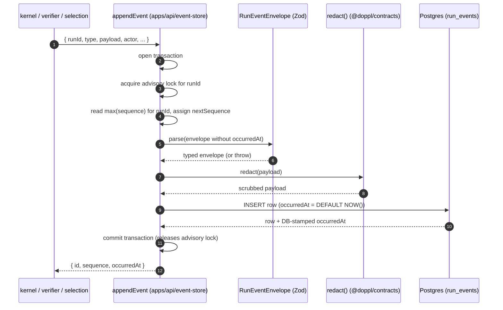
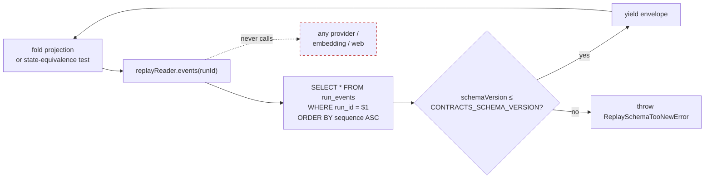
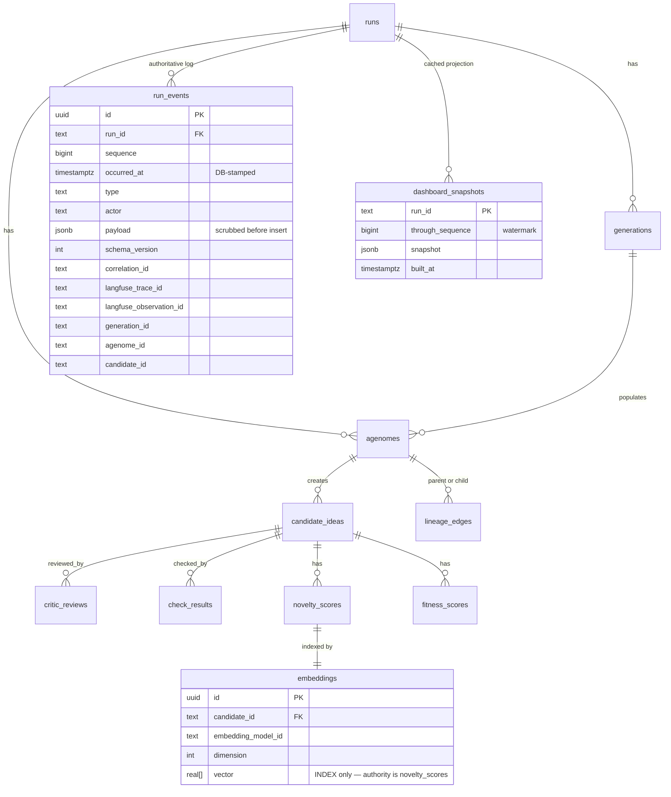

# feat: Phase 1 — Persistence & event store (Doppl)

## Summary

Stand up the authoritative persistence kernel: a Postgres 16 `run_events` table as the append-only, per-run-monotonic-sequence, schema-validated, transactional write boundary; the secret-redaction scrub wired at every append boundary (§14 safety pin, consuming the function frozen in Phase 0); the Drizzle migration chain that materializes the canonical projection/table set (same chain runs identically local & hosted at boot); the inline raw+normalized output discipline with `EvidenceRef` resolution strictly within the Postgres tier; and the replay reader that reconstructs state ordered by `(run_id, sequence)` with **zero** model/embedding/web calls and asserts state-equivalence against the run-end projection.

Phase 1 is **library code only** — no HTTP server, no SSE, no REST. The HTTP surface lands in Phase 6. Phase 1 ships under `apps/api/event-store/` consumed in-process by later phases (kernel P3, verifier P4, selection P5, projections P6).

---

## Problem Frame

The append-only event log is the **single source of truth** (`ARCHITECTURE.md §2/§4/§9`, `DECISIONS.md` ADR-003): every read model — current-state tables, dashboard projections, the lineage graph, Neo4j exports, SSE streams, Langfuse traces — is **derived and never authoritative**. Phase 1 builds that source-of-truth tier. Get this wrong and every downstream track inherits the bug — wrong ordering, secret leaks at the persistence boundary, drift between local and hosted DBs, or replay calls leaking out to providers all silently corrupt the demo evidence.

A second framing matters: **Phase 0 already absorbed most of Phase 1's contract work**. `RunEventEnvelope` + closed `RunEventType` registry + 7-role `Actor` + `EvidenceRef` + `EnergyEvent` + `NoveltyScore` + per-type payload map + `redact()` scrub all shipped in `@doppl/contracts` (PR #1). The IMPLEMENTATION_PLAN.md was authored before Phase 0 was scoped that broadly. So Phase 1's `P1.1 / P1.2-function / P1.5 / P1.6-contract` work is **already done**; this plan picks up the persistence-wiring deliverables that remain: Drizzle schema + migrations + writer + redaction-at-write boundary + evidence resolver + replay reader + testing harness.

---

## Scope Boundaries

**In scope:**
- New `apps/api/` package skeleton (private, library-only at this phase — no HTTP).
- `docker-compose.yml` at repo root with Postgres 16 + `pg_data` volume.
- Drizzle ORM 0.36.x + drizzle-kit 0.28.x + `pg` 8.x driver wired into the new package.
- Canonical Drizzle schema mirroring the Phase 0 contracts: `runs`, `run_events` (authoritative), `generations`, `agenomes`, `candidate_ideas`, `critic_reviews`, `check_results`, `fitness_scores`, `novelty_scores`, `lineage_edges`, `embeddings`, `dashboard_snapshots`. Each materialized via Drizzle table defs that the migration chain reflects 1:1.
- Per-run monotonic gapless `sequence` column with a `UNIQUE (run_id, sequence)` constraint + advisory-lock-backed assignment for concurrent appends to the same run.
- `occurredAt` stamped by Postgres (`DEFAULT NOW()`) — never supplied by the caller, never used for ordering.
- Append-only enforcement: a Postgres trigger rejecting `UPDATE` and `DELETE` against persisted rows (defense-in-depth; the writer never issues either, the trigger is the last-mile pin).
- Append writer (`appendEvent`) that runs Zod validation + `redact()` + insert inside one transaction.
- Boot migrator that runs migrations to current head idempotently (re-run against an already-migrated DB is a no-op).
- `EvidenceRef` resolver that dereferences `kind/eventId` against the Postgres tier and **fails closed** on any external-only `uri`.
- Replay reader: ordered iterator over `(runId, sequence)`, rejects `schemaVersion > CONTRACTS_SCHEMA_VERSION`, reads inline-persisted retrieval results and embedding vectors without re-fetching anything from a provider.
- Canonical serialization helper that lets a state-equivalence test compare "rebuilt-from-log" projection ≡ "captured-at-run-end" projection.
- Testcontainers-per-test-file integration harness running real Drizzle migrations against a disposable Postgres 16 container.
- Unit tests for pure logic + integration tests for every storage invariant.

**Deferred for later** (next plans, not non-goals):
- Phase 2 work (model gateway, OpenRouter, OpenAI embeddings adapter) — `embeddings` table only stores what the gateway computes; Phase 1 does not call any provider.
- Phase 3 runtime kernel (state machines, caps, energy ledger) — consumes `appendEvent`; Phase 1 ships only the writer.
- Phase 6 projection builders (current-state tables fold, lineage projection, SSE) — Phase 1 ships schemas and writer; projection-building logic is Phase 6.
- REST + SSE endpoints — Phase 6.
- Hosted Postgres deployment (Railway / Neon / Supabase migration runbook) — local-first per `ARCHITECTURE.md`; the migration chain is *designed* to run on hosted, but the runbook isn't authored here.
- pgvector adoption — `ARCHITECTURE.md §9` keeps it as a deferred indexing optimization; the `embeddings` table uses `real[]` for now (authoritative vector lives in `novelty.scored` event payload anyway).
- Neo4j spike (Phase 6 / Phase D) — `lineage_edges` is a relational projection; the Neo4j export is a separate, deferred concern.

**Outside this product's identity** (per `DECISIONS.md` / `CONSTRAINTS.md`):
- SQLite anywhere (ADR-003).
- Treating any read model (projections, Langfuse, Neo4j, SSE buffer) as authoritative (§2.5).
- Persisting provider secrets in event payloads (REQ-S-004; `redact()` is the last-mile pin on top of "credentials only loaded from env").
- Re-running model / embedding / web calls during replay (`REQ-D-001`, `REQ-F-014`).

**Deferred to Follow-Up Work** (plan-local sequencing, not scope):
- A separate ce-plan for Phase 2 (`model-gateway` track) — should be drafted right after this ships so the kernel track can start consuming both the event store and the gateway.
- CI for integration tests — testcontainers works locally now; a GitHub Actions matrix that boots Docker is a follow-up plan when CI cost becomes worth it.

---

## Origin Document References

- `IMPLEMENTATION_PLAN.md` Phase 1 (lines 342-455) — binding decomposition. Each U-ID below maps to one or more `P1.x`. Note: `P1.1`, the function side of `P1.2`, `P1.5`'s contract, and `P1.6`'s contract were absorbed by Phase 0 (see `docs/plans/2026-06-19-001-…-plan.md` U4 / U5 / U8 / U11 / U12 / U13); this plan picks up the persistence-wiring remainder.
- `ARCHITECTURE.md` §2.5 (subsystem DAG: `contracts → infrastructure ports → domain/runtime → projections → api → ui`), §4 (event model + RNG capture + redaction), §6 (module/import rules), §9 (storage tiers, embedding authority, projection rebuild), §14 (testing strategy + redaction), §15 (fail-fast config).
- `docs/planning/DECISIONS.md` ADR-003 (Postgres locked, SQLite forbidden).
- `docs/planning/DATA_MODEL.md` §100-122 (event log = authoritative; projections derived; historical events not editable in place; reproduction/culling events define lineage).
- `@doppl/contracts` (Phase 0 / PR #1) — every Zod schema this plan persists is already frozen there.

---

## Key Technical Decisions

| Decision | Choice | Rationale |
|---|---|---|
| Local Postgres delivery | **docker-compose** with Postgres 16 + `pg_data` volume at repo root | User selection; zero-account dev loop; mirrors hosted Postgres exactly so the `same migration chain runs local+hosted at boot` invariant holds with no env-specific branching. |
| Test database strategy | **testcontainers per test file** | User selection; bulletproof isolation, real Drizzle migrations every run, schema drift between tests and production becomes structurally impossible. |
| Drizzle version | **drizzle-orm 0.36.x + drizzle-kit 0.28.x** | Latest stable line as of June 2026; well-tested with Postgres 16 and pg 8.x; native generation of timestamped migration files. |
| Driver | **node-postgres (`pg` 8.x)** | First-class Drizzle dialect target; battle-tested; supports `LISTEN/NOTIFY` if later phases want it; small and explicit. |
| Per-run sequence assignment | **Postgres advisory lock keyed by `runId` hash + window-function gap check** | The plan's invariant is "monotonic gapless per run, serialized cross-process". A `runId`-scoped advisory lock serializes appends to the same run without contending on cross-run appends. The gap check inside the same transaction rejects out-of-order or duplicate writes. Alternative: per-run Postgres sequence (`CREATE SEQUENCE run_${id}_seq`) was rejected — unbounded sequence proliferation across runs is operationally messy. |
| `sequence` column type | **`bigint`** | Future-proof against very long runs; integer overhead is negligible at insert. |
| Append-only enforcement | **Postgres trigger rejecting `UPDATE` / `DELETE` on `run_events`** | The writer never issues either, but the trigger is the structural pin — a future incidental migration or admin query cannot mutate history. |
| `occurredAt` column | **`timestamptz NOT NULL DEFAULT NOW()`** | DB-stamped UTC; supplying it from the caller is rejected at the writer (the Zod `RunEventEnvelope` accepts it for read-path symmetry, but the writer strips it before insert so Postgres always assigns it — see U6 Approach). |
| `payload` column | **`jsonb NOT NULL`** | `jsonb` allows indexed access later (GIN over payload paths if needed for projections). The Zod per-type validation runs *before* insert, so the column is structurally trusted. |
| Vector storage | **`real[]`** for `embeddings.vector` (not `vector` / pgvector) | Phase 1 is authoritative-once-computed: the vector lives in `novelty.scored` payload and the `embeddings` row is just an index. App-level cosine works fine at MVP scale per `ARCHITECTURE.md §8`. pgvector is a deferred indexing optimization. |
| Migration generation | **`drizzle-kit generate`** (timestamped SQL files committed) | Migration files are checked into `apps/api/src/event-store/migrations/`; the boot migrator (`apps/api/src/event-store/migrate.ts`) applies them via `drizzle-orm/node-postgres/migrator`. Same chain runs local + hosted. |
| Boot migrator idempotency | **Drizzle's `__drizzle_migrations` table** | Standard mechanism; re-run is a no-op once a migration is in the table. The boot sequence is `migrate → seed → start` per `ARCHITECTURE.md §15`; Phase 1 supplies the `migrate` step. |
| Transaction shape | **`db.transaction(async (tx) => { /* validate → redact → insert */ })`** | The plan requires schema validation + redaction + insert to be one transaction. Drizzle's transaction wrapper gives us exactly this; partial commits are impossible. |
| Replay-reader API | **Async iterator** (`for await (const env of replayReader.events(runId)) { … }`) | Streams ordered rows without loading the whole run into memory; downstream fold consumers iterate naturally. |
| `EvidenceRef` resolver — external `uri` policy | **Fail closed** (return `{ status: "external_only", uri }`, do NOT fetch) | The resolver never reaches outside Postgres — that's the §9 invariant. Callers handle the closed-fail case explicitly. |
| Canonical serialization | **Stable JSON: sorted object keys at every level + RFC 7159 number form** | Required to assert state-equivalence between "rebuilt-from-log" and "captured-at-run-end" projections without false positives from key-order or whitespace. |
| Test isolation per file | **One container per test file** (`@testcontainers/postgresql`) + `globalSetup` warmup | Per-test containers would be too slow (~3s startup × N); per-file is the sweet spot for isolation vs CI time. |
| Schema-snapshot discipline | **Reuse the U3 `fieldset()` helper from `@doppl/contracts`** — every Drizzle table also gets a column-name-set snapshot test | Catches Drizzle/contracts drift in CI: if a contract field renames without the Drizzle schema following, the column-set snapshot fails. |
| `dashboard_snapshots` watermark | **`through_run_id` + `through_sequence` columns** | Every cached/rebuildable projection carries the `(runId, sequence)` it was built through (per IMPLEMENTATION_PLAN.md P1.4). A reader compares against the run's head sequence to detect staleness. |

---

## High-Level Technical Design

These sketches are **directional guidance** for review, not implementation specification.

### Write path (the §14 safety pin)



Three structural invariants pinned by this shape:
1. Schema validation runs before redaction (so a malformed envelope never reaches the scrub).
2. Redaction runs before insert (so the storage tier never sees a secret).
3. The advisory lock + `UNIQUE (run_id, sequence)` constraint together make gap-free monotonic sequence assignment safe under concurrent appends to the same run, without serializing cross-run appends.

### Replay path



Zero external calls means: no `fetch()`, no `openai.embeddings.create()`, no `retrieval.search()` — the reader only reads `run_events.payload` (which already contains the persisted seed, persisted retrieval results, and persisted embedding vectors).

### Canonical schema (ERD sketch)



Read-model tables (`runs`, `generations`, …) are projections; Phase 6 owns their fold logic. Phase 1 only declares the schema so migrations can materialize them.

---

## Output Structure

```text
doppl-prime/
├── docker-compose.yml                              (NEW — Postgres 16 + pg_data volume)
├── apps/
│   └── api/                                        (NEW — private workspace package)
│       ├── package.json                            (name: "@doppl/api")
│       ├── tsconfig.json                           (extends ../../tsconfig.base.json)
│       ├── vitest.config.ts
│       ├── drizzle.config.ts
│       └── src/
│           ├── index.ts                            (barrel for the event-store public API)
│           └── event-store/
│               ├── index.ts                        (barrel — appendEvent, replayReader, resolveEvidence)
│               ├── connection.ts                   (pg pool factory; reads DATABASE_URL)
│               ├── schema.ts                       (Drizzle table defs for the full canonical set)
│               ├── migrations/                     (drizzle-kit generated)
│               │   ├── 0000_initial_schema.sql
│               │   └── meta/_journal.json
│               ├── migrate.ts                      (boot migrator, idempotent)
│               ├── append.ts                       (appendEvent + transaction shape)
│               ├── sequence.ts                     (advisory-lock + max-sequence helpers)
│               ├── append-only-trigger.sql         (the UPDATE/DELETE-rejecting trigger)
│               ├── replay-reader.ts                (async-iterator over ordered events)
│               ├── canonical-serialization.ts      (stable JSON for equivalence asserts)
│               ├── evidence-resolver.ts            (Postgres-tier-only EvidenceRef resolver)
│               └── __tests__/                      (unit tests for pure helpers)
│                   ├── canonical-serialization.test.ts
│                   ├── sequence.test.ts
│                   └── …
│           └── __integration_tests__/              (testcontainers — slow tier)
│               ├── helpers/
│               │   ├── pg-container.ts             (testcontainers helper)
│               │   └── seed.ts                     (fixture helpers built on @doppl/contracts)
│               ├── append.int.test.ts
│               ├── monotonic-sequence.int.test.ts
│               ├── append-only-constraint.int.test.ts
│               ├── redaction-at-write.int.test.ts
│               ├── evidence-resolver.int.test.ts
│               ├── replay-reader.int.test.ts
│               ├── replay-state-equivalence.int.test.ts
│               └── migrations-idempotent.int.test.ts
└── packages/contracts/                             (existing — no changes)
```

> The tree is the expected output shape. Per-unit `Files:` lists are authoritative; layout may shift if implementation surfaces something better.

---

## Implementation Units

Every unit's execution posture is **test-first** (matching Phase 0's convention) unless noted. Each unit cites the source `P1.x` from IMPLEMENTATION_PLAN.md for traceability — note many `P1.x` are already shipped by Phase 0 and are marked accordingly.

### U1. `apps/api` package skeleton + docker-compose + Postgres connection

- **Goal:** `pnpm install` succeeds with the new `@doppl/api` package, `docker compose up -d` brings up Postgres 16, and a `pg` pool can connect from a smoke test.
- **Requirements:** ADR-003 (Postgres); REQ-NF-001 (fail-fast at boot).
- **Dependencies:** none.
- **Files:**
  - Create: `docker-compose.yml`, `apps/api/package.json`, `apps/api/tsconfig.json`, `apps/api/vitest.config.ts`, `apps/api/src/index.ts`, `apps/api/src/event-store/connection.ts`, `apps/api/src/event-store/__tests__/connection.test.ts`
  - Modify: `.env.example` (add `DATABASE_URL`)
- **Approach:** docker-compose declares a single `postgres` service: image `postgres:16-alpine`, port `5432`, env `POSTGRES_USER=doppl`/`POSTGRES_PASSWORD=doppl`/`POSTGRES_DB=doppl_dev`, volume `pg_data:/var/lib/postgresql/data`, healthcheck `pg_isready`. `connection.ts` exports `createPool(databaseUrl?: string)` reading `DATABASE_URL` with a sensible local default for dev. Package depends on `pg`, `drizzle-orm`, `drizzle-kit`, `@doppl/contracts` (workspace), and devDeps `vitest`, `@testcontainers/postgresql`, `@types/pg`.
- **Execution note:** Smoke-test-first — a unit test that creates a pool and immediately `end()`s it (no DB connection) confirms the package wires.
- **Patterns to follow:** Mirror `packages/contracts/package.json` shape (private, `type: "module"`, source-first dev, `tsc --emitDeclarationOnly` for publish types).
- **Test scenarios:**
  - Smoke: `createPool({ connectionString: "postgres://invalid" })` returns a Pool without throwing (lazy connection).
  - Config: passing no args uses `process.env.DATABASE_URL`; absence throws a `MissingDatabaseUrlError` with a clear message.
- **Verification:** `pnpm -w typecheck && pnpm -w lint && pnpm -w test` exit 0; `docker compose up -d postgres` reaches healthy; `psql $DATABASE_URL -c 'select 1'` returns `1`.

### U2. Drizzle schema definitions for the full canonical table set (source: P1.4 — schema half)

- **Goal:** `apps/api/src/event-store/schema.ts` declares every table from `IMPLEMENTATION_PLAN.md` P1.4 using Drizzle's `pgTable` DSL. No migrations generated yet — just the TS schema.
- **Requirements:** `ARCHITECTURE.md §9` (storage tier); P1.4 canonical table set.
- **Dependencies:** U1.
- **Files:**
  - Create: `apps/api/src/event-store/schema.ts`, `apps/api/src/event-store/__tests__/schema-columns.fieldset.test.ts`
  - Modify: `apps/api/src/index.ts` (barrel)
- **Approach:** Declare `runs`, `run_events`, `generations`, `agenomes`, `candidate_ideas`, `critic_reviews`, `check_results`, `fitness_scores`, `novelty_scores`, `lineage_edges`, `embeddings`, `dashboard_snapshots`. `run_events` columns: `id uuid PK`, `run_id text NOT NULL`, `sequence bigint NOT NULL`, `occurred_at timestamptz NOT NULL DEFAULT NOW()`, `type text NOT NULL`, `actor text NOT NULL`, `payload jsonb NOT NULL`, `schema_version int NOT NULL`, `correlation_id text`, `langfuse_trace_id text`, `langfuse_observation_id text`, `generation_id text`, `agenome_id text`, `candidate_id text`, `UNIQUE (run_id, sequence)`. Other tables match the Phase 0 Zod field-sets (camelCase → snake_case at the DB column boundary). `embeddings.vector` is `real[]`. `dashboard_snapshots` carries `through_run_id` + `through_sequence` watermark.
- **Execution note:** test-first (column-set snapshots first).
- **Patterns to follow:** Phase 0 unit U3 `fieldset()` snapshot pattern — every table gets a `*.fieldset.test.ts` asserting its column-name set.
- **Test scenarios:**
  - Snapshot: `Object.keys(runEvents._.columns).sort()` matches the expected 14 columns (inline snapshot).
  - Snapshot: every other table has its column-set snapshot (inline) — adding/renaming a column is a single test failure.
  - Cross-contract invariant: `runEvents` columns are a superset of the camelCase keys in `RunEventEnvelope` (snake-case-equivalent) — a meta-test asserts this so renaming a contract field without updating the table breaks immediately.
  - Type alignment: `Pick<InferSelectModel<typeof runEvents>, "schema_version">["schema_version"]` is a `number` (Drizzle's bigint mode is `string` by default — assert we configured the right mode).
- **Verification:** Column snapshots committed; `pnpm --filter @doppl/api typecheck` clean.

### U3. Drizzle migration generation + boot migrator (idempotent) (source: P1.4 — migration half)

- **Goal:** `drizzle-kit generate` produces `apps/api/src/event-store/migrations/0000_initial_schema.sql`. The boot migrator at `migrate.ts` applies it idempotently against a fresh DB.
- **Requirements:** P1.4 "same chain runs identically local & hosted at boot"; idempotent re-run.
- **Dependencies:** U2.
- **Files:**
  - Create: `apps/api/drizzle.config.ts`, `apps/api/src/event-store/migrate.ts`, `apps/api/src/event-store/migrations/0000_initial_schema.sql` (generated), `apps/api/src/event-store/migrations/meta/_journal.json` (generated), `apps/api/src/event-store/migrations/meta/0000_snapshot.json` (generated), `apps/api/__integration_tests__/helpers/pg-container.ts`, `apps/api/__integration_tests__/migrations-idempotent.int.test.ts`
- **Approach:** `drizzle.config.ts` points `out` at `src/event-store/migrations/`, `schema` at `src/event-store/schema.ts`, dialect `postgresql`. `migrate.ts` exports `runMigrations(db)` using `drizzle-orm/node-postgres/migrator`. `pg-container.ts` starts a `@testcontainers/postgresql` container, runs migrations against it, and exposes the pool. The trigger-based append-only enforcement (U7) is applied via a *follow-on* migration file authored manually since Drizzle doesn't model triggers natively.
- **Execution note:** test-first.
- **Patterns to follow:** Drizzle node-postgres migrator pattern; testcontainers `StartedPostgreSqlContainer.getConnectionUri()`.
- **Test scenarios:**
  - Integration: fresh container → `runMigrations(db)` → every table from U2 exists with the expected columns (`SELECT column_name FROM information_schema.columns WHERE table_name = $1` matches the snapshot).
  - Integration: idempotent — `runMigrations(db)` twice in a row succeeds; the second call is a no-op (no row added to `__drizzle_migrations` beyond the first run).
  - Edge: passing a closed pool surfaces a clear error rather than hanging.
- **Verification:** Migration files committed; `pnpm --filter @doppl/api test:int -t "migrations-idempotent"` passes.

### U4. Per-run monotonic sequence helper with advisory lock (source: P1.3 — sequence half)

- **Goal:** `nextSequence(tx, runId)` returns the next gapless sequence for a run under an advisory lock held for the lifetime of the transaction.
- **Requirements:** P1.3 monotonic gapless per-run; sole-ordering-key invariant.
- **Dependencies:** U3.
- **Files:**
  - Create: `apps/api/src/event-store/sequence.ts`, `apps/api/src/event-store/__tests__/sequence.test.ts`, `apps/api/__integration_tests__/monotonic-sequence.int.test.ts`
- **Approach:** `nextSequence(tx, runId)` performs `SELECT pg_advisory_xact_lock($1)` with `$1` = a stable 64-bit hash of `runId` (e.g., `hashtext(run_id)::bigint`). Then `SELECT COALESCE(MAX(sequence), -1) + 1 AS next FROM run_events WHERE run_id = $1`. Returns `bigint` (Drizzle string). The lock auto-releases on transaction commit/rollback. Per-run scoping means cross-run appends don't contend; same-run concurrent appends serialize.
- **Execution note:** test-first.
- **Patterns to follow:** None local; standard Postgres advisory-lock-for-row-allocation pattern.
- **Test scenarios:**
  - Unit: a pure helper that builds the hash for `runId` returns a stable bigint for the same input.
  - Integration: empty `run_events` for `runId="run_a"` → `nextSequence` returns 0.
  - Integration: after inserting events at sequences 0, 1, 2 for `runId="run_a"` → next call returns 3.
  - Integration: concurrent appends to the same `runId` from two parallel transactions get distinct sequential values (0, 1) — verified by spawning two transactions that each call `nextSequence` then `pg_sleep(0.1)` then insert.
  - Integration: parallel appends to different `runId`s do NOT serialize on each other (timing test: total wall-clock ≈ max(per-tx duration), not sum).
  - Integration: a rolled-back transaction does not consume a sequence (the next successful append for that run uses the abandoned number).
- **Verification:** All scenarios pass; lock contention measurable but bounded per-run.

### U5. `appendEvent` writer: validate + redact + insert in one transaction (source: P1.3 — write half, P1.2 — wiring half)

- **Goal:** `appendEvent(db, input): Promise<{ id, sequence, occurredAt }>` performs Zod validation → `redact()` → INSERT in a single transaction.
- **Requirements:** P1.3 schema-validated transactional append; P1.2 redaction at write boundary; REQ-S-004.
- **Dependencies:** U3, U4.
- **Files:**
  - Create: `apps/api/src/event-store/append.ts`, `apps/api/__integration_tests__/append.int.test.ts`, `apps/api/__integration_tests__/redaction-at-write.int.test.ts`
- **Approach:** `appendEvent` accepts an input shape that mirrors `RunEventEnvelope` minus DB-stamped fields (`id` is generated client-side as `randomUUID()` for correlation pre-insert; `occurredAt` is omitted and DB-stamped). The transaction body: (1) `nextSequence(tx, runId)`; (2) validate the assembled envelope against `RunEventEnvelope` from `@doppl/contracts`; (3) per-type payload validation via `parseEventPayload(type, payload)`; (4) `payload = redact(payload)` from `@doppl/contracts`; (5) `INSERT INTO run_events (...) RETURNING id, sequence, occurred_at`. Errors at any step roll back the whole transaction; the row is never partially written. Returns `{ id, sequence, occurredAt }` (the DB-stamped `occurredAt`).
- **Execution note:** test-first — the transactional invariants are exactly what tests should drive.
- **Patterns to follow:** Phase 0 `RunEventEnvelope` parse pattern + `redact()` pattern; Drizzle `db.transaction(async (tx) => …)`.
- **Test scenarios:**
  - Integration happy path: valid `run.configured` envelope → row inserted; returned `sequence === 0`; `occurredAt` is set to a recent UTC time.
  - Integration: a malformed payload (e.g., `run.configured` without `config`) throws; no row in `run_events`.
  - Integration: an envelope carrying `actor: "developer"` (not in the closed 7-role union) throws; no row inserted.
  - Integration: an envelope carrying `type: "run.exploded"` (not in `RunEventType`) throws; no row inserted.
  - Integration: redaction (REQ-S-004) — payload `{ provider: { apiKey: "sk-abcdefghijklmnopqrstuvwxyz0123" } }` is persisted with the secret replaced by `"[REDACTED]"`; raw secret substring absent from `SELECT payload FROM run_events` row dump.
  - Integration: redaction is applied even when the envelope is otherwise rejected — actually NO, validation fails first → no row → no redaction concern. The test asserts the rejection.
  - Integration: a caller-supplied `occurredAt` is ignored — the writer strips it; the DB stamps it. Two appends within 1ms have different `occurredAt` values stamped by Postgres but identical-shape stamps.
  - Integration: `schemaVersion` defaults to `CONTRACTS_SCHEMA_VERSION` when the caller omits it (so the kernel doesn't have to pass it on every call); a caller-supplied value `> CONTRACTS_SCHEMA_VERSION` is rejected.
- **Verification:** All scenarios pass; `SELECT pg_relation_size('run_events')` grows by exactly one row per `appendEvent`.

### U6. Append-only enforcement trigger (source: P1.3 / P1.4 — invariant half)

- **Goal:** A Postgres trigger that rejects `UPDATE` and `DELETE` against `run_events`, packaged as a versioned migration step.
- **Requirements:** P1.4 append-only enforcement.
- **Dependencies:** U3.
- **Files:**
  - Create: `apps/api/src/event-store/migrations/0001_append_only_trigger.sql`, `apps/api/__integration_tests__/append-only-constraint.int.test.ts`
  - Modify: `apps/api/src/event-store/migrations/meta/_journal.json` (regenerated by `drizzle-kit generate` after manual SQL drop-in)
- **Approach:** SQL: `CREATE OR REPLACE FUNCTION run_events_reject_mutation() RETURNS TRIGGER LANGUAGE plpgsql AS $$ BEGIN RAISE EXCEPTION 'run_events is append-only'; END $$;` plus `CREATE TRIGGER run_events_reject_update BEFORE UPDATE OR DELETE ON run_events FOR EACH ROW EXECUTE FUNCTION run_events_reject_mutation();`. Drizzle doesn't model triggers natively — the SQL is hand-authored and added to the migration chain manually (this is a known Drizzle pattern; the journal records the manual migration so `drizzle-kit generate` doesn't re-emit it). Document the manual step in the file header so the next migration generation doesn't regress.
- **Execution note:** test-first.
- **Patterns to follow:** Standard Postgres trigger pattern.
- **Test scenarios:**
  - Integration: insert one event via `appendEvent` → `UPDATE run_events SET type = 'run.completed' WHERE id = $1` throws with the trigger's message; row unchanged.
  - Integration: `DELETE FROM run_events WHERE id = $1` throws; row count unchanged.
  - Integration: `TRUNCATE run_events` — separate test asserts whether this is intentionally blocked or not. Default Postgres trigger behavior: `BEFORE DELETE` does not fire on `TRUNCATE`; we accept this and document it (TRUNCATE is a DDL-tier operation, not a runtime mutation; the kernel never issues it).
  - Integration: `INSERT INTO run_events …` directly (bypassing `appendEvent`) succeeds at the schema level (trigger only blocks mutations) — *however* such an insert bypasses redaction and is policy-banned; an ESLint/biome custom rule (deferred to follow-up) would catch this in source.
- **Verification:** Trigger present after migration; mutation tests pass.

### U7. `EvidenceRef` resolver — Postgres-tier only, fails closed on external (source: P1.7)

- **Goal:** `resolveEvidence(db, ref): Promise<EvidenceResolution>` dereferences an `EvidenceRef` strictly within Postgres. External-only refs return `{ status: "external_only", uri }` without fetching.
- **Requirements:** P1.7 fail-closed; §9 (no external store).
- **Dependencies:** U3.
- **Files:**
  - Create: `apps/api/src/event-store/evidence-resolver.ts`, `apps/api/__integration_tests__/evidence-resolver.int.test.ts`
- **Approach:** A `EvidenceResolution` sum type: `{ status: "resolved", event: RunEventEnvelope }` for `kind/eventId` matches against `run_events`; `{ status: "not_found", eventId }` when the ID does not match; `{ status: "external_only", uri }` when `eventId` is absent and only `uri` is present; `{ status: "langfuse_only", langfuseObservationId }` when only `langfuseObservationId` is present (also non-Postgres-tier, fails closed). No HTTP client imported; no `fetch` called.
- **Execution note:** test-first.
- **Patterns to follow:** Phase 0 `EvidenceRef` (U8) — the resolver's input type IS `EvidenceRef`.
- **Test scenarios:**
  - Integration happy: insert event `evt_42`; `resolveEvidence(db, { kind: "trace", eventId: "evt_42" })` returns `{ status: "resolved", event: <envelope> }`.
  - Integration: `resolveEvidence(db, { kind: "trace", eventId: "evt_does_not_exist" })` returns `{ status: "not_found", eventId: "evt_does_not_exist" }`.
  - Integration: `resolveEvidence(db, { kind: "prior_art", uri: "https://example.com/x" })` returns `{ status: "external_only", uri }` and does NOT issue a network call (asserted by mocking `fetch` and asserting zero invocations — or simply by code inspection since no http client is imported).
  - Integration: `resolveEvidence(db, { kind: "trace", langfuseObservationId: "obs_1" })` returns `{ status: "langfuse_only", langfuseObservationId: "obs_1" }`.
  - Edge: an `EvidenceRef` with both `eventId` AND `uri` — `eventId` wins (Postgres-tier is authoritative); `uri` is informational and ignored for resolution.
- **Verification:** All scenarios pass; a grep for `fetch(`, `http`, `https` in `evidence-resolver.ts` returns zero matches.

### U8. Canonical serialization for state-equivalence (source: P1.8 — equivalence half)

- **Goal:** `canonicalize(value: unknown): string` returns stable JSON: object keys sorted lexicographically at every level; numbers in RFC 7159 normalized form; arrays preserve order (they're meaningful).
- **Requirements:** P1.8 state-equivalence assertion.
- **Dependencies:** U1.
- **Files:**
  - Create: `apps/api/src/event-store/canonical-serialization.ts`, `apps/api/src/event-store/__tests__/canonical-serialization.test.ts`
- **Approach:** Recursive serialization. For objects: `Object.keys(value).sort()` then build canonical form. For arrays: serialize each element canonically and join. For numbers: `JSON.stringify(n)` is already RFC 7159; but `-0` → `0`. For strings: `JSON.stringify`. For `null`/booleans: literal. Throws on `Date`, `Map`, `Set`, functions, symbols — those should never appear in projection state (which is plain JSON).
- **Execution note:** test-first.
- **Patterns to follow:** Standard "canonical JSON" implementations (RFC 8785 if a reader needs the full spec).
- **Test scenarios:**
  - Happy: `canonicalize({ b: 1, a: 2 })` === `canonicalize({ a: 2, b: 1 })` — key order doesn't matter.
  - Happy: nested objects sort recursively: `canonicalize({ x: { z: 1, y: 2 } })` produces `{"x":{"y":2,"z":1}}`.
  - Arrays preserve order: `canonicalize([3, 1, 2])` ≠ `canonicalize([1, 2, 3])`.
  - Edge: `canonicalize(-0)` === `canonicalize(0)`.
  - Edge: `canonicalize(null)`, `canonicalize(true)`, `canonicalize("")` all return the literal JSON forms.
  - Error: `canonicalize(new Date())` throws with a message naming the unsupported type.
  - Error: `canonicalize(() => {})` throws.
  - Equivalence property: for several fixture projection objects, `canonicalize(deepCopy(fx)) === canonicalize(fx)`.
- **Verification:** All scenarios pass; ready for use in U10.

### U9. Replay reader: ordered async iterator, no external calls, schemaVersion gate (source: P1.8 — read half)

- **Goal:** `replayReader(db).events(runId): AsyncIterable<RunEventEnvelope>` yields envelopes strictly ordered by `(run_id, sequence)`. Rejects any row whose `schemaVersion > CONTRACTS_SCHEMA_VERSION`.
- **Requirements:** P1.8 ordered, no model/embedding/web calls, schema gate.
- **Dependencies:** U3.
- **Files:**
  - Create: `apps/api/src/event-store/replay-reader.ts`, `apps/api/__integration_tests__/replay-reader.int.test.ts`
- **Approach:** `replayReader(db).events(runId)` queries `SELECT * FROM run_events WHERE run_id = $1 ORDER BY sequence ASC` and yields rows mapped through `RunEventEnvelope.parse(row)`. A `ReplaySchemaTooNewError` is thrown the moment a `schemaVersion > CONTRACTS_SCHEMA_VERSION` is encountered (mid-iteration). A `ReplaySequenceGapError` is thrown if the iterator sees a gap in the sequence (expected `n` but got `n+2`); since U4+U5 guarantee no gaps in a healthy run, this is a corruption alarm. No HTTP / no embedding / no provider call.
- **Execution note:** test-first.
- **Patterns to follow:** Node async iterator pattern; `for await` consumption.
- **Test scenarios:**
  - Integration happy: append 3 events (sequences 0, 1, 2) → iterator yields them in order; each is a valid `RunEventEnvelope`.
  - Integration: append events for two runs; iterator over `run_a` does not yield events for `run_b`.
  - Integration: `schemaVersion = CONTRACTS_SCHEMA_VERSION` accepted; `schemaVersion = CONTRACTS_SCHEMA_VERSION + 1` (insert via raw SQL bypassing the writer) → iterator throws `ReplaySchemaTooNewError` at that row.
  - Integration: forge a gap (delete a row via direct SQL — for testing, since the trigger blocks deletes, the test sets up the gap before the trigger migration applies, or uses a separate raw-SQL bypass) → iterator throws `ReplaySequenceGapError(expected 1, got 2)`.
  - Integration "no external calls": a grep for `fetch`, `openai`, `axios`, `request`, `http`, `https` in `replay-reader.ts` returns zero matches; the test asserts via import inspection (`Object.keys(require.cache)` filter) that no provider package is loaded.
  - Integration: iterating consumes O(constant) memory per row (streaming) — verified by an iteration over 10k events where heap usage stays bounded (loose assertion).
- **Verification:** All scenarios pass; the no-external-calls invariant is structurally enforced by import inspection.

### U10. Replay state-equivalence integration test (source: P1.8 — equivalence assertion)

- **Goal:** End-to-end integration test: build a small fixture run via `appendEvent`, capture a "run-end projection" by folding events in-process, then replay the same run via `replayReader` + canonical-serialize both → both serializations equal.
- **Requirements:** P1.8 state-equivalence.
- **Dependencies:** U5, U8, U9.
- **Files:**
  - Create: `apps/api/__integration_tests__/replay-state-equivalence.int.test.ts`, `apps/api/__integration_tests__/helpers/seed.ts`
- **Approach:** `seed.ts` exports `buildSampleRun(db, runId): Promise<RunEndProjection>` — appends a representative sequence of events (e.g., `run.configured`, `generation.started`, `agenome.spawned`, `candidate.created`, `critic.reviewed`, `fitness.scored`, `lineage.culled`, `generation.completed`, `run.completed`) using `@doppl/contracts` fixtures (the U18 canonical fixtures from Phase 0). It also computes a `RunEndProjection` data structure as it goes — this is the "captured-at-run-end" projection. The test then drops to a fresh in-memory fold over `replayReader.events(runId)` to rebuild the same projection from the log, and asserts `canonicalize(rebuilt) === canonicalize(captured)`.
- **Execution note:** test-first — this test IS the equivalence assertion.
- **Patterns to follow:** Phase 0 `__fixtures__/events.ts` (the cross-track canonical fixtures).
- **Test scenarios:**
  - Integration: ~10-event fixture run; equivalence holds.
  - Integration: equivalence still holds after a `provider_call_failed` event (failure path persists too).
  - Integration: equivalence still holds after a redacted secret in a payload — redaction is deterministic, so both paths produce the same scrubbed output.
- **Verification:** Test passes; sample fold logic lives in the test file (not the production codebase — projection fold is Phase 6).

### U11. Public API barrel + contract surface harness for `@doppl/api` event-store

- **Goal:** `apps/api/src/index.ts` exports a curated public API for the event-store, and a contract-surface test asserts every required export is present.
- **Requirements:** §2.5 module boundaries.
- **Dependencies:** U5, U7, U9.
- **Files:**
  - Create: `apps/api/src/__tests__/api-surface.test.ts`
  - Modify: `apps/api/src/index.ts`, `apps/api/src/event-store/index.ts`
- **Approach:** `apps/api/src/event-store/index.ts` exports: `createPool`, `runMigrations`, `appendEvent`, `nextSequence`, `resolveEvidence`, `replayReader`, `canonicalize`, `ReplaySchemaTooNewError`, `ReplaySequenceGapError`, `MissingDatabaseUrlError`. `apps/api/src/index.ts` re-exports under `eventStore.*` namespace or flat — pick flat for symmetry with `@doppl/contracts`. The surface test (mirroring Phase 0 U18) asserts each name is on the exported module.
- **Execution note:** test-first.
- **Patterns to follow:** Phase 0 U18 surface-completeness pattern.
- **Test scenarios:**
  - Each required export name resolves to a defined value.
  - No private helper (e.g., `hashRunId`) leaks into the public surface.
- **Verification:** Surface test passes.

### U12. Workspace-level smoke: `pnpm -w` commands pick up the new package

- **Goal:** Root-level `pnpm test`, `pnpm typecheck`, `pnpm lint` discover the new `@doppl/api` package automatically (via `pnpm-workspace.yaml` already covering `apps/*`).
- **Requirements:** Workspace ergonomics; no per-engineer surprises.
- **Dependencies:** U1.
- **Files:**
  - Modify: `vitest.workspace.ts` (already globs `packages/*`; extend to glob `apps/*` if needed).
- **Approach:** Verify the existing root vitest workspace config picks up `apps/api/vitest.config.ts`. If `apps/*` is not in the workspace glob, add it. Same for biome (already configured globally).
- **Execution note:** Trivial config check — no test-first discipline needed.
- **Patterns to follow:** Existing `vitest.workspace.ts`.
- **Test scenarios:** `Test expectation: none — pure config check, verification is whether root commands discover the package.`
- **Verification:** `pnpm test` from repo root runs the `@doppl/api` unit tests + the smoke test; `pnpm test:int` (a new optional root script) runs the integration suite.

---

## Requirements Traceability

| Plan unit | IMPLEMENTATION_PLAN source | ARCHITECTURE.md anchors | Requirements / risks |
|---|---|---|---|
| U1 | (scaffold — implied) | §6 module rules; §15 fail-fast | ADR-003; REQ-NF-001 |
| U2 | P1.4 (schema half) | §9 storage tier | — |
| U3 | P1.4 (migration half) | §9, §15 | — |
| U4 | P1.3 (sequence) | §4 sole-ordering-key invariant | — |
| U5 | P1.3 (write); P1.2 (wiring) | §4, §14 | REQ-S-004; RISK-006/009 |
| U6 | P1.3 / P1.4 (invariant) | §4 append-only | — |
| U7 | P1.7 | §9 (Postgres tier only) | — |
| U8 | P1.8 (equivalence half) | §4 deterministic replay | — |
| U9 | P1.8 (read half) | §4, §14 | REQ-D-001; REQ-F-014 |
| U10 | P1.8 (equivalence assertion) | §4 | REQ-D-001 |
| U11 | §2.5 | §6 | — |
| U12 | (workspace ergonomics) | — | — |

Already shipped in Phase 0 (PR #1) and **not duplicated** here: P1.1 (event-model Zod contracts — `@doppl/contracts` U4), P1.2's function half (`redact()` — U5), P1.5's contract half (`EnergyEvent` — U12), P1.6's contract half (`NoveltyScore` + payload narrowing — U11 / U13).

---

## System-Wide Impact

- **Affected parties:** Every downstream track that needs to read or write run events — `kernel` (Phase 3), `verifier` (Phase 4), `selection` (Phase 5), `demo` projections (Phase 6). After this lands they all import `appendEvent` / `replayReader` / `resolveEvidence` from `@doppl/api`.
- **DB surface introduced:** 12 new tables in a fresh schema. Every later phase consumes this schema; field renames after this point become cross-track Findings (the schema-snapshot test catches them).
- **Local dev loop change:** Every engineer needs Docker (for `docker compose up -d postgres`) and `DATABASE_URL` in their `.env`. The README needs a brief "Quick start" addendum noting this; that lives with U1.
- **CI implications:** Integration tests require Docker. The repo doesn't have a CI config yet — when one is added (a Deferred to Follow-Up Work item), the workflow needs Docker-in-Docker or an external Postgres service. Until CI exists, integration tests run locally only; the `Deferred to Follow-Up Work` section flags this.
- **Phase 6 prep:** `dashboard_snapshots.through_sequence` is the projection watermark — Phase 6's `LineageGraphProjection.sequenceThrough` (frozen in Phase 0 U16) flows through it. Today's schema and tomorrow's projection share that field name on purpose.

---

## Risks

| Risk | Mitigation |
|---|---|
| Drizzle 0.36.x's bigint mode default (returns string) silently breaks downstream arithmetic on `sequence`. | U2 explicitly tests the inferred TS type for `sequence` and configures the bigint mode to "number" (safe up to 2^53 — well beyond any expected run length) or "string-with-helpers". Asserted by snapshot. |
| Postgres advisory lock keyspace collisions between `runId` hashes. | `hashtext(run_id)::bigint` is a 64-bit value derived from the runId. Collision risk in MVP is negligible (we expect <1000 concurrent runs in dev). A test asserts that two crafted run IDs produce different hashes. If a real collision is ever observed in practice, the mitigation is to switch to `pg_advisory_xact_lock(hashtext(run_id), hashtext("doppl_events"))` — a two-key 32-bit-pair lock — which gives a separate keyspace. |
| Manual append-only trigger migration drifts from Drizzle's generated journal. | The journal is committed; the next `drizzle-kit generate` run won't regenerate the trigger file (Drizzle doesn't manage triggers). A README at `apps/api/src/event-store/migrations/README.md` documents the manual-trigger pattern so future engineers don't drop it on regen. |
| `TRUNCATE` bypasses the trigger and silently wipes history. | Documented limitation. The kernel never issues `TRUNCATE`; admin scripts MUST NOT either. Acceptable for MVP; a later phase could revoke `TRUNCATE` privilege on the doppl role. |
| Testcontainers boot adds ~3s per test file — CI cost balloon if test files multiply. | U12 keeps integration tests in a single `__integration_tests__/` folder; the per-file count stays small (~8 files). `globalSetup` warmup is not needed at this scale. If files exceed 15-20, consider consolidating before CI integrates. |
| `canonicalize()` semantics drift between this plan and Phase 6's fold logic. | The helper is fully tested here; Phase 6 imports the same function. A snapshot test in U10 pins the canonical form of a representative projection so any later change breaks the fixture loudly. |
| `EvidenceRef` with an external `uri` that *the operator expected to be authoritative*. | The fail-closed return type forces the caller to handle the case. A docstring on `resolveEvidence` explains the §9 invariant. No silent fetching is ever added — that's a structural rule, not a config flag. |
| Redaction at write boundary may be slow on large nested payloads. | `redact()` from Phase 0 is already benchmarked at the contract level (small fixtures < 1ms). Phase 1 doesn't add new redaction logic — it just wires the existing function in. If a payload becomes pathologically large at runtime, the bottleneck is JSONB serialization, not redaction. |
| Schema-snapshot inline tests for Drizzle tables get out of sync if columns reorder. | The snapshot is over `Object.keys(table._.columns).sort()` — order-independent. A column rename always shows up as a one-line snapshot diff. |

---

## Deferred to Implementation

These are intentionally not resolved here; the implementing agent resolves them during U-execution.

- **Exact column types and constraints in U2** — e.g., `runs.status` is `text` or a Postgres enum? Decision: lean `text` for MVP (the contracts already enforce the closed enum at the application boundary). If a runtime cap on storage size is found to matter, narrow at execution.
- **Drizzle's bigint TS mode** — `"number"` vs `"string"`. U2 picks; current default leans `"number"` since per-run sequences won't approach 2^53. Test pins the choice.
- **`schema_version` column type** — `int` (matches `RunEventEnvelope.schemaVersion: z.number().int().positive()`). Confirmed.
- **Where the docker-compose `pg_data` volume lives** — a named volume vs a bind mount under `./.postgres-data/`. U1 picks; bind mount is friendlier for `psql` inspection but messes with `git`. Recommend named volume + add to `.gitignore`.
- **Hashing function for advisory lock keys** — `hashtextextended(run_id, 0)` (returns bigint) vs `('x' || md5(run_id))::bit(64)::bigint`. U4 picks; `hashtextextended` is the cleaner default.
- **Whether `apps/api/__integration_tests__/` lives outside `src/` or inside under `src/**/*.int.test.ts`** — U2 picks; outside is cleaner for `tsconfig` excludes during the publish-types build.
- **CI matrix shape** — Deferred to a follow-up plan; this plan only commits to local execution working.

---

## Verification

Phase 1 is complete (and this plan ships) when all of the following pass on a fresh clone after `pnpm install && docker compose up -d postgres`:

1. `pnpm -w typecheck && pnpm -w lint && pnpm -w test` exit 0 (unit tests + smoke).
2. `pnpm --filter @doppl/api test:int` exits 0 (every integration test passes; testcontainers spins up per file).
3. `pnpm --filter @doppl/api db:migrate` (a script wrapping `runMigrations`) is idempotent — running twice in a row yields a clean exit.
4. The append-only trigger is present in the running DB (`SELECT * FROM pg_trigger WHERE tgname = 'run_events_reject_update'` returns one row).
5. An attempted `UPDATE` or `DELETE` against `run_events` via raw `psql` is rejected.
6. A grep for `fetch(`, `openai`, `axios`, `https://`, `http://` in `apps/api/src/event-store/replay-reader.ts` and `apps/api/src/event-store/evidence-resolver.ts` returns zero matches (structurally pinned no-external-calls invariant).
7. The state-equivalence test (U10) passes: a rebuilt projection canonically equals the captured-at-run-end projection.
8. The §2 IMPLEMENTATION_PLAN.md "Acceptance criteria (P1)" checkboxes (lines 446-455) can each be ticked by inspection of the new package + test results.

When U1 – U12 ship, the `kernel`, `verifier`, `selection`, and `demo` tracks can consume `@doppl/api` and begin Phases 3-6.
