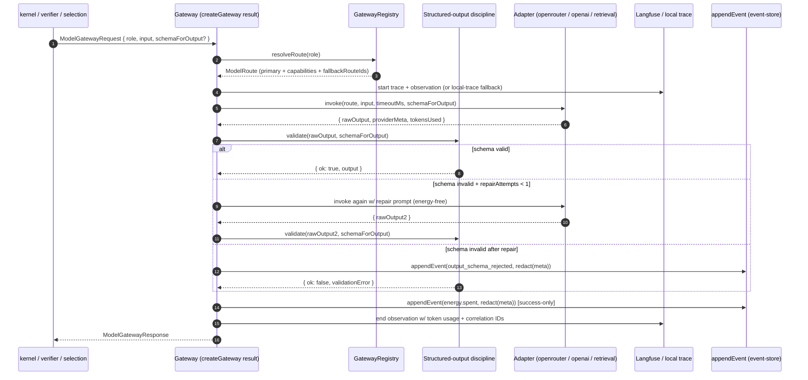
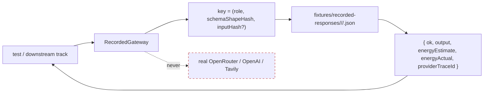

# feat: Phase 2 — Model gateway & provider integration (Doppl)

## Summary

Stand up **the single provider seam** the whole kernel depends on. Phase 2 wires the runtime against the `ModelGateway*` contracts already frozen in Phase 0: a Zod-validated **role→route registry** with fail-fast boot, a typed gateway dispatcher with **structured-output discipline** (validate → repair ≤1 → reject-with-event), the **OpenRouter** generation/critic/judge/synthesis adapter with bounded retry + per-role timeout + one fallback route, **direct-OpenAI** embeddings pinned behind the seam (`text-embedding-3-small`), a **retrieval/web-search** adapter (Tavily primary + curated-corpus fallback) whose results are persisted into the originating event, **Langfuse correlation** with a local-trace fallback as the default dev posture, secret-redaction at the gateway/persistence boundary (using `redact()` from `@doppl/contracts`), and a **recorded/fake gateway** stub so downstream tracks fork without paying provider costs.

Phase 2 ships as library code in `apps/api/src/model-gateway/`. No HTTP server. No runtime kernel logic. Phases 3-5 consume this seam in-process.

---

## Problem Frame

`ARCHITECTURE.md §6` makes the import rule structural: **domain/runtime code may not import a vendor SDK directly** — it sees only the `ModelGateway` port and `ProviderCapability` metadata. The four parallel tracks (`kernel`, `verifier`, `selection`, `demo`) all converge on this one seam. Get it wrong and either every track imports `openai` directly (breaking the fan-out hub design) or every track waits on it (serializing the parallelism). Get it right and any provider swap, recording strategy, or retry-policy change is a single-package edit invisible to everyone above the seam.

Three load-bearing invariants the gateway must enforce on every call:
1. **Schema-validated outputs.** Every model response is parsed against its Zod schema and either accepted, **repaired once**, or rejected — with the rejection emitting an `output_schema_rejected` event the replay reader can reconstruct.
2. **Energy is success-only.** Retries, timeouts, repairs, and rejected outputs do **not** debit energy. Only a successful productive call emits `energy.spent`. Failed calls emit `provider_call_failed` with structured context.
3. **Secrets never reach storage.** Credentials load only from env, never thread into payloads. `redact()` runs at both the persistence boundary (already wired in Phase 1) and the Langfuse-emit boundary added here.

A secondary framing matters: **Phase 0 already absorbed P2.1's contracts** (`ModelGatewayRequest`/`Response`, `ModelRoute`, `ModelRole`, `ProviderCapability` shipped in U14/U15). The redaction *function* was frozen in U5. This plan picks up the **runtime wiring** remainder.

---

## Scope Boundaries

**In scope:**
- New `apps/api/src/model-gateway/` package directory (library code; no HTTP).
- `GatewayRegistry`: role→route resolution from a Zod-validated config (file + env precedence, fail-fast at boot per `ARCHITECTURE.md §15`).
- `createGateway(deps)`: the dispatcher that resolves a route, invokes its adapter, applies the structured-output discipline, persists provider metadata, and returns a `ModelGatewayResponse`.
- **Structured-output discipline** (P2.4): validate → repair ≤1 → reject with `output_schema_rejected` event; persisted via `appendEvent` from `@doppl/api/event-store`.
- **OpenRouter** generation/critic/judge/synthesis adapter (P2.5): OpenAI-compatible HTTP with bounded retry (3 attempts max with exponential backoff), per-role timeout, one fallback `routeId` (chained, not multi-hop) — uses the official `openai` Node SDK with `baseURL` re-pointed.
- **Direct-OpenAI** embedding adapter (P2.6): `text-embedding-3-small` (1536-dim) pinned via env + per-call schema-snapshot test of `(model, dimension)`.
- **Retrieval / web-search** adapter (P2.7): Tavily primary + curated-corpus JSON file fallback + per-result persistence into the originating event payload (so replay reads the saved results, never re-queries Tavily).
- **Langfuse correlation** (P2.8): trace + observation IDs returned on every successful gateway response; **local-trace fallback** is the default (in-memory ring + event-payload echo); Langfuse Cloud opt-in via `LANGFUSE_*` env vars.
- **Operator content toggle** (P2.8): a single boolean (`DOPPL_LANGFUSE_INCLUDE_CONTENT`) that controls whether prompt + completion *content* is emitted to Langfuse (off by default — only metadata + IDs).
- **Secret-redaction at the gateway boundary** (P2.3): `redact()` runs on every payload that lands in a persisted event AND on every payload before Langfuse emit (one scrub, two callsites).
- **Energy event emission** (kernel will consume in Phase 3; defined here): `energy.spent` on success only, with `estimate` + `actual`; `provider_call_failed` on every failed-or-retry-exhausted attempt.
- **Recorded/fake gateway** (P2.9): in-memory implementation matching the `ModelGateway` interface; loads fixture responses from JSON files; lets the verifier / selection / demo tracks run end-to-end without provider keys.
- **`test:live` script** (opt-in): runs a small live-provider smoke matrix when `DOPPL_LIVE_TESTS=1` + provider keys are set. Excluded from CI by default.

**Deferred for later** (next plans, not non-goals):
- Phase 3 runtime kernel (state machines, caps, energy ledger) — consumes the gateway; not built here.
- Phase 4-7 (verifier council, selection, projections, dashboard) — all consume the gateway via the recorded stub for parallel development.
- Multi-hop fallback chains (>1 fallback) — Phase 2 ships one fallback per route per `IMPLEMENTATION_PLAN.md` P2.5.
- Provider streaming (token-by-token SSE from the model) — `streaming: true` is a capability flag but no SSE path is wired in Phase 2.
- Anthropic-direct adapter — same seam shape as OpenAI-direct, but ARCHITECTURE.md keeps it deferred until needed; OpenRouter routes Anthropic for now.
- Production cost/quota guards (per-provider monthly budgets, dashboards) — runtime cap-enforcement is Phase 3.

**Outside this product's identity** (per `CONSTRAINTS.md` / `DECISIONS.md`):
- LangGraph as authoritative orchestration (ADR-002).
- Codex as a runtime provider (ADR-004 — research-only).
- LangSmith (deferred indefinitely; Langfuse is the locked observability seam, ADR-005).
- Persisting provider secrets in event payloads (REQ-S-004 — defense-in-depth on top of env-only credentials).

**Deferred to Follow-Up Work** (plan-local sequencing, not scope):
- A separate plan for the live-provider regression matrix (an enriched `test:live` that exercises every route monthly against real APIs).
- A plan for Anthropic-direct as a second seam (when OpenRouter availability becomes a demo-blocker).
- Production-grade circuit breakers / per-provider quota enforcement (beyond per-call timeout + bounded retry).

---

## Origin Document References

- `IMPLEMENTATION_PLAN.md` Phase 2 (lines 457-580) — binding decomposition. Each U-ID below maps to one or more `P2.x`. Note: `P2.1` was absorbed by Phase 0 (`@doppl/contracts` U14 + U15); this plan picks up the runtime-wiring remainder.
- `ARCHITECTURE.md` §6 (module/import rules — domain may not import vendor SDKs), §9 (provider routing: OpenRouter primary, OpenAI embeddings pinned, retrieval persisted, capability matrix), §14 (testing strategy + redaction), §15 (fail-fast config), Appendix A (`ModelGatewayRequest`/`Response`, `ModelRoute`, `ModelRole`, `ProviderCapability`).
- `docs/planning/DECISIONS.md` ADR-004 (OpenRouter primary, OpenAI fallback + embeddings, Anthropic via same seam, Codex research-only), ADR-005 (Langfuse Cloud locked, LangSmith deferred).
- `docs/plans/2026-06-19-001-…-plan.md` U14 / U15 (frozen contracts), U5 (frozen `redact()`).
- `docs/plans/2026-06-19-002-…-plan.md` U5 (`appendEvent` — the persistence boundary the gateway emits through).

---

## Key Technical Decisions

| Decision | Choice | Rationale |
|---|---|---|
| OpenRouter adapter SDK | **`openai` Node SDK 4.x** with `baseURL: "https://openrouter.ai/api/v1"` | OpenRouter is OpenAI-compatible; reusing the official SDK keeps the surface familiar, well-tested, and gives us first-class streaming + tool-calling for free if we ever need them. One SDK across OpenRouter + direct OpenAI = one less dependency to vet. |
| Direct-OpenAI embedding model | **`text-embedding-3-small`** (1536-dim) | Pinned per ARCHITECTURE.md §9 (the "OpenRouter-only" fallback still needs an OpenAI key for embeddings, or the app-level-cosine path). 3-small balances quality and cost; matches the MVP scale. |
| Retrieval provider (primary) | **Tavily Search API** | LLM-friendly output shape (title/content/url/score), generous free tier (1000 searches/month), single endpoint, no SDK required (small REST surface — direct `fetch`). |
| Retrieval fallback shape | **Curated JSON corpus file** at `apps/api/src/model-gateway/fixtures/retrieval-corpus.json` | Per ARCHITECTURE.md §9 the "rehearsed-fallback" path; the file is treated as a static lookup keyed by query topic, and per-call results are persisted into the originating event so replay is identical. |
| Langfuse client | **Official `langfuse` package** (3.x) | Stable Node SDK; small surface (trace + observation primitives); production-recommended. |
| Langfuse default posture | **Local-trace fallback by default**; Langfuse Cloud opt-in via `LANGFUSE_PUBLIC_KEY` + `LANGFUSE_SECRET_KEY` | Avoids a hard external dep for the dev loop. The local trace is an in-memory ring + an echo of the trace/observation IDs in the persisted event payload (always present), so callers always get correlation IDs back. |
| Live provider tests | **Recorded-only by default**; `pnpm test:live` opt-in via `DOPPL_LIVE_TESTS=1` + provider keys | Confirmed user pick. Daily dev + CI run zero provider cost; live smoke runs are explicit and visible. |
| Recording shape | **Per-call JSON fixtures** under `apps/api/__fixtures__/recorded-responses/<adapter>/<scenario>.json` | Hand-authored + dump-from-live; checked in. The fake gateway loads them; recording new ones is a separate (opt-in) script. |
| Structured output validation | **Zod validate at gateway boundary**; on `safeParse` failure, **one repair attempt** through the adapter with the validation error appended to the prompt; on second failure emit `output_schema_rejected` and return `{ok: false, validationError, repairAttempts: 1}` | Matches ARCHITECTURE.md §9 and IMPLEMENTATION_PLAN.md P2.4 verbatim. The repair attempt is energy-free (failed attempts never debit). |
| Retry policy | **Up to 3 attempts** per call (initial + 2 retries) with exponential backoff (200ms / 600ms / 1.8s + jitter), only on transient errors (5xx, timeout, ECONNRESET). 4xx errors fail immediately. | Bounded retry per IMPLEMENTATION_PLAN.md P2.5; jitter prevents thundering-herd against the same provider under partial outage. |
| Per-role timeout | **From `ModelRoute.timeoutMs`**, default 30_000ms for generation/critic/judge/synthesis; 10_000ms for embedding; 15_000ms for retrieval | Matches expected provider latency profiles; tunable per route. |
| Fallback policy | **One fallback per route** — if all primary retries exhaust, try the route named in `ModelRoute.fallbackRouteIds[0]` exactly once; if that also fails, emit `provider_call_failed` | Per IMPLEMENTATION_PLAN.md P2.5 "one fallback route"; chains beyond depth-1 are explicitly deferred. |
| Energy unit math | **Provider tokens / 1000 = doppl_energy** | Rough heuristic; reconciled actual reflects actual provider tokens × normalization. Reserved for Phase 3 to tune. |
| Operator content toggle | `DOPPL_LANGFUSE_INCLUDE_CONTENT=true` to include prompt + completion in Langfuse spans; default off (metadata + IDs only) | REQ-S-004 / §14 — keep candidate text out of side channels by default. Operators can opt in for debugging. |
| HTTP transport (Tavily) | **Native `fetch`** (Node 22+); no `node-fetch` dep needed | Node 22 has stable `fetch`; one less dep; one less attack surface. |
| Fake gateway impl | **In-memory `RecordedGateway`** that reads fixture JSON keyed by `(role, schemaForOutput-shape-hash)` | Lets downstream-track tests construct deterministic gateway behavior without mocking individual adapters. |

---

## High-Level Technical Design

These sketches are **directional guidance** for review, not implementation specification.

### Gateway call lifecycle (the §14 / §9 spine)



Three structural invariants pinned by this shape:
1. **Schema validation runs at the gateway boundary** — adapters return raw output; the gateway gates parsing.
2. **`appendEvent` is the only persistence path** — Phase 1's redaction-at-write applies automatically.
3. **Langfuse is observed, never authoritative** — correlation IDs always flow back (via Langfuse SDK or local-trace fallback); the persisted event is the source of truth.

### Provider routing matrix (MVP)

| Role | Primary route | Fallback route | Why |
|---|---|---|---|
| `population_generator` | OpenRouter → `meta-llama/llama-3.3-70b-instruct` | OpenRouter → `openai/gpt-4o-mini` | Cheap, fast generation; Llama 3.3 70b is strong on creative; gpt-4o-mini covers if Llama is down. |
| `critic` | OpenRouter → `anthropic/claude-3.5-sonnet` | OpenRouter → `openai/gpt-4o` | Critique benefits from strong instruction-following; Sonnet 3.5 well-tested for adversarial review. |
| `subtype_check` | OpenRouter → `openai/gpt-4o-mini` | OpenRouter → `anthropic/claude-3.5-haiku` | Cheap structured-output check work; Haiku is the cheapest Anthropic fallback. |
| `embedding` | Direct OpenAI → `text-embedding-3-small` | Direct OpenAI → `text-embedding-3-large` | Same provider, swap models on transient error; replay reads the persisted vector. |
| `final_judge` | OpenRouter → `anthropic/claude-3.5-sonnet` | OpenRouter → `openai/gpt-4o` | Held-out judge needs stability — pinned strong model; ARCHITECTURE.md §7 says config is immutable-to-agents. |
| `fusion_synthesis` | OpenRouter → `openai/gpt-4o` | OpenRouter → `anthropic/claude-3.5-sonnet` | Creative two-parent synthesis; gpt-4o is the strongest available creative model in 2026. |

This matrix is a starting point — every route is also re-readable from a config file so an operator can swap without redeploying.

### Recorded/fake gateway flow



Fixtures are checked into the repo. A separate (later) script can dump from a live `pnpm test:live` run to populate them, but Phase 2 ships with hand-authored fixtures sufficient for downstream-track tests to drive a full small run.

---

## Output Structure

```text
apps/api/
├── package.json                                  (deps: openai, langfuse added)
├── src/
│   ├── event-store/                              (Phase 1 — unchanged)
│   ├── index.ts                                  (extends barrel with gateway exports)
│   └── model-gateway/                            (NEW)
│       ├── index.ts                              (barrel — createGateway, RecordedGateway, GatewayRegistry, errors)
│       ├── gateway.ts                            (the dispatcher; createGateway(deps): ModelGateway)
│       ├── registry.ts                           (role→route resolution + Zod-validated config loader)
│       ├── default-routes.ts                     (the MVP route table from the matrix above)
│       ├── structured-output.ts                  (validate → repair ≤1 → reject pipeline)
│       ├── langfuse.ts                           (LangfuseClient + local-trace fallback)
│       ├── redaction.ts                          (thin wrapper around @doppl/contracts redact() with two-boundary helpers)
│       ├── errors.ts                             (GatewayConfigError, RouteNotFoundError, RetryExhaustedError, OutputSchemaRejectedError)
│       ├── recorded-gateway.ts                   (the P2.9 stub)
│       └── adapters/
│           ├── http-client.ts                    (thin fetch wrapper with timeout + retry — shared by openrouter + tavily)
│           ├── openrouter.ts                     (OpenAI-SDK against openrouter.ai)
│           ├── openai-embedding.ts               (OpenAI-SDK direct for embeddings)
│           ├── retrieval.ts                      (Tavily + curated-corpus fallback)
│           └── __tests__/                        (unit tests for adapters)
├── __fixtures__/
│   └── recorded-responses/                       (NEW — checked-in JSON fixtures)
│       ├── openrouter/
│       │   ├── population_generator/
│       │   │   ├── happy-path-llama.json
│       │   │   └── repair-then-accept.json
│       │   ├── critic/
│       │   └── …
│       ├── openai-embedding/
│       │   └── text-embedding-3-small/…
│       └── retrieval/
│           ├── tavily/…
│           └── corpus/retrieval-corpus.json      (the curated fallback)
└── __integration_tests__/
    ├── gateway-recorded.int.test.ts              (recorded-gateway end-to-end)
    ├── registry-config.int.test.ts               (boot-time validation)
    ├── structured-output.int.test.ts             (validate / repair / reject + event emission)
    ├── retrieval-persisted.int.test.ts           (results saved into originating event)
    ├── langfuse-correlation.int.test.ts          (IDs returned from both Cloud + local-trace modes)
    └── live/                                     (NEW — opt-in tier; vitest excludes by default)
        ├── openrouter.live.test.ts
        ├── openai-embedding.live.test.ts
        └── tavily.live.test.ts
```

> The tree is the **expected output shape**, not a constraint. Per-unit `Files:` lists are authoritative.

---

## Implementation Units

Every unit's execution posture is **test-first** unless noted. Each unit cites the source `P2.x` for traceability.

### U1. `apps/api/src/model-gateway/` skeleton + `ModelGateway` port + `HttpClient` interface

- **Goal:** A new `model-gateway/` directory exists with the typed `ModelGateway` port (the public seam), a shared `HttpClient` interface (timeout + bounded retry, mocked in tests), and a barrel that downstream phases can import.
- **Requirements:** ADR-004; ARCHITECTURE.md §6 import-rule.
- **Dependencies:** none (consumes only Phase 0 contracts).
- **Files:**
  - Create: `apps/api/src/model-gateway/index.ts`, `apps/api/src/model-gateway/gateway.ts` (skeleton with type only), `apps/api/src/model-gateway/adapters/http-client.ts`, `apps/api/src/model-gateway/errors.ts`, `apps/api/src/model-gateway/__tests__/http-client.test.ts`
  - Modify: `apps/api/src/index.ts` (re-export gateway barrel), `apps/api/package.json` (add `openai` 4.x, `langfuse` 3.x devDeps stay zero new)
- **Approach:** `ModelGateway` is `interface ModelGateway { invoke(req: ModelGatewayRequest): Promise<ModelGatewayResponse> }`. `HttpClient.fetch(url, init): Promise<Response>` plus `withTimeout(ms)` and `withRetry({ attempts, backoff, retryOn })` middleware. Errors: `GatewayConfigError`, `RouteNotFoundError`, `RetryExhaustedError`, `OutputSchemaRejectedError`.
- **Execution note:** Smoke-test-first — a unit test that builds an `HttpClient`, applies `withTimeout(1)`, and asserts a slow handler throws inside 50ms.
- **Patterns to follow:** Phase 1 `apps/api/src/event-store/connection.ts` shape for the public-API exports + `MissingDatabaseUrlError` style.
- **Test scenarios:**
  - `HttpClient` respects `withTimeout` (a handler that sleeps 200ms throws after 50ms timeout).
  - `HttpClient` respects `withRetry({ attempts: 2 })`: a handler returning 500 then 200 returns the 200 body; a handler returning 500/500/500 throws `RetryExhaustedError` on the configured attempt count.
  - `HttpClient` does NOT retry on 4xx (a 400 throws immediately).
  - Each custom error class has a stable `.name` field.
- **Verification:** `pnpm -w typecheck && pnpm -w lint && pnpm --filter @doppl/api test` exit 0 with the new tests passing.

### U2. `GatewayRegistry`: role→route resolution + Zod-validated config (source: P2.2)

- **Goal:** `createRegistry(config)` returns a `GatewayRegistry` that resolves `role → ModelRoute`. `loadRegistryFromEnv(env, fileConfig?)` is the boot entry; it fails fast with a clear field-named error on any invalid route.
- **Requirements:** REQ-NF-001 fail-fast; ARCHITECTURE.md §9 / §15.
- **Dependencies:** U1.
- **Files:**
  - Create: `apps/api/src/model-gateway/registry.ts`, `apps/api/src/model-gateway/default-routes.ts`, `apps/api/src/model-gateway/__tests__/registry.test.ts`
- **Approach:** `default-routes.ts` exports the MVP route matrix as a `Record<ModelRole, ModelRoute>`. `registry.ts` wraps a Zod schema asserting `Record<ModelRole, ModelRoute>` is fully populated (no missing roles) and runs `ModelRoute.parse` on each entry. `loadRegistryFromEnv` merges `defaultRoutes < fileConfig < envOverrides` (using a tiny override format like `DOPPL_ROUTE_CRITIC=openrouter:anthropic/claude-3.5-haiku`). On boot, any missing role or invalid route shape throws `GatewayConfigError("registry.<role>: <reason>")`.
- **Execution note:** test-first.
- **Patterns to follow:** Phase 0 U6 `validateBootConfig` shape — `defaults < file < env` precedence + named error on the first invalid field.
- **Test scenarios:**
  - `defaultRoutes` covers all 6 `ModelRole.options` values (snapshot the role names).
  - `createRegistry(defaultRoutes).resolveRoute("critic")` returns the expected route.
  - `resolveRoute("not_a_role" as ModelRole)` throws `RouteNotFoundError`.
  - `loadRegistryFromEnv({})` returns the defaults unchanged.
  - `loadRegistryFromEnv({ DOPPL_ROUTE_CRITIC: "openrouter:openai/gpt-4o" })` overrides only the critic role; other roles untouched.
  - A malformed override (`DOPPL_ROUTE_CRITIC: "not-a-route-string"`) throws `GatewayConfigError` naming `registry.critic`.
  - A route with a missing `capabilities.structuredOutputs` field is rejected at parse time.
  - Empty role coverage (delete `critic` from defaults) throws on creation with a clear "role not covered: critic" message.
- **Verification:** Tests pass; `defaultRoutes` snapshot is the regression alarm.

### U3. `createGateway(deps)` dispatcher (gateway core) (source: P2.4 spine)

- **Goal:** `createGateway({ registry, adapters, eventStore, langfuse })` returns a `ModelGateway` whose `invoke()` runs the full lifecycle: resolve route → call adapter → structured-output discipline → persist energy/failure events → return response. Adapters are injected (kept untyped here; U5/U6/U7 plug in concrete ones).
- **Requirements:** ARCHITECTURE.md §6, §9.
- **Dependencies:** U2.
- **Files:**
  - Create: `apps/api/src/model-gateway/gateway.ts` (full impl), `apps/api/src/model-gateway/__tests__/gateway-dispatch.test.ts`
- **Approach:** The dispatcher takes a `GatewayDeps` shape: `{ registry, adapterFor: (provider: string) => Adapter, eventStore: { appendEvent }, langfuse: { startTrace } }`. `invoke(req)` calls `registry.resolveRoute(req.role)`, then `adapterFor(route.provider).invoke(route, req)`. On adapter success: applies structured-output discipline (U4 injected; for now a passthrough stub). On adapter failure: emits `provider_call_failed`, tries the fallback route once if defined, else rethrows. Adapters return `{ rawOutput, energyEstimate, energyActual, providerTraceId? }`; the gateway wraps this in `ModelGatewayResponse`. The dispatcher is pure orchestration — all I/O lives in adapters.
- **Execution note:** test-first — drive the lifecycle with a stub adapter that returns canned responses.
- **Patterns to follow:** Phase 1 `appendEvent` integration pattern.
- **Test scenarios:**
  - Happy path: stub adapter returns ok; gateway returns `{ ok: true, output, energyEstimate, energyActual }`; no failure events emitted.
  - Stub adapter throws on first call, succeeds on the fallback route → gateway returns the fallback's result; one `provider_call_failed` event emitted.
  - Stub adapter throws on both primary and fallback → gateway throws `RetryExhaustedError`; two `provider_call_failed` events emitted.
  - Unknown role → `RouteNotFoundError` (no adapter call attempted).
  - Adapter without a registered provider (`adapterFor("nonexistent")` throws) → `GatewayConfigError`.
  - Energy invariant: a thrown adapter call does NOT emit `energy.spent` (success-only).
- **Verification:** All test scenarios pass with stub adapters.

### U4. Structured-output discipline: validate → repair ≤1 → reject (source: P2.4)

- **Goal:** A `pipeStructuredOutput({ raw, schema, repair })` helper that returns `{ ok: true, output }` on first-try success; `{ ok: true, output, repairAttempts: 1 }` on second-try success after `repair()`; `{ ok: false, validationError, repairAttempts: 1 }` on second-try failure (with side-effect: emits `output_schema_rejected` via the injected event store).
- **Requirements:** ARCHITECTURE.md §9 ("validated, accepted, repaired ≤1, or rejected"); IMPLEMENTATION_PLAN.md P2.4.
- **Dependencies:** U3 (called by the dispatcher).
- **Files:**
  - Create: `apps/api/src/model-gateway/structured-output.ts`, `apps/api/src/model-gateway/__tests__/structured-output.test.ts`
- **Approach:** Generic over a `ZodTypeAny`. `repair` is a callback the gateway provides — typically a re-invocation of the adapter with the validation error appended to the prompt as an instruction to fix it. The function NEVER retries more than once; the second call's result is final. Validation uses `safeParse` so the error path doesn't throw. Wire `appendEvent` for the rejection path.
- **Execution note:** test-first.
- **Patterns to follow:** Phase 0 Zod patterns.
- **Test scenarios:**
  - Happy path: raw parses → returns `{ ok: true, output, repairAttempts: 0 }`; `repair` never called.
  - Repair-then-accept: raw fails; repair returns valid → `{ ok: true, output, repairAttempts: 1 }`; one `appendEvent(output_schema_rejected)` is NOT emitted (the repair succeeded).
  - Reject: raw fails; repair returns invalid → `{ ok: false, validationError, repairAttempts: 1 }`; one `output_schema_rejected` event is emitted with the original + repair-attempt errors.
  - `repair` throws → the error propagates (treated as an adapter failure by the gateway dispatcher).
  - Schema with `.strict()`: an extra-field response fails first-try and triggers repair.
- **Verification:** All scenarios pass.

### U5. OpenRouter generation adapter + bounded retry + per-role timeout + one fallback (source: P2.5)

- **Goal:** `createOpenRouterAdapter({ http, env })` returns an `Adapter` for `provider: "openrouter"`. Uses the `openai` SDK with `baseURL: "https://openrouter.ai/api/v1"`, `apiKey: env.OPENROUTER_API_KEY`. Per-call wraps with `withTimeout(route.timeoutMs ?? 30_000)`. Bounded retry handled by the shared `HttpClient` (U1).
- **Requirements:** ARCHITECTURE.md §9; ADR-004.
- **Dependencies:** U1, U3.
- **Files:**
  - Create: `apps/api/src/model-gateway/adapters/openrouter.ts`, `apps/api/src/model-gateway/adapters/__tests__/openrouter.test.ts`
- **Approach:** Adapter shape: `{ invoke(route, request): Promise<AdapterResult> }`. Translates `ModelGatewayRequest` into an OpenAI-SDK `chat.completions.create({ model: route.modelId, messages, response_format? })`. If `request.schemaForOutput` is present and the route's `capabilities.structuredOutputs === true`, use `response_format: { type: "json_schema", json_schema: { schema, strict: true } }`. Otherwise plain chat. Returns `{ rawOutput, providerTraceId, tokensUsed, energyEstimate, energyActual }` where energy = `Math.ceil(tokensUsed / 1000)`. The adapter is provider-agnostic at the call boundary — the route tells it the model.
- **Execution note:** test-first; use a recorded mock client (the `HttpClient` accepts an injected `fetch` substitute for testing).
- **Patterns to follow:** OpenAI SDK 4.x idioms.
- **Test scenarios:**
  - Happy path: mock client returns a chat completion; adapter returns `{ rawOutput: <the message content>, providerTraceId: <id>, tokensUsed: <usage.total_tokens>, energyEstimate, energyActual }`.
  - `route.capabilities.structuredOutputs === true` + `schemaForOutput` provided → mock client receives `response_format` with the schema; adapter call succeeds.
  - `route.capabilities.structuredOutputs === false` → no `response_format` in the outgoing request even if `schemaForOutput` is provided.
  - Timeout: mock client sleeps 200ms with `timeoutMs: 50` → adapter throws.
  - Transient failure (mock returns 503 twice then 200) → retry kicks in via `HttpClient`; adapter ultimately returns the 200 body.
  - Permanent failure (mock returns 401) → adapter throws immediately; no retries.
  - Missing API key (`env.OPENROUTER_API_KEY` empty) → adapter construction throws `GatewayConfigError`.
- **Verification:** All scenarios pass with the mocked `HttpClient`.

### U6. Direct-OpenAI embedding adapter (text-embedding-3-small) (source: P2.6)

- **Goal:** `createOpenAIEmbeddingAdapter({ env })` returns an `Adapter` for `provider: "openai-embedding"`. Uses the `openai` SDK directly against `api.openai.com` with `apiKey: env.OPENAI_API_KEY`. Calls `embeddings.create({ model: route.modelId, input })`. Returns vector + model + dimension on the response.
- **Requirements:** ARCHITECTURE.md §9 (embeddings pinned to direct OpenAI); IMPLEMENTATION_PLAN.md P2.6.
- **Dependencies:** U1, U3.
- **Files:**
  - Create: `apps/api/src/model-gateway/adapters/openai-embedding.ts`, `apps/api/src/model-gateway/adapters/__tests__/openai-embedding.test.ts`
- **Approach:** `invoke(route, request)` extracts the text to embed from `request.input` (expected shape: `{ text: string } | { texts: string[] }`). Calls SDK. Returns `{ rawOutput: { vector, embeddingModelId: route.modelId, dimension: vector.length }, energyEstimate, energyActual: Math.ceil(usage.total_tokens / 1000) }`. The adapter does NOT compute novelty — that's selection-scoring (Phase 5). It just returns an authoritative vector.
- **Execution note:** test-first.
- **Patterns to follow:** U5 OpenRouter adapter (similar shape).
- **Test scenarios:**
  - Happy path: input `{ text: "hello" }` → adapter returns vector of length 1536 (default for `text-embedding-3-small`).
  - Batch input `{ texts: ["a", "b"] }` → returns `{ vectors: number[][], embeddingModelId, dimension }` (or model the multi-input case explicitly; document the shape).
  - Schema snapshot pin: a test asserts `(embeddingModelId, dimension)` is the pair `("text-embedding-3-small", 1536)` for the default route — catches a model swap.
  - Timeout: mock SDK that sleeps → adapter throws after `route.timeoutMs ?? 10_000`.
  - Missing API key → adapter construction throws `GatewayConfigError`.
- **Verification:** All scenarios pass.

### U7. Retrieval / web-search adapter (Tavily + curated-corpus fallback + persistence) (source: P2.7)

- **Goal:** `createRetrievalAdapter({ http, env, corpusPath })` returns an `Adapter` for `provider: "retrieval"`. Primary path calls Tavily Search API (`POST https://api.tavily.com/search`). On any Tavily error (4xx, 5xx, timeout), falls back to the curated JSON corpus. Results are returned in `rawOutput` so the gateway dispatcher can persist them into the originating event via `appendEvent`.
- **Requirements:** ARCHITECTURE.md §9 (retrieval + curated fallback); IMPLEMENTATION_PLAN.md P2.7.
- **Dependencies:** U1, U3.
- **Files:**
  - Create: `apps/api/src/model-gateway/adapters/retrieval.ts`, `apps/api/__fixtures__/recorded-responses/retrieval/corpus/retrieval-corpus.json`, `apps/api/src/model-gateway/adapters/__tests__/retrieval.test.ts`
- **Approach:** The corpus file is a JSON object: `{ queries: Array<{ matchPattern: string, results: Array<{ title, content, url, score }> }> }`. The fallback path matches the user query against `matchPattern` (case-insensitive substring); first match wins. If no match, returns an empty results array (the kernel can fail-closed on it). The adapter returns `{ rawOutput: { source: "tavily" | "corpus", results, query }, energyEstimate, energyActual }`. Energy is small: 1 doppl_energy per call regardless of result count.
- **Execution note:** test-first.
- **Patterns to follow:** None local; standard `fetch`-based REST shape.
- **Test scenarios:**
  - Happy path Tavily: mock `fetch` returns a Tavily response; adapter returns `{ source: "tavily", results, query }`.
  - Tavily timeout → falls back to corpus; a corpus match returns `{ source: "corpus", results }`.
  - Tavily 401 → falls back to corpus (treating auth as a config issue but not a hard fail in MVP).
  - Tavily 5xx with one retry → on second failure, falls back to corpus.
  - Empty corpus match → adapter returns `{ source: "corpus", results: [] }`; the caller decides what to do.
  - Missing TAVILY_API_KEY → adapter STILL constructs (corpus-only mode); a debug log says so.
  - The corpus JSON itself is validated at adapter construction via a Zod schema (malformed corpus = `GatewayConfigError`).
- **Verification:** All scenarios pass; the corpus fixture committed.

### U8. Langfuse correlation + local-trace fallback + operator content toggle (source: P2.8)

- **Goal:** `createLangfuseClient({ env })` returns a `LangfuseClient` with `startTrace({ name, metadata }): { traceId, observationId, end(usage) }`. When `LANGFUSE_PUBLIC_KEY` + `LANGFUSE_SECRET_KEY` are set, it wraps the real `langfuse` SDK. Otherwise it returns a local-trace fallback that generates IDs locally and appends them to event metadata (no external network). `DOPPL_LANGFUSE_INCLUDE_CONTENT` (default off) controls whether prompt + completion content reaches Langfuse spans.
- **Requirements:** ARCHITECTURE.md §14; ADR-005.
- **Dependencies:** U3.
- **Files:**
  - Create: `apps/api/src/model-gateway/langfuse.ts`, `apps/api/src/model-gateway/__tests__/langfuse.test.ts`
- **Approach:** A small interface lets the gateway hold one reference regardless of mode. Local-trace fallback uses `crypto.randomUUID()` for trace/observation IDs and stores nothing (the IDs flow back to the caller in `ModelGatewayResponse` and are persisted by `appendEvent` via the regular event payload — Langfuse is non-authoritative either way).
- **Execution note:** test-first.
- **Patterns to follow:** None local.
- **Test scenarios:**
  - Local-trace mode (no env keys): `startTrace` returns a stable UUID-shaped `traceId` and `observationId`; `end(usage)` does NOT make a network call.
  - Cloud mode (env keys set, mocked Langfuse client): `startTrace` invokes the SDK; `end(usage)` flushes; correlation IDs are the SDK's.
  - Content toggle off (default): `metadata` passed to the SDK does NOT include `prompt`, `completion`, or `messages` keys (asserted by a snapshot of the SDK call payload).
  - Content toggle on (`DOPPL_LANGFUSE_INCLUDE_CONTENT=true`): same `metadata` includes the content fields.
  - Cloud-mode SDK throws on flush → falls back to local-trace IDs; the gateway call still succeeds.
- **Verification:** All scenarios pass.

### U9. `RecordedGateway` — the P2.9 stub (source: P2.9)

- **Goal:** `RecordedGateway` is an `ModelGateway` implementation that, instead of calling adapters, looks up a JSON fixture keyed by `(role, schemaShapeHash)` and returns it. Lets the verifier / selection / demo tracks fork without provider keys.
- **Requirements:** IMPLEMENTATION_PLAN.md P2.9 (parallel-track fork).
- **Dependencies:** U3 (matches the same `ModelGateway` shape).
- **Files:**
  - Create: `apps/api/src/model-gateway/recorded-gateway.ts`, `apps/api/src/model-gateway/__tests__/recorded-gateway.test.ts`, `apps/api/__fixtures__/recorded-responses/README.md`, plus a handful of seed fixtures under `apps/api/__fixtures__/recorded-responses/openrouter/<role>/*.json`
- **Approach:** `RecordedGateway` accepts a `fixtureDir` path at construction; on `invoke`, it computes a stable key from `(role, schemaShapeHash, optional inputHash)` and reads the JSON. The fixture format is the same shape as a real `ModelGatewayResponse` (`{ ok, output, energyEstimate, energyActual, providerTraceId? }`). Missing fixture → throws `RecordedFixtureNotFoundError` with a clear message naming the expected path. The README documents the fixture-key derivation and how to author new ones (or dump from `pnpm test:live`).
- **Execution note:** test-first.
- **Patterns to follow:** None local; standard fixture-replay pattern.
- **Test scenarios:**
  - Happy path: a fixture at `openrouter/population_generator/happy.json` is loaded for `role: "population_generator"`; the returned `ModelGatewayResponse` matches the fixture verbatim.
  - Missing fixture → `RecordedFixtureNotFoundError("openrouter/critic/...")` with the resolved path in the message.
  - Schema-shape hash collision: two different schemas with the same shape resolve to different keys (a positive test).
  - Fixture with `ok: false` (the simulated rejection path) is returned as-is.
- **Verification:** All scenarios pass; the README is checked in.

### U10. Secret-redaction at the gateway boundary (source: P2.3)

- **Goal:** Every payload the gateway sends to `appendEvent` or to Langfuse goes through `redact()` first. Wired in a single helper so a missed callsite is impossible (call-grep-asserted).
- **Requirements:** REQ-S-004; ARCHITECTURE.md §14 ("one scrub used at both boundaries").
- **Dependencies:** U3, U8.
- **Files:**
  - Create: `apps/api/src/model-gateway/redaction.ts`, `apps/api/src/model-gateway/__tests__/redaction.test.ts`
- **Approach:** Exports two helpers: `persistedEventPayload(metadata)` and `langfuseMetadata(metadata)`. Both pass through `redact()` from `@doppl/contracts` (already in scope via Phase 0); persistedEventPayload also normalizes the field-set the gateway uses. The two callsites (U3 dispatcher → `appendEvent`, U8 langfuse → `startTrace`) MUST go through these helpers; a grep test asserts the dispatcher does not call `appendEvent(... raw)` directly with un-scrubbed metadata.
- **Execution note:** test-first.
- **Patterns to follow:** Phase 1 U5 redaction-at-append pattern.
- **Test scenarios:**
  - `persistedEventPayload({ apiKey: "sk-real" })` returns `{ apiKey: "[REDACTED]" }`.
  - `langfuseMetadata({ authorization: "Bearer sk-real" })` returns `{ authorization: "[REDACTED]" }`.
  - A grep test on `gateway.ts` asserts `appendEvent(` is only called inside this module's helpers.
  - A grep test on `langfuse.ts` asserts `startTrace(` and `end(` callers go through `langfuseMetadata`.
- **Verification:** All scenarios pass; grep tests pin the structural invariant.

### U11. Energy event emission (success-only + provider_call_failed) (source: P2.4 / P2.5 invariant)

- **Goal:** Every successful gateway call emits one `energy.spent` event with `estimate` + `actual`. Every failed call (including the fallback exhausted case) emits one `provider_call_failed` event. The two paths are mutually exclusive — a successful call NEVER emits `provider_call_failed`, a failed call NEVER emits `energy.spent`.
- **Requirements:** ARCHITECTURE.md §4 success-only energy invariant.
- **Dependencies:** U3, U10.
- **Files:**
  - Create: `apps/api/src/model-gateway/__tests__/energy-events.test.ts`
  - Modify: `apps/api/src/model-gateway/gateway.ts` (final wiring)
- **Approach:** This unit doesn't add new files — it cements the energy/failure invariant in `gateway.ts` and adds explicit tests. The dispatcher's success path calls `appendEvent("energy.spent", { energy: {...} })`. The failure path (after retries + fallback exhausted) calls `appendEvent("provider_call_failed", { reason, routeId, retryable })`. The structured-output rejection path (U4) emits `output_schema_rejected` but NOT `energy.spent` (the call was unsuccessful productive spend).
- **Execution note:** test-first — the invariant tests are the wiring.
- **Patterns to follow:** Phase 1 U5 `appendEvent` semantics.
- **Test scenarios:**
  - A successful gateway call → exactly one `energy.spent` event written to `run_events`; zero `provider_call_failed`.
  - A gateway call that fails on both primary and fallback → zero `energy.spent`; exactly two `provider_call_failed` events (one per attempt).
  - A schema-rejection call → zero `energy.spent`; one `output_schema_rejected` event; zero `provider_call_failed` (the provider responded, the output was bad).
  - A successful call after one retry → one `energy.spent` (the successful one); zero `provider_call_failed` (retries are not failures unless exhausted). The `actual` energy reflects only the successful call's tokens.
- **Verification:** All scenarios pass against the integration-tested gateway (uses the testcontainers Postgres from Phase 1's helper).

### U12. Public surface harness + workspace `test:live` script (source: §2.5 acceptance gate)

- **Goal:** The gateway's public API is curated through `apps/api/src/model-gateway/index.ts`, asserted by a surface-completeness test (mirroring Phase 0 U18 and Phase 1 U11). A new `test:live` script runs the live-provider matrix opt-in.
- **Requirements:** §2.5 module boundaries.
- **Dependencies:** U1 – U11.
- **Files:**
  - Modify: `apps/api/src/model-gateway/index.ts`, `apps/api/src/index.ts` (re-export gateway barrel), `apps/api/package.json` (add `test:live` script), `package.json` (root — add `test:live` fan-out)
  - Create: `apps/api/src/__tests__/gateway-surface.test.ts`, `apps/api/__integration_tests__/live/openrouter.live.test.ts`, `apps/api/__integration_tests__/live/openai-embedding.live.test.ts`, `apps/api/__integration_tests__/live/tavily.live.test.ts`, `apps/api/vitest.config.ts` (modify to exclude `__integration_tests__/live/` from default runs)
- **Approach:** Surface barrel exports: `createGateway`, `createRegistry`, `loadRegistryFromEnv`, `defaultRoutes`, `pipeStructuredOutput`, `createOpenRouterAdapter`, `createOpenAIEmbeddingAdapter`, `createRetrievalAdapter`, `createLangfuseClient`, `RecordedGateway`, plus error classes (`GatewayConfigError`, `RouteNotFoundError`, `RetryExhaustedError`, `OutputSchemaRejectedError`, `RecordedFixtureNotFoundError`). `vitest.config.ts` adds `exclude: ["__integration_tests__/live/**"]` to keep them out of default runs. `test:live` script: `DOPPL_LIVE_TESTS=1 vitest run __integration_tests__/live`. Each live test checks for required env vars and skips with a clear message if absent.
- **Execution note:** Trivial config + barrel changes; live tests are themselves test-first against real APIs.
- **Patterns to follow:** Phase 0 U18 surface pattern + Phase 1 U11 surface pattern.
- **Test scenarios:**
  - Surface completeness: every required export name is present on `@doppl/api` barrel (hand-curated array, one test per export).
  - No private helper leaks (`hashRouteKey`, `defaultRetryPolicy`, etc. stay internal).
  - Live tests: each loads its required env vars; missing keys → test is `test.skip(...)` with a message; present keys → makes a single small call against the real API and asserts the response shape.
  - The default `pnpm test` does NOT discover the live tier (a meta-test counts test files and asserts `__integration_tests__/live/` is excluded).
- **Verification:** All surface assertions pass; `pnpm -w test` excludes live; `DOPPL_LIVE_TESTS=1 pnpm test:live` runs the live tier (manually-verified when keys are set; the plan does not require running it as part of acceptance).

---

## Requirements Traceability

| Plan unit | IMPLEMENTATION_PLAN source | ARCHITECTURE.md anchors | Requirements / risks |
|---|---|---|---|
| U1 | (scaffold + P2.4 spine prep) | §6 import rules | — |
| U2 | P2.2 | §9, §15 | REQ-NF-001 |
| U3 | P2.4 spine | §6, §9 | — |
| U4 | P2.4 | §9 | — |
| U5 | P2.5 | §9 | ADR-004 |
| U6 | P2.6 | §9 (embeddings pinned) | — |
| U7 | P2.7 | §9 (retrieval + fallback) | — |
| U8 | P2.8 | §14 | ADR-005 |
| U9 | P2.9 | §2.5 (parallel-track fork) | — |
| U10 | P2.3 | §14 | REQ-S-004, RISK-006/009 |
| U11 | P2.4 / P2.5 (invariant) | §4 success-only energy | — |
| U12 | §2.5 acceptance gate | §6 | — |

Already shipped in Phase 0 (PR #1) and **not duplicated**: P2.1 contracts (`ModelGatewayRequest`/`Response`, `ModelRoute`, `ModelRole`, `ProviderCapability` — `@doppl/contracts` U14 + U15); `redact()` function (`@doppl/contracts` U5).

---

## System-Wide Impact

- **Affected parties:** Every downstream track. Phase 3 kernel will call `gateway.invoke()` for every population call. Phase 4 verifier will call it for critic + check. Phase 5 selection will call it for embeddings + judge. Phase 6 projections will read the persisted events (incl. `energy.spent`, `provider_call_failed`, `output_schema_rejected`). Phase 7 dashboard surfaces them.
- **New env vars introduced:** `OPENROUTER_API_KEY`, `OPENAI_API_KEY`, `TAVILY_API_KEY` (all optional in default dev mode — adapters operate in recorded/fallback mode if absent). `LANGFUSE_PUBLIC_KEY`, `LANGFUSE_SECRET_KEY`, `LANGFUSE_HOST` (optional). `DOPPL_LANGFUSE_INCLUDE_CONTENT` (default false). `DOPPL_LIVE_TESTS` (gates the live-tier tests).
- **New deps:** `openai` 4.x, `langfuse` 3.x. Both already-vetted production packages.
- **Local dev loop unchanged:** the recorded gateway lets `pnpm -w test` + `pnpm -w test:int` keep running cost-free.
- **CI implications:** the live tier is excluded from default runs. When a CI job wants to exercise it, it provides the env vars and runs `pnpm test:live`.
- **Phase 3+ prep:** the `RecordedGateway` lets the kernel / verifier / selection tracks all fork in parallel against deterministic fixtures.

---

## Risks

| Risk | Mitigation |
|---|---|
| OpenAI SDK 4.x or Langfuse 3.x bumps a major version with a breaking change after Phase 2 lands. | Pin exact versions in `package.json`. Add a small smoke test that constructs both SDKs at boot — a major-version break is caught by that smoke. |
| `response_format: json_schema` is not supported on every OpenRouter-routed model. | The route's `capabilities.structuredOutputs` flag decides whether to ask for it. For models without support, the gateway falls back to plain chat + post-hoc Zod validation + the repair path. |
| Tavily free-tier rate limits the demo. | The curated corpus fallback IS the safety net. Per ARCHITECTURE.md §9 the demo path is "live retrieval + persisted into the originating event + curated fallback"; if live fails, replay reads the persisted result either way. |
| A recorded fixture goes stale when a real provider changes its response shape. | Fixtures are checked in; the dump-from-live script (deferred to a follow-up plan) refreshes them. In-the-meantime the live tier (`pnpm test:live`) catches drift. |
| Langfuse Cloud is down → gateway calls hang. | The Langfuse SDK is wrapped with `withTimeout(5_000)`; any flush failure falls back to local-trace silently. The gateway never blocks on Langfuse. |
| `DOPPL_LANGFUSE_INCLUDE_CONTENT=true` accidentally leaks candidate text to the side channel. | Default off + the toggle is a single conspicuous env var. The redaction helper (U10) runs even when content is included — so secrets are still scrubbed; only candidate text flows. |
| Energy unit heuristic (tokens / 1000) is wrong by an order of magnitude vs the kernel's caps. | Reserved for Phase 3 to tune; the heuristic lives in one place (`tokensToDopplEnergy()`) so a single edit moves it. |
| Fake gateway fixture-key collisions across roles. | The fixture path includes the role explicitly (`fixtures/openrouter/<role>/<key>.json`); collisions are file-system errors, not silent overlaps. |
| `openai` SDK in a Node 22 env may pull a polyfill (`form-data`, `node-fetch`) that introduces an HTTP-tier import we don't want. | Pin the SDK version; assert via a top-level dep test that we have only the vetted set. If a polyfill creeps in, switch to manual `fetch` for the offending adapter (Tavily is already manual). |
| Recorded gateway lets downstream tracks build against unrealistic fixtures and miss provider quirks. | The live tier (`pnpm test:live`) is the corrective; each downstream track that depends on a specific quirk should add a live test for it before relying on it. |

---

## Deferred to Implementation

These are intentionally not resolved here; the implementing agent resolves them during U-execution.

- **Exact `langfuse` package import shape** — `langfuse` vs `langfuse-node` vs `@langfuse/node`. U8 picks based on current package status; the SDK has changed names historically.
- **Whether `openai` SDK 4.x exposes a top-level `OpenAI` class or a default-export-only API in the current minor.** U5/U6 pick.
- **Exact Tavily response field names** — the public API is stable but the `score` field has changed before; U7 validates the response shape with a small Zod schema.
- **Default token budget for the energy heuristic** — `tokens / 1000` is the placeholder; the real ratio is set in Phase 3 when caps land.
- **Whether the `RecordedGateway` should match `inputHash` strictly or fall back to a `*` wildcard fixture.** U9 picks; default strict, document the policy.
- **Where the live tier reads its env vars from** — `.env.local` vs process-only. U12 picks; default process-only so tests don't accidentally load a checked-in `.env`.

---

## Verification

Phase 2 is complete (and this plan ships) when all of the following pass from a fresh clone after `pnpm install && docker compose up -d postgres`:

1. `pnpm -w typecheck && pnpm -w lint && pnpm -w test` exit 0 (unit + smoke + Phase 1 + Phase 2 unit tests).
2. `pnpm -w test:int` exits 0 (Phase 1 integration tests + Phase 2 integration tests against the `RecordedGateway`).
3. `pnpm -w test:live` is NOT required for acceptance — it is the opt-in smoke for human validation when provider keys are present.
4. The `model-gateway/` directory exists at the expected location with the U1-U12 file set.
5. The surface harness (U12) asserts every required export is present on `@doppl/api`.
6. A grep for `openai`, `langfuse`, `tavily`, `fetch(` in `apps/api/src/event-store/` returns zero matches — the event-store does not leak into the model-gateway concern.
7. A grep for `appendEvent(` in `apps/api/src/model-gateway/` is bounded to the dispatcher and the redaction helpers; no adapter calls `appendEvent` directly.
8. The `IMPLEMENTATION_PLAN.md` "Acceptance criteria (P2)" (lines 568-580) check items can each be ticked by inspection of the new package + test results.

When U1 – U12 ship, the `kernel` (Phase 3), `verifier` (Phase 4), `selection` (Phase 5), and `demo` (Phase 6-7) tracks can all consume the gateway via `RecordedGateway` and begin their work in parallel.
