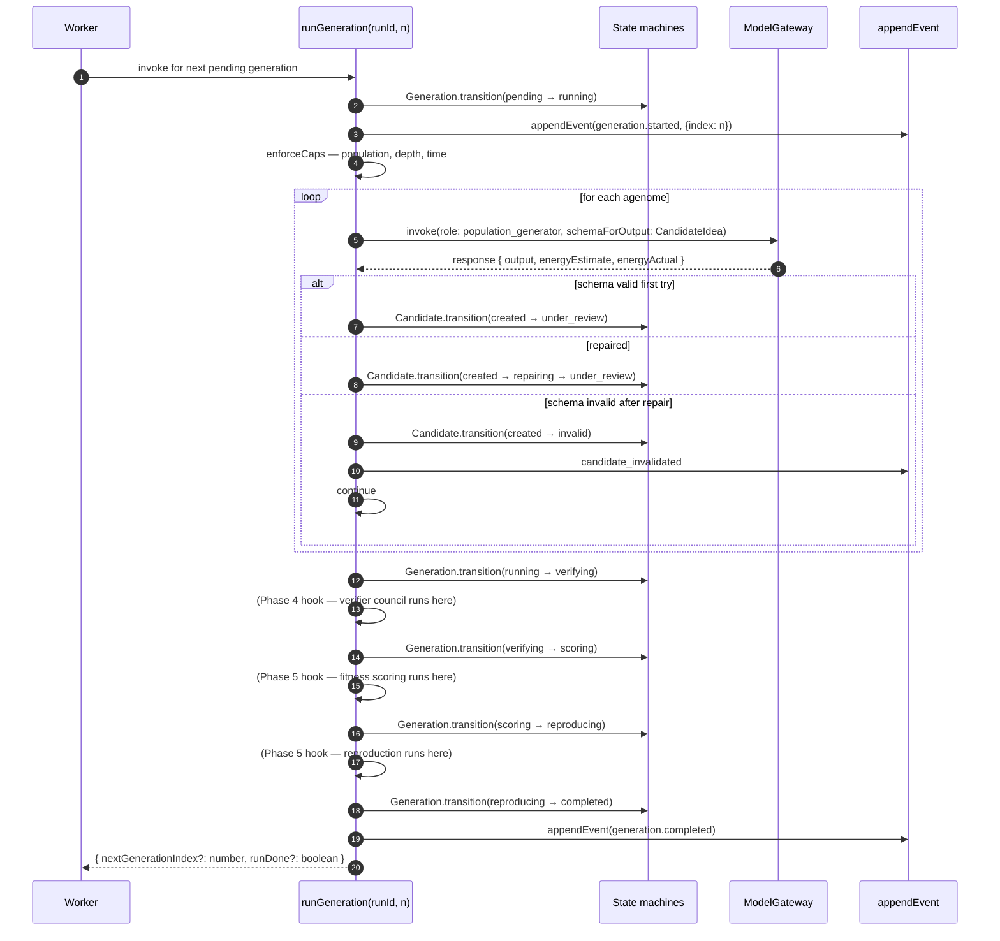
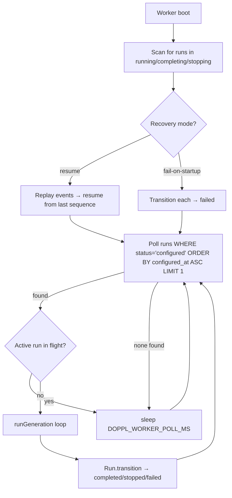
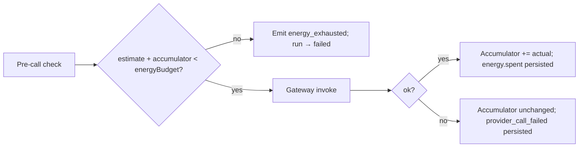

# feat: Phase 3 — Runtime kernel (Doppl)

## Summary

Stand up **the authoritative runtime** — the layer that turns a configured `Run` into a sequence of generations, agenome spawns, candidate evaluations, fitness scoring, culling, and reproduction, all bounded by hard caps and gated by a kill switch. The kernel enforces every state-machine transition for `Run` / `Generation` / `CandidateIdea` / `Agenome`, debits energy only on successful productive spend, captures and persists a seeded RNG so replay is deterministic, wires the structured-output repair edge from the model gateway into the candidate lifecycle, and runs as an in-process **async worker backed by a DB queue** so the single-active-run invariant survives a process restart via crash-forward recovery. Phase 0 already froze every state enum (`RunStatus`, `GenerationStatus`, `CandidateStatus`, `AgenomeStatus`); this plan ships the **transition guards + the orchestration loop + the worker + the recovery path**.

Phase 3 is library + worker code; no HTTP. The eventual REST/SSE surface (Phase 6) calls `startRun(config)` directly. Phases 4 (verifier), 5 (selection), and 6-7 (demo) consume the kernel via the same in-process boundaries.

---

## Problem Frame

Phase 1 ships **what** is persisted; Phase 2 ships **how** model calls land; Phase 3 ships **what actually happens between them**. The kernel is the only subsystem that emits authoritative lifecycle decisions (`run.started`, `generation.started`, `agenome.spawned`, `lineage.culled`, `run.completed`, …). Get the state guards wrong and downstream replay sees impossible transitions; get the caps wrong and a runaway loop bankrupts the demo budget; get the RNG wrong and replay diverges from the original run; get the worker wrong and a crash mid-generation leaves the run dangling forever.

A second framing matters: **the kernel never invents data**. Every decision it makes (which agenome to mutate, which candidate to cull, which generation to seed) is derived from the persisted event log + the seeded RNG + the configured caps. Replay reconstructs every decision from that triple — no fresh randomness, no fresh provider calls, no fresh wall-clock judgment. The `replayReader` from Phase 1 already enforces "no model/embedding/web calls"; Phase 3's contract is the symmetric guarantee: every kernel-side choice can be reproduced from the persisted seed.

A third framing: **single-active-run is a hard invariant**. The kernel processes exactly one run at a time. A second `startRun` request during an active run is rejected, not queued and not paralleled — the operator decides whether to wait or abort. The DB-backed queue is for *durable submission* (a crash mid-`startRun` doesn't drop the request), not for parallelism.

---

## Scope Boundaries

**In scope:**
- Four state-transition guards (`Run`, `Generation`, `CandidateIdea`, `Agenome`) enforcing the closed transition matrices from `ARCHITECTURE.md §3` and `DOMAIN_MODEL.md §150-189`.
- `RunCaps` enforcement: per-cap predicate + a single `enforceCaps(run)` entry that consults the current state and fails closed.
- **Kill switch**: an operator can request termination of the active run; the kernel transitions the run through `stopping → stopped` and emits a `run.stopped` event with a terminal summary that lists what *did* survive.
- **Energy ledger**: every gateway call emits a pre-call `energyEstimate`; on successful return the actual is reconciled and persisted via the existing `energy.spent` event. The ledger maintains an in-process accumulator that mirrors the persisted spend and is checkpointed every N events for cap enforcement.
- **Seeded RNG**: `seedrandom` 3.x backed PRNG, constructed from `RunConfig.rngSeed`, with **every consumed value persisted as the outcome of the decision that consumed it** (per `ARCHITECTURE.md §4` — replay reads the persisted outcome rather than reseeding mid-run).
- **Structured-output repair edge**: when the gateway's `pipeStructuredOutput` returns `repairAttempts: 1`, the kernel transitions the candidate `created → repairing → under_review`; on `output_schema_rejected` it transitions `created → invalid`.
- **Authored gen-0 seed agenome set**: a small bundle of 3-5 hand-authored gen-0 agenome configs the kernel uses as the starting population. `spawnBudget` is clamped to the run's `RunCaps.maxPopulation` at seed time.
- **Generation loop orchestration**: the central `runGeneration(runId)` that walks `pending → running → verifying → scoring → reproducing → completed`, dispatches gateway calls per role, handles the degenerate-edge cases enumerated in `ARCHITECTURE.md §3` (zero-survivors, partial-failure, degraded path).
- **Run terminal classification**: a single function that, given the persisted event log for a run, returns one of `completed | stopped | failed | cancelled` plus a partial terminal summary capturing how many generations completed, how many candidates survived, and the final-judge acceptance score.
- **In-process async worker with DB-backed queue**: a long-lived loop that polls `runs WHERE status='configured'` for the oldest queued run, processes it, and respects the single-active-run invariant.
- **Crash-forward recovery at boot**: at process startup, the worker scans for any run in a non-terminal `running | completing | stopping` state and either resumes from the last persisted event (`crash-forward`) or transitions it to `failed` with an explainable reason, depending on configuration.

**Deferred for later** (next plans, not non-goals):
- Phase 4 (verifier council + critic rotation + held-out judge) — consumes the kernel via the gateway; not built here.
- Phase 5 (selection / fitness scoring / reproduction internals) — the *call site* lives in the kernel's generation loop, but the actual scoring math is Phase 5.
- Phase 6 (REST + SSE) — the eventual HTTP surface that calls `startRun` and streams run events to the dashboard.
- Phase 7 (dashboard) — the React Flow projection consumer.
- Distributed / multi-host workers, leader election, queue durability beyond a single Postgres database.
- HTTP-driven cancellation — the kill switch is a function-call API in Phase 3; a REST endpoint lands in Phase 6.
- Worker observability (Prometheus metrics, structured logs to stdout/stderr beyond simple boot heartbeats).

**Outside this product's identity** (per `CONSTRAINTS.md` / `DECISIONS.md`):
- LangGraph or any workflow framework as the authoritative orchestrator (ADR-002 — the kernel IS the orchestrator).
- Multi-active-run parallelism (the single-active-run invariant is structural).
- Wall-clock-based ordering anywhere in the kernel (the persisted `sequence` from Phase 1 is the sole ordering key).
- Re-running model / embedding / web calls during replay (ARCHITECTURE.md §4; the kernel must NOT do this during replay).

**Deferred to Follow-Up Work** (plan-local sequencing, not scope):
- A separate plan for Phase 4 (`verifier` track) — should be drafted right after this ships so the verifier council can begin consuming the kernel's `runGeneration` per-generation outputs.
- A separate plan for Phase 5 (`selection` track) — selection-scoring is the math that turns critic reviews + check results + novelty + energy efficiency into a `FitnessScore`; Phase 3 calls into it but the math is owned there.
- A CLI script (`pnpm run dev:start-run`) that wires the worker up against the docker-compose Postgres — useful for local demo rehearsal; deferred from Phase 3 because it's a thin shell over `startRun(config)`.

---

## Origin Document References

- `IMPLEMENTATION_PLAN.md` Phase 3 (lines 581-758) — binding decomposition. Each U-ID below maps to one or more `P3.x`. Already shipped: P3.1 contract (`@doppl/contracts` U6); P3.3 (`@doppl/api/event-store` U5); P3.7 (`@doppl/api/model-gateway` U1 + U3).
- `ARCHITECTURE.md` §3 (state machine grammar — Run / Generation / Candidate / Agenome), §4 (event model + RNG capture + sequence ordering), §5 (energy ledger + caps), §6 (import rules — kernel imports contracts + event-store + model-gateway, nothing else), §15 (fail-fast boot).
- `docs/planning/DECISIONS.md` ADR-002 (custom kernel, not LangGraph), ADR-006 (finite-by-construction caps + kill switch).
- `docs/planning/DOMAIN_MODEL.md` §150-189 (canonical state transition tables + locked-decision invariants).
- Predecessor plans (Phase 0/1/2) — frozen contracts + persistence + gateway boundaries the kernel sits on top of.

---

## Key Technical Decisions

| Decision | Choice | Rationale |
|---|---|---|
| Worker trigger model | **DB-backed queue polled by the worker** (operator's pick) | `startRun(config)` validates + inserts a `runs` row with `status='configured'` and a `configured_at` timestamp; the worker polls for the oldest configured run when no active run is in flight. Future-proofs Phase 6's HTTP entry without changing the kernel surface. |
| Concurrency policy | **Reject second active run with `RunAlreadyActiveError`** (operator's pick) | The single-active-run invariant is explicit at the API boundary. The caller decides whether to wait or abort; no hidden queueing of submitted-but-not-started runs beyond the polled queue itself. |
| Seeded RNG library | **`seedrandom` 3.0.5** (operator's pick) | Stable, deterministic, ~50 lines minified once imported. Replay safety hinges on the package version staying pinned in `package.json` — that pin IS the replay contract. |
| RNG outcome persistence | **Persist the consumed value as the payload of the event that consumed it** | Per ARCHITECTURE.md §4 RNG capture — `agenome.mutated` events carry the mutation delta (which was drawn from the RNG), `reproduction.event` carries `crossoverPoints` (which were drawn), etc. Replay reads the persisted outcome rather than reseeding to that exact draw point. |
| Worker polling interval | **1-second polling**; configurable via `DOPPL_WORKER_POLL_MS` env (default 1000) | Postgres LISTEN/NOTIFY would be elegant but adds bookkeeping; 1s polling adds at most 1s startup latency and zero complexity. Easy to bump to 100ms locally for the demo. |
| State transition mechanism | **Pure functions returning `Result<NewState, IllegalTransitionError>`** | A `canTransition(from, to)` predicate + a `transition(from, to)` function per machine. No hidden side effects. The kernel's caller (the generation loop) translates a successful transition into an `appendEvent` call. |
| State machine file shape | **One file per machine** in `apps/api/src/runtime/state-machines/` | Mirrors Phase 0's per-schema file convention (each Zod schema got its own file); a single-machine file is small (closed enum + transition table + 4 functions) and reads well in code review. |
| Caps enforcement timing | **Pre-call check** (before issuing the gateway request) + **post-call accumulator update** (on each `energy.spent` event) | Pre-call: refuse the call if the predicted spend would exceed the budget. Post-call: update the in-process accumulator so the next pre-call check sees the new total. Survives crashes because the accumulator is rebuilt from `replayReader` at boot. |
| Energy estimate source | **The model gateway returns `energyEstimate` per adapter** (Phase 2 already does this) | The kernel does not re-estimate; it trusts the gateway's estimate and uses it for the pre-call cap check. Post-call reconciliation uses the gateway's `energyActual`. |
| Wall-clock cap (`wallClockTimeoutMs`) | **Process-level `AbortController` tied to the run; checked at every cap-checkpoint** | The kernel does not background-time individual gateway calls (Phase 2 owns that); it bounds the whole run. On timeout: `running → stopping → stopped` with reason `wallClockTimeoutMs exceeded`. |
| Kill switch shape | **`requestStop(runId, reason): Promise<void>`** | A function the operator (or Phase 6 HTTP) calls. Sets a flag the generation loop checks between state transitions; the run terminates cleanly at the next safe transition point (not mid-event). |
| Repair-state edge | **`created → repairing → under_review`** when `pipeStructuredOutput` returns `repairAttempts: 1` AND `ok: true` | The intermediate `repairing` state is the documented edge in `ARCHITECTURE.md §3`. On `ok: false` after repair → `created → invalid` and emits `candidate_invalidated`. |
| Gen-0 seed bundle | **3-5 hand-authored agenomes** in `apps/api/src/runtime/seeds/gen-0-agenomes.ts` | The minimum REQ-F-017 demands; configurable per-run by overriding via `RunConfig.seedAgenomeOverrides` (optional field — defaults to the bundle). Each seed has a distinct `personaWeights` distribution so generation 1 has real diversity to work with. |
| Generation loop reentrancy | **The loop is single-threaded within one run by construction** | The worker holds one in-flight run; the loop is a single `for` over generations + a single `for` over agenomes within a generation. No concurrent gateway calls within one generation (sequential is fine at MVP scale — population is ~20). |
| Crash-forward policy | **Two configurable modes**: `resume` (default) and `fail-on-startup` | `resume`: the worker reads the last event for the run and continues from there. `fail-on-startup`: the worker transitions the run to `failed` with reason `process restart during active generation`. `resume` matches the demo posture; `fail-on-startup` is safer in cases where the crash itself implies inconsistent state. |
| Runs-table migration | **New column `configured_at: timestamptz NOT NULL DEFAULT NOW()`** | Lets the worker query `WHERE status='configured' ORDER BY configured_at ASC LIMIT 1` cheaply. Adds the migration as `0002_runs_configured_at.sql`. |

---

## High-Level Technical Design

These sketches are **directional guidance** for review, not implementation specification.

### State-machine grammar (closed transitions)

```text
Run
  configured → running → completing → completed
  configured → running → stopping → stopped
  configured → running → failed
  configured → cancelled

Generation
  pending → running → verifying → scoring → reproducing → completed
  pending → running → degraded → verifying → scoring → reproducing → completed
  pending → running → failed
  pending → skipped

CandidateIdea
  created → under_review → checked → scored → selected
  created → under_review → rejected
  created → repairing → under_review        (P3.8 repair edge)
  created → invalid                          (gateway returned ok:false)
  scored → culled

Agenome
  seeded → active → spent → eligible_parent
  seeded → active → failed
  eligible_parent → reproduced
  active → culled  (when fitness < threshold AND not selected)
```

Every state machine has the same shape:
```text
canTransition(from, to): boolean
transition(from, to): Result<NextState, IllegalTransitionError>
terminalStates: Set<State>
isTerminal(s): boolean
```

### Generation loop (the central orchestrator)



Two structural invariants pinned by this shape:
1. **Every state transition flows through the state machine + an `appendEvent`** — there is no path where state mutates in memory without a persisted event.
2. **The generation loop is the only orchestrator** — Phase 4/5 modules hand back results; they don't drive state transitions themselves.

### Worker + queue + crash-forward



A `startRun(config)` call is a synchronous validation + insert; the worker picks up the run on the next poll. `requestStop(runId)` sets a flag the generation loop checks between transitions.

### Caps + energy ledger



The accumulator is rebuilt at boot from the persisted `energy.spent` events for the active run — so a crash-forward resume has the right number in memory.

---

## Output Structure

```text
apps/api/
├── src/
│   ├── event-store/                          (Phase 1 — unchanged)
│   ├── model-gateway/                        (Phase 2 — unchanged)
│   └── runtime/                              (NEW)
│       ├── index.ts                          (public barrel — startRun, requestStop, Worker)
│       ├── state-machines/
│       │   ├── index.ts
│       │   ├── run.ts                        (RunStateMachine — predicates + transition fn)
│       │   ├── generation.ts                 (GenerationStateMachine)
│       │   ├── candidate.ts                  (CandidateStateMachine)
│       │   ├── agenome.ts                    (AgenomeStateMachine)
│       │   ├── errors.ts                     (IllegalTransitionError)
│       │   └── __tests__/
│       ├── caps.ts                           (enforceCaps + per-cap predicates + kill-switch flag)
│       ├── energy-ledger.ts                  (in-process accumulator; rebuildFromEvents)
│       ├── rng.ts                            (createSeededRng wrapping seedrandom)
│       ├── repair-state.ts                   (P3.8 — wires pipeStructuredOutput → candidate transition)
│       ├── seeds/
│       │   └── gen-0-agenomes.ts             (3-5 hand-authored agenomes + spawnBudget clamp)
│       ├── generation-loop.ts                (runGeneration — the central orchestrator)
│       ├── terminal-classifier.ts            (classifyTerminal(runId, db))
│       ├── worker.ts                         (in-process polling worker + DB queue)
│       ├── recovery.ts                       (crash-forward at boot)
│       ├── start-run.ts                      (startRun + RunAlreadyActiveError)
│       └── __tests__/                        (unit tests for pure helpers)
├── src/event-store/migrations/
│   └── 0002_runs_configured_at.sql           (NEW migration — adds runs.configured_at)
└── __integration_tests__/
    └── runtime/                              (NEW — integration tier for kernel)
        ├── state-machine-events.int.test.ts
        ├── caps-enforcement.int.test.ts
        ├── energy-ledger.int.test.ts
        ├── repair-state.int.test.ts
        ├── generation-loop.int.test.ts
        ├── worker-queue.int.test.ts
        ├── recovery.int.test.ts
        └── kill-switch.int.test.ts
```

> The tree is the **expected output shape**, not a constraint. Per-unit `Files:` lists are authoritative.

---

## Implementation Units

Every unit's execution posture is **test-first** unless noted. Each unit cites the source `P3.x` for traceability.

### U1. State machines: Run + Generation transition guards (source: P3.2 lifecycle half)

- **Goal:** Two pure-function state machines for `Run` and `Generation` with `canTransition`, `transition`, `terminalStates`, `isTerminal`. Closed transitions match `ARCHITECTURE.md §3` and `DOMAIN_MODEL.md §150-189`.
- **Requirements:** §3 state machine grammar.
- **Dependencies:** none (consumes Phase 0 closed enums).
- **Files:**
  - Create: `apps/api/src/runtime/state-machines/run.ts`, `apps/api/src/runtime/state-machines/generation.ts`, `apps/api/src/runtime/state-machines/errors.ts`, `apps/api/src/runtime/state-machines/__tests__/run.test.ts`, `apps/api/src/runtime/state-machines/__tests__/generation.test.ts`
- **Approach:** Each module exports a `RunStateMachine` (or `GenerationStateMachine`) object: `{ canTransition(from, to), transition(from, to), terminalStates: Set, isTerminal(s) }`. The transition matrix is a `Map<RunStatus, Set<RunStatus>>` built from the closed enum. `transition` returns `{ ok: true, next }` on legal transitions and throws `IllegalTransitionError(from, to)` on illegal ones (a stable `.name` for cross-module identity).
- **Execution note:** test-first.
- **Patterns to follow:** Phase 0 closed-enum patterns; Phase 1 error-class shape with stable `.name`.
- **Test scenarios:**
  - Snapshot the legal `Run` transitions (inline snapshot of `Array<[from, to]>` sorted).
  - Every terminal state is in `terminalStates` and `isTerminal(s)` returns true.
  - `canTransition('completed', 'running')` is `false` (no exit from terminal).
  - `transition('configured', 'running')` returns `{ ok: true, next: 'running' }`.
  - `transition('configured', 'completed')` throws `IllegalTransitionError`.
  - Snapshot the legal `Generation` transitions (includes the `running → degraded → verifying` partial-failure edge per §3).
  - `Generation` 'skipped' is terminal.
  - `transition('failed', 'completed')` for both machines throws.
- **Verification:** Snapshots committed; both machines reachable from `runtime/state-machines/index.ts`.

### U2. State machines: Candidate + Agenome transition guards (source: P3.2 lineage half)

- **Goal:** Same shape as U1 for `CandidateIdea` (with the `repairing` edge — see U6) and `Agenome`.
- **Requirements:** §3 state machine grammar.
- **Dependencies:** none.
- **Files:**
  - Create: `apps/api/src/runtime/state-machines/candidate.ts`, `apps/api/src/runtime/state-machines/agenome.ts`, `apps/api/src/runtime/state-machines/__tests__/candidate.test.ts`, `apps/api/src/runtime/state-machines/__tests__/agenome.test.ts`
- **Approach:** Same shape as U1. `CandidateStateMachine` includes `created → repairing → under_review` and `created → invalid` per §3; `AgenomeStateMachine` covers `seeded → active → spent → eligible_parent → reproduced` plus the `culled` and `failed` paths.
- **Execution note:** test-first.
- **Patterns to follow:** U1.
- **Test scenarios:**
  - Snapshot `Candidate` legal transitions including `repairing`.
  - `transition('created', 'repairing')` succeeds; `transition('checked', 'repairing')` throws.
  - Snapshot `Agenome` legal transitions including `culled` and `failed`.
  - `transition('reproduced', 'active')` throws (no resurrection).
  - Every machine's `terminalStates` is non-empty.
- **Verification:** Snapshots committed.

### U3. `RunCaps` enforcement + kill switch (source: P3.4)

- **Goal:** `enforceCaps(state): Result<ok, CapExhaustedError>` with one predicate per cap. Plus a `KillSwitch` object the operator/orchestrator polls.
- **Requirements:** REQ-NF-001 (caps); ADR-006.
- **Dependencies:** U1.
- **Files:**
  - Create: `apps/api/src/runtime/caps.ts`, `apps/api/src/runtime/__tests__/caps.test.ts`
- **Approach:** Exports `createCapEnforcer(caps: RunCaps): CapEnforcer`. The enforcer takes a `RunState` shape (`{ generationCount, populationCount, spawnDepth, toolCallCount, energyAccumulator, wallClockStartMs }`) and returns either `{ ok: true }` or `{ ok: false, cap: 'maxGenerations', value, limit }`. Errors are stable shapes (no exceptions for the predicate; the generation loop reads them and emits the corresponding terminal events). Separately, `createKillSwitch()` exposes `requestStop(reason)` and `isStopped(): boolean`. The kill switch is checked between every safe transition point in the generation loop (U8).
- **Execution note:** test-first.
- **Patterns to follow:** Phase 0 Zod-result patterns; Phase 1 error class names.
- **Test scenarios:**
  - All caps satisfied → `{ ok: true }`.
  - `generationCount > maxGenerations` → `{ ok: false, cap: 'maxGenerations' }`.
  - `energyAccumulator + nextEstimate > energyBudget` → `{ ok: false, cap: 'energyBudget' }`.
  - `Date.now() - wallClockStartMs > wallClockTimeoutMs` → `{ ok: false, cap: 'wallClockTimeoutMs' }`.
  - `populationCount > maxPopulation` → `{ ok: false, cap: 'maxPopulation' }`.
  - `KillSwitch.requestStop('operator request')` → subsequent `isStopped()` returns `true`; `reason` is preserved.
  - Multiple `requestStop` calls — second call is a no-op (first reason wins).
- **Verification:** All scenarios pass.

### U4. Energy ledger — pre-call estimate + post-call reconcile + rebuild-from-events (source: P3.5)

- **Goal:** `createEnergyLedger({ runId, db })` returns `{ estimateAllowed(estimate): boolean, reconcile(actual): void, current(): number }`. At construction, rebuilds the in-process accumulator from the persisted `energy.spent` events for `runId`.
- **Requirements:** ARCHITECTURE.md §4 (success-only) + §5 (energy ledger).
- **Dependencies:** Phase 1 `replayReader`.
- **Files:**
  - Create: `apps/api/src/runtime/energy-ledger.ts`, `apps/api/src/runtime/__tests__/energy-ledger.test.ts`, `apps/api/__integration_tests__/runtime/energy-ledger.int.test.ts`
- **Approach:** The ledger is per-run; it does NOT persist events itself (the gateway does). It just maintains an accumulator + a pre-call check. `rebuildFromEvents(runId)` reads via `replayReader` and sums `payload.energy.actual` for every `energy.spent` event — so crash-forward resume has the right number. The pre-call `estimateAllowed(estimate)` returns `false` if `accumulator + estimate > budget`. `reconcile(actual)` is called by the kernel after the gateway returns; it just updates the accumulator (the `energy.spent` event was already persisted by the gateway).
- **Execution note:** test-first.
- **Patterns to follow:** Phase 1 replayReader for the rebuild step.
- **Test scenarios:**
  - Fresh ledger with no events → accumulator is 0.
  - After 3 `energy.spent` events totaling 150 → `current()` is 150.
  - `estimateAllowed(50)` with budget 200 and current 150 → `true`.
  - `estimateAllowed(60)` with budget 200 and current 150 → `false`.
  - `reconcile(50)` after a successful gateway call → `current()` is now 200.
  - Rebuild from a run that had one `provider_call_failed` between two `energy.spent` → accumulator only counts the `energy.spent` events (success-only invariant).
- **Verification:** Integration test exercises the full rebuild path against a real Postgres.

### U5. Seeded RNG + per-run seed persistence (source: P3.6)

- **Goal:** `createSeededRng(seed)` wraps `seedrandom` 3.x and exposes `{ next(), nextInt(min, max), choose(arr), seed }`. The seed is captured in the `run.configured` event payload at boot (already in `RunConfig.rngSeed` — this unit just adds the consumer side).
- **Requirements:** ARCHITECTURE.md §4 RNG capture.
- **Dependencies:** none.
- **Files:**
  - Create: `apps/api/src/runtime/rng.ts`, `apps/api/src/runtime/__tests__/rng.test.ts`
  - Modify: `apps/api/package.json` (add `seedrandom` 3.0.5 dep + `@types/seedrandom`)
- **Approach:** Tiny wrapper. `next()` returns float in [0,1). `nextInt(min, max)` returns inclusive-inclusive integer. `choose(arr)` returns one element. The wrapper preserves `seed` on the instance so the generation loop can include it in event metadata. The actual *outcome* of each draw is persisted by the event payload that consumed it (per ARCHITECTURE.md §4) — this unit just ensures determinism given a fixed seed.
- **Execution note:** test-first.
- **Patterns to follow:** None local.
- **Test scenarios:**
  - Two instances with the same seed produce the same sequence of `next()` values for the first 100 draws.
  - Different seeds produce divergent sequences within the first 5 draws.
  - `nextInt(0, 9)` over 1000 draws produces values only in [0, 9] inclusive.
  - `choose([])` throws (empty array is not a sensible input).
  - `choose(['a'])` always returns `'a'`.
- **Verification:** Determinism property pinned by the same-seed test.

### U6. Structured-output repair-state edge (source: P3.8)

- **Goal:** Wire Phase 2's `pipeStructuredOutput` into the candidate lifecycle. When repair succeeds, transition `created → repairing → under_review`. When repair fails, transition `created → invalid` and emit `candidate_invalidated`.
- **Requirements:** ARCHITECTURE.md §3 repair edge.
- **Dependencies:** U2 (Candidate state machine), Phase 2 U4 (`pipeStructuredOutput`).
- **Files:**
  - Create: `apps/api/src/runtime/repair-state.ts`, `apps/api/src/runtime/__tests__/repair-state.test.ts`
- **Approach:** A small helper `handleStructuredOutput({ candidateId, result, candidate, appendEvent })`. Given the `pipeStructuredOutput` result, returns the next `CandidateStatus` AND emits the appropriate event. The helper is called by the generation loop immediately after every gateway call that has a `schemaForOutput`. Energy is not debited on the rejection branch — that's already handled by U4 (Phase 2 doesn't emit `energy.spent` for the rejection case).
- **Execution note:** test-first.
- **Patterns to follow:** Phase 2 U4 result shape (`{ ok, output?, validationError?, repairAttempts }`).
- **Test scenarios:**
  - Result `{ ok: true, repairAttempts: 0 }` → candidate goes `created → under_review` directly (no `repairing` event emitted).
  - Result `{ ok: true, repairAttempts: 1 }` → emits `candidate.repairing` event, then `under_review`. Both state transitions go through `CandidateStateMachine`.
  - Result `{ ok: false, repairAttempts: 1 }` → emits `candidate_invalidated` event; candidate ends in `invalid` state.
  - The repair helper does NOT emit `energy.spent` on any path (energy is the gateway's responsibility).
- **Verification:** Integration test exercises the full path against a real Postgres + a stub gateway.

### U7. Gen-0 seed agenome bundle + spawnBudget clamp (source: P3.9)

- **Goal:** A hand-authored set of 3-5 gen-0 agenomes (varied `personaWeights`, `toolPermissions`, `decompositionPolicy`) plus a function that clamps each seed's `spawnBudget` to the run's `RunCaps.maxPopulation`.
- **Requirements:** REQ-F-017 (gen-0 seeds).
- **Dependencies:** none.
- **Files:**
  - Create: `apps/api/src/runtime/seeds/gen-0-agenomes.ts`, `apps/api/src/runtime/__tests__/seeds.test.ts`
- **Approach:** `defaultGen0Bundle: Array<Omit<Agenome, 'id' | 'runId' | 'generationId'>>` exports 3-5 distinct configs. `materializeGen0Bundle(run, caps, rng): Array<Agenome>` clamps `spawnBudget` to `caps.maxPopulation / bundle.length` (floored) and assigns IDs using `randomUUID()`. `RunConfig.seedAgenomeOverrides` (an optional field added to the contract layer if not already present — note this in Deferred to Implementation if a contract change is needed) lets a per-run override the bundle.
- **Execution note:** test-first.
- **Patterns to follow:** Phase 0 Agenome schema.
- **Test scenarios:**
  - `defaultGen0Bundle` has at least 3 entries; each entry parses against the Phase 0 `Agenome` schema (sans the runtime-assigned IDs).
  - `materializeGen0Bundle(caps={maxPopulation: 10}, bundle of 5)` → each agenome's `spawnBudget` is at most `10/5 = 2`.
  - All materialized agenomes have unique IDs.
  - `personaWeights` are distinct across the bundle (no two seeds with identical persona vectors).
- **Verification:** Tests pass; the bundle is committed.

### U8. Generation loop orchestration (source: P3.10 — the central unit)

- **Goal:** `runGeneration({ runId, generationIndex, deps }): Promise<{ nextIndex?, runDone? }>`. Walks `pending → running → verifying → scoring → reproducing → completed` for one generation. Dispatches gateway calls per role; consults caps before each call; emits events for every state transition.
- **Requirements:** §3 state machines; §5 caps; §4 RNG capture.
- **Dependencies:** U1, U2, U3, U4, U5, U6.
- **Files:**
  - Create: `apps/api/src/runtime/generation-loop.ts`, `apps/api/__integration_tests__/runtime/generation-loop.int.test.ts`
- **Approach:** The loop takes `deps`: `{ db, gateway, eventStore, caps, ledger, rng, killSwitch, stateMachines }`. For each step in the generation lifecycle:
  1. Check `killSwitch.isStopped()` — if true, transition the run to `stopping` and return.
  2. Check `enforceCaps(state)` — if any cap exhausted, emit the corresponding event (`energy_exhausted`, `generation_failed`, etc.) and transition.
  3. Call the state machine: `Generation.transition(currentStatus, nextStatus)`.
  4. Append the lifecycle event (`generation.started`, `generation.completed`, etc.).
  5. Inside `running`: for each agenome with `spawnBudget > 0`, call `gateway.invoke(population_generator)`, handle the structured-output via U6, transition each candidate.
  6. Inside `verifying`, `scoring`, `reproducing`: call into the Phase 4/5 hooks (which return data; the loop does the state transition + event emit).
  7. On the degraded path (running → degraded → verifying when ≥1 candidate reached `created`): match `ARCHITECTURE.md §3`.
  8. On zero-survivors (all candidates rejected): generation completes with no offspring, run continues to next generation if caps allow.
- **Execution note:** test-first; the integration test is the centerpiece.
- **Patterns to follow:** Phase 2 U3 dispatcher's event-emitting orchestration shape.
- **Test scenarios:**
  - Happy path: stub gateway returns 5 valid candidates; loop completes one generation in `completed` state; 5 `candidate.created` events + 1 `generation.completed` event in the log.
  - Partial failure (3 of 5 candidates have invalid structured output): loop walks `running → degraded → verifying` because ≥1 candidate reached `created`.
  - Zero survivors (all 5 gateway calls return schema-invalid output after repair): generation completes with 0 candidates; run continues if caps allow.
  - Cap exhausted mid-generation (energy budget hit): generation transitions to `failed`, emits `energy_exhausted`, run terminates.
  - Kill switch triggered mid-generation: generation completes the current step, then the run transitions to `stopping → stopped`.
  - Wall-clock timeout: run transitions to `failed` with reason `wallClockTimeoutMs exceeded`.
- **Verification:** All scenarios pass; the loop is the only orchestrator (Phase 4/5 hooks are pure functions).

### U9. Run terminal classification (source: P3.11)

- **Goal:** `classifyTerminal(runId, db): Promise<{ status, summary }>` reads the persisted event log and returns one of `completed | stopped | failed | cancelled` plus a partial terminal summary (counts of generations completed, candidates surviving, final-judge acceptance score if reached).
- **Requirements:** §3 terminal rules.
- **Dependencies:** Phase 1 `replayReader`.
- **Files:**
  - Create: `apps/api/src/runtime/terminal-classifier.ts`, `apps/api/src/runtime/__tests__/terminal-classifier.test.ts`
- **Approach:** Walk the events via `replayReader`. Look for: `run.stopped` → classify `stopped`; `run.failed` → `failed`; `run.completed` → `completed`; `energy_exhausted` or `generation_failed` without a subsequent `run.completed` → `failed`. Build the summary by counting `generation.completed`, `candidate.created`, `lineage.culled`, etc. Classification is pure — no DB writes.
- **Execution note:** test-first.
- **Patterns to follow:** Phase 1 U10 state-equivalence test for the fold pattern.
- **Test scenarios:**
  - Run with `run.completed` event → status `completed`; summary counts match.
  - Run with `run.stopped` event → status `stopped`; summary reflects partial generations.
  - Run with `energy_exhausted` event → status `failed`; summary reason is `energyBudget exceeded`.
  - Run with `provider_call_failed` events but ultimately `run.completed` → status `completed` (provider failures don't terminate a run by themselves).
- **Verification:** All scenarios pass; classifier is pure.

### U10. Async worker + DB-backed queue (source: P3.12)

- **Goal:** A long-lived worker loop that polls `runs WHERE status='configured' ORDER BY configured_at ASC LIMIT 1`, respects the single-active-run invariant, and runs `startRun`'s lifecycle. Plus `startRun(config)` (the public submission function) and `requestStop(runId, reason)`.
- **Requirements:** §3, §15.
- **Dependencies:** U1, U8.
- **Files:**
  - Create: `apps/api/src/runtime/worker.ts`, `apps/api/src/runtime/start-run.ts`, `apps/api/src/event-store/migrations/0002_runs_configured_at.sql`, `apps/api/__integration_tests__/runtime/worker-queue.int.test.ts`
  - Modify: `apps/api/src/event-store/schema.ts` (add `configured_at` column to `runs`), `apps/api/src/event-store/migrations/meta/_journal.json` (append entry)
- **Approach:** `Worker` class with `start()` and `stop()`. `start()` enters a loop: every `DOPPL_WORKER_POLL_MS` (default 1000), query for the active run; if found, wait; else query for the oldest configured run; if found, run the generation loop end-to-end; else sleep. `startRun(config, db)`:
  1. Validate config via `validateBootConfig` (Phase 0).
  2. Check if any run is in non-terminal status. If yes → throw `RunAlreadyActiveError`.
  3. Insert a `runs` row with `status='configured'`, `configured_at=NOW()`, `config=<json>`.
  4. Insert the `run.configured` event via `appendEvent`.
  5. Return the new run ID. The worker picks it up on its next poll.
  `requestStop(runId, reason)` finds the active run; if it matches, sets the kill switch flag (the in-process flag; the generation loop reads it). If the active run doesn't match, emit `run.cancelled` directly (the run hadn't started yet — the queue can be cancelled).
- **Execution note:** test-first.
- **Patterns to follow:** Phase 1 U5 transactional event-append.
- **Test scenarios:**
  - `startRun(validConfig)` returns a new run ID; one `runs` row at `status='configured'` exists; one `run.configured` event in `run_events`.
  - Second `startRun` while a run is `running` → throws `RunAlreadyActiveError`; no new row inserted.
  - Worker boot: with one configured run in the queue, picks it up within `DOPPL_WORKER_POLL_MS + ε`; transitions to `running`.
  - Worker shutdown via `worker.stop()`: pending generation completes; no new generations started.
  - `requestStop` on the active run: kill switch flag is set; generation loop terminates at next safe point.
  - `requestStop` on a configured-not-yet-started run: emits `run.cancelled`; the worker sees the terminal status and skips it.
  - Worker poll interval is configurable via `DOPPL_WORKER_POLL_MS`.
- **Verification:** Integration tests exercise the full submission → poll → run → terminate path.

### U11. Crash-forward recovery at boot (source: P3.13)

- **Goal:** At worker startup, scan for runs in non-terminal states (`running | completing | stopping`) and either resume from the last event (`resume` mode) or transition each to `failed` with reason `process restart` (`fail-on-startup` mode). Mode is configurable via `DOPPL_RECOVERY_MODE` env (default `resume`).
- **Requirements:** §15, §3 terminal-state pin.
- **Dependencies:** U10.
- **Files:**
  - Create: `apps/api/src/runtime/recovery.ts`, `apps/api/__integration_tests__/runtime/recovery.int.test.ts`
- **Approach:** `recoverIncompleteRuns({ db, mode }): Promise<Array<{ runId, action }>>`. In `resume` mode: for each non-terminal run, the worker picks it up on the next poll and the generation loop resumes from the last event. In `fail-on-startup` mode: each non-terminal run is transitioned to `failed` with reason `process restart during active generation`; an event is persisted. Both modes are idempotent — re-running recovery against an already-recovered tree is a no-op.
- **Execution note:** test-first.
- **Patterns to follow:** Phase 1 U10 state-equivalence; Phase 1 U3 boot migrator idempotency.
- **Test scenarios:**
  - Boot with one run in `running` state and `mode=resume` → no transition; the worker picks it up on next poll.
  - Boot with one run in `running` state and `mode=fail-on-startup` → run is transitioned to `failed`; one `run.failed` event persisted with reason `process restart during active generation`.
  - Boot with no incomplete runs → recovery is a no-op; return value is empty array.
  - Boot with one run already in terminal state (`completed`) → recovery skips it (no state mutation).
  - Idempotency: calling recovery twice in a row produces the same DB state both times.
- **Verification:** Integration tests pass against a real Postgres.

### U12. Public surface harness + workspace `pnpm runtime:dev` script (source: §2.5 acceptance gate)

- **Goal:** `apps/api/src/runtime/index.ts` exports the curated public API. Surface-completeness test mirrors Phase 1 U11 and Phase 2 U12. Optionally adds a thin CLI shell at `scripts/dev-worker.ts` that boots the worker against the docker-compose Postgres for local demo rehearsal (this script is the Phase 3 → demo runway).
- **Requirements:** §2.5 module boundaries.
- **Dependencies:** U1 – U11.
- **Files:**
  - Create: `apps/api/src/__tests__/runtime-surface.test.ts`, `scripts/dev-worker.ts` (root-level convenience script — explicitly Deferred to Follow-Up Work if it adds churn here)
  - Modify: `apps/api/src/runtime/index.ts`, `apps/api/src/index.ts` (re-export runtime barrel), `apps/api/package.json` (optional `runtime:dev` script wrapping `tsx scripts/dev-worker.ts`)
- **Approach:** Curated exports: `startRun`, `requestStop`, `Worker`, `runGeneration`, `RunStateMachine`, `GenerationStateMachine`, `CandidateStateMachine`, `AgenomeStateMachine`, `createCapEnforcer`, `createEnergyLedger`, `createSeededRng`, `classifyTerminal`, `recoverIncompleteRuns`, `defaultGen0Bundle`, plus error classes (`IllegalTransitionError`, `RunAlreadyActiveError`, `CapExhaustedError`). The surface test (mirroring Phase 1 U11) asserts each name is on the exported module.
- **Execution note:** test-first.
- **Patterns to follow:** Phase 0 U18 surface-completeness pattern; Phase 1 U11.
- **Test scenarios:**
  - Each required export name resolves to a defined value.
  - No private helper leaks (no `transitionMatrix`, `accumulator`, etc. on the public surface).
- **Verification:** Surface test passes.

---

## Requirements Traceability

| Plan unit | IMPLEMENTATION_PLAN source | ARCHITECTURE.md anchors | Requirements / risks |
|---|---|---|---|
| U1 | P3.2 lifecycle half | §3 state machines | — |
| U2 | P3.2 lineage half + P3.8 edge | §3 state machines | — |
| U3 | P3.4 | §5 caps | REQ-NF-001; ADR-006 |
| U4 | P3.5 | §4 success-only; §5 | — |
| U5 | P3.6 | §4 RNG capture | — |
| U6 | P3.8 (P2.4 integration) | §3 repair edge | — |
| U7 | P3.9 | §3 gen-0 seeds | REQ-F-017 |
| U8 | P3.10 | §3, §4, §5 | — |
| U9 | P3.11 | §3 terminal rule | — |
| U10 | P3.12 | §3, §15 | — |
| U11 | P3.13 | §15, §3 terminal pin | — |
| U12 | §2.5 acceptance gate | §6 | — |

Already shipped in earlier phases (and **not duplicated** here): P3.1 contract (`@doppl/contracts` U6 `validateBootConfig`); P3.3 (`@doppl/api/event-store` U5 `appendEvent`); P3.7 (`@doppl/api/model-gateway` U1 + U3 bounded retry / timeout / fallback).

---

## System-Wide Impact

- **Affected parties:** Every downstream track. Phase 4 (verifier council) plugs into U8's `verifying` step; Phase 5 (selection / fitness / reproduction) plugs into the `scoring` and `reproducing` steps; Phase 6 (REST + SSE) wraps `startRun` and streams events via the existing `run_events` log; Phase 7 (dashboard) renders the projections derived from the kernel's events.
- **New env vars introduced:** `DOPPL_WORKER_POLL_MS` (default 1000), `DOPPL_RECOVERY_MODE` (default `resume`; `fail-on-startup` is the alternative).
- **New dep:** `seedrandom` 3.0.5 + `@types/seedrandom` (devDep). Both well-vetted and tiny.
- **New DB schema change:** `runs.configured_at TIMESTAMPTZ NOT NULL DEFAULT NOW()` via migration `0002_runs_configured_at.sql`. Backfills `configured_at` for existing rows with `NOW()` (safe default — existing rows in dev DBs would be test runs).
- **Local dev loop unchanged otherwise.** A `pnpm runtime:dev` script is optional and may be deferred.
- **CI implications:** Integration tests now include kernel-level tests; testcontainers boot one more file. No new infra needed.
- **Phase 6 prep:** `startRun(config)` is the same shape an HTTP `POST /runs` will call. `requestStop(runId)` is what a `POST /runs/:id/stop` will call. The kernel's surface is already API-shaped.

---

## Risks

| Risk | Mitigation |
|---|---|
| `seedrandom` API changes in a future major version, breaking replay determinism. | Pin exact version (`3.0.5`). The package version IS the replay contract — any version bump in this dep needs a deliberate replay-equivalence audit. |
| Worker poll loop creates noisy DB traffic if `DOPPL_WORKER_POLL_MS` is set too low. | Default of 1000ms is fine for a single-host MVP. Document the trade-off in the worker's source comments. A LISTEN/NOTIFY upgrade is a deferred plan. |
| Generation loop has too many side-effect points to test cleanly. | The loop only emits events through `appendEvent` and only mutates state through state machines — both are injected. The integration test wires real DB + stub gateway + real loop. Pure helpers are unit-tested in isolation. |
| Crash-forward `resume` mode incorrectly resumes a run whose state was actually corrupted by the crash. | The plan ships both `resume` (demo posture) and `fail-on-startup` (safer); operators flip via env. A future plan adds a `fail-with-confirmation` middle option that requires manual operator approval to resume. |
| Worker has no observability hook in Phase 3. | The persisted event log IS the observability source; the worker's `start/stop` boundaries get console heartbeats. Structured logs are deferred. |
| `RunAlreadyActiveError` from `startRun` becomes annoying to handle if HTTP callers retry naively. | The error has a stable `.name` and includes the active run ID. Phase 6 wraps it with a clear HTTP 409 + body explaining what the active run is. |
| Kill switch isn't checked frequently enough → terminate is laggy. | The generation loop checks at every state transition (≈ every gateway call). At worst, the lag is one gateway call (10-30s). Acceptable; documented. |
| `configured_at` migration breaks existing test data. | Default `NOW()` backfills existing rows; tests should TRUNCATE between runs anyway (Phase 1 pattern). |
| Energy ledger drifts from persisted total due to a kernel bug. | The ledger is rebuilt from `replayReader` at boot — a drift bug self-corrects on next process restart. Integration test asserts post-rebuild value matches sum of persisted `energy.spent` events. |
| RNG draws happen in code paths that don't get persisted, breaking replay determinism. | Every RNG-consuming code path must persist the consumed outcome via the event payload. A code review checklist + grep test that asserts no `rng.next()` call is unaccompanied by an `appendEvent` in the same function. |
| Recovery mode toggle affects demo reliability if misconfigured. | Default is `resume` (the demo posture); the operator opt-in is `fail-on-startup`. Documented in `.env.example`. |

---

## Deferred to Implementation

These are intentionally not resolved here; the implementing agent resolves them during U-execution.

- **`RunConfig.seedAgenomeOverrides`** — whether to add an optional field to the Phase 0 `RunConfig` schema OR to handle override via a side channel (e.g., a separate argument to `startRun`). The contracts package is frozen; touching it should be deliberate. Default: keep it out of `RunConfig` and add as a third arg to `startRun(config, db, overrides?)`.
- **The actual `personaWeights` values for the gen-0 bundle** — pick 3-5 distinct vectors at U7 execution; the plan doesn't dictate specific numbers.
- **Whether `requestStop` returns a Promise that resolves when the run is actually stopped, or returns immediately** — default is "returns immediately" with the operator polling the run status. Document the choice in U10.
- **Whether the `Worker` class encapsulates its own DB pool or accepts one** — Phase 1 pattern is to accept a pool. Match that.
- **Whether `classifyTerminal` uses `replayReader` or a direct DB query** — the latter is faster for end-of-run classification but breaks the "pure fold" pattern. Default to `replayReader` for consistency with Phase 1 U10.
- **Exactly which Phase 4/5 hook signatures the generation loop accepts** — U8 picks; the hooks are pure functions that take `Generation + Candidates` and return decisions. The exact shape may evolve as Phase 4/5 land; record current shape with a comment block.
- **Worker logging format** — defaults to plain `console.log` for boot/shutdown; the structured-log story is deferred.

---

## Verification

Phase 3 is complete (and this plan ships) when all of the following pass from a fresh clone after `pnpm install && docker compose up -d postgres`:

1. `pnpm -w typecheck && pnpm -w lint && pnpm -w test` exit 0 (unit + smoke + Phase 0/1/2 tests + Phase 3 unit tests).
2. `pnpm -w test:int` exits 0 (every integration test passes; kernel integration tier added).
3. The migration `0002_runs_configured_at.sql` is present + idempotent.
4. `apps/api/src/runtime/index.ts` exports every public surface name from U12.
5. A grep for `Math.random` in `apps/api/src/runtime/` returns zero matches (all randomness must flow through `createSeededRng`).
6. A grep for direct vendor SDK imports (`from "openai"`, `from "langfuse"`) in `apps/api/src/runtime/` returns zero matches (the kernel goes through the gateway).
7. The energy-ledger rebuild integration test (U4) passes: rebuilt accumulator equals sum of persisted `energy.spent` events.
8. The generation-loop integration test (U8) passes: a full one-generation run with a stub gateway emits the expected sequence of events.
9. The worker-queue integration test (U10) passes: submission via `startRun` → polled → run executed → terminal event.
10. The recovery integration test (U11) passes for both `resume` and `fail-on-startup` modes.
11. The IMPLEMENTATION_PLAN.md Phase 3 acceptance criteria (lines 747-758) can each be ticked by inspection of the kernel + test results.

When U1 – U12 ship, **Phase 4 (verifier council) and Phase 5 (selection / fitness / reproduction) are unblocked** — both can fork against the kernel's `verifying` and `scoring` hooks while the demo path continues to use `RecordedGateway`.
