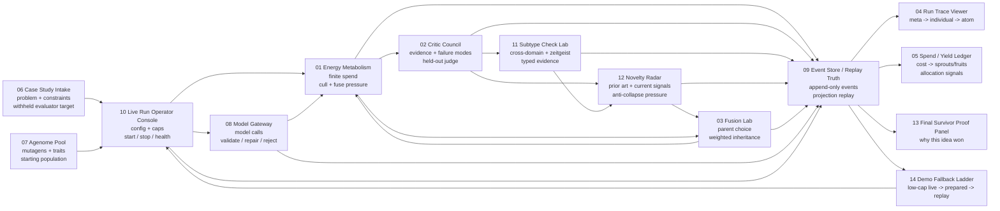
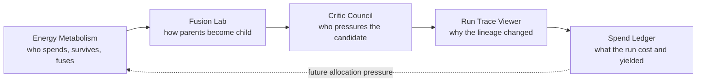
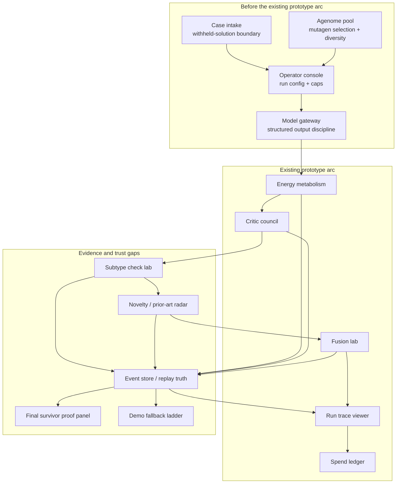

# Prototype System Map

## Purpose

This document explains the Doppl prototype PRD set as one product organism. Each prototype proves a visible part of the full process; together, they should make it obvious how a case becomes a bounded evolutionary run, how agents are bred and judged, and how the final survivor is defended with replayable evidence.

## The Full Doppl Loop

## What Each Prototype Proves

| Prototype PRD | What It Proves | Role In The Full Process |
|---|---|---|
| [01 Energy Metabolism](01-energy-metabolism-prototype-prd.md) | Doppl is bounded by energy, caps, culling, and reproductive pressure. | Makes the organism feel finite and selective instead of like an open-ended chat loop. |
| [02 Critic Council](02-critic-council-prototype-prd.md) | Candidates are pressured by evidence, failure modes, subtype review, and a held-out judge. | Prevents agents from grading their own homework. |
| [03 Fusion Lab](03-fusion-lab-prototype-prd.md) | Parent agenomes combine through weighted inheritance into a child with visible tradeoffs. | Makes reproduction tangible and product-legible. |
| [04 Run Trace Viewer](04-run-trace-viewer-prototype-prd.md) | Runs can be inspected from population level down to prompts, raw outputs, critic reasoning, and inheritance math. | Turns impressive outputs into auditable evidence. |
| [05 Spend / Yield Ledger](05-spend-yield-ledger-prototype-prd.md) | Paid calls and energy become sprouts, fruits, and allocation signals. | Connects cost to learning where the organism should spend next. |
| [06 Case Study Intake](06-case-study-intake-prototype-prd.md) | A problem can be prepared with agent-visible facts and withheld evaluator-only solution anchors. | Creates fair seeds for evaluation. |
| [07 Agenome Pool](07-agenome-pool-prototype-prd.md) | Users can understand and compose mutagen agenomes before a run. | Shapes the starting population and diversity pressure. |
| [08 Model Gateway](08-model-gateway-prototype-prd.md) | Every model call is validated, repaired once, rejected, traced, and routed through one seam. | Makes model behavior accountable and provider-agnostic. |
| [09 Event Store / Replay Truth](09-event-store-replay-prototype-prd.md) | Append-only `run_events` can reconstruct the run without fresh model/web/embedding calls. | Establishes the trust foundation. |
| [10 Live Run Operator Console](10-live-run-operator-console-prototype-prd.md) | One operator can start, monitor, stop, and recover a run. | Makes the system controllable in a real demo. |
| [11 Subtype Check Lab](11-subtype-check-lab-prototype-prd.md) | `cross_domain_transfer` and `zeitgeist_synthesis` get subtype-specific evidence. | Keeps candidate evaluation specific instead of generic. |
| [12 Novelty / Prior-Art Radar](12-novelty-prior-art-radar-prototype-prd.md) | Doppl can see similarity, prior art, and current-signal pressure. | Adds anti-collapse pressure and explains novelty. |
| [13 Final Survivor Proof Panel](13-final-survivor-proof-panel-prototype-prd.md) | The winning idea can be defended in one closing artifact. | Gives the capstone its room-facing proof moment. |
| [14 Demo Fallback Ladder](14-demo-fallback-ladder-prototype-prd.md) | Live demo failure can degrade honestly into prepared or replay mode. | Protects the showcase without lying about liveness. |

## How The Existing Five Fit Together

The live prototype suite already proves the central user-facing arc:

The gap is not that these prototypes are wrong. The gap is that they start in the middle of the organism. They assume a case already exists, a mutagen pool already exists, model calls have already been made safely, events are already trustworthy, and the operator can already run the system.

## What Is Missing For The Full Doppl Process

## Suggested Build Order For Prototype Coverage

1. **Trust spine first:** Event Store / Replay Truth, Model Gateway, Case Study Intake.
2. **Run control next:** Operator Console, Demo Fallback Ladder.
3. **Evaluation depth next:** Subtype Check Lab, Novelty / Prior-Art Radar.
4. **Closing proof last:** Final Survivor Proof Panel.

This order lets the current five prototypes keep their product intuition while the missing prototypes add the hard proof surfaces: fair inputs, safe model calls, authoritative events, controllable runs, typed checks, novelty pressure, and a defensible final artifact.

## Completion Definition

The prototype set represents the full Doppl process when a viewer can follow one case from intake to final survivor without hand-waving any of these questions:

- What did the agents see, and what was withheld?
- Which agenomes were allowed to compete, and why?
- What calls were made, validated, repaired, rejected, or failed?
- Which events are authoritative?
- Why did this lineage survive and another die?
- What evidence did critics and subtype checks produce?
- What made the idea novel rather than merely different?
- How did parent traits become child traits?
- What did the run cost, and what did it yield?
- Why did the final survivor win?
- If the live demo failed, what exactly became replay?

