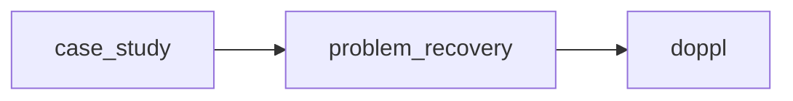

# Proposal — a unified frame for the doppl idea lifecycle

This proposes a set of changes to **doppl**, the agent-evolution runtime defined in
`docs/ARCHITECTURE.md`. Each change stands on its own: **what** it is, **why** it helps, and **how it
would change the current build contract**. Where we have a decision, it is stated (and the owning team
can override it); where a fact about the current system is asserted, it is cited. These changes came
out of iterating on the model; together they formalize the system's inputs and outputs into one
human-readable frame.

## Baseline (the current contract, in brief)

`docs/ARCHITECTURE.md` defines doppl as a runtime that breeds a bounded population of agent genomes
("agenomes"); the agenomes generate **candidate ideas** in two subtypes — `cross_domain_transfer` and
`zeitgeist_synthesis` (§3); a **critic council** and a frozen **held-out judge** score each idea on a
five-axis **0–5** rubric (§7); strong lineages **fuse** and **mutate** into later generations (§8);
and every decision is written to a **Postgres append-only event log** that is the sole source of
truth (§4). Everything a human sees is a derived projection of that log.

The proposals below keep that engine. They change how an idea's journey is **structured**, **scored**,
and **surfaced**.

## New terms used here

- **node** — one step of an idea's journey, stored as a single markdown file. Conceptually a candidate
  idea plus its lineage and scores, rendered as a portable, human- and agent-readable artifact.
- **stage** — which step a node is: `case_study`, `problem_recovery`, or `doppl`.
- **doppl** — a finished answer: the unlock, solution, or insight a chain arrives at. Equivalent to
  the architecture's "final surviving idea," with one change: a problem may yield more than one. A.k.a. fruit, afrit, Pepsi
- **stock** — a persistent, per-domain store of validated findings the runtime reads from and writes
  to. New; no current counterpart.
- **rating** — a judgment of worth on a **−5…+5** scale, as distinct from a **measurement** (a `0–1`
  instrument reading such as cosine similarity).

## The conceptual model (read this first)

doppl evolves ideas the way a population evolves: generate many candidates, apply selective pressure,
breed the survivors into the next round. Two ideas govern that pressure and explain the structure
below.

- **Divergence and convergence.** A run can *diverge* — spread into many varied candidates
  (exploration) — or *converge* — collapse toward the strongest few (exploitation). The architecture
  already exposes this as a diverge/converge selection schedule (§8). Divergence is why one problem
  can yield several doppls; convergence is why distinct lineages can independently reach the same
  answer.
- **r/K selection.** The two postures map to the ecological strategies: divergence is *r-like* (many
  cheap offspring, broad search of unexploited space), convergence is *K-like* (few, heavily-invested
  offspring, refined near the best). A run dials between them.
- **Breeding, not picking.** A stage does not *select the best candidate* — it *breeds a stronger
  child* from the whole population, taking the best traits from several. The bar is anti-fragility: a
  child that gets stronger under the variation, not one that merely survives it.

Stages, scoring, and signals below are all in service of applying that pressure legibly.

---

## 1 · A staged idea lifecycle: case_study → problem_recovery → doppl

**What.** Split an idea's journey into three explicit, separately-recorded stages: `case_study` (the
seeded situation), `problem_recovery` (the actual underlying problem, recovered from the case:
surface symptom → hidden cause → the real problem to solve), and `doppl` (the finished answer). A
problem may produce **more than one** doppl when it has genuinely distinct strong answers; each is its
own node.

**Why.** The current contract scores a candidate idea as one whole-cloth artifact. Separating
problem-finding from answer-finding lets each be checked and scored on its own, and makes the
reasoning legible: a weak answer to the right problem is visibly different from a good answer to the
wrong one.

**Change vs the contract.** Adds explicit stages to the candidate-idea lifecycle (§3); the held-out
judge would score `problem_recovery` and `doppl` as separate units. Allowing multiple doppls keeps
several distinct survivors rather than collapsing to one — the architecture currently presents a
single "final surviving idea" (§3, §12) and defers quality-diversity methods (§18).

## 2 · The node: one markdown artifact per step

**What.** Every step is one markdown file with fixed sections: `Trace` (a short copied summary of each
prior stage), `Discovery` (what was found), `Growth` (the step's actual work and its scores), and
`Path` (which stage comes next). The same shape at every stage.

Inside `Growth`, the content is stage-specific. A `problem_recovery` node holds the recovery chain
plus **Skin in the Game** — concrete, real-world-first moves to validate the problem (talk to users
and people in the field before any desk research). A `doppl` node holds the **Claim**, its
**Implications** (what it changes — who wins, who loses, what loses its substrate), and its
**Opportunities** (the action surface — where to actually deploy or act on it). Any node may carry a
rare **Sprouts** list (high-novelty side-ideas that aren't the conclusion, kept for later) and an
**Evaluation** (the judge's per-axis scores and reasoning). This encodes a **bias to action**: a node
isn't finished at analysis — a problem must say how you would test it, and a doppl must say what you
would do; after a doppl, the next step is the human's action, not another node.

**Why.** A single, uniform, portable artifact is readable by a person, an agent, or another tool with
no special viewer, and it carries its own lineage, so any node explains itself.

**Change vs the contract.** Adds a new derived projection alongside the dashboard the architecture
already specifies (§12). It does not change the source of truth — nodes are rendered *from* the event
log (§4), not in place of it.

## 3 · Discovery: a single-purpose context-gathering step

**What.** A tool a stage calls to gather supporting context. It reads the web and the stock, keeps
only what clears a quality bar, writes the keepers into the stock, and returns the context to the
stage. It does one job — find. It does not score or judge.

**Why.** Idea quality depends on grounding. Making context-gathering an explicit, single-purpose step
keeps it separable and improvable.

**Change vs the contract.** Extends the architecture's retrieval-grounding capability (§6) into a
defined step with a persistent destination (the stock). The same demo-safety rule holds: retrieved
results are persisted so a replay never re-calls the web (§4, §6).

## 4 · Stock: a persistent knowledge store

**What.** A per-domain store of validated findings, grown over time. Two gates guard it: **admission**
(only a high-signal *discovery* enters, not every casual *find*) and **enrichment** (a finding that
duplicates one already in the stock is merged into it rather than re-added; a genuinely new one is
added).

**Why.** Today each run starts cold. A persistent, deduplicated store lets later runs build on earlier
ones instead of re-deriving the same ground.

**Change vs the contract.** New — the architecture has no cross-run knowledge store. **Decision (the
team can revise):** it lives as an append-only table in the existing Postgres tier with a rendered
read view, consistent with the single-source-of-truth model (§4, §9) and the no-SQLite rule (§18) —
not a separate datastore.

## 5 · Rating on a −5…+5 scale, and measurement vs. rating

**What.** Score worth on one signed scale, **−5…+5**: negative means *actively harmful or
value-subtracting* (not merely ineffective), 0 is neutral, positive is real contribution. Keep
**measurements** (`0–1` instrument readings — cosine similarity, ratios) distinct from **ratings**:
measurements are inputs that *map into* a rating; they are not ratings themselves.

**Why.** One signed scale lets a judge and a human be compared directly and lets a clearly-bad idea
score below zero, which a 0–5 scale cannot express. Separating measurements from ratings keeps an
instrument reading from being mistaken for a judgment.

**Change vs the contract.** A change to the scoring contract: the held-out judge's five-axis **0–5**
rubric (§7) becomes **−5…+5**. Proposed axes: **Novelty, Grounding, Falsifiability, Cost-efficiency**
(value relative to the all-in cost to realize it), **Relevance** (how much it matters for the target
actor/use). **Decision (the team can revise):** the internal `0–1` instruments (e.g. the
novelty-embedding scores, §8) stay as they are and are mapped to −5…+5 only at the point a rating is
produced — the internal math is not reworked. Exact axis weights are deferred-open in the current
contract (§7) and stay open here.

## 6 · Two raters: the held-out judge and a human

**What.** The **judge** (the held-out scorer) fills the full rubric with reasoning and boils it to a
single number. A **human** gives one number — a single −5…+5 slider, a gut read of the whole node. A
node is created judge-only; human scores are appended later, one row per rater, and averaged.

**Why.** A held-out judge gives a consistent, automatable score; a human snapshot catches what a
rubric misses. Asking a human to fill five axes will not happen in practice — one slider will.

**Change vs the contract.** Adds a human rater alongside the held-out judge (§7) and a small
append-only ratings store (`{node, rater, score, time}`) projected onto the node. The held-out judge
stays the immutable anchor it is today (§7, §14); the human score is advisory.

## 7 · Temporal: the time-decay axis of an idea

**What.** A flag on a node, `temporal`, marking whether the idea is time-bound. A time-bound idea (a
`zeitgeist_synthesis`) loses value as its moment passes; a timeless one (a `cross_domain_transfer`,
solved-or-not) does not.

**Why.** The two idea subtypes already differ in how time affects them. Making that explicit lets the
score decay correctly for time-bound ideas and stay put for timeless ones.

**Change vs the contract.** Not a replacement for the subtype — the subtype names (§3) still say *what
kind* of idea it is; `temporal` is only the time-decay axis that follows from it. Decay applies to
time-bound ideas only, and only **toward zero** (it never turns a positive idea negative; a negative
idea does not decay). A faded idea can be re-validated if its moment returns. **Decision (the team can
revise):** use the candidate-idea decay half-life already in `src/fitness.ts` — zeitgeist ideas on a
180-day half-life, transfers no decay — rather than the discovery-source half-life in
`tools/source-radar.ts` (zeitgeist 14 days); the two govern different layers (an idea's score vs. a
source's freshness).

## 8 · Discovery and the compiler as named functions

**What.** Two runtime steps are defined as standalone functions: **discovery** (above) and the
**compiler** — the step that renders a stage's raw output and its scores into a finished node.

**Why.** Naming and isolating these steps makes them independently testable and swappable. The
compiler is a mechanical render, so a cheap model can run it; the expensive models stay on generation
and judging.

**Change vs the contract.** The compiler is a new projection writer (it produces the node of §2);
discovery is the retrieval step of §3/§6.

## 9 · Identity

**What.** Every node and stock entry has a stable **UUID**; links point at the UUID, not a human
title, so titles can change without breaking links.

**Change vs the contract.** A formatting rule for the lineage references the architecture already
keeps (§3, §10).

## 10 · Memory and signals from the node graph

**What.** The node graph *is* the lineage memory; there is no separate ledger. Two signals come off
it: **doppelgangers**, a count on a node of how many near-duplicate ideas were merged into it (a
rising count on a low-scored idea is a process-health signal — the generator is stuck or the scoring
is miscalibrated); and **convergence**, distinct ideas arriving at the same target, found by querying
the graph for similar nodes reached by different lineages and read through novelty and usefulness,
computed on demand and never stored.

**Why.** These are the anti-collapse and lineage-analysis signals the architecture already wants
(novelty/anti-collapse, §8; lineage diversity, §10), surfaced from the graph with one stored number
and one query rather than a separate memory schema.

**Change vs the contract.** Reframes the lineage graph (§10) and novelty/anti-collapse (§8) as queries
over the node graph plus one stored count. No separate lineage store.

---

Where a proposal implies a concrete contract change, the owning team confirms it in their own branch.
`docs/**` remains the baseline everyone else builds from — kept separate on purpose; this is the
skunkworks frame proposed back to it.
