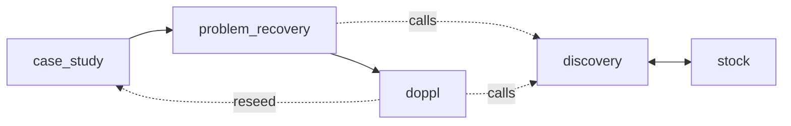

# Proposal — the current doppl frame

This is the hut proposal: the model we are shaping before the kernel catches up.

## Bedrock

Doppl turns a case study into a recovered problem and then into one or more actionable doppls.

The durable artifact is markdown. A human should be able to read it directly, and a service should be able to parse it into a typed shape.

Every durable object needs one source of truth. Rendered markdown can be an authored artifact, a materialized projection, or both by section, but the contract must say which facts are owned elsewhere.

## Lifecycle

The spine is fixed: `case_study → problem_recovery → doppl`.

`case_study` is the seed. It does not call discovery and it is not scored.

`problem_recovery` recovers the actual problem from the case. It is scored on Growth.

`doppl` is the finished answer, unlock, opportunity, or solution surface. A recovered problem can produce more than one doppl when the answers are genuinely distinct.

After a doppl, the path points out of the system into human action.

A doppl may also be **reseeded** as a fresh `case_study` — the forest loop — starting a new island that links back to the doppl via `prev_id`. This is the one back-edge in the graph; it does not change the three-stage spine. An original seed has no parent (`prev_id: null`); a reseeded case study carries `prev_id: [[doppl]]`.

## Node

A node is one markdown file with frontmatter and a body.

Growth-stage nodes carry `## Trace`, `## Discovery`, `## Growth`, and `## Path`.

`## Growth` is the scored surface. It contains the current stage's full work and the judge's `### Evaluation`.

Trace copies prior stage synopses verbatim. Discovery records what was found. Path names the next stage.

The node contract lives in [`../../contracts/node.md`](../../contracts/node.md).

## Discovery And Stock

Discovery is a kernel function with one job: gather context. It reads stock first, reaches outward through a backend only when needed, keeps only what clears the bar, and returns context to the calling stage.

Stock is durable domain memory. It stores admitted discoveries, not raw search output and not conclusions.

Stock has two gates: admission decides whether a find is worth remembering, and enrichment decides whether an admitted discovery is new, merged, or dropped as a rehash.

The stock contract lives in [`../../contracts/stock.md`](../../contracts/stock.md).

## Engine

Each spine arrow runs the generate→fitness→select→lens crucible.

The engine does not merely pick the best candidate. It breeds a stronger child from a population, rejects no-delta rehashes, and records the trace as the specimen.

The selection dial still matters: diverge favors novelty under a grounding floor; converge favors grounding under a novelty floor.

## Selection Aim

The engine is not looking for novelty for its own sake. It is trying to surface true, non-obvious, actionable implications.

For now, `novelty × grounding` is the measurable selector. Novelty is the proxy for "not already in the visible record"; grounding is the proxy for "not merely clever."

Consensus-gap names a goal we may later learn to measure, but it is not a typed contract yet.

## Lens

Lens stays separate from the judge.

The judge rates worth. The lens asks whether the survivor is actionable for a specific actor, context, or constraint set.

Lens runs after selection and must not contaminate novelty, grounding, or rating.

## Rating

There are two kinds of numbers.

Measurements are `0...1` instrument readings. They carry no judgment.

Ratings are `-5...+5` judgments of worth. Negative means value-subtracting, not merely ineffective.

The judge fills the five-axis evaluation and boils it down to `scores.judge`.

The human gives one slider. Human ratings live in the human ratings ledger, one current rating per `(node_id, rater_id)`, where `rater_id` is email for the demo.

The node stores only the materialized human projection: `scores.human` and `scores.n`.

The rating contract lives in [`../../contracts/rating.md`](../../contracts/rating.md). The human ratings contract lives in [`../../contracts/human-ratings-ledger.md`](../../contracts/human-ratings-ledger.md).

## Temporal

`temporal` remains a boolean seam for time-bound ideas.

Active decay is configured to `0`: no score changes with age, and the effective multiplier is `1`.

A future decay mechanism can bolt onto `temporal` without changing the node shape.

## Compiler and validation

The compiler is the **producer** in MarkScript's two-direction contract ([`../../contracts/markscript.md`](../../contracts/markscript.md)): it renders a typed value — the `RunTrace` — into the node artifact. It renders; it does not think. Its field-by-field map is [`../../contracts/projection.md`](../../contracts/projection.md); its procedure is [`../../mechanics/kernel/compiler.md`](../../mechanics/kernel/compiler.md).

Because a contract runs both ways, production and parsing meet at one shape. The decision being shaped: **render is deterministic, and drift is caught at the boundary, never tolerated.**

Render the format from the typed value, not from prose. Headings, section order, anchors, and frontmatter keys are fixed by the contract, and `projection.md` already gives every field a deterministic mode (`render_verbatim`, `derive`, `mint`, `fixed_by_stage`, `birth_empty`; only `render` reshapes a container, never meaning). A renderer that walks that map emits the prescribed markdown by construction — the format layer needs no model and so has no variance to drift. A model's job is upstream, producing a stage's Growth content; it never authors the final markdown surface.

The validator closes the loop. `compiler.md` step 7 — "validate it parses and every required part is present" — has no spec yet. Give it one: parse the emitted node back into its typed shape and assert it round-trips against the source projection. Same value from both ends, or reject. This is MarkScript's "reject drift without interpreting vibes" made executable — the half that exists nowhere in the repo today.

A MarkScript skill is the natural host: one skill, two entry points. At **production** (compile time) it validates the node the compiler just wrote before it lands. At **ingestion** (reading nodes back to reseed or dedup) it recovers the typed shape from an existing file. It reads the contracts rather than hand-written per-field parsers, so when a contract changes the skill follows.

## Open

The measurement-to-rating bridge is still real work. We know measurements feed ratings; we have not finished the map.

The human ratings projection runner is intentionally open. The data structure is fixed; the mechanism can be a local command, scheduled job, GitHub Action, or service.

The validator has no spec. The round-trip checker above is a decision in this proposal, not yet frozen. When it lands, give it a contract — the parse direction of each node section — and point `compiler.md`'s validate step and `projection.md`'s open items at it.
